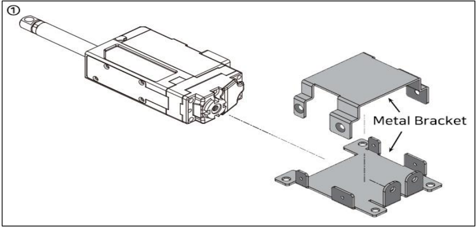
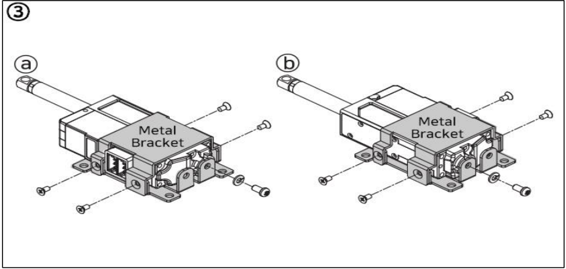

# IR-MB02 assemble
## 1. 메탈 브라켓(IR-MB02) - 26mm, 27mm Stroke 수평장착용
서보모터의 힌지를 이용한 설치가 아닌, 수평 고정장착을 할 때 사용할 수 있는 메탈 브라켓입니다.
1) 메탈브라켓을 아래 그림의 오른쪽과 같이 위, 아래 부분을 구분합니다.
   이때, 모터는 좌, 우 방향에 상관없이 마운팅 가능합니다.
   
2) 아래 그림 ②에서 적색 원으로 표시된 M2.5 L5 스크류 체결시에는 반드시 동봉된 Spring washer를 함께 조립하여 주십시오. 와셔 미체결시 제품 파손의 원인이 될 수도 있습니다. 메탈브라켓의 상, 하는 4개의 M2 L4스크류를 사용하여 체결합니다.
   
3) IR-MB02는 방향성의 제약없이 리니어서보모터(27mm 스트로크)를 마운팅할 수 있습니다. 즉, 서보모터의 좌(ⓐ), 우(ⓑ) 방향과 상관없이 마운팅이 가능합니다.
   
## 2