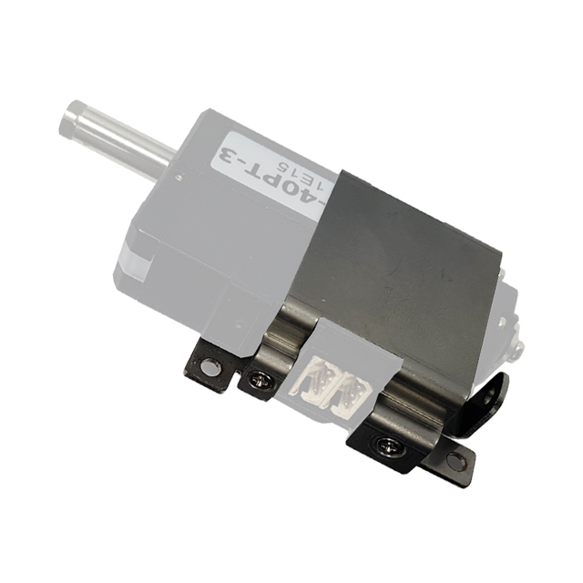

## IR-MB02
메탈 브라켓 IR-MB02의 3D(STEP) / 2D(DWG)도면 입니다.  12Lf, L12, D12, D7, 12L, 12D 시리즈 22mm, 26mm, 27mm stroke 전용이며, 수평장착 브라켓입니다.

### 브라켓 모델별 제품 호환성
- IR-MB02 : 12Lf, L12, D12, D7 , 12L, 12D 시리즈 22mm, 26mm, 27mm stroke제품의 수평장착 브라켓
- IR-MB03 : 12Lf, L12 시리즈의 40~96mm stroke제품의 전용 브라켓
- IR-MB04 : 12Lf, L12, D12, D7 , 12L, 12D 시리즈 22mm, 26mm, 27mm stroke제품의 수직장착 브라켓
- IR-MB05 : 17Lf 시리즈 27mm stroke제품의 수평장착 브라켓
- IR-MB06 : 17Lf 시리즈 27mm stroke제품의 수직장착 브라켓
- IR-MB07 : 17Lf 시리즈 37, 50, 87mm stroke제품의 전용 브라켓

<!--  -->
## 12Lf-xx-27 Uint : mm
 
**Download**  <a class="downloadbtn" href="./data/MB02.step" download> STEP </a> <a  class="downloadbtn" href="./data/MB02.DXF" download> DXF </a>   

## 12Lf-xx-27 Uint : Inch
