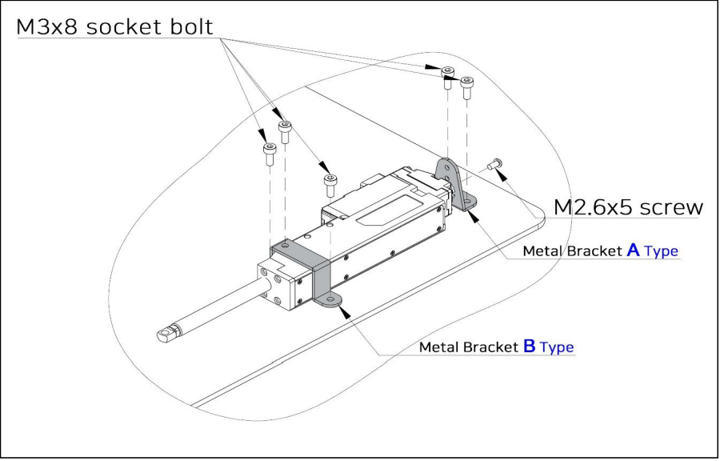

## 1. 메탈 브라켓(IR-MB03) - 41mm, 96mm Stroke 전용
- 리니어 서보모터를 고정 부위에 동봉된 M3 볼트를 이용하여 가로 도는 세로 방향으로 고정합니다.
- 고정 방법은 아래 [그림 1], [그림 2] 를 참조하시기 바랍니다.
- 필요한 경우 아래 A, B, C Type 브라켓 별도 구입 가능

1) 서보모터를 가로 방향으로 체결
   
2) 서보모터를 세로 방향으로 체결
   ]]