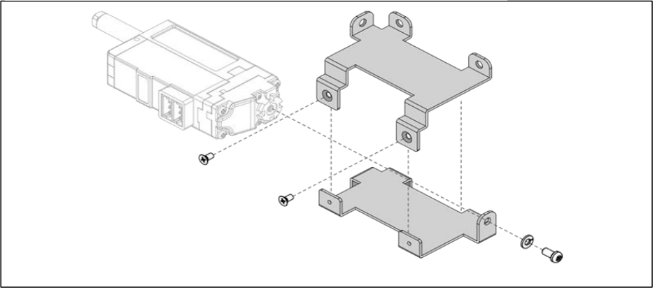

## 메탈 브라켓(IR-MB04) - 26mm, 27mm Stroke 수직장착용
서보모터의 힌지를 이용한 설치가 아닌, 수직 고정장착을 할 때 사용할 수 있는 메탈 브라켓입니다.
1) **메탈브라켓을 아래 그림의 오른쪽과 같이 좌, 우 부분을 구분합니다.** 
   이때, 아래 그림과 같이 모터의 방향에 주의하여 마운팅을 하시기 바랍니다.
   
2) **아래 그림에서 적색 원으로 표시된 M2.5 L5 스크류 체결시에는 반드시 동봉된 Spring washer를 함께 조립**하여 주십시오. 
   **와셔 미체결시 제품 파손의 원인이 될 수도 있습니다.** 
   메탈브라켓의 상, 하는 2개의 M2 L4스크류를 사용하여 체결합니다
   
3) 완성된 메탈브라켓의 장착 방법
	1) 제품의 바닥면 고정 방법
	   
	2) 제품의 정면 고정 방법
	   
4) IR-MB04 장착시 주의 사항
   - 아래 그림내 설명과 같이 제품 정면으로 장착시에는 제품정면에 돌출된 볼트머리를 회피할 수 있도록 상대물에 공간이 있어야 합니다.
     