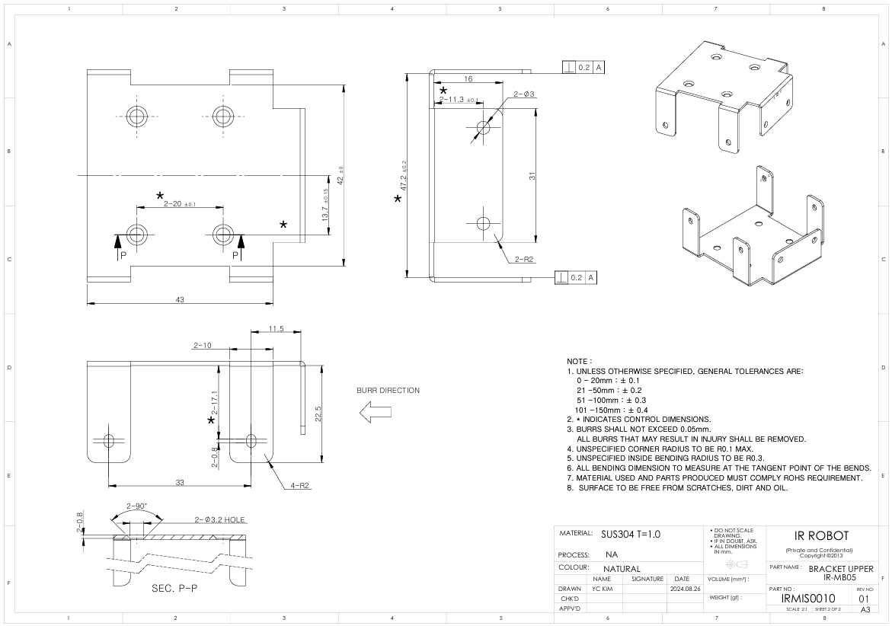
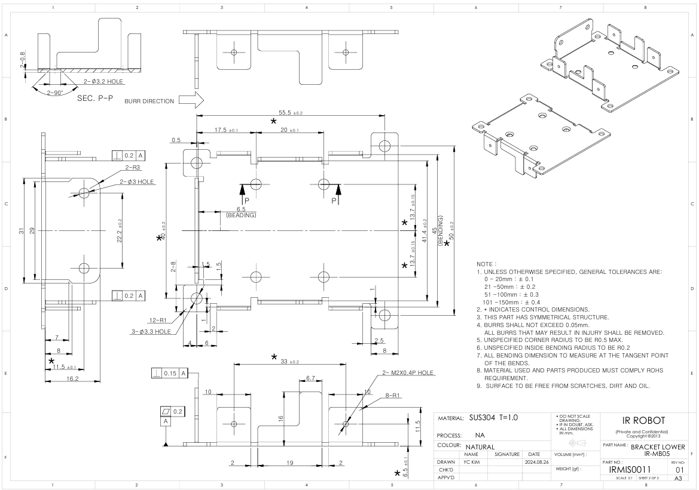

## [IR-MB05] 메탈 브라켓 3D / 2D 도면 (17Lf 시리즈 27mm stroke제품 전용) - 수평장착용

메탈 브라켓 IR-MB05의 3D(STEP) / 2D(DXF)도면 입니다. 17Lf 시리즈 전용 27mm stroke제품을 위한 **수평장착용** 브라켓입니다.  
  
###  브라켓 모델별 제품 호환성
- IR-MB02 : 12Lf, L12, D12, D7 , 12L, 12D 시리즈 22mm, 26mm, 27mm stroke제품의 수평장착 브라켓
- IR-MB03 : 12Lf, L12 시리즈의 40~96mm stroke제품의 전용 브라켓
- IR-MB04 : 12Lf, L12, D12, D7 , 12L, 12D 시리즈 22mm, 26mm, 27mm stroke제품의 수직장착 브라켓
- IR-MB05 : 17Lf 시리즈 27mm stroke제품의 수평장착 브라켓
- IR-MB06 : 17Lf 시리즈 27mm stroke제품의 수직장착 브라켓
- IR-MB07 : 17Lf 시리즈 37, 50, 87mm stroke제품의 전용 브라켓
### MB-05 Drawing  Uint : mm
#### MB-05 Bracket Upper

**Download**  <a class="downloadbtn" href="./data/ENG-IRMIS0010 BRACKET UPPER, IR-MB05_Rev01_20240826.pdf" download> PDF </a><a  class="downloadbtn" href="./data/ENG-IRMIS0010 BRACKET UPPER, IR-MB05_Rev01_20240826.DXF" download> DXF </a><a  class="downloadbtn" href="./data/IR-MB05_Rev01_20240826.step" download> STEP </a>

#### MB-05 Bracket Lower

**Download**  <a class="downloadbtn" href="./data/ENG-IRMIS0011 BRACKET LOWER, IR-MB05_Rev01_20240826.pdf" download> PDF </a><a  class="downloadbtn" href="./data/ENG-IRMIS0011 BRACKET LOWER, IR-MB05_Rev01_20240826.DXF" download> DXF </a><a  class="downloadbtn" href="./data/IR-MB05_Rev01_20240826.step" download> STEP </a>
