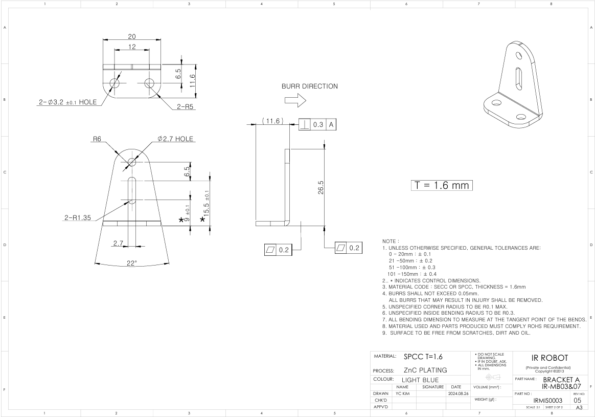
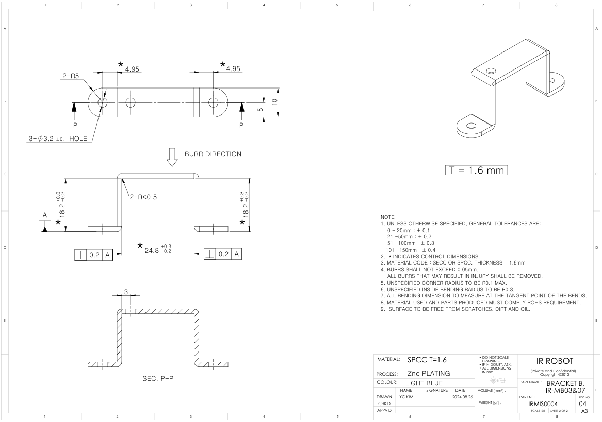
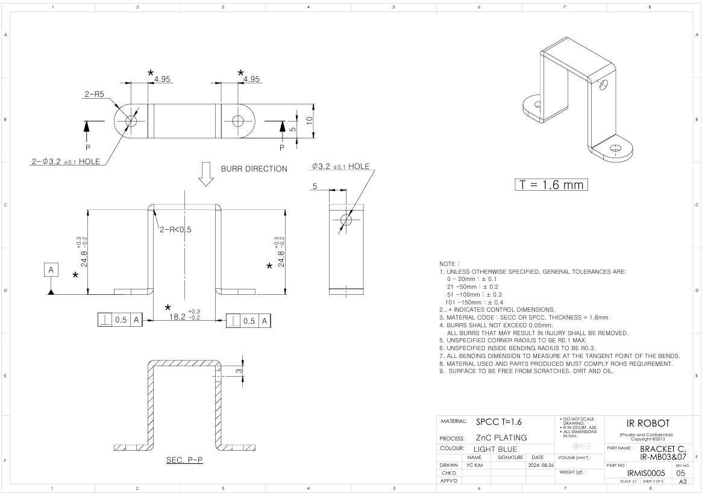
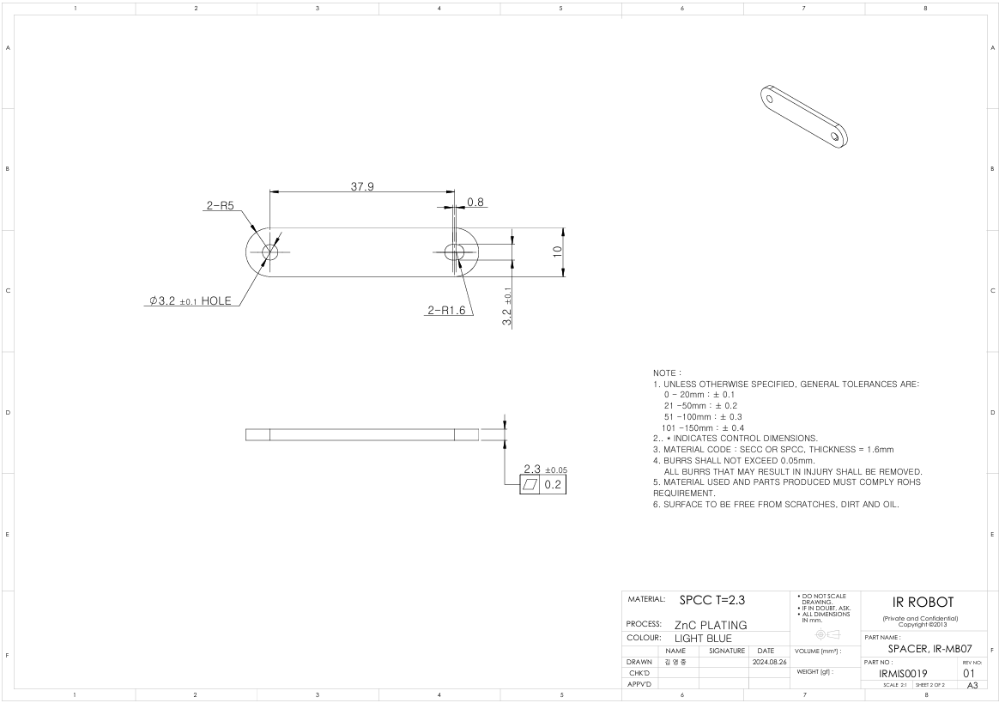
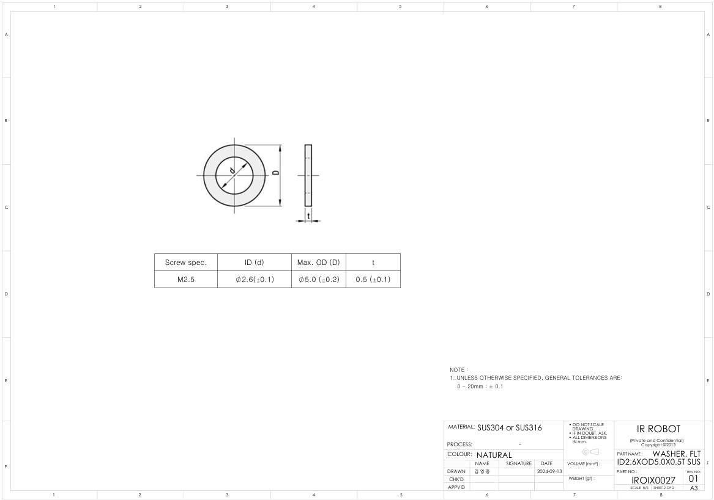

## [IR-MB07] 메탈 브라켓 3D / 2D 도면 (17Lf 시리즈 37, 50, 87mm stroke 제품 전용)- 수직, 수평 장착용

메탈 브라켓 IR-MB07의 3D(STEP) / 2D(PDF)도면 입니다.  IR-MB07 은 17Lf 시리즈 전용 37, 50, 87mm stroke 제품을 위한 "수직,수평 장착" 브라켓입니다.
  
###  브라켓 모델별 제품 호환성
- IR-MB02 : 12Lf, L12, D12, D7 , 12L, 12D 시리즈 22mm, 26mm, 27mm stroke제품의 수평장착 브라켓
- IR-MB03 : 12Lf, L12 시리즈의 40~96mm stroke제품의 전용 브라켓
- IR-MB04 : 12Lf, L12, D12, D7 , 12L, 12D 시리즈 22mm, 26mm, 27mm stroke제품의 수직장착 브라켓
- IR-MB05 : 17Lf 시리즈 27mm stroke제품의 수평장착 브라켓
- IR-MB06 : 17Lf 시리즈 27mm stroke제품의 수직장착 브라켓
- IR-MB07 : 17Lf 시리즈 37, 50, 87mm stroke제품의 전용 브라켓 (수직.수평장착 브라켓)
### MB-07 Drawing  Uint : mm
**Download**  <a class="downloadbtn" href="./data/IR-MB07_2D_PDF.zip" download> PDF(ZIP) </a><a  class="downloadbtn" href="./data/IR-MB0307_Horizontal_Rev01_20240826.step" download> STEP(Horizontal) </a><a  class="downloadbtn" href="./data/IR-MB0307_Vertical_Rev01_20240826.step" download> STEP(Vertical) </a>
#### MB-07 BRACKET A

#### MB-07 BRACKET B

#### MB-07 BRACKET C

#### MB-07 SPACER

#### MB-07 WASHER
