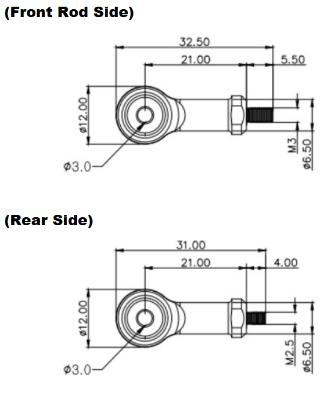

## 1. IR-EB01 Rod End Bearing 도면(2D/3D)
migthyZAP의 양단을 IR-EB01, end bearing으로 고정할 수 있는 IR-EB01의 2D 도면(PDF, DXF), 3D 도면(STEP)입니다.  3D 도면의 경우 M2.5, M.30 규격별로 별도의 도면이 있으니 참고하십시오. (1 set IR-EB01 = 1 x M2.5 end bearing + 1 x M3.0 end bearing)

### EB01 Rod End Bearing Uint : mm

**Download**  <a class="downloadbtn" href="./data/IR-EM01-Rod-End-Bearing.pdf" download> PDF </a><a class="downloadbtn" href="./data/PHSCM-3-M3.0-ASSM-1.step" download> STEP(M3.0) </a><a class="downloadbtn" href="./data/PHSCM-3-M2.5-ASSM-1.step" download> STEP(M2.5) </a><a  class="downloadbtn" href="./data/IR-EB01-Rod-End-Bearing.DXF" download> DXF </a>

### Rod end Nut Unit : mm
Here is the drawing for the Rod end nut (M3)which is attached on the end of Rod.  
Its specification is M3.0x5P, 7mm depth.

**Download**  <a class="downloadbtn" href="./data/Rod-end-nutM3.pdf" download> PDF </a><a  class="downloadbtn" href="./data/Rod-end-nutM3.DXF" download> DXF </a>
