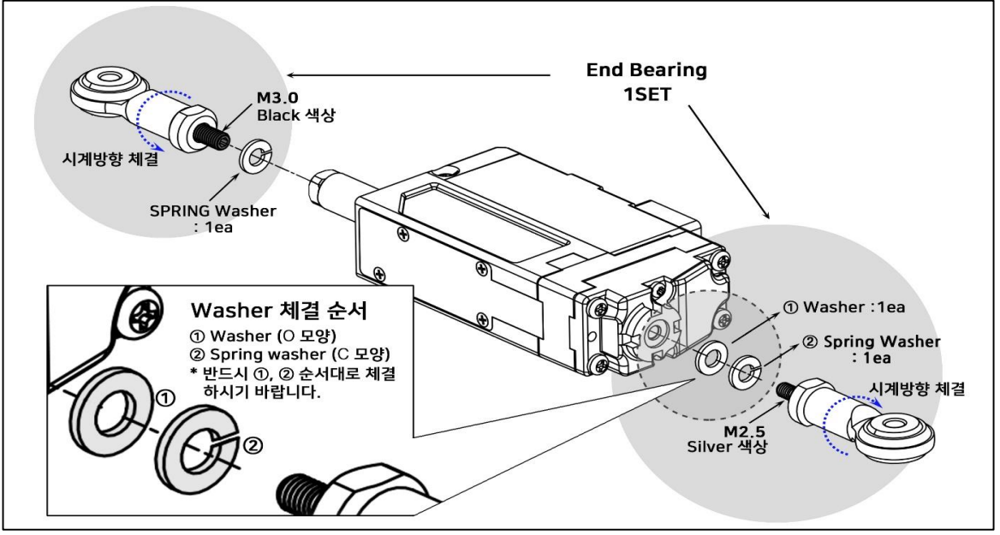
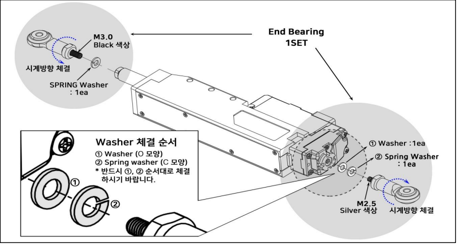

# EB01 Assemble
## IR-EB01 End bearing 을 통한 고정
서보모터의 양쪽을 고정할 때 사용할 수 있는 End bearing을 이용한 고정방법 입니다.
서보모터 자체를 고정하는 것이 아닌 양단의 베어링을 고정하는 방식입니다. 
이 경우 양단 중 적어도 하나는 스프링이나 LM guide등을 이용해 서보모터가 동작할 수 있는 기구적 여건이 마련되어야 합니다. (스프링 연결시, 총 장력은 정격 포스를 넘지 않는 범위내에서 선택 하십시오)
### 26mm, 27mm 버전

### 40mm ~ 96 mm 버전

>[!warning] 주의
>반드시 위 그림과 같이 Washer 체결 순서에 유의하여 엔드베어링을 고정해주시기 바랍니다. 순서대로 체결하지 않을시 모터 파손 및 오작동의 원인이 될 수 있습니다.
