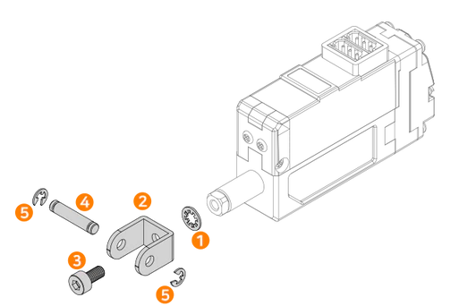

## Using U Type Rod-End Bracket(IR-MC05)
The IR-MC05 U Type Rod-End Bracket is a good replacement of basic rod-end tip, allowing the user to set the desired angle more easily and freely. It can be used together with the Hinge (standard accessory) and optional metal brackets – IR-MB02, MB03, and MB04.

1. After inserting ① Tooth Lock Washer between U bracket and actuator rod.
2. Fix the ②U-type Bracket with ③M3 Socket Head Bolt at the desired angle.
3. Insert ④ the hinge-pin together with the object and fix it with ⑤ 2 x E-rings.

