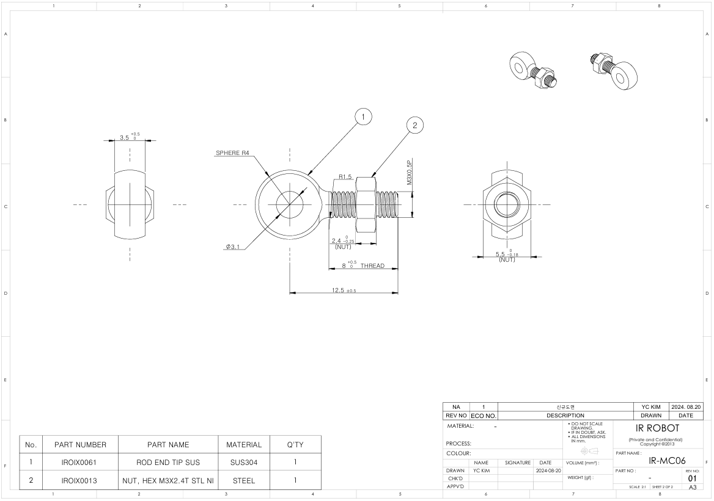

## [IR-MC06] SUS Rod End Tip 도면
- 액추에이터 패키지에 포함된 기존 황동재질의 로드 엔드 팁보다 강도가 향상된 새로운 SUS 로드 엔드 팁(2D/3D)의 도면입니다.  
- 신형 SUS 로드 엔드 팁의 모양/재질은 기존 로드 엔드 팁과 약간 다릅니다.  로드앤드 팁은 액추에이터의 표준 액세서리 패키지에 1개씩 포함되어 있으며,  
- 필요할 경우 SUS 로드 엔드 팁 5개와 M3 너트 5개가 함께 제공되는 IR-MC06(별도 구매)을 옵션파츠로 구매하실 수 있습니다.

### MC06 Drawing Unit : mm

**Download**  <a class="downloadbtn" href="./data/IR-MC06_Rev01_20240820.pdf" download> PDF </a><a class="downloadbtn" href="./data/IR-MC06_Rev01_20240820.step" download> STEP </a><a  class="downloadbtn" href="./data/IR-MC06_Rev01_20240820.DXF" download> DXF </a>
