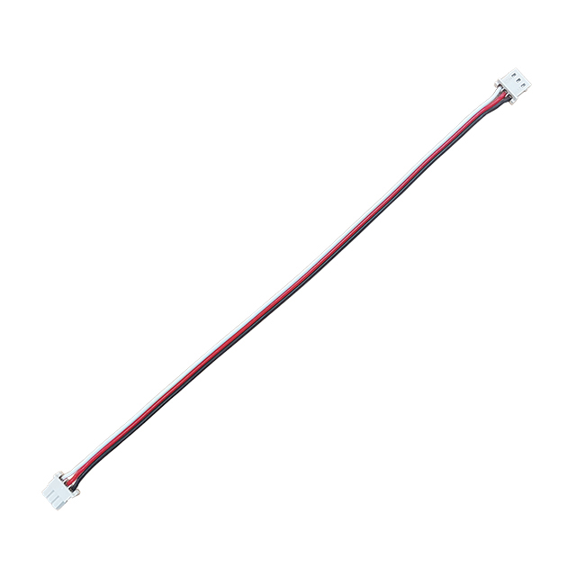

# Basic Connector Wire
## IR-EW05

	
	<ul style="margin:auto 0">
	<li>  3pins TTL/PWM</li>
	<li> Molex connectors (50-37-5033)</li>
	<li> 200mm Length</li>
	<li> 5pcs in a Set</li>
	<li> Unshielded</li>
	</ul>

## IR-EW07

	
	<ul style="margin:auto 0">
	<li> 4pins RS-485</li>
	<li> Molex connectors (51065-0400)</li>
	<li> 200mm Length</li>
	<li> 5pcs in a Set</li>
	<li> Unshielded</li>
	</ul>

