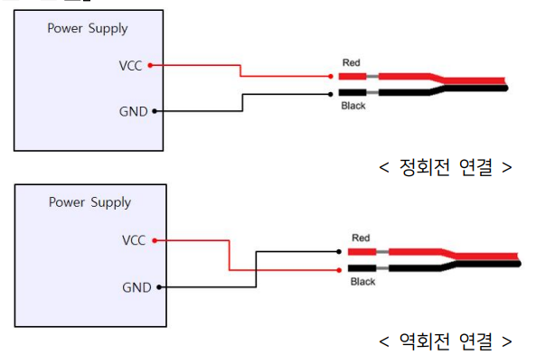
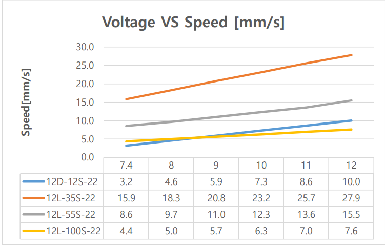
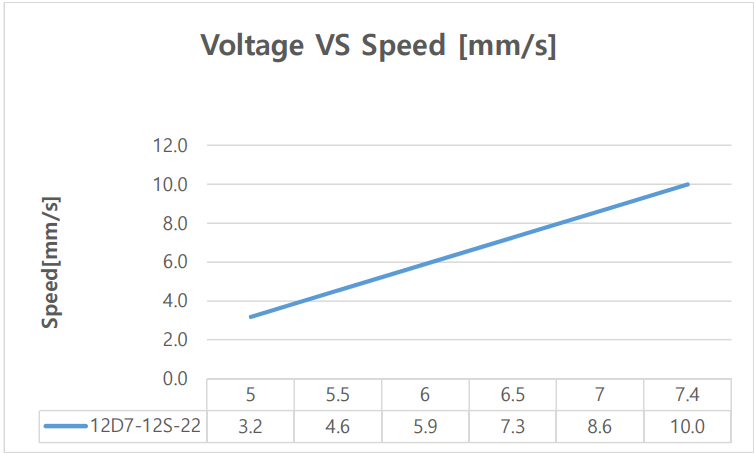
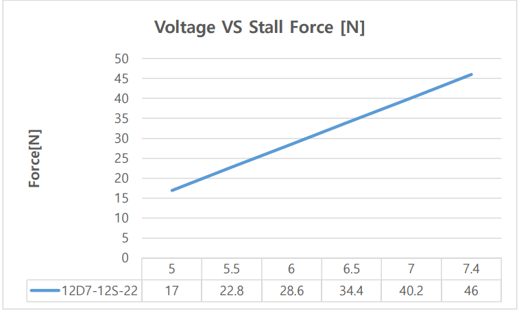

## 12L / 12D Series Limit Switch mightyZAP Actuator 특장점 
- 내장된 위치인식 센서가 아닌 리미트 스위치를 장착하여 두 지점간 위치를 왕복하는 제품 
- 회로, 리미트 스위치, DC 모터, 기어박스, 리드스크류, 로드 등이 집적된 Compact한 사이즈 
- 포지션 컨트롤 및 포스 컨트롤 서보액츄에이터 대비 저렴한 가격 
- 쉽고 간단한 설치로 바로 동작 가능 (통신제어 불필요) 
- 12mm 직경의 12V Coreless Motor 라인업(12L Series)과 12V/7.4V Cored Motor 라인업 (12D Series) - coreless모터가 출력과 내구성면에서 cored motor보다 우수 
- 22mm stroke (외부 스위치를 추가하여 22mm 내에서 자유롭게 스트로크 조절 가능)  
- 기어비에 따라 12~100N의 정격부하 구현 - speed는 force와 반비례하여, force가 강할수록 speed는 느려집니다.
### 사양 12L 시리즈 Coreless Motor Lineup
| 인가전압                             | 27mm 스트로크                             | <<               |                    |
| -------------------------------- | ------------------------------------- | ---------------- | ------------------ |
| ^                                | 정격부하 35N                              | 정격부하 55N         | 정격부하 100N          |
| **12V**                          | 12L-35S-22                            | 12L-55S-22       | 12L-100S-22        |
| **정격 부하** /  **최고 속도(무부하 시)** | **35N** / 28mm/s                      | **55N** / 15mm/s | **100N** / 7.7mm/s |
| **최대 허용 부하**                     | 70N                                   | 110N             | 200N               |
| **기어비**                          | 10:1                                  | 20:1             | 50:1               |
| **기어재질**                         | 4 Metal & 2 Engineering Plastic Gears | <                | <                  |
| **메카니컬 셀프락**                     | Yes                                   | <                | <                  |
| **와이어**                          | 300mm / 0.08x60 (22AWG)               | <                | <                  |

### 사양 12D 시리즈 Coreless Motor Lineup
| 인가전압                             | 22mm 스트로크                                                      |
| -------------------------------- | -------------------------------------------------------------- |
| ^                                | 정격부하 12N                                                       |
| **7V**                           | 12D7-12S-22                                                    |
| **12V**                          | 12D-12S-22                                                     |
| **정격 부하** /  **최고 속도(무부하 시)** | 12N / 10mm/s                                                   |
| **최대 허용 부하**                     | 24N                                                            |
| **기어비**                          | 10:1                                                           |
| **기어재질**                         | Engineering Plastic Gears4 Metal & 2 Engineering Plastic Gears |
| **메카니컬 셀프락**                     | Yes                                                            |
| **와이어**                          | 300mm / 0.08x60 (22AWG)                                        |
### 12L / 12D Series Limit Switch mightyZAP Actuator 결선도

- 액츄에이터 제어를 위해서는 노출된 와이어에 정,역 전압을 인가하여 방향 제어를 합니다. DPDT 스위치를 이용하면 동 작 방향 전환이 용이해집니다. 
- 전압 인가 범위는 7V~13VDC 이나, 정격은 12V이므로 12V이하의 전압에서는 힘이 약해지고 속도도 느려지게 됩니 다. 
- 13V이상의 전압 인가시 회로 및 모터가 소손될 수 있으므로, 반드시 정격 12V이하의 전압을 인가 바랍니다. (12V 배 터리 사용시, 만충의 경우 14V가 넘을 수 있으므로 주의 요망)

### 12L / 12D Series Limit Switch mightyZAP Actuator 결선도
#### 1. DPDT Switch 연결

- DPDT 스위치는 SPDT 스위치 2개가 내장되어 동일한 동작을 수행합니다. 
- 위 결선도에 따른 스위치 동작은 다음과 같습니다. 
- 오배선이 되어 단락이 나지 않도록 배선에 주의하시기 바랍니다. (DPDT스위치 핀간 상호 접촉이 되면 안됩니다)
- 
#### 2. External Limit Switch 연결
 

- 표준 21.8mm 스트로크가 아닌, 더 짧은 스트로크 구현을 위해서는, 외부에 추가로 마이크로 Limit 스위치를 설치 한 후, 위 DPDT 스위치 결선도에 위와 같이 Limit Switch를 추가 결선하시어 사용하면 됩니다. 
- 액츄에이터의 Rod가 추가한 Limit Switch를 누르게 되면 동작이 멈추게 됩니다. 
- 오배선이 되어 단락이 나지 않도록 배선에 주의하시기 바랍니다. (DPDT스위치 핀간 상호 접촉이 되면 안됩니다)

### Figure 1 Voltage/Speed[mm/s]
#### Figure 1-1 12V Model

 - 해당 Data는 오차를 포함하고 있습니다.

#### Figure 1-2 7.4V Model

 - 해당 Data는 오차를 포함하고 있습니다.

### Figure 2. Voltage / Stall Force[N]
#### Fugure2-1 12V Model

 - 해당 Data는 오차를 포함하고 있습니다.

#### Fugure2-2 7.4V Model

 - 해당 Data는 오차를 포함하고 있습니다.
