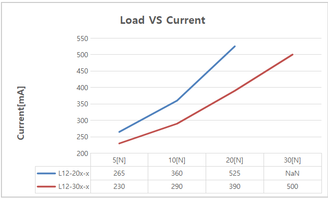
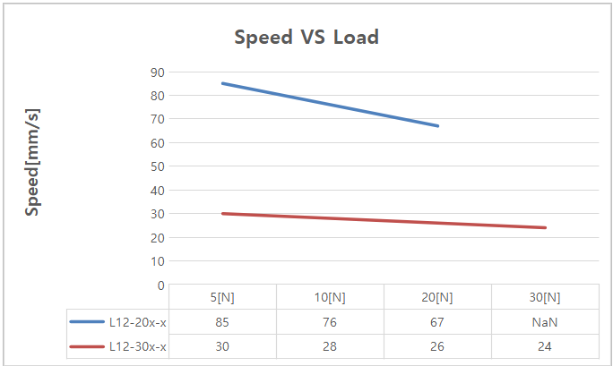
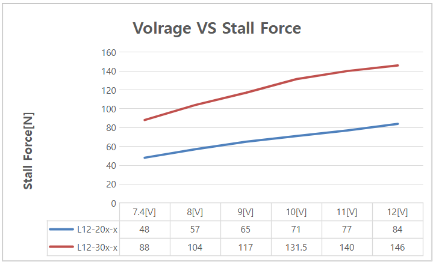
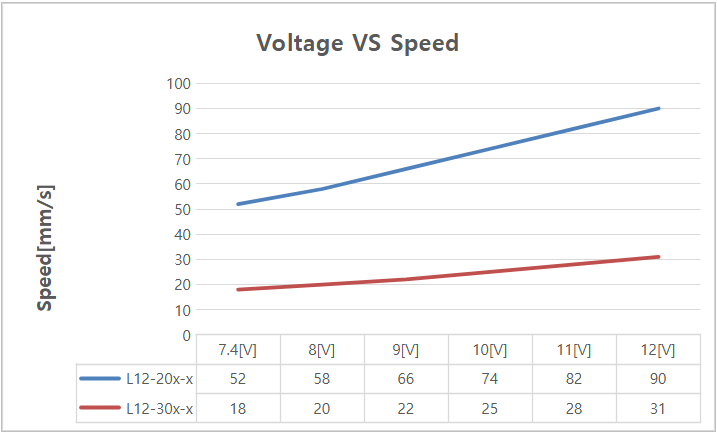
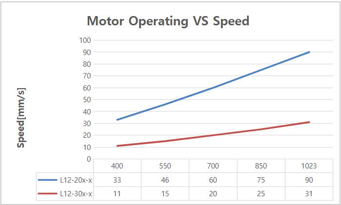

# L12-xxF-10 Datasheet
## 1. Features / 주요 특장점
-  Micro size / 마이크로 사이즈  
-  Precise position control / 정밀 위치 제어
-  Strong force comparing to the size / 체적 대비 강한 힘
-  Built-in Drive Circuitry / 드라이브 회로 내장
-  RS-485 communication / RS-485 통신 지원
-  Parameter programmable on the Manager software / 매니저 소프트웨어를 통한 Parameter 셋팅 가능 

## 2. Specification
### 2.1 Common Specifications / 공통 사양
| **Property** | Value |
| --------- | ------- |
| **Stroke / 스트로크** | 96mm |
| **Rated Load / 정격 부하** | 17N~30N according to gear ratio(See appendix.) / 기어비에 따라 17~31N(별첨 참조) |
| **Recommended duty cycle/정격부하 시 권장 듀티 사이클** | under 50% (50% 이하) |
| **Micro controller** | 32bit Arm Cortex |
| **Position Resolution** | 4096 Resolution (A/D Converter) |
| **Input Voltage / 입력 전압** | 12.0V(Rated/정격), 7.4V ~ 13 V(Operating) |
| **Motor Type / Watt** | Coreless DC Motor / 3.5 Watt |
| **Current consumption / 소모전류** | 30mA(Idle), 380mA(Rated), 1.6A(Stall) |
| **Position repeatability** | Unidirectional less than 0.05mm(50um) |
| ^ | Bydirectional less than +/0.1mm(100um) |
| **Position sensor / 위치센서** | 10kΩ linearity potentiometer |
| **Size, Weight /크기,무게** | 151.5(L)x36(W)x18(H)mm **/**177g (to be varied according to gear ratio) |
| **Communication/ 통신** | RS-485 |
| **Protocol** | IR Open Protocol (MODBUS is for Force control lineup only.) |
| **Operating Temperatures / 동작온도** | -10℃ ~ 60℃ |
| **Ingress protection / 방수방진** | IP-54 |
| **Mechanical Backlash / 기구백래쉬** | 0.03mm(30um) |
| **Audible Noise / 가청소음** | Max. 50db at 1m |
| **Gear ratio / 기어비** | 10:1(20PT,30PT) |
| **Gear type / 기어 타입** | Engineering plastic gears(20PT,30PT),   (Aluminum and stainless steel combination) |
| **Rod type / Rod 타입** | 스테인레스 스틸 |
| **Standard Accessory / 표준 악세서리** | 1xHinge base   1x Hinge   1xHinge shaft   1xRod end tip   2x M3 NUT   3 x M2.5x6 screws   1x Molex wire harness (200mm)   1 x M3 spanner   1 x Socket set screwlex wire harness (200mm)     1 x M3 spanner     1 x Socket set screw |
| **Connector Type (Male) in the Actuator**   | MOLEX 22-03-5035 |
| **Wire Harness** | Molex(50-37-5033) to Molex(50-37-5033)/ 200mm / 0.08x60(22AWG) |

### 2.2 Volatges / 전압  
| Parameter                          | Min | Norm | Max | Unit | Note |
| :--------------------------------- | :-: | :--: | :-: | :--: | :--: |
| **Supply voltage/ 공급 전압**          | 7.4 |  12  | 13  |  V   |   |
| **Logic input voltage / 로직 인가 전압** | 2.0 | 3.3  | 5.5 |  V   | TTL  |

### 2.3 Currents / 전류
| Parameter                               | Min | Norm | Max | Unit | Note          |
| :-------------------------------------- | :-- | :--- | :-- | :--- | :------------ |
| **Maximum peak Current  / 최대 피크 전류** | 2.1 | 2.2  | 2.3 | A    | Stall Current |
| **No Load Current  / 무 부하 전류**       | 180 | 200  | 220 | mA   | No Load       |
| **Rated Load Current  /정격 부하 시 전류**  | 420 | 450  | 480 | mA   | Rated Load    |
| **Idle Current**                        | 25  | 30   | 35  | mA   |               |

### 2.4 Temperatures / 온도
| Parameter                   | Min | Norm | Max | Unit | Note |
| :-------------------------- | :-: | :--: | :-: | :--: | :--: |
| **StorageTemp. / 보관온도**     | -20 |  -   | 70  |  ℃   |      |
| **Operating Temp. / 동작온도 ** | -10 |  -   | 60  |  ℃   |      |

### 2.5 Strokes / 스트로크
| Parameter                   | Min  | Norm | Max  | Unit | Note |
| :-------------------------- | :--- | :--- | :--- | :--- | :--- |
| **MIN Position / 최소 수축 위치** | 2.5  | 3.0  | 3.5  | mm   |      |
| **MAX Position / 최대 확장 위치** | 98.0 | 98.5 | 99.0 | mm   |      |
| **Stroke length/ 스트로크**     |      | 95.5 |      | mm   |      |

⁕ 매니저 소프트웨어 또는 파라메터 맵의 Min / Max Position Calibration 기능으로 Min / Max 위치값 동기화 가능
### 2.6 No Load Speed / 무부하 속도
| Parameter                                  | Min  | Norm | Max   | Unit | Note       |
| :----------------------------------------- | :--- | :--- | :---- | :--- | :--------- |
| Maximum Speed at 12.0V   최대 속도 at 12.0V | 72   | 80   | 88    | mm/s | L12-20PT-x |
| ^                                          | 25.2 | 28   | 30.8  | mm/s | L12-30PT-x |

### 2.7 Load / 부하
| Parameter Parameter         | Min | Rated | Max | Unit | Note       |
| :----------------------------- | :-: | :---: | :-: | :--: | :--------- |
| Load at 12.0V   부하 at 12.0V |     | 17.0  |     |  N   | L12-20PT-x |
| ^                              |     | 3.82  |     | lbf  | ^          |
| ^                              |     | 1.73  |     | kgf  | ^          |
| ^                              |     | 31.0  |     |  N   | L12-30PT-x |
| ^                              |     | 6.96  |     | lbf  | ^          |
| ^                              |     | 3.16  |     | kgf  | ^          |

⁕ 1 kgf = 9.8N, 1lbf = 4.45N
### 2.8 Self Lock Feature / 셀프-락 기능
| Parameter | Min |     Norm      | Max | Unit | Note      |
| :-------- | :-: | :-----------: | :-: | :--: | :-------- |
| Slef Lock |  -  |    N/A(불가)    |  -  |      | L12-20x-x |
| ^         |  -  | Available(가능) |  -  |      | L12-30x-x |

>[!tip] Tip
>Self-Lock 이란 액츄에이터가 전원을 통한 모터의 힘 없이, 기구마찰력만으로 위치를 고수할 수 있는 힘을 의미합니다.

## 3. 참고 자료
### 3.1 Load Vs Current
부하에 따른 소비 전류를 나타낸 그래프 입니다. 해당 값은 오차를 포함하고 있습니다.

### 3.2 Load Vs Speed
부하에 따른 모터의 최대 속도도를 나타낸 그래프 입니다. 해당 값은 오차를 포함하고 있습니다.

### 3.3 Voltage Vs Stall Force 
입력 전압에 따른 Stall Force를 측정한 Data입니다. 해당 Data는 오차를 포함하고 있음으로 참고로 사용하시면 됩니다.  

### 3.4 Voltage Vs Speed 
입력 전압에 따른 무부하 최대 속도를 측정한 Data입니다. 해당 Data는 오차를 포함하고 있음으로 참고로 사용하시면 됩니다.  

### 3.5 Motor Operating Rate

### 3.6 PIN Map
| PIN NUMBER(COLOR) | PIN NAME&nbsp; | 
FUNCTION
 |
| :---------------: | :------------: | :-----------------: |
|     1(YELLOW)     |       D-       |      RS 485 -       |
|     2(WHITE)      |       D+       |      RS 485 +       |
|      3(RED)       |      VCC       |       Power +       |
|     3(BLACK)      |      GND       |       Power -       |

