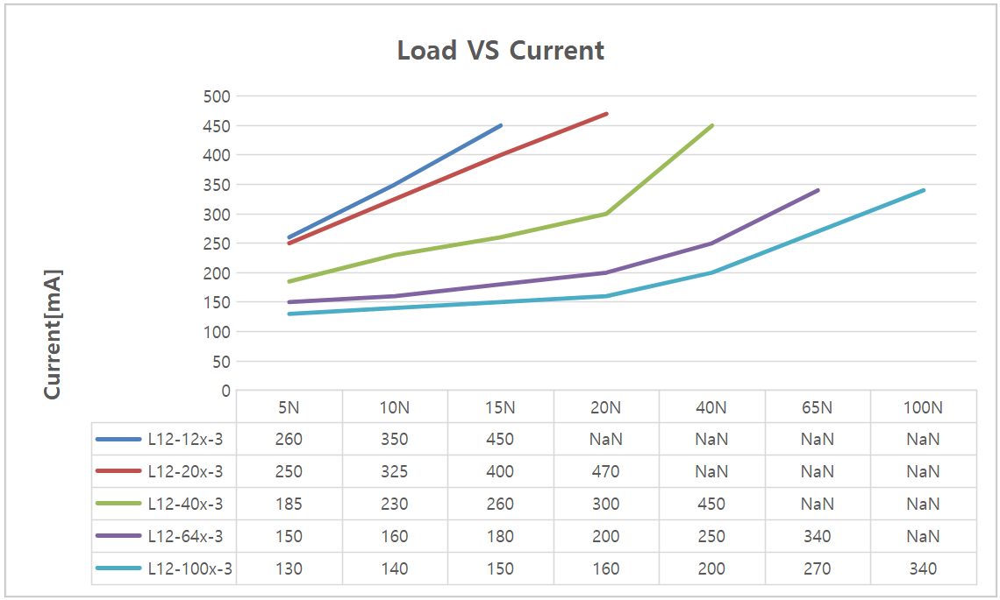
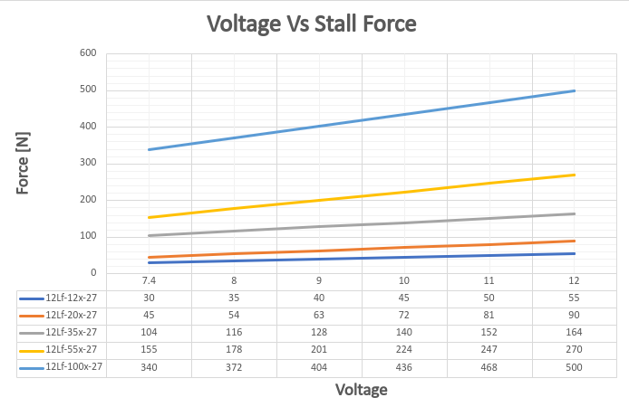
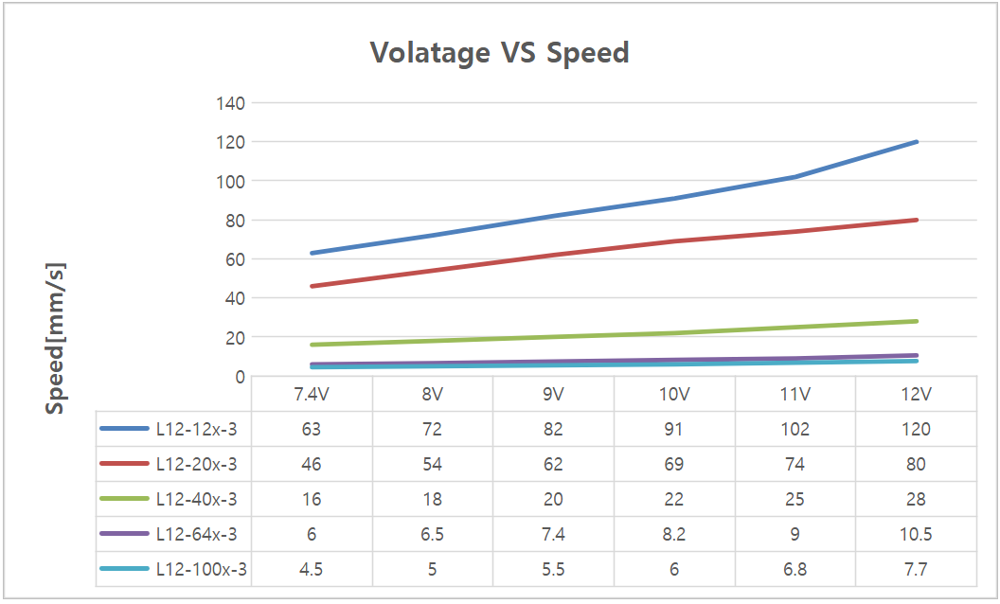
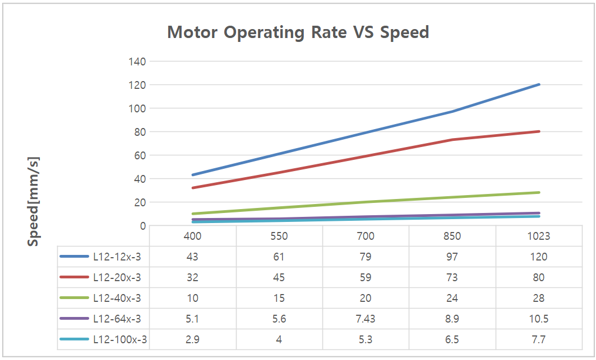
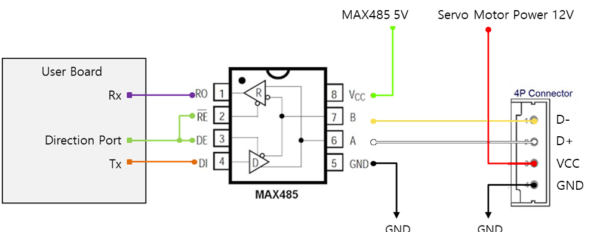

## 1. Features / 주요 특장점
-  Micro size / 마이크로 사이즈  
-  Precise position control / 정밀 위치 제어
-  Strong force comparing to the size / 체적 대비 강한 힘
-  Built-in Drive Circuitry / 드라이브 회로 내장
-  - RS-485 communication / RS-485 통신 지원
-  Parameter programmable on the Manager software / 매니저 소프트웨어를 통한 Parameter 셋팅 가능 

## 2. Specification
### 2.1 Common Specifications / 공통 사양

| **Property**                                | Value                                                                                                                                                                                                                                                             |
| ------------------------------------------- | ----------------------------------------------------------------------------------------------------------------------------------------------------------------------------------------------------------------------------------------------------------------- |
| **Stroke / 스트로크**                           | 27mm(프로그램통해 30mm까지 확대 가능)                                                                                                                                                                                                                                         |
| **Rated Load / 정격 부하**                      | 기어비에 따라 12~100N(별첨 참조)                                                                                                                                                                                                                                            |
| **Recommended duty cycle/정격부하 시 권장 듀티 사이클** | 32bit Arm Cortex                                                                                                                                                                                                                                                  |
| **Micro controller**                        | 32bit Arm Cortex                                                                                                                                                                                                                                                  |
| **Position Resolution**                     | 4096 Resolution (A/D Converter)                                                                                                                                                                                                                                   |
| **Input Voltage / 입력 전압**                   | 12.0V(Rated/정격),7V~13V(Operating)                                                                                                                                                                                                                                 |
| **Motor Type / Watt**                       | Coreless DC Motor / 3.5 Watt                                                                                                                                                                                                                                      |
| **Current consumption / 소모전류**              | 30mA(Idle), 380mA(Rated), 1.6A(Stall)                                                                                                                                                                                                                             |
| **Position repeatability**                  | Unidirectional less than 0.03mm(30um)                                                                                                                                                                                                                             |
| ^                                           | Bydirectional less than +/0.06mm(60um)                                                                                                                                                                                                                            |
| **Position sensor / 위치센서**                  | 10kΩ linearity potentiometer                                                                                                                                                                                                                                      |
| **Size, Weight /크기,무게**                     | 57.4(L)x29.9(W)x15(H)mm / 49~52g (to be varied according to gear ratio)                                                                                                                                                                                           |
| **Communication/ 통신**                       | RS-485                                                                                                                                                                                                                                                            |
| **Protocol**                                | IR Open Protocol (MODBUS is for Force control lineup only.)                                                                                                                                                                                                       |
| **Operating Temperatures / 동작온도**           | -10℃ ~ 60℃                                                                                                                                                                                                                                                        |
| **Ingress protection / 방수방진**               | IP-54                                                                                                                                                                                                                                                             |
| **Mechanical Backlash / 기구백래쉬**             | 0.03mm(30um)                                                                                                                                                                                                                                                      |
| **Audible Noise / 가청소음**                    | Max. 50db at 1m                                                                                                                                                                                                                                                   |
| **Gear ratio / 기어비**                        | :10:1(12PT,20PT,40PT) /30:1(64PT) /50:1(100PT)                                                                                                                                                                                                                    |
| **Gear type / 기어 타입**                       | Engineering plastic gears(12PT,20PT,40PT)   4metal & 2engineering plastic gears(64PT,100PT)(Aluminum and stainless steel combination)                                                                                                                          |
| **Rod type / Rod 타입**                       | stainless steel                                                                                                                                                                                                                                                   |
| **Standard Accessory / 표준 악세서리**            | 1xHinge base   1x Hinge   1xHinge shaft   1xRod end tip   2x M3 NUT   3 x M2.5x6 screws   1x Molex wire harness (200mm)   1 x M3 spanner   1 x Socket set screwlex wire harness (200mm)     1 x M3 spanner     1 x Socket set screw |
| **Connector Type (Male) in the Actuator**   | MOLEX 22-03-5035                                                                                                                                                                                                                                                  |
| **Wire Harness**                            | Molex(50-37-5033) to Molex(50-37-5033)/ 200mm / 0.08x60(22AWG)                                                                                                                                                                                                    |

### 2.2 Volatges / 전압  

| Parameter                          | Min | Norm | Max | Unit | Note |
| :--------------------------------- | :-: | :--: | :-: | :--: | :--: |
| **Supply voltage/ 공급 전압**          | 7.4 |  12  | 13  |  V   |   |
| **Logic input voltage / 로직 인가 전압** | 2.0 | 3.3  | 5.5 |  V   | TTL  |

### 2.3 Currents / 전류 

| Parameter                               | Min | Norm | Max | Unit | Note          |
| :-------------------------------------- | :-- | :--- | :-- | :--- | :------------ |
| **Maximum peak Current  / 최대 피크 전류** | 2.1 | 2.2  | 2.3 | A    | Stall Current |
| **No Load Current  / 무 부하 전류**       | 180 | 200  | 220 | mA   | No Load       |
| **Rated Load Current  /정격 부하 시 전류**  | 420 | 450  | 480 | mA   | Rated Load    |
| **Idle Current**                        | 25  | 30   | 35  | mA   |               |

### 2.4 Temperatures / 온도 

| Parameter                   | Min | Norm | Max | Unit | Note |
| :-------------------------- | :-: | :--: | :-: | :--: | :--: |
| **StorageTemp. / 보관온도**     | -20 |  -   | 70  |  ℃   |      |
| **Operating Temp. / 동작온도 ** | -10 |  -   | 60  |  ℃   |      |

### 2.5 Strokes / 스트로크

| Parameter                   | Min  | Norm | Max  | Unit | Note |
| :-------------------------- | :--- | :--- | :--- | :--- | :--- |
| **MIN Position / 최소 수축 위치** | 3.3  | 3.8  | 4.3  | mm   |      |
| **MAX Position / 최대 확장 위치** | 30.3 | 30.8 | 31.3 | mm   |      |
| **Stroke length/ 스트로크**     |      | 27.0 |      | mm   |      |

-  매니저 소프트웨어 또는 파라메터 맵의 Min / Max Position Calibration 기능으로 Min / Max 위치 값 동기화 가능.

### 2.6 No Load Speed / 무부하 속도

| Parameter                                      | Min  | Norm | Max  | Unit | Note        |
| :--------------------------------------------- | :--- | :--- | :--- | :--- | :---------- |
| Maximum Speed at 12.0V   최대 속도 at 12.0V  | 119  | 120  | 121  | mm/s | L12-12PT-3  |
| ^                                              | 79.5 | 80.0 | 80.5 | mm/s | L12-20PT-3  |
| ^                                              | 27.5 | 28.0 | 28.5 | mm/s | L12-40PT-3  |
| ^                                              | 10.0 | 10.5 | 11.0 | mm/s | L12-64PT-3  |
| ^                                              | 7.3  | 7.7  | 8.1  | mm/s | L12-100PT-3 |
### 2.7 Load 

| Parameter Parameter          | Min | Rated | Max | Unit | Note        |
| :------------------------------ | :-: | :---: | :-: | :--: | :---------- |
| Load at 12.0V   부하 at 12.0V  |     | 12.0  |     |  N   | L12-12PT-3  |
| ^                               |     | 2.69  |     | lbf  | ^           |
| ^                               |     | 1.22  |     | kgf  | ^           |
| ^                               |     | 20.0  |     |  N   | L12-20PT-3  |
| ^                               |     | 4.49  |     | lbf  | ^           |
| ^                               |     | 2.04  |     | kgf  | ^           |
| ^                               |     |  40   |     |  N   | L12-40PT-3  |
| ^                               |     | 8.99  |     | lbf  | ^           |
| ^                               |     | 4.07  |     | kgf  | ^           |
| ^                               |     | 64.0  |     |  N   | L12-64PT-3  |
| ^                               |     | 14.38 |     | lbf  | ^           |
| ^                               |     | 6.52  |     | kgf  | ^           |
| ^                               |     | 100.0 |     |  N   | L12-100PT-3 |
| ^                               |     | 22.48 |     | lbf  | ^           |
| ^                               |     | 10.19 |     | kgf  | ^           |

⁕ 1 kgf = 9.8N, 1lbf = 4.45N

### 2.8 Self Lock Feature / 셀프-락 기능
| Parameter | Min |     Norm      | Max | Unit | Note       |
| :-------- | :-: | :-----------: | :-: | :--: | :--------- |
| Slef Lock |  -  |    N/A(불가)    |  -  |      | L12-12x-3  |
| ^         |  -  |       ^       |  -  |      | L12-20x-3  |
| ^         |  -  | Available(가능) |  -  |      | L12-40x-3  |
| ^         |  -  |       ^       |  -  |      | L12-64x-3  |
| ^         |  -  |       ^       |  -  |      | L12-100x-3 |

>[!tip] Tip
>Self-Lock 이란 액츄에이터가 전원을 통한 모터의 힘 없이, 기구마찰력만으로 위치를 고수할 수 있는 힘을 의미합니다.
## 3. 참고 자료
### 3.1 Load Vs Current
부하에 따른 소비 전류를 나타낸 그래프 입니다. 해당 값은 오차를 포함하고 있습니다.

### 3.2 Load Vs Speed
부하에 따른 모터의 최대 속도도를 나타낸 그래프 입니다. 해당 값은 오차를 포함하고 있습니다.

### 3.3 Voltage Vs Stall Force 
입력 전압에 따른 Stall Force를 측정한 Data입니다. 해당 Data는 오차를 포함하고 있음으로 참고로 사용하시면 됩니다.  

  
### 3.4 Voltage Vs Speed 
입력 전압에 따른 무부하 최대 속도를 측정한 Data입니다. 해당 Data는 오차를 포함하고 있음으로 참고로 사용하시면 됩니다.  

### 3.5 Motor Operating Rate

### 3.6 PIN Map
| PIN NUMBER(COLOR) | PIN NAME&nbsp; | 
FUNCTION
 |
| :---------------: | :------------: | :-----------------: |
|     1(YELLOW)     |       D-       |      RS 485 -       |
|     2(WHITE)      |       D+       |      RS 485 +       |
|      3(RED)       |      VCC       |       Power +       |
|     3(BLACK)      |      GND       |       Power -       |
