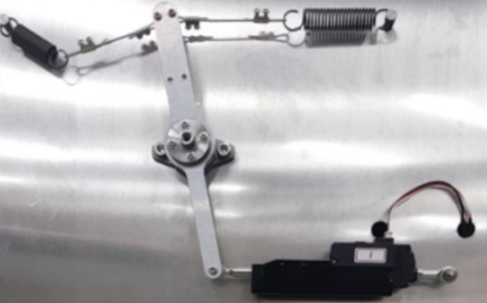

## mightyZAP 내구수명 가이드라인 (FORCE Control Lineup)
### 테스트 조건
- Full Stroke / 50% Duty Cycle / Pull spring Load (정격 full부하 조건)
  

### 수명 연장 조건
 - Stroke 길이 주이기
	 - 길이를 줄이는 만큼 정 비례로 수명 연장
	   예) 10mm stroke만 사용하면 2.7배 수명 연장
 - Duty cycle 
	 - 매 10%의 Duty cycle이 줄어들 때, 10% 수명 연장
	   예) 30%의 duty cycle이 줄면, 30%  수명 연장
 - 부하 줄이기
	 - 10% 붛라가 줄어들면, 5% 수명 연장
	   예) 1kg로 부하가 줄면, 25% 수명 연장

### 모델 별 내구수명
- 하기 수명 조건은 평균 수치이며, 개런티의 개념이 아닌 참고용 수치입니다.

### 27mm Stroke Series
| Test condition         | 12N           | 17~20N        | 30~40N      | 50~60N      | 80~10N      |
| ---------------------- | ------------- | ------------- | ----------- | ----------- | ----------- |
| **Model**              | L12-12XX-3    | L12-20XX-3    | L12-40XX-3  | L12-64XX-3  | L12-100XX-3 |
| **Test Load**          | 1.2kg         | 2kg           | 4kg         | 6.4kg       | 10kg        |
| **Duty Cycle**         | 50%           | 50%           | 50%         | 50%         | 50%         |
| **1 cycle stroke(mm)** | 54            | 54            | 54          | 54          | 54          |
| **Average Lifecycle**  | **1,500,000** | **1,300,000** | **650,000** | **351,000** | **195,000** |
### 40mm Stroke Series
| Test condition         | 17N         | 30N         | 50N         | 80N         |
| ---------------------- | ----------- | ----------- | ----------- | ----------- |
| **Model**              | L12-20XX-4  | L12-30XX-4  | L12-50XX-4  | L12-80XX-3  |
| **Test Load**          | 1.7kg       | 3.1kg       | 5kg         | 7.8kg       |
| **Duty Cycle**         | 50%         | 50%         | 50%         | 50%         |
| **1 cycle stroke(mm)** | 80          | 80          | 80          | 80          |
| **Average Lifecycle**  | **856,000** | **428,000** | **231,000** | **128,000** |
### 53mm Stroke Series
| Test condition         | 17N         | 30N         | 50N         | 80N        |
| ---------------------- | ----------- | ----------- | ----------- | ---------- |
| **Model**              | L12-20XX-6  | L12-30XX-6  | L12-50XX-6  | L12-80XX-6 |
| **Test Load**          | 1.7kg       | 3.1kg       | 5kg         | 7.8kg      |
| **Duty Cycle**         | 50%         | 50%         | 50%         | 50%        |
| **1 cycle stroke(mm)** | 80          | 80          | 80          | 80         |
| **Average Lifecycle**  | **627,000** | **313,000** | **169,000** | **94,000** |
### 90mm Stroke Series
| Test condition         | 17N         | 30N         |
| ---------------------- | ----------- | ----------- |
| **Model**              | L12-20XX-10 | L12-30XX-10 |
| **Test Load**          | 1.7kg       | 3.1kg       |
| **Duty Cycle**         | 50%         | 50%         |
| **1 cycle stroke(mm)** | 80          | 80          |
| **Average Lifecycle**  | **366,000** | **183,000** |
### 중요 공지 
- 명시된 수명 자료는 수명보증의 근거로 사용될 수 없습니다. 사용 및 설치 환경에 따라 수명은 달라질 수 있음을 양 해하여 주시기 바랍니다. 
- 당사 제품은 접촉식 위치인식 센서(포텐시오센서)를 사용하기 때문에, 사용 횟수에 따른 센서의 수명이 있습니다. 당사의 테스트에 따르면 최저 1백만회부터 2백만회 이상까지 편차가 있으니, 참고하시기 바랍니다. 
- 모터가동율 조정 : 만약 구매한 서보모터의 힘과 속도가 해당 어플리케이션에서 충분하다면, 모터의 가동률을 줄 임으로써 수명을 연장 시킬 수 있습니다. 마이티잽 매니저 소프트웨어를 통해 Motor Operating Rate 파라메터를 하향 조정하면 Stall force 힘과 속도가 함께 줄어듭니다. (Stall force가 하향되어도 정격포스는 변하지 않습니다)