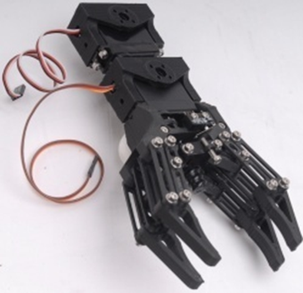
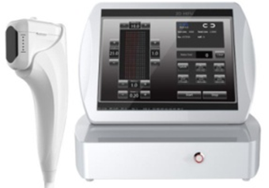
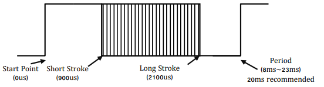
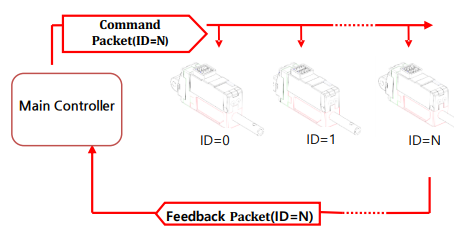
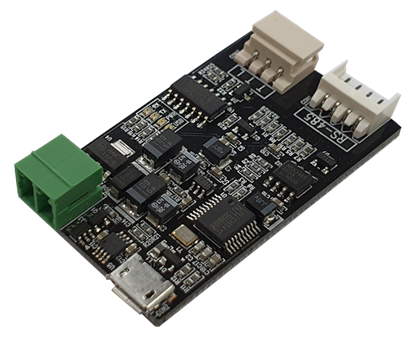

>[!note] NOTE
>- 본 매뉴얼은 모델명이 L12 또는 D12, D7로 시작하는 포지션 컨트롤 라인업 제품중, 펌웨어 버전 20이상이 적용 된 제품을 위한 매뉴얼입니다. 사용중인 액츄에이터의 펌웨어를 확인해 보신 후 펌웨어 버전이 20이하일 경우 펌웨어 업데이트를 한 후 본 매뉴얼을 참고하시기 바랍니다. (메모리 맵의 변동이 있습니다.) 
>- 모델명이 12Lf로 시작하는 모델 사용자분들은 별도의 포스 컨트롤 라인업 매뉴얼을 참고하시기 바랍니다.      
# 1. 시작에 앞서
## 1.1. 제품소개  
아이알로봇의 마이티잽 미니 리니어 서보 액츄에이터를 구매하여 주심에 감사 드립니다. 제품의 예상치 못한 파손과 인체에 발생할 수 있는 상해를 예방하기 위해 사용 전 본 매뉴얼을 숙지하여 주시기 바랍니다.    
마이티잽 미니 리니어 서보는 협소한 공간에서 효율적인 선형 운동이 필요한 어플리케이션에 활용 가능한 제품이며, 산업용, 의료용, 로봇연구 분야, UAV 분야 등 다양한 방면에서 활용이 가능한 제품입니다.      

**특징**
- 위치 제어 가능(위치 정밀도 50~90um : 모델 별 사양서 참고)
- 드라이브 회로 내장으로 설비 간소화
- 4096 스텝의 고해상도
- 고 출력 코어리스 모터 적용 
- 기구적인 백래쉬 최소화 설계 (30um)
- 위치 제어가 불가능한 기존 공압 실린더의 훌륭한 대체품
- 합리적인 비용으로 설비 단가 절감  
## 1.2. 사용시 주의 사항 
<b>⚠ 아래 주의 사항은 사용 시 각별히 주의를 요하는 사항이므로, 반드시 숙지를 하여 주십시오.     아래 사항을 준수하지 못해 발생한 문제에 대해서는 보증 서비스를 받을 수 없음을 알려드립니다.     </b> 
1. 제품 동작 시 로드(Rod)를 무리한 힘으로 누르지 마십시오. 정격 로드(Load) 범위 이상의 힘이 지속적으로 가해질 경우 모터가 소손 될 수 있습니다.     
2. 서보에 DC 정전압 장치를 사용하여 정격 전압에 맞게 전원 인가를 하여 주십시오. 12V 인가 제품은 7.0~13V를 인가 해 주셔야 합니다.   (정격 전압에서 최고 힘/최고 속도 출력) 13V이상의 과전압이 들어가면 제품 파손의 원인이 됩니다.    
3. 액츄에이터의 수명은 모터에 가해지는 부하(load)의 정도, 연속 반복 동작 횟수 및 동작 간 cooling time(Duty Cycle) 등의 요인에 의해 달라질 수 있습니다.     
	1) 반드시 정격 부하 이하 조건에서 사용하여 주십시오. 가령, L12-20PT-3 제품의 경우 정격 부하가 20N(약 2kg)입니다. 즉, L12-20PT-3 제품의 경우 20N 이하의 부하로 사용하셔야 제품의 수명을 극대화할 수 있습니다.   정격 부하 대비 작은 부하를 가할 수록 액츄에이터의 수명은 향상됩니다.     
	2) Duty Cycle은 50% 이하로 설정하여 주십시오. DC 모터 특성 상, 조금도 쉬지 않고 지속적으로 움직이는 작업을 수행하면, 모터는 결국 과부하가 걸리고, 모터를 보호하기 위해 Overload 보호 기능이 작동되어 모터 전원이 꺼지게 됩니다.   그러므로 모터 동작 시간 대비 일정 시간 쉴 수 있도록 하는 Duty Cycle을 설정해 주어야 합니다.   Duty Cycle이란 DC모터가 동작하는 시간 대비 쉬어주는 시간의 주기입니다.   즉, 듀티 사이클 50%라함은 액츄에이터가 50%의 시간을 동작하면 50%의 시간은 쉬어주어액츄에이터의 효율적인 수명 관리가 가능합니다.   최적의 수명 관리를 위해, 적용 시 최대 듀티 사이클은 50%를 넘지 않도록 해주십시오. 듀티 사이클이 적어질수록 액츄에이터의 수명은 연장됩니다.    
	3) 설비 운용 중, 리니어 서보 액츄에이터를 사용하지 않는 상황 에서는, 액츄에이터에 Force off 명령을 주어서 액츄에이터의 수명을 늘릴 수 있습니다. (참조 : [[#1.5. 포스오프기능]] )
4. 오배선에 유의하십시오. 당사가 제공하는 커넥터가 장착된 wire harness를 사용하여 배선하게 될 경우 오배선의 확률은 거의 없습니다.   다만, 사용자의 필요에 따라 당사 제공 커넥터가 아닌 납땜, 혹은 제3의 커넥터를 활용하게 될 경우, 통신/전원 라인간 오배선에 유의하여 주십시오. 오배선을 하게 될 경우, PC보드 또는 특정 전장 부품이 소손되어 치명적인 손상을 가져올 수 있습니다.   핀맵을 참고하여 오배선을 방지하십시오. 사용자 매뉴얼 [[#4.1. 서보 회로 연결]]  페이지의 배선 Pin map을 참고하여 오배 선이 되지 않도록 유의하여 주십시오.      
5.   기구적인 limit설정과 위치 이동 명령 범위를 일치 시켜 주세요. 서보 액츄에이터의 기구적인 설치 시, 서보 액츄에이터가 움직일 수 있는 기구적인 한계 치를 설정하게 됩니다. 기구적인 limit 설정 후, 서보의 위치 명령은 반드시 이 한계 내에서 이루어져야 하며, 그렇지 않을 경우 액츄에이터에 큰 부하를 주어서 Overload 보호 기능이 작동되고, 이것이 지속적으로 반복될 경우 액츄에이터수명에 영향을 주게 되며, 인위적으로 Overload 보호 기능을 사용자가 해제한 경우 액츄에이터가 소손 될 수도 있습니다.     정밀한 위치 제어 특성상 기구적인 리미트 내에서 위치 명령을 주도록 설계가 되었는지 반드시 재 점검 및 주의를 하여 주시기 바랍니다.     
    
6. 두 개의 액츄에이터로 하나의 대상 체를 동기 제어하지 마십시오.     동일 모델이라 할지라도 두개 액츄에이터 사이에는 미세한 속도 차이가 존재하며, 동일한 대상체에 대해 모션 동기화를 시켰을 때 도달하는 위치 값은 동일하더라도 속도 차이로 인해 한쪽 액츄에이터가 과부하 될 수 있습니다.    
   

7. Rod End Tip 체결 시 무리하게 Rod를 비틀어 돌리지 마십시오. (주의) 로드 엔드 팁 장착 시 본체가 고정된 상태에서 무리하게 로드에 비트는 힘을 가하게 되면 내부 부품(EngineeringPlastic Rod-Insert) 파손의 원인이 됩니다.     파손 방지를 위해 아래를 참고하십시오.        
   **체결방법 – M3스패너 사용**
   
	1) 동봉된 M3 스패너(⑤)로 Rod end(⑥)를 고정합니다. M3 너트(②)를 조이면서 로드(①)가 심하게 돌아가며 내부 부품이 파손되는 것을 방지하기 위함입니다.      
	2) 필요에 따라 무두 볼트(③) 또는 로드 엔드 팁(④)을 완전히 조이기 전 적정 위치까지 돌려 장착합니다.      
	3) 로드 엔드 팁(④)의 각도를 원하는 각도로 맞춘 후 롱 노우즈 또는 여분의 M3 스패너가 있을 경우 스패너를 사용하여 M3 너트(②)를 조여서 위치를 고정합니다(아래 그림과 같이 로드 엔드는 M3 스패너로 고정된 상태에서 진행).    

8. 작동 직후 서보 액츄에이터 케이스는 뜨거울 수 있습니다. 화상에 주의하십시오.      
9. 서보 액츄에이터를 물기, 먼지, 기름으로부터 멀리 하십시오.       
10. 본 제품은 실내 용도로 설계된 제품입니다. 실외에서 사용을 금합니다.    
11. 어린이의 손이 닿지 않는 곳에 제품을 보관하십시오. 성인이 사용 시에도 모터의 동작 시 발생할 수 있는 신체 상해에 유의하십시오.       
## 1.3. 적절한 보관
아래 극심한 환경에서 제품을 사용하거나 보관하지 마십시오. 오작동이나 제품의 파손을 불러올 수 있습니다.    
- 섭씨 70도 이상의 고온 환경 또는 섭씨 영하 20도의 저온 환경
- 직사광선 또는 화기 근처 / 고온 다습하고 먼지가 많은 장소 / 진동이 심한 장소 / 정전기를 유발할 수 있는 장소
##  1.4. 과부하 조건 / 과부하 (Overload) 보호 기능

과부하 보호(Overload Protection/Overload shutdown)기능은, 서보 액츄에이터 구동 시 구동 모터에 과부하가 걸려 수명에 지대한 영향을 미치거나,나아가서는 모터 소손을 방지하기 위한 것입니다. 적절한 보호 기능을 위해 아래 사항을 잘 읽어보시고 조건에 맞게 사용을 해주시기 바랍니다.      
### 1.4.1. 과부하 보호 기능(Overload shutdown)의 메커니즘 / 용어 정의
- 당사 제품의 과부하 보호기능 메커니즘은, 구동모터가 Duty cycle 50%를 넘는 상태로 작동이 되어, 쉼없이 동작한 누 적 시간이 30초 이상 경과 되면 shutdown 이 일어납니다. 
- Duty cycle 이라 함은, 서보 액츄에이터에 전원이 들어가 있는 시간대비 실제 모터가 구동하는 시간의 비율이며, Duty cycle 50%라 함은 모터가 50% 시간을 일하면 50% 시간은 쉬어주어야 함을 뜻합니다. 
- 구동 모터의 작동이라 함은 모터가 회전하여 정상적으로 stroke 이동이 일어나는 경우와, 장애물에 의해 위치이동이 제약되어 모터가 회전하지 않더라도 전류를 소모하는 경우도 포함합니다.   
### 1.4.2. Overload shutdown 해제 기능
Overload shutdown 기능이란 과부하 상황에서 서보 액츄에이터를 보호하기 위한 기능입니다.   어플리케이션에 따라서는, 서보 액츄에이터 보다는 전체 메커니즘의 보호가 중요한 경우나, 혹은 서보 액츄에이터의 수명을 좀 단축 시키더라도 가혹한 조건으로 운용이 필요한 어플리케이션이 존재 합니다.   이때는 shutdown이 작동하지 않도록 mightZAP 서보 매니져를 통해서 shutdown 기능을 해제 할 수 있습니다. 단, force control버전에서는 Goal current를 설정하여 overload상황에서도 설정해 놓은 전류 최대치를 넘지 않도록 하여 모터를 보호할 수 있습니다.
### 1.4.3. Overload shutdown 후 복구
Shutdown된 후에도 통신 라인은 여전히 기능을 하고 있으므로, Restart 명령을 통해 복구를 하거나, 전원을 다시 연결하면 초기 상태로 복구가 됩니다. 복구 전 반드시 과부하 요인을 제거하여 주십시오.        
### 1.4.4. 예외 혹은 주의 사항
- 주의 1) Application과 액츄에이터 사이에 스프링이 장착되었을 때나, 중력 방향으로 설치가 되어 있어 로드에 중력에 따른 외력이 영향을 줄  경우 로드의 위치 변화는 없지만, 서보 액츄에이터는 위치 유지를 위해서 모터를 가동 시키는 상태가 될 수 있습니다. 이 상황이 지속될 경우 Overloadshutdown을 불러올 수 있으며, 이를 방지하기 위해 외력이 발생하는 동안에는 Force Off 명령을 적절히 이용해주면 됩니다.    
- 주의 2) Overload shutdown이 한번 실행될 때마다, 크지는 않지만 모터에 손상을 입히는 것이므로 자주 shutdown이 일어나지 않도록 첫 번째 Overload shutdown 후, 과부하 조건을 해소해야 합니다.     
### 1.4.5. 과부하 보호 기능(Overload Protection)
과부하 보호 기능을 활성화하여 모터의 과부하를 방지할 수 있습니다.     
과부하 보호기능은 기본적으로 활성화 되어 출하되며, 해당 기능이 필요 없을 경우 servo manager software를 이용하여 보호기능을 비활성화 시켜주면 됩니다(단, Overload 보호기능 비활성화는 추천하지 않습니다).  과부하 보호기능을 활성화 시키면, 특정 시간 이상 동일한 위치에서 부하 환경이 지속될 경우, 이를 인식하여 모터의 전원을 차단, 모터를 보호합니다.    
과부하 보호기능 설정/해제 방법은, 서보매니저 프로그램을 이용하면 가장 간편하게 설정할 수 있습니다. 서보 연결 후 소프트웨어상에서 Shutdown Alarm 셋팅을 선택하여 Overload Error항목을 활성화/비활성화 시켜줌으로써 설정이 가능합니다.     
명령 패킷을 통한 설정 방법은, Alarm Shutdown기능에 해당하는 주소(0x12)에 다음과 같이 Error 발생중에 Overload Error에 해당하는 bit 5를 ‘1’로 SET하여 리니어서보로 Store Data 명령을 보냅니다. Overload Error가 발생 했을 때,해당 bit가 ‘1’로 설정되어 있으면 Force를 OFF하게 됩니다. (1=활성 / 0=비활성)

| Error               | bit |
| :------------------ | :-- |
| NONE                | 7   |
| NONE                | 6   |
| Overload Error      | 5   |
| NONE                | 4   |
| NONE                | 3   |
| NONE                | 2   |
| NONE                | 1   |
| Input Voltage Error | 0   |

<u>Store Data</u>명령을 보낼 때 아래 예제를 참고합니다.    

**Command Packet**

| HEADER   | ID   | Size | Command | Factor #1 Address  | Factor #2 Data  | Checksum |
| :------- | :--- | :--- | :------ | :----------------------- | :-------------------- | :------- |
| 0xFFFFFF | 0x00 | 0x04 | 0xF3    | 0x12                     | 0x20                  | 0xD6     |

> [!warning] 주의 - 정격부하에서의 사용  
> 리니어 액츄에이터 적용 시 표기된 정격 부하 내에서 사용해야 안정적인 동작을 구현하고 제품의 수명을 적절히 관리할 수 있습니다.
## 1.5. **Force Off 기능** 
서보액츄에이터가 위치 이동 후에는, 위치 값 변경을 불러오는 외력이 없는 이상 동작을 멈추게 됩니다. 진동 또는 외력으로 액츄에이터의 위치 값 변경이 지속적으로 발생하게 되면, 액츄에이터는 위치 값을 고수하기 위해 쉬지 못하고 지속적으로 동작하게 되어 모터 수명에 영향을 주게 됩니다. 이런 경우, Force Off 기능을 적절히 활용하게 되면 모터전원을 해제하여 모터를 쉬게 하면서도 기구적인 마찰력으로 위치를 고수하게 할 수 있습니다(Mechanical Self Lock 기능). 특정 위치에 도달 후 특정 시간 위치를 계속 유지한 상태로 있어야 할 때도, 부가된 안전기능으로서 Force off 파라메터를 활용하여 모터의 전원을 차단해 주면 모터 수명 관리에 도움을 줍니다.     
모터의 전원은 차단되더라도 통신은 여전히 유지되며, 다음 명령(Force On 또는 GoalPosition)을 내릴 때까지 모터는 힘을 받지 않고 그 자리를 기구적으로 유지하게 되어, 고정 시간이 긴 경우 모터의 수명 관리에 많은 도움이 됩니다.    
Force off기능은 전원 차단 시 위치를 고수하는 기구적인 Mechanical Self lock 기능이 있는 제품에 한해 사용되어져야 하며, 각 제품의 Mechanical Self lock 기능 여부는 아래 표를 참고하십시오. (아래표는 27mm스트로크 제품에 국한됩니다. 스트로크가 긴 액츄에이터의 mechanical self lock기능 여부는 각 제품의 사양서를 참고하십시오.       

| 정격 부하 사양  | Mechanical Self-Lock |
| :-------- | :------------------- |
| 10 - 20N  | 해당없음 (특정부하에서 밀림)     |
| 27 - 100N | 가능                   |

명령 패킷을 통한 설정 방법은, Force ON/OFF기능에 해당하는 주소(0x80)에 0x00를 리니어 서보로 Store Data 명령을 보냅니다. (Force를 ON하고자 할때는 0x01을 보냅니다.    )
Store Data 명령을 보낼 때 아래 예제를 참고합니다.     
Command Packet 

| HEADER   | ID   | Size | Command | Factor #1 Address  | Factor #2 Data  | Checksum |
| :------- | :--- | :--- | :------ | :----------------------- | :-------------------- | :------- |
| 0xFFFFFF | 0x00 | 0x04 | 0xF3    | 0x80                     | 0x00                  | 0x88     |

> [!tip] TIP  
>Force Off상태에서 위치 이동(Goal Position) 명령을 내리는 경우는 별도의 Force ON 패킷 명령을 주지 않아도 됩니다.     모든 위치 이동 명령에는 이미 Force ON 명령이 포함되어 있기 때문입니다.     

---
# 2. 제품 구성/제원 및 사양
## 2.1. 구성

* 3번 M3 너트는 Hinge Shaft 고정과 더불어, 로드 앤드 팁과 로드 앤드 너트 사이에 스토퍼로 체결하여 사용하시기 바랍니다.    
## 2.3. 사양
### 2.3.1. 상세 스펙표
#### 2.3.1.1 Coreless Motor

| 정격부하 | 스트로크 | 통신 타입  (RS-485) | 통신타입 (TTL/PWM)&nbsp; | 정격부하 /   최고속도 (무부하) | Mechanical   Self Lock   (Z축 사용) | 리드스크류 / 기어비 / 기어타입                                         |
| :--- | :--- | :----------------- | :------------------- | :--------------------- | :------------------------------------- | :--------------------------------------------------------- |
| 12N  | 27mm | L12-12F-3          | L12-12PT-3           | 12N / 110mm/s          | 없음   (Z축 적용주의)                      | 리드각 20°   / 10:1    / Engineering   Plastic Gears |
| 17N  | 41mm | L12-20F-4          | L12-20PT-4           | 17N / 80mm/s           | ^                                      | 리드각 15°   / 10:1    / Engineering   Plastic Gears |
| ^    | 56mm | L12-20F-6          | L12-20PT-6           | ^                      | ^                                      | ^                                                          |
| ^    | 96mm | L12-20F-10         | L12-20PT-10          | ^                      | ^                                      | ^                                                          |
| 20N  | 27mm | L12-20F-3          | L12-20PT-3           | 20N / 80mm/s           | ^                                      | ^                                                          |
| 31N  | 41mm | L12-30F-4          | L12-30PT-4           | 31N / 28.0mm/s         | 있음 (Z축 적용가능)                           | 리드각 5°   / 10:1    / Engineering   Plastic Gears  |
| ^    | 56mm | L12-30F-6          | L12-30PT-6           | ^                      | ^                                      | ^                                                          |
| ^    | 96mm | L12-30F-10         | L12-30PT-10          |                        | ^                                      | ^                                                          |
| 40N  | 27mm | L12-40F-3          | L12-40PT-3           | 40N/28.0mm/s           | ^                                      | ^                                                          |
| 50N  | 41mm | L12-50F-4          | L12-50PT-4           | 50N / 10.5mm/s         | ^                                      | 리드각 5° / 30:1 / Metal Gear                                 |
| ^    | 56mm | L12-50F-6          | L12-50PT-6           | ^                      | ^                                      | ^                                                          |
| 64N  | 27mm | L12-64F-3          | L12-64PT-3           | 64N / 10.5mm/s         | ^                                      | ^                                                          |
| 78N  | 41mm | L12-78F-4          | L12-78PT-4           | 78N / 7.7mm/s          | ^                                      | 리드각 5° / 50:1 / Metal Gears                                |
| ^    | 56mm | L12-78F-6          | L12-78PT-6           | ^                      | ^                                      | ^                                                          |
| 100N | 27mm | L12-100F-3         | L12-100PT-3          | 100N / 7.7mm/s         | ^                                      | ^                                                          |
#### 2.3.1.2 Cored Motor
| 정격부하 | 스트로크 | 통신 타입  (RS-485) | 통신타입 (TTL/PWM)&nbsp; | 정격부하 /   최고속도 (무부하) | Mechanical   Self Lock   (Z축 사용) | 리드스크류 / 기어비 / 기어타입                                     |
| :--- | :--- | :----------------- | :------------------- | :--------------------- | :------------------------------------- | :----------------------------------------------------- |
| 6N   | 26mm | D12-6F-3           | D12-6PT-3            | 6N / 36mm/s            | 없음   (Z축 적용주의)                      | 리드각 15° / 10:1 / Engineering Plastic Gears    |
| ^    | ^    | D7-6F-3            | D7-6PT-3             | ^                      | ^                                      | ^                                                      |
| 12N  | ^    | D12-12F-3          | D12-12PT-3           | 12N / 12mm/s           | 있음 (Z축 적용가능)                           | 리드각 5° / 10:1 / Engineering Plastic Gears     |
| ^    | ^    | D7-12F-3           | D7-12PT-3            | ^                      | ^                                      | ^                                                      |

### 2.3.2. 공통 사양서
#### 2.3.2.1 L12 시리즈 공통사양서
| Item                   | &lt;        | &lt;    | Value                                                                                                                                                                                                                   |
| :--------------------- | :---------- | :------ | :---------------------------------------------------------------------------------------------------------------------------------------------------------------------------------------------------------------------- |
| **위치정밀**               | 27mm / 41mm | &lt;    | 30μm (0.03mm)                                                                                                                                                                                                           |
| ^                      | 56mm        | &lt;    | 40μm (0.04mm                                                                                                                                                                                                            |
| ^                      | 96mm        | &lt;    | 50μm (0.05mm))                                                                                                                                                                                                          |
| **기구 백래쉬**             | &lt;        | &lt;    | 0.03mm (30μm)                                                                                                                                                                                                           |
| **Rod 타입**             | &lt;        | &lt;    | Metal Alloy Rod                                                                                                                                                                                                         |
| **모터타입**               | &lt;        | &lt;    | Coreless Motor                                                                                                                                                                                                          |
| **전압**                 |             | &lt;    | 12V                                                                                                                                                                                                                     |
| **Watt**               |             | &lt;    | 3.5W                                                                                                                                                                                                                    |
| **권장 Duty Cycle**      | 정격 부하 시     | &lt;    | 최대 50%                                                                                                                                                                                                                  |
| ^                      | 최대 허용 부하 시  | &lt;    | 최대 20%                                                                                                                                                                                                                  |
| **위치인식센서**             | &lt;        | &lt;    | 10KΩ linear Potentiometer                                                                                                                                                                                               |
| **인가 전압범위**            | &lt;        | &lt;    | 7 ~ 13V                                                                                                                                                                                                                 |
| **소모전류**               | Idle        | &lt;    | 20mA                                                                                                                                                                                                                    |
| ^                      | Rated       | &lt;    | 280mA                                                                                                                                                                                                                   |
| ^                      | Stall       | Default | 800mA                                                                                                                                                                                                                   |
| ^                      | ^           | MAX     | 1.6A                                                                                                                                                                                                                    |
| **가청 소음**              | &lt;        | &lt;    | 약 50db at 1m                                                                                                                                                                                                            |
| **LED 표시**             | &lt;        | &lt;    | 2가지 에러표시 (Input voltage, Overload)                                                                                                                                                                                      |
| **펄스방식 / 펄스범위**        | &lt;        | &lt;    | PWM (PT version, RC모형 송수신용 신호) / 900μs(수축)-1500 μs(센터)-2100μs (확장)                                                                                                                                                      |
| **데이타 통신방식 / 프로토콜**    | &lt;        | &lt;    | RS-485 또는 TTL(PT version) / IR Robot open protocol                                                                                                                                                                      |
| **Ingress Protection** | &lt;        | &lt;    | IP-54 (Dust &amp; Water Tight)                                                                                                                                                                                          |
| **스크로크별 크기/무게**        | &lt;        | &lt;    | (크기는 로드엔드 / 힌지 제외)                                                                                                                                                                                                      |
| **27mm**               | &lt;        | &lt;    | 57.5(L)x29.9(W)x15(H)mm / 49~52g                                                                                                                                                                                        |
| **40mm**               | &lt;        | &lt;    | 86.9(L)x36(W)x18(H)mm / 96~99g                                                                                                                                                                                          |
| **53mm**               | &lt;        | &lt;    | 111.5(L)x36(W)x18(H)mm / 124~127g                                                                                                                                                                                       |
| **90mm**               | &lt;        | &lt;    | 151.5(L)x36(W)x18(H)mm / 약177g                                                                                                                                                                                          |
| **동작온도 조건**            | &lt;        | &lt;    | -10℃ ~ 60℃                                                                                                                                                                                                              |
| **와이어 하네스**            | &lt;        | &lt;    | TTL(PT version) :&nbsp; Molex to Molex Type&nbsp;(Molex 50-37-5033, 3pins) / 200mm length, 0.08×60(22AWG) &lt;br&gt; 또는 RS485(F version) : Molex to Molex Type (Molex 0510650400, 4pins) / 200mm length, 0.08×60(22AWG) |
#### 2.3.2.2 D12,D7 시리즈 공통사양서
| Item                   | &lt;       | &lt;    | Value                                                                                                                                                                                                                   | <       |
| :--------------------- | :--------- | :------ | :---------------------------------------------------------------------------------------------------------------------------------------------------------------------------------------------------------------------- | ------- |
| **위치정밀**               | 26mm       | &lt;    | 30μm (0.03mm)                                                                                                                                                                                                           | <       |
| **기구 백래쉬**             | &lt;       | &lt;    | 0.03mm (30μm)                                                                                                                                                                                                           | <       |
| **Rod 타입**             | &lt;       | &lt;    | Metal Alloy Rod                                                                                                                                                                                                         | <       |
| **모터타입**               | &lt;       | &lt;    | Coreless Motor                                                                                                                                                                                                          | <       |
| **Watt**               |            | &lt;    |                                                                                                                                                                                                                         | <       |
| **권장 Duty Cycle**      | 정격 부하 시    | &lt;    | 최대 50%                                                                                                                                                                                                                  | <       |
| ^                      | 최대 허용 부하 시 | &lt;    | 최대 20%                                                                                                                                                                                                                  | <       |
| **위치인식센서**             | &lt;       | &lt;    | 10KΩ linear Potentiometer                                                                                                                                                                                               | <       |
| **인가 전압범위**            | &lt;       | &lt;    | 12V 모터 : 7 ~ 13V, 7.4V 모터 : 6.5 ~ 8.9V                                                                                                                                                                                  | <       |
| **소모전류**               | <          | <       | 7.4V 라인업                                                                                                                                                                                                                | 12V 라인업 |
| ^                      | Idle       | &lt;    | 30mA                                                                                                                                                                                                                    | 30mA    |
| ^                      | Rated      | &lt;    | 250mA                                                                                                                                                                                                                   | 140mA   |
| ^                      | Stall      | Default | 480mA                                                                                                                                                                                                                   | 300mA   |
| ^                      | ^          | MAX     | 1.6A                                                                                                                                                                                                                    | <       |
| **가청 소음**              | &lt;       | &lt;    | 약 50db at 1m                                                                                                                                                                                                            | <       |
| **LED 표시**             | &lt;       | &lt;    | 2가지 에러표시 (Input voltage, Overload)                                                                                                                                                                                      | <       |
| **펄스방식 / 펄스범위**        | &lt;       | &lt;    | PWM (PT version, RC모형 송수신용 신호) / 900μs(수축)-1500 μs(센터)-2100μs (확장)                                                                                                                                                      | <       |
| **데이타 통신방식 / 프로토콜**    | &lt;       | &lt;    | RS-485 또는 TTL(PT version) / IR Robot open protocol                                                                                                                                                                      | <       |
| **Ingress Protection** | &lt;       | &lt;    | IP-54 (Dust &amp; Water Tight)                                                                                                                                                                                          | <       |
| **스크로크별 크기/무게**        | &lt;       | &lt;    | (크기는 로드엔드 / 힌지 제외)                                                                                                                                                                                                      | <       |
| **26m**                | &lt;       | &lt;    | 57.5(L)x29.9(W)x15(H)mm / 49~52g                                                                                                                                                                                        | <       |
| **동작온도 조건**            | &lt;       | &lt;    | -10℃ ~ 60℃                                                                                                                                                                                                              | <       |
| **와이어 하네스**            | &lt;       | &lt;    | TTL(PT version) :&nbsp; Molex to Molex Type&nbsp;(Molex 50-37-5033, 3pins) / 200mm length, 0.08×60(22AWG) &lt;br&gt; 또는 RS485(F version) : Molex to Molex Type (Molex 0510650400, 4pins) / 200mm length, 0.08×60(22AWG) | <       |

# 3. 리니어 서보의 활용처
## 3.1. 공장자동화
]
- 위치제어가 쉽지 않은 공압실린더의 훌륭한 대체품 
- 실시간 자동 폭 조정 장치
- 실시간 자동 얼라인먼트 시스템 (상/하 또는 좌/우)
- 자동 밸브 컨트롤 
- 자동 디스펜싱 시스템 
- 클램핑 구동부
- 고정 또는 거리 조정
- Pick & Place
- In & Out / 확장 & 수축
- Pull & Pushing
- Open & Closing (On-Off)
- 방향 전환
- Hexapod /Tripod 운동
## 3.2. 생산 및 검사 지그
]
- 생산 및 검사 지그
- 홀 펀칭 지그
- 홀 검사 지그
- 버튼 / 스위치 검사 지그
- 터치 패널 검사 지그
- PCB 테스트 지그
## 3.3. 로보틱스 연구분야
]
- 로보틱스 연구분야
- 로봇의 구동 관절
- 로봇 그리퍼
- 로봇의 선형 구동부
## 3.4. UAV / 전문 Drone
]
- UAV / 전문 Drone
- 고정익 항공기의 타각/스로틀 조정 
- 회전익 항공기의 Swash Plate Control / Rudder Control
- 드론의 리트렉터, 물건 투하 장치, 카메라 팬틸트
- 기타 방산 장비의 타각 조정용 부품
## 3.5. 의료기 / 실험실 장비
]
- 의료기/실험실 장비
- 의료장비의 선형위치제어
- 카메라 또는 레이저 장비의 포커스 조절
- 실험분석 장비
## 3.6. 교육 / 취미
]
- 3D 프린터
- 아두이노나 라즈베리 파이 제어 / Maker's DIY

# 4. 서보제어
## 4.1. 서보 회로 연결
### 4.1.1. TTL/PWM (3핀 커넥터-모델명 L(D)-xxPT-xx 계열)
마이티잽(L(D)xx-xxPT-x)을 TTL레벨로 제어 하기 위해서 제어기의 UART 신호를 Half Duplex type로 변환 시켜야 합니다.   이때 변환 회로는 아래 그림과 같습니다.    

]
위의 회로도에서 TTL Level의 Tx와 Rx는 DIRECTION_PORT의 Level에 따라 다음과 같이 Data 신호의 방향이 결정됩니다.    
	- DIRECTION_PORT의 신호 Level이 LOW인 경우 :Data의 신호가 Rx로 입력  
	- DIRECTION_PORT의 신호 Level이 HIGH인 경우 :Tx 의 신호가 Data로 출력  
	※ 위 다이어그램과 같이 통신 제어기와 액츄에이터의 GND는 서로 연결이 되어야 합니다.    
> [!note] NOTE  
>※ PWM통신의 경우, 위 청색 Data핀에 3~5V의 PWM 시그널선을 연결해 주면 됩니다 (전원 연결도 위 그림과 동일).  
>※ PWM통신을 이용하는 경우, 데이터 통신 지원이 안되므로, 위치 명령은 가능하지만 현재 위치값 등의 Feedback data를 받을 수 없으며, 시리얼 Daisy chain 연결을 지원하지 않습니다.    
>※ Feedback data 수신과 Daisy chain연결은 TTL 또는 RS-485통신을 통해 가능합니다.    

### 4.1.2. RS-485 (4핀 커넥터- 모델명 Lxx-xxF-x 계열)
mightyZAP (L(D)xx-xxF-xx)을 제어하기 위해 RS485 통신방식을 사용합니다.    
이때 핀맵과 변환회로는 다음 페이지의 그림과 같습니다.    

|PIN NUMBER(COLOR)|PIN NAME|FUNCTION(RS485)|
|---|---|---|
|1(황색)|D-|RS485 –|
|2(백색)|D+|RS485 +|
|3(적색)|VCC|전원 +|
|4(흑색)|GND|전원 -|

※ 전원이 별도로 외부에서 공급되는 경우에는, 485 D+, 485 D-만 연결해도 동작에 문제가 없습니다.    
]
위의 회로도에서DIRECTION_PORT핀을 제어하여 RS485의 TX및 RX 모드를 변환할 수 있습니다.    
	- DIRECTION_PORT의 신호 Level이 LOW인 경우 :Data의 신호가 Rx로 입력  
	- DIRECTION_PORT의 신호 Level이 HIGH인 경우 :Tx의 신호가 Data로 출력  
	※ 위 다이어그램과 같이 통신 제어기와 액츄에이터의 GND는 서로 연결이 되어야 합니다.    
## 4.2. 통신 
]
Controller와 마이티잽은 packet을 주고 받으며 통신합니다.   Packet의 종류로는 Main controller에서 마이티잽으로 전송되는Command Packet과 마이티잽에서 제어기로 전송되는 Feedback Packet이 있습니다.    

### 4.2.1. Communication specification    
- 2 Mode in One (Pulse / Data Mode Auto-Switching)  
  입력 신호에 따라 자동적으로 데이터 모드와 펄스 모드의 전환이 이루어집니다.    
- Data Mode (TTL / RS-485)  
   마이티잽은8 bit, 1 Stop bit, None Parity의 Asynchronous Serial 통신을 합니다.    

|Item|Spec|
|---|---|
|**Structure**|Half-duplex UART|
|**Baud Rate**|57600bps(default)|
|**Data Size**|8bit|
|**Parity**|non-parity|
|**Stop Bit**|One bit|

> [!warning] <b>주의</b>    <b>안정적인 통신을 위한 지연 시간</b>  
> MightyZap은 반이중 통신 방식으로, 데이터 읽고 쓰기 중 데이터 충돌이 나지 않도록, 데이터 쓰기 중에는 5msec, 데이터 읽어오기 중에는 10msec 정도의 지연 시간을 주어야 안정적으로 통신을 할 수 있습니다.    해당 지연시간을 지키지 않을 경우 통신 충돌로 인한 서보액츄에이터의 이상동작이 발생할 수 있습니다.   위의 지연시간은 최소 지연시간이 아닌 안전을 고려한 적정 지연 시간입니다

- PWM Pulse Mode 
  PPM(Pulse Position Modulation) Compatible (Radio-Control Servo Pulse Mode) 
  흔히,RC용 서보에 사용하는 Pulse 규격을 사용합니다.   위치명령이 가능하지만, 여타 피드백 데이터는 없습니다.  
  ]
※ Period (8ms~23ms) 20ms 추천    

> [!note] NOTE  
>※ PWM 제어는 노이즈에 취약함으로 한번의 PWM 신호로 제어하지 않고, 특정 주파수로 끊어지지않게  연속적으로 포화방식의 신호를 보내줘야 합니다.   추천 frequency는 50Hz(20ms) 입니다.    
>※ PWM통신을 이용하는 경우, 데이터 통신 지원이 안되므로, 위치 명령은 가능하지만 현재 위치값 등의 Feedback data를 받을 수 없으며, 시리얼 Daisy chain 연결을 지원하지 않습니다.     
>※ Feedback data 수신과 Daisy chain연결은 TTL 또는 RS-485통신을 통해 가능합니다.    
>※ 아래와 같은 방식으로도 PWM제어가 가능합니다.    
>Frequency 50Hz / Duty rate 4.5% ~ 10.5%. 
>(0.05% 단위로 제어)추천 frequency는 50Hz(20ms)  

### 4.2.2. Data specification    
데이터 모드와 펄스 모드에서 아래와 같은 데이터 범위로 기본지정 되어있습니다.     

|Rod Stroke|Data Mode|Pulse Mode|
|---|---|---|
|Short (수축) Stroke|0|900us|
|Half Stroke|2047|1500us|
|Long (확장) Stroke**|4095**|2100us|

> [!tip] TIP  
> 27mm 스트로크 제품은 공장 출하 시 27mm로 셋팅 되어 출하 되나, 30mm를 모두 사용해야 하는 경우 사용자가 설정 가능.  27mm의 데이터 값은 3686입니다.    (횡부하 관련 기구적인 안정성을 위해 가급적 27mm사용을 권장합니다.  )  
### 4.2.3. Daisy-Chain Connection    
ID 번호 N번인 mightyZAP 서보에 Command Packet을 전송할 경우 여러 개의 MIGHTY ZAP중 ID가 N인 서보만이 Feedback Packet을 return하고, 그 Command를 수행합니다.    
]
> [!warning] 주의 Unique ID 
> 여러 개의 마이티잽이 동시에 Packet을 전송하면 Packet충돌이 일어나서 통신에 문제를 일으킵니다.   그러므로 Network Node안에 ID가 같은 마이티잽이 존재하지 않도록 ID설정을 해야 합니다.  
> TTL통신의 경우 이론적으로 253개의 ID를 설정하고 연결할 수 있으며, RS-485 통신의 경우 253개의 ID설정은 가능하지만 표준 규정상 노드 제한으로 인해 연결가능 한 서보액츄에이터는 32개입니다.   
> 출하 시 ID가 0으로 되어 있으므로, 여러개의 액츄에이터로 Daisy chain 구성시 0~253까지의 ID가 겹치지 않도록 각 액츄에이터 ID를 설정해주시면 됩니다.  

## 4.3. Data Map

#### 4.3.1 Memory 사용 데이터 (Non-volatile)
- 전원OFF시에도 데이터를 유지하는 메모리 영역에 저장합니다.    
- Factory Reset명령 수행 시 모든 데이터는 Default값으로 설정되게 됩니다.    

| Address   | Name                         | Description           | Access | Default    |
| --------- | ---------------------------- | --------------------- | ------ | ---------- |
| 0 (0x00)  | Model Number(L)              | 모델 번호의 하위 바이트         | R      |            |
| 1 (0x01)  | Model Number(H)              | 모델 번호의 상위 바이트         | R      |            |
| 2 (0x02)  | Version of Firmware          | 펌웨어 버전 정보             | R      | -          |
| 3 (0x03)  | ID                           | 액츄에이터ID               | RW     | 0 (0x00)   |
| 4 (0x04)  | Baud Rate                    | 서보 통신 속도              | RW     | 32 (0x20)  |
| 6 (0x06)  | Short Stroke Limit(L)        | 수축 방향 한계 위치 값의 하위 바이트 | RW     | 0 (0x00)   |
| 7 (0x07)  | Short Stroke Limit(H)        | 수축 방향 한계 위치 값의 상위 바이트 | RW     | 0 (0x00)   |
| 8 (0x08)  | Long Stroke Limit(L)         | 확장 방향 한계 위치 값의 하위 바이트 | RW     | 102 (0x66) |
| 9 (0x09)  | Long Stroke Limit(H)         | 확장 방향 한계 위치 값의 상위 바이트 | RW     | 14 (0x0E)  |
| 12 (0x0C) | the Lowest Limit Voltage     | 입력 하한 전압              | R      | 개별 SPEC    |
| 13 (0x0D) | the Highest Limit Voltage    | 입력 상한 전압              | R      | 개별 SPEC    |
| 14(0x0E)  | Motor Operating Rate(L)      | 모터 가동률 한계값 하위 바이트     | RW     | 255 (0xFF) |
| 15(0x0F)  | Motor Operating Rate(H)      | 모터 가동률 한계값 상위 바이트     | RW     | 3 (0x03)   |
| 16 (0x10) | Feedback Return Mode         | 응답 회신 모드              | RW     | 1 (0x01)   |
| 17 (0x11) | Alarm LED                    | 알람용 LED 기능            | RW     | 33 (0x21)  |
| 18 (0x12) | Alarm Shutdown               | 알람용 셧 다운 기능           | RW     | 33(0x21)   |
| 19 (0x13) | Start Compliance Margin      | 시작 Compliance Margin  | RW     | 개별 SPEC    |
| 20 (0x14) | End Compliance Margin        | 종료 Compliance Margin  | RW     | 개별 SPEC    |
| 24 (0x18) | Calibration Short Stroke (L) | 최단 조정 값의 하위 바이트       | R      | 0 (0x00)   |
| 25 (0x19) | Calibration Short Stroke (H) | 최단 조정 값의 상위 바이트       | R      | 0 (0x00)   |
| 26 (0x1A) | Calibration Long Stroke (L)  | 최장 조정 값의 하위 바이트       | R      | 255 (0xFF) |
| 27 (0x1B) | Calibration Long Stroke (H)  | 최장 조정 값의 상위 바이트       | R      | 15 (0x0F)  |
| 33 (0x21) | Acceleration Ratio           | 이동 가속도 율              | RW     | 개별 SPEC    |
| 34 (0x22) | Deceleration Ratio           | 이동 감속도 율              | RW     | 개별 SPEC    |
| 37 (0x25) | Position D Gain              | Derivative Gain       | RW     | 개별 SPEC    |
| 38 (0x26) | Position I Gain              | Integral Gain         | RW     | 개별 SPEC    |
| 39 (0x27) | Position P Gain              | Proportional Gain     | RW     | 개별 SPEC    |
| 46 (0x2E) | Min Position Calibration     | Min Position 값 Trim   | RW     | 개별 SPEC    |
| 47 (0x2F) | Max Position Calibration     | Max Position 값 Trim   | RW     | 개별 SPEC    |

#### 4.3.2 Parameter 사용 데이터 (Volatile)
- 전원인가 시 매번 Default값으로 초기화합니다.    

| Address    | Name                             | Description      | Access | Default  |
| ---------- | -------------------------------- | ---------------- | ------ | -------- |
| 128 (0x80) | Force ON/OFF                     | 기동력 켜기           | RW     | 1 (0x01) |
| 129 (0x81) | LED                              | LED On/Off       | RW     | 0 (0x00) |
| 134 (0x86) | Goal Position(L)                 | 목표 위치 값의 하위 바이트  | RW     | -        |
| 135 (0x87) | Goal Position(H)                 | 목표 위치 값의 상위 바이트  | RW     | -        |
| 140 (0x8C) | Present Position(L)              | 현재 위치 값의 하위 바이트  | R      | -        |
| 141 (0x8D) | Present Position(H)              | 현재 위치 값의 상위 바이트  | R      | -        |
| 144 (0x90) | Present Motor Operating Rate (L) | 현재 모터가동률의 하위 바이트 | R      | -        |
| 145 (0x91) | Present Motor Operating Rate(H)  | 현재 모터가동률의 상위 바이트 | R      | -        |
| 146 (0x92) | Present Voltage                  | 현재 전압            | R      | -        |
| 150 (0x96) | Moving                           | 움직임 유무           | R      | 0 (0x00) |

펌웨어 V2.0이상부터 적용    
## 4.4 Data Description
### 4.4.1. Model Number
mightyZAP의 모델 번호입니다.   
모델을 구별하고 인지하기 의하여 읽기 전용으로 사용합니다.  
### 4.4.2. Version of Firmware
펌웨어 버전 정보가 저장되어 현재 mightyZAP의 펌웨어 버전이 최신인지 확인하여 최신 펌웨어로 유지하도록 합니다
### 4.4.3. ID 
서보를 식별 하기 위한 고유 번호, Daisy-Chain방식으로 연결된 서보들은 서로 다른 ID가 할당되어야 합니다.   
 - 미리 저장된 ID와 비교하여 선별적으로 동작함
 - Broadcasting Mode로 동작할 경우 Feedback Packet은 동작하지 않음
 
|  |Range|Broadcast|
|----|----|----|
|IR Protocol|0 ~ 253|254|
|Modbus RTU|1~247|0|
### 4.4.4. Baudrate
- 통신 속도를 결정, Default 통신 속도는 57600bps
- 설정 값으로 통신 속도를 변경하고자 할 때는 서보 모터의 시스템을 재 시작 해야 합니다.  

| 설정값        | 통신속도(bps) |
| ---------- | --------- |
| 16 (0x10)  | 115200    |
| 32 (0x20)  | 57600     |
| 48(0x30)   | 38400     |
| 64 (0x40)  | 19200     |
| 128 (0x80) | 9600      |

> [!warning] WARNING  
>비휘발성 메모리 영역입니다.   데이터를 변경할 경우 저장하는 동안 통신이 짧은 시간 멈출 수 있습니다.   운영 중 빈번한 값의 변경은 주의하시기 바랍니다.    

> [!note] NOTE  
>Firmware Version 1.5이하 에서는 Baudrate 38400bps는 지원하지 않습니다.    

### 4.4.5. Stroke Limit (0~4095)  
Short Stroke(A)또는 Long Stroke(C)상태의 한계 위치 값으로 Goal Position의 최대/최소 값이 됩니다.   Goal Position값이 Short Stroke Limit 값보다 작을 경우 또는 Long Stroke Limit 값보다 클 경우  Stroke Limit값으로 치환됩니다.    
(범위 : 0 ~ 4095 )
   ]
> [!note] NOTE  
> 비 휘발성 메모리 영역입니다.   데이터를 변경할 경우 저장하는 동안 통신이 짧은 시간 멈출 수 있습니다.   운영 중 빈번한 값의 변경은 주의하시기 바랍니다.     
### 4.4.7. The Highest / Lowest Limit Voltage
입력 전원의 전압에 상한 / 하한 (단위 : 0.1V).  
입력 전압에 따라 Actuator의 속도, Force가 변경될 수 있습니다.   자세한 사항은 해당 모델 Datasheet참조.  
   
|항목|Default 값|
|---|---|
|Lowest voltage [하한 전압]|7.0[V]|
|Hightest Voltage [상한 전압]|13[V]|
### 4.4.8. Motor Operating Rate (0~1023 / Default : 1023)
모터의 최대 가동률을 값으로, 모터의 공급되는 최대 PWM 값을 나타냅니다.    
400 이하로 설정할 경우, 모터가 동작 하지 않을 수도 있습니다.   Motor Operating Rate를 변경하면 속도와 Stall Force가 변경됩니다.    
> [!warning] WARNING  
> 비휘발성 메모리 영역입니다.   데이터를 변경할 경우 저장하는 동안 통신이 짧은 시간 멈출 수 있습니다.   운영 중 빈번한 값의 변경은 주의하시기 바랍니다.    

### 4.4.9. Feedback Return Mode
COMMAND Packet이 전송된 이후 Feedback Packet을 회신 결정 모드  

| Mode | Feedback Packet Return 여부                                      |
| ---- | -------------------------------------------------------------- |
| 0    | 모든 COMMAND에 대해 Feedback Packet을 전송하지 않음. (단, Echo명령 패킷은 제외) |
| 1    | Load Data명령에만 Feedback Packet을 전송                              |
| 2    | 모든 COMMAND에 대해 Feedback Packet을 전송                             |

Broadcast ID(0xFE)일 때, Feedback Return Mode와 상관없이 Feedback Packet을 전송하지 않음.    
> [!warning] WARNING  
> 비휘발성 메모리 영역입니다.   데이터를 변경할 경우 저장하는 동안 통신이 짧은 시간 멈출 수 있습니다.   운영 중 빈번한 값의 변경은 주의하시기 바랍니다.    

> [!note]  Note
> Broadcast ID(0xFE) mode에서, feedback packet 은 Feedback Return Mode 값에 상관없이 보내지지 않습니다.     

### 4.4.10. Alarm LED  (Default : 33)  
Error가 발생 했을 때,해당 bit가 1로 설정되어 있으면 LED표시를 수행한다.   (1=활성 / 0=비활성)  

|Error|bit|LED Indicate|
|---|---|---|
|Overload Error|5|Red 점멸|
|Input Voltage Error|0|Red 지속점등|
Input voltage Alarm의 경우 원인이 해결 되면 LED 알람이 사라집니다.     
> [!warning] Warning  
> 비휘발성 메모리 영역입니다.   데이터를 변경할 경우 저장하는 동안 통신이 짧은 시간 멈출 수 있습니다.    운영 중 빈번한 값의 변경은 주의하시기 바랍니다.    

Overload Error의 경우 원인이 해결되어도, LED 알람이 곧바로 해지 되지 않으며, 전원 재 시작(Restart) 또는 전원 재부팅 명령을 내려야 Alarm이 해제됩니다.  
### 4.4.11. Alarm Shutdown (Default : 33)
Error가 발생 했을 때,해당 bit가 1로 설정되어 있으면 Force를 OFF (1=활성 / 0=비활성)

|Error|bit|
|---|---|
|NONE|7|
|NONE|6|
|Overload Error|5|
|NONE|4|
|NONE|3|
|NONE|2|
|NONE|1|
|Input Voltage Error|0|

Lowest input voltage의 경우 모터가 Force Off(shutdown) 되지는 않습니다.     
highest voltage 및 Overload Error의 경우 Force Off (shutdown) 되며, 전원 재 부팅 또는 System Restart 명령을 내려야 shutdown이 해제됩니다.    

> [!tip] TIP  
> Overload 보호 자동 shutdown기능은 공장 출하 시 활성화 되어 출하 되며, 나머지 기능도 사용자 필요에 따라 서보 매니저 프로그램을 통해 활성화 / 비활성화가 가능합니다.  

> [!warning] Warning   
> 비 휘발성 메모리 영역입니다.   데이터를 변경할 경우 저장하는 동안 통신이 짧은 시간 멈출 수 있습니다.   운영 중 빈번한 값의 변경은 주의하시기 바랍니다.    

### 4.4.12. Compliance Margin
Compliance Margin이란 이동 명령을 통해 액츄에이터를 구동 시작 시키거나 혹은 명령 수행을 완료 시키기 위한 최소 값의 크기입니다.   일반적인 경우 한가지의 컴플라이언스 마진 값을 통해, 구동 시작이나 구동 완료를 시키는 것이 보통이지만 당사 액츄에이터는 시작 시와 완료 시의 컴플라이언스 마진을 각각 개별로 설정해서, 우수한 반복 위치 정밀도를 가지면서도, 안정적인 동작이 가능하게 설계가 되었습니다.  　일반적으로 컴플라이언스 마진을 조종하는 경우는 디폴트 값보다 크게 해서 정밀도를 일부 희생하더라도 외압이나 노이즈 등이 발생하는 불안정된 환경에서도 안정적으로 동작이 될 수 있도록 하는 경우가 대부분입니다.   반대로 컴플라이언스 마진을 디폴트 값 보다 더 줄여서 사용하는 경우는 정밀도는 좋아지는 대신에 동작 안정성을 해칠 수 있으므로 특별한 주의를 요합니다.     

**Start Compliance Margin(Long/Short) / 시작 컴플라이언스 마진(권장 Margin 값 : 7)**
- 서보 액츄에이터가 위치 이동을 시작하기 위한 최소한의 마진 값입니다.     
- 예를 들어 컴플라이언스 마진 값이 7이고, 현재 위치 값이 400이라면 7을 더한 407 이상의 값,  혹은 7을 뺀 393 이하의 위치 값이 입력되어야 구동을 시작합니다.     
- 이와 마찬가지로 물리적인 외압이나 노이즈 등에 의해서 현재 입력된 위치 값에서 7이상 틀어진 407 이상이나 393이하로 위치 변화가 일어나면 위치 보정을 위해 모터가 구동을 시작합니다.     
- 그런 이유 때문에 이 값이 클수록 외압이나 노이즈의 발생 혹은 유격이 늘어나는 환경에서도 흔들리지 않고 깨끗한 동작을 하게 되지만, 원하는 위치로 정확한 구동을 하기 위한 민감성이 떨어집니다.   즉, 일반적으로 이 값을 키우면, 내구성이 증가하고, 줄이면 정밀도가 올라간다고 할 수 있습니다.    
- 아래 항목의 "종료 컴플라이언스 마진 값"보다는 반드시 그 값이 같거나 커야 합니다.   이 보다 낮게 설정이 되면 에러를 일으킬 수 있습니다.     

**End Compliance Margin / 종료 컴플라이언스 마진 (권장Margin 값 : 4 )**  
  - 위치 이동 명령에 대해서 수행을 완수했다고 인정하는 오차의 크기 값입니다.    
  - 예를 들어 액츄에이터가 위치 값 400이라는 위치로 이동하라는 명령을 받았을 경우, 서보의 기구적인 오차나 회로적인 오차, 가속도 등으로 인해서 물리적으로 정확히 400 이라는 위치 값에 멈출 수가 없다고 가정할 때, 어느 정도의 오차 범위 내에서 명령 수행이 되었다고 인정을 하는 값이 종료 컴프라이언스 마진입니다.   이 값을 4라고 입력하고 위치 명령 값을 400으로 주었을 때, 실제 위치 값 396 부터 404내에 들어오면 완료되었다고 인정하고 구동을 멈추게 됩니다.    
  - 안정된 동작을 위해 이 값을 늘리는 경우, 위에서 설명한 대로 "시작 컴프라이언스 마진 값" 이상으로 늘려서는 안되고, 정밀도를 높이려고 이 값을 줄이는 경우, 이 액츄에이터가 받아들일 수 있는 성능 이상으로 값을 줄이는 경우, 오히려 역효과가 나게 됩니다.    
  - End Compliance Margin이 작을수록 위치 정밀도가 민감하고 좋아지나, 일정 값 이하로 줄일 경우 효과가 미비해집니다.     
  - End Compliance Margin을 늘릴 경우 목표 위치 도달 시 동작이 깔끔해지고 안정적으로 변하며, 특히 속도가 빠른 제품일수록 효과가 좋습니다.   단, 너무 클 경우 반대로 정밀도가 나빠질 수 있습니다.     
> [!warning] Warning    
> 비 휘발성 메모리 영역입니다.   데이터를 변경할 경우 저장하는 동안 통신이 짧은 시간 멈출 수 있습니다.    운영 중 빈번한 값의 변경은 주의하시기 바랍니다.    

### 4.4.15. Calibration Stroke  
- Calibration Short Stroke : Short Stroke위치 보정 값, 공장에서 설정된 Short Stroke Calibration 값을 저장  
- Calibration Long Stroke : Long Stroke위치 보정 값,공장에서 설정된 Long Stroke Calibration 값을 저장  

### 4.4.16. Acceleration / Deceleration (0~255 / Default : 개별 사양)  
]
- 모터의 가감속률을 나타냅니다.    
- Acceleration : 모터의 이동 시작 시의 가속도 값으로 값이 클 경우 모터가 급 가속을 하게 됩니다. 반대로 값이 낮을 경우 부드러운 가속을 하지만, 너무 낮을 경우 모터가 움직이지 않을 수도 있습니다.    
- Deceleration : 모터의 위치 도달 시의 감속도 값으로 값이 클 경우 목표위치에서 급 감속을 하게 되어 목표 위치 값을 벗어나 정지하게 되고, 다시 벗어난 위치에서 목표위치로의 이동을 하게 되는 바운딩 현상이 나타나 정상적인 제동이 이루어지지 않을 수 있습니다.   너무 낮은 감속은 서보모터가 지나치게 느려지는 동작을 하게 되어 목표위치까지 도달하는 시간이 늦어질 수 있습니다.    
> [!tip] TIP  
> Acceleration / Deceleration 수정 시 작은 변화 값부터 적용하신 후 테스트 해주세요.  

> [!warning] WARNING  
> 비휘발성 메모리 영역입니다. 데이터를 변경할 경우 저장하는 동안 통신이 짧은 시간 멈출 수 있습니다. 운영 중 빈번한 값의 변경은 주의하시기 바랍니다.    

### 4.4.17. Position PID
- 모터의 위치제어를 위한 PID 값. 
- 정해진 값이 보다 큰 PID값을 적용할 경우 Goal Position과의 오차에 대해 거칠게 동작하여 Overshoot 또는 과도 응답상태로 정해진 위치 값에 정지하지 못하고 모터가 진동할 수 있습니다. 
- 정해진 값보다 작은 PI값을 적용할 경우 Goal Speed 와의 오차에 부드럽게 동작하나 Goal speed 값과의 오차가 크게 나타날 수 있습니다.
> [!warning] WARNING  
> **수정 시 작은 변화 값부터 적용하신 후 테스트 해주세요.**   
> 비 휘발성 메모리 영역입니다.   데이터를 변경할 경우 저장하는 동안 통신이 짧은 시간 멈출 수 있습니다.   운영 중 빈번한 값의 변경은 주의하시기 바랍니다.     

### 4.4.19. Min/Max Position Calibration (0~255 / Default : 개별 사양)  
- Min Position : Goal Position의 값이 '0'일경우 최소 Stroke의 위치  
- Max Position : Goal Position의 값이 '4095'일경우 최대 Stroke의 위치  
  
- Stroke Limit 명령과는 달리 Goal Position의 범위[0~4095]가 제한되지 않고 실제 사용 Stroke의 길이의 변화가 생깁니다.    
- 각 서보모터의 출하 시 Min/Max Position 값은 ±0.5mm의 오차를 가지고 있습니다.   해서, Position Calibration 명령은 각 오차의 값을 보정하여, 동일한 Goal Position 값에 대한 약간 씩 다른 서보들의 시작 위치와 종료 위치를 동기화 시킬 때 사용합니다.    

| Parameter            | Goal Position 범위                       | 비고                                           |
| -------------------- | -------------------------------------- | -------------------------------------------- |
| Stroke Limit         | Short Stroke Limit ~ Long Stroke Limit | 가용 스트로크 범위 제한 없이,입력범위(0~4095)만 제한            |
| Position Calibration | 0~4095(최대사용)                           | 입력범위 (0~4095) 제한은 없으나, 가용 스트로크 범위가 변동될 수 있음. |

(예, L12-20F-27의 Min Position 3.8mm/ Min Position Calibration값이 5 일 경우, Min Position Calibration 값을 높이면 Min Position 값이 늘어나고 전체 Stroke 구간은 Min Position이 늘어남만큼 줄어들게 됩니다.  )   
> [!warning] WARNING  
> 비 휘발성 메모리 영역입니다.   데이터를 변경할 경우 저장하는 동안 통신이 짧은 시간 멈출 수 있습니다.   운영 중 빈번한 값의 변경은 주의하시기 바랍니다.    

### 4.4.20. Force ON/OFF (Default : 1 / Force ON)
- 기동력 활성화 여부 설정 ( 0일 때 OFF, 1일 때 ON)  

|value|동작상태|
|---|---|
|0|모터의 전원을 차단하여서 기동력이 발생 되지 않도록 합니다.  |
|1|모터의 전원을 인가하여서 기동력이 발생하도록 합니다.  |
> [!tip] TIP  
>  당사 리니어 서보는 모터의 전원이 해제되어도 기구적인 설계 특성상 위치를 고수하려는 특성이 있습니다. 27N이상 정격부하 사양의 제품은 전원 차단 시에도 기구적인 마찰력으로 위치를 고수합니다. 따라서, 설비에서 서보 모터가 특정 위치를 지속적으로 고수하고 있어야 하는 경우 Force Off 명령으로 모터 전원을 차단하여 모터의 수명을 연장시킬 수 있습니다.   이 경우 통신은 여전히 유지되며, 모터의 전원만 차단됩니다. 다시 위치 이동 명령을 내리게 되면 자동으로 Force ON되어 다음 명령을 수행하게 됩니다.  
### 4.4.21. LED
- Error 표시가 되지 않을 때 사용자가 임의로 LED 제어하여 디스플레이 효과를 낼 수 있음.   (LED에러표시가 우선) 

|bit|동작상태|
|---|---|
|0|LED Disable (1일 때 모두 꺼짐)|
|1|RED LED 제어|
|2|GREEN LED 제어|
### 4.4.22. Goal Position ( 0 ~ 4095 )
- 목표 위치의 값. 이동 시키고자 하는 위치 값입니다. 목표위치 값은 Short/Long stroke limit 설정치에 영향을 받습니다. (즉, stroke limit 범위 밖으로는 위치 명령을 내려도 stroke limit위치까지만 움직임)  
- 27mm stroke제품의 경우, Long stroke limit설정으로 인해 27mm에서의 Goal position 값은 3686입니다. 원할 경우 30mm(4095)로 늘려 사용할 수 있습니다.     
### 4.4.25. Present Position ( 0 ~ 4095 )
- 현재 Stroke 위치 값을 나타냅니다.    
- 0~4095의 범위로 표시되며 모터가 정지한 후에도 margin 값 이내의 미세한 위치 변동이 나타날 수 있으며 이는 정상 동작입니다.    
### 4.4.26. Present Motor Operating Rate ( 0 ~ 2047 )
- Motor의 현재 가동률의 값 입니다.     
- Goal current와 Goal speed, 가감속 조정 564등에 따라 달리 표시됩니다.     
- 0~2047의 범위로 표시 됩니다.    
- 0은 모터가 정지한 상태를 나타냅니다.    
- 1~1023 범위의 값은 Short Stroke(수축) 방향으로의 모터 가동률 상태이고,  
- 1024~2047 범위의 값은 Long Stroke(확장) 방향으로의 모터 가동률 상태입니다.    
### 4.4.28. Present Voltage
- 현재 입력 전압 값이며 단위는 0.1V입니다.    
- 예를 들어, 74이면 7.4V입니다.    
### 4.4.29. Moving
- 움직임 유무  

|Value|Description|
|---|---|
|0|Motor 정지 상태|
|1|Motor 가동 중|

# 5. 별매 악세서리
## 5.1. 메탈 브라켓 (IR-MB02/IR-MB03/IR-MB04) 

]
 - IR-MB02  
]
- IR-MB03  
]
- IR-MB04  
IR-MB02는 27mm 스트로크 제품 전용 가로 고정 브라켓입니다.   수직/전면 고정을 위해 IR-MB04를 사용하시기 바랍니다.   41/56/96mm 스트로크 제품은 케이스에 내부 장착된 마운팅 홀을 통해 취부가능하지만, 전용 IR-MB03을 통해 보다 유연한 설치가 가능합니다.    도면을 공개하고 있어, 고객사에서 직접 제작도 가능합니다.      
## 5.2. PC USB Interface (IR-USB02)
]
IR-USB02을 사용하면 PC를 통하여 아래와 같은 제어를 할 수 있습니다.     
전용 PC 소프트웨어 mightyZAP Manager가 제공됩니다.    
]
- 운용 파라메터 및 저장 메모리 셋팅
- 모션 테스트
- 전압, 온도, 현재 위치, 전류, 전압, 모터 가동률 모니터링
- 시스템 초기화 및 펌웨어 업데이트

## 5.3. 엔드베어링 (IR-EB01)
]
브라켓을 통한 고정이 아닌, 로드엔드와힌지부에 베어링을 장착하여 최적의 설치 및 운용이 가능하도록 합니다.   M2.5와 M3규격의 엔드베어링 1셋트를 구성합니다.    

## 5.4. 아두이노 기반 EZ Controlller (IR-CT01)
]
- 제어기가 없는 고객사를 위한 mightyZAP전용 컨트롤러/테스터
- 간단한 조작의 아두이노 기반 컨트롤러
- 기본 제어 프로그램 내장, 사용자 프로그래밍 가능 (아두이노 예제 제공)
- 위치 지정 다이얼, 위치명령 버튼스위치, 위치명령 슬라이드 내장
- 외부 스위치 또는 전압레벨 신호를 통한 제어 가능
- 아날로그/디지털 센서 연결을 위한 별도 3개씩의 I/O 핀 제공
- 블루투스 또는 지그비(Zigbee) 통신을 위한 외부통신 단자

## 5.5. 라즈베리파이 HAT (IR-STS02)
]
Raspberry Pi B3 또는 Raspberry Pi Zero에 호환되는 HAT(Hardware Attached on Top) 보드입니다.   mightyZAP Raspberry Pi HAT 제품은 40 GPIO 핀을 통해서 라즈베리파이의 위에 바로 결합할 수 있는 제품입니다.   TTL, RS-485, PWM 통신 인터페이스와 GPIO핀을 내장하고 있어 Raspberry Pi를 통한 mightyZAP 제어가 가능합니다.   

## 5.6. 별매 익스텐션 와이어 (IR-EW01~10)
]
산업현장에서 필요에 따라 사용할 수 있는 확장된 길이의 익스텐션 와이어입니다.   
- IR-EW01 :Extension wire - 3pin TTL 1000mm
- IR-EW02 :Extension wire - 3pin TTL 2000mm
- IR-EW03 :Extension wire - 4pin RS-485 2000mm
- IR-EW04 :Extension wire - 4pin RS-485 4000mm
- IR-EW08 :Extension wire - 3pin TTL 500mm
- IR-EW09 :Extension wire - 4pin RS-485 500mm
- IR-EW10 :Extension wire - 4pin RS-485 1000mm
쉴드 처리가 되어 있지 않으므로 노이즈 환경이 많은 설비에서는, 별도의 쉴드 와이어를 사용하시기 바랍니다.   배선을 위한 커넥터와 커넥터 터미널은 당사에서 별도로 구매가 가능합니다.  

## 5.7. 로드앤드 팁 (IR-GT01) 
]
Rod-End Grip Tip은 mightyZAP의 rod end에 연질의 패드가 부착된 팁을 장착하여, 어플리케이션 대상체에 물리적인 손상을 주지 않도록 하는 제품입니다.   예를 들어, Flat grip tip에 고무/실리콘 패드를 부착하여, 상처나기 쉬운 물체를 밀거나 접촉하여 제어할 때, 또는 실리콘의 마찰력을 이용해서 물체를 잡거나 들어올릴 때 사용할 수 있습니다.  
> [!note]
> 추가적인 악세서리 정보는 당사 웹사이트의 악세서리 메뉴를 참고하시기 바랍니다.   
 
# 6. 보증 및 수리
## 6.1. 보증 및 수리
마이티잽의 보증기간은 구매일로부터 1년입니다.   보증 수리를 받기 위해서는 제품 구매일을 증명할 수 있는 영수증 등을 지참하시어 구매처 또는 본사 고객만족실로 문의를 하여 주시기 바랍니다.    단, 정상적인 기어의 마모, 와이어 피복의 벗겨짐, 모터의 소손 등 사용자의 오용과 과실에 따르는 문제는 보증에서 제외됩니다.   또한, 임의 분해 및 임의 수리에 따르는 고장 또한 보증 대상에서 제외되오니, 모든 수리는 지정된 업체에 의해 진행되어야 함을 양지하여 주시기 바랍니다.    

>[!info]
> (주) 아이알로봇 고객만족실 070-7600-9466 / 경기도 부천시 원미구 평천로 655 부천테크노파크 401동 1303호 /   이메일 :cs@irrobot.com

  