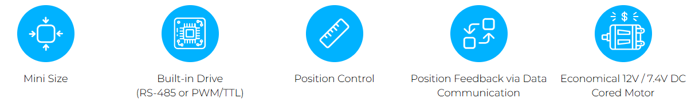

# D7 / D12 Servo Series 
## Overview
경제적인 가격의 cored DC모터를 적용하고, 속도 및 전류 제어기능 없이, 통신을 통해 정밀 위치제어 기능을 제공하는 mightyZAP 1세대 서보 제품군. 
IR Open 프로토콜 제공. 

## Features
- 위치제어/위치피드백이 가능한 제품군
- 드라이브 회로, 위치인식 센서, 모터, 기어박스 일체형
- 12Lf Series 제품군 대비 저렴한 가격 
- 12mm 직경의 cored motor 라인업  
(더 높은 내구성과 출력을 원한다면 12Lf Series 검토요망)
- Motor operating rate를 조절하여 Stall force와 Speed를 제한적인 범위에서 조절 가능
- 기어비에 따라 6N과 12N의 정격부하 구현  
(Speed는 정격부하와 반비례하여, 정격부하가 강할수록 Speed는 느려집니다.)
- 26mm Stroke  
  (사용자 설정으로 최대 29mm까지 확장 가능)
- RS-485 또는 TTL/PWM 통신 지원  
    – TTL/PWM 통신 버전은 입력되는 TTL/PWM신호를 자동 인식하여 작동합니다.  
    – PWM 통신을 사용하면 위치 명령만 가능할 뿐 feedback을 받을 수 없습니다.
- IR Open Protocol  
  (MODBUS RTU 프로토콜은 12Lf 시리즈에서 지원)