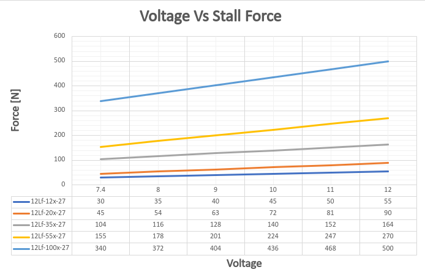
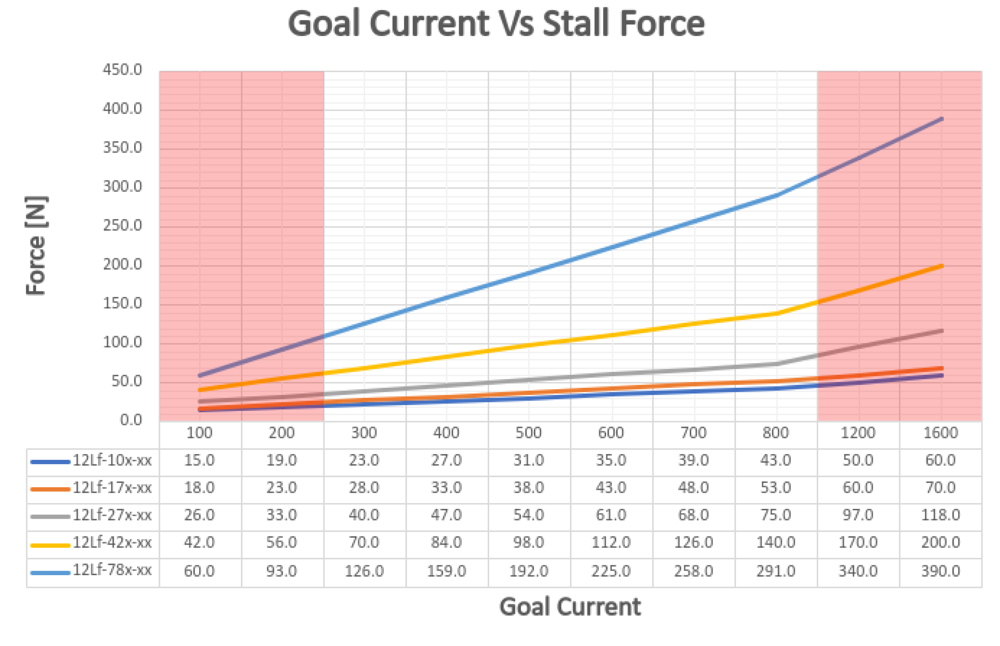
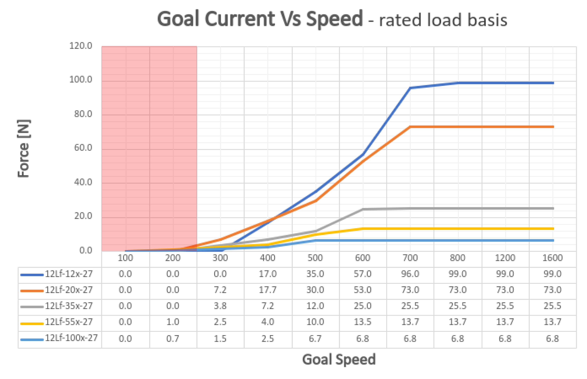
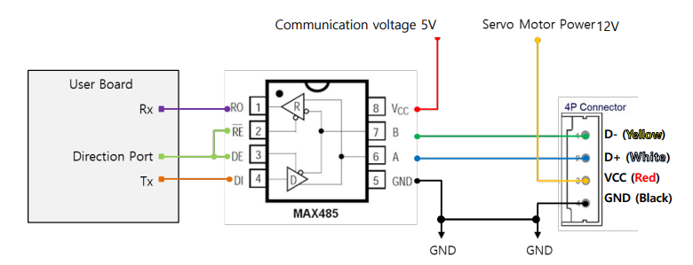

## 1. Features / 주요 특장점
-  Micro size / 마이크로 사이즈  
-  Precise position control / 정밀 위치 제어
-  Force control by current feedback / 전류 피드백 통한 포스 제어
-  Speed control (1024 resolution) / 속도 제어( 1024 해상도)
-  Strong force comparing to the size / 체적 대비 강한 힘
-  Built-in Drive Circuitry / 드라이브 회로 내장
-  RS-485 communication / RS-485 통신 지원
-  Parameter programmable on the Manager software / 매니저 소프트웨어를 통한 Parameter 셋팅 가능 

## 2. Specification
### 2.1 Common Specifications / 공통 사양
| **Property** | Value |
| ---- | ---- |
| **Stroke / 스트로크** | 27mm |
| **Rated Load / 정격 부하** | 기어비에 따라 12N ~ 100N |
| **Recommended duty cycle at rated load** | 50% 이하 |
| **Max apllicable Load/ 최대 허용부하** | 2times rated load / 정격 부하의 2배 |
| **Recommended duty cycle at max applicable load/ 최대 허용 부하시 권장 듀티사이클 :** | under 20% (20% 이하) |
| **Micro controller** | 32bit Arm Cortex |
| **Position Resolution** | 4096 Resolution (A/D Converter) |
| **Input Voltage / 입력 전압** | 12.0V(Rated/정격), 7.4V ~ 13 V(Operating) |
| **Motor Type / Watt** | Coreless DC Motor / 3.5 Watt |
| **Current consumption / 소모전류** | 30mA(Idle), 380mA(Rated), 1.6A(Stall) |
| **Position repeatability** | Unidirectional less than 0.03mm(30um) |
| ^ | Bydirectional less than +/0.06mm(60um) |
| **전류 값 오차 / Current Tolerance** | ±15% at Over 50mA |
| **Position sensor / 위치센서** | 10kΩ linearity potentiometer |
| **Size, Weight /크기,무게** | 86.9(L)x36(W)x18(H)mm /96~99g (to be varied according to gear ratio) be varied according to gear ratio |
| **Communication/ 통신** | RS485 |
| **Protocol** | IR Robot Open Protocol (switchable to MODBUS RTU protocol/ MODBUS 프로토콜전환 가능) |
| **Operating Temperatures / 동작온도** | -10℃ ~ 60℃ |
| **Ingress protection / 방수방진** | IP-54 |
| **Mechanical Backlash / 기구백래쉬** | 0.03mm(30um) |
| **Audible Noise / 가청소음** | Max. 50db at 1m |
| **Gear ratio / 기어비** | 10:1(10F,17F,27F) /20:1(42F) /50:1(78F) |
| **Gear type / 기어 타입** | Engineering plastic gears(10F,17F,27F) 4metal & 2engineering plastic gears(42F,78F) (Aluminum and stainless steel combination) |
| **Rod type / Rod 타입** | 스테인레스 스틸 |
| **Standard Accessory / 표준 악세서리** | 1xHinge base   1x Hinge   1xHinge shaft   1xRod end tip   2x M3 NUT   3 x M2.5x6 screws   1x Molex wire harness (200mm)   1 x M3 spanner   1 x Socket set screwlex wire harness (200mm)     1 x M3 spanner     1 x Socket set screw |
| **Connector Type (Male) in the Actuator** | MOLEX 53253-0470 |
| **Wire Harness** | Molex(51065-0400) to Molex(51065-0400)/ 200mm / 0.08x60(22AWG) |

### 2.2 Voltages / 전압  
| Parameter                          | Min  | Norm | Max  | Unit |  Note  |
| :--------------------------------- | :--: | :--: | :--: | :--: | :----: |
| **Supply voltage/ 공급 전압**          | 7.4  |  12  |  13  |  V   |     |
| **Logic input voltage / 로직 인가 전압** | -7.0 |  -   | 12.0 |  V   | RS-485 |

### 2.3 Currents / 전류
| Parameter                                           | Min | Norm | Max | Unit | Note            |
| :-------------------------------------------------- | :-- | :--- | :-- | :--- | :-------------- |
| **Maximum peak Current  / 최대 피크 전류**             |     | ≤1.6 |     | A    | Stall Current   |
| **No Load Current  / 무 부하 전류**                   |     | ≤300 |     | mA   | No Load         |
| **Rated Load Current  /정격 부하 시 전류**              |     | ≤400 |     | mA   | 골커런트 800mA 이상설정 |
| **Max Applicable Load Current /  최대 허용 부하 시 전류** |     | ≤600 |     |      | 골커런트1.6A설정 시    |
| **Idle Current**                                    |     | ≤20  |     | mA   |                 |

### 2.4 Temperatures / 온도
| Parameter                   | Min | Norm | Max | Unit | Note |
| :-------------------------- | :-: | :--: | :-: | :--: | :--: |
| **StorageTemp. / 보관온도**     | -20 |  -   | 70  |  ℃   |      |
| **Operating Temp. / 동작 온도** | -10 |  -   | 60  |  ℃   |      |

### 2.5 Strokes / 스트로크
| Parameter                   | Min  | Norm | Max  | Unit | Note |
| :-------------------------- | :--- | :--- | :--- | :--- | :--- |
| **MIN Position / 최소 수축 위치** | 3.3  | 3.8  | 4.3  | mm   | ⁕    |
| **MAX Position / 최대 확장 위치** | 30.3 | 30.8 | 31.3 | mm   |      |
| **Stroke length/ 스트로크**     |      | 27.0 |      | mm   |      |

- 복수의 mightyZAP의 최소 수축 위치를 완벽하게 동일하게 설정해야 하는 경우, 별도 협의
- 매니저 소프트웨어 또는 파라메터 맵의 Min / Max Position Calibration 기능으로 Min / Max 위치 값 동기화 가능.
### 2.6 No Load Speed / 무부하 속도
| Parameter                                  | Min   | Norm  | Max   | Unit | Note         |
| :----------------------------------------- | :---- | :---- | :---- | :--- | :----------- |
| Maximum Speed at 12.0V   최대 속도 at 12.0V | 100.8 | 112.0 | 123.2 | mm/s | 12Lf-12F-27  |
| ^                                          | 75.6  | 84.0  | 92.4  | mm/s | 12Lf-20F-27  |
| ^                                          | 26.1  | 29.0  | 31.9  | mm/s | 12Lf-35F-27  |
| ^                                          | 13.95 | 15.5  | 17.05 | mm/s | 12Lf-55F-27  |
| ^                                          | 6.93  | 7.7   | 8.47  | mm/s | 12Lf-100F-27 |
### 2.7 Load / 부하
| Parameter Parameter | Min | Rated | Max | Unit | Note |
| :--- | :--: | :--: | :--: | :--: | :--- |
| Load at 12.0V   부하 at 12.0V |  | 12.0 | 24.0 | N | 12Lf-12F-27 |
| ^ |  | 2.69 | 5.39 | lbf | ^ |
| ^ |  | 1.22 | 2.44 | kgf | ^ |
| ^ |  | 20.0 | 30.0 | N | 12Lf-20F-27 |
| ^ |  | 4.49 | 8.98 | lbf | ^ |
| ^ |  | 2.04 | 4.08 | kgf | ^ |
| ^ |  | 35.0 | 70.0 | N | 12Lf-35F-27 |
| ^ |  | 7.87 | 15.73 | lbf | ^ |
| ^ |  | 3.57 | 7.14 | kgf | ^ |
| ^ |  | 55.0 | 110.0 | N | 12Lf-55F-27 |
| ^ |  | 12.37 | 24.72 | lbf | ^ |
| ^ |  | 5.61 | 11.22 | kgf | ^ |
| ^ |  | 100.0 | 200.0 | N | 12Lf-100F-27 |
| ^ |  | 22.48 | 44.94 | lbf | ^ |
| ^ |  | 10.19 | 20.4 | kgf | ^ |

⁕ 1 kgf = 9.8N, 1lbf = 4.45N

>[!warning] Caution / 주의  
>가급적 정격 부하 조건에서 사용하되, 최대 허용 부하 (정격부하의 2배) 적용시에는 Goal current설정을 1600(1.6A) 으로, Duty cycle을 20% 이하로 낮추어야 합니다.
### 2.8 Self Lock Feature / 셀프-락 기능

| Parameter | Min | Norm | Max | Unit | Note |
| :--- | :--: | :--: | :--: | :--: | :--- |
| Slef Lock | - | N/A(불가) | - |  | 12Lf-12x-27 |
| ^ | - | ^ | - |  | 12Lf-20x-27 |
| ^ | - | Available(가능) | - |  | 12Lf-35x-27 |
| ^ | - | ^ | - |  | 12Lf-55x-27 |
| ^ | - | ^ | - |  | 12Lf-100x-27 |

>[!tip] Tip
>Self-Lock 이란 액츄에이터가 전원을 통한 모터의 힘 없이, 기구마찰력만으로 위치를 고수할 수 있는 힘을 의미합니다.
## 3. 참고 자료
### 3.1 Voltage Vs Speed
입력 전압에 따른 무 부하 시 속도 변화에 대한 그래프 입니다. 해당 Data는 오차를 포함하고 있음으로 참고로 사용하시면 됩니다.
 
>[!note] Note  
>Voltage Vs Speed는 Goal Current 800에서 Test한 Data입니다.  
>해당 Data는 약 +/-15%오차를 포함하고 있습니다.
### 3.2 Voltage Vs Stall Force 
입력 전압에 따른 800mA에서 Stall Force를 측정한 Data입니다. 해당 Data는 오차를 포함하고 있음으로 참고로 사용하시면 됩니다.  
  

> [!note] Note  
> Voltage Vs Stall Force Data는 Goal Current 1600에서 Test한 Data입니다.
>각 Force 값의 오차는 +/- 15% 입니다. 

>[!warning] Caution  
>Stall force는 참고용으로, 제품의 파손을 방지하기 위해 실제 application에서의 사용시에는 정격부하에 맞추어 사용하여 주십시오.
### 3.3 Goal Speed Vs Speed  
Goal Current가 800일 때, Goal Speed Parameter 값의 변화에 따른 무 부하 속도 변화를 나타냅니다.
정격 부하 이하의 경우, 부하 정도에 따라 최고 속도가 나오는 시간이 달라지게 됩니다.  

>[!note] Note
>Goal Speed Vs Speed Data는 Goal Current 800에서 Test한 Data입니다.
### 3.4 Goal Current vs Stall Force  
Goal Current 값에 대한 mightyZAP의 Stall Force를 나타냅니다. 
Stall Force 측정 방식은 속도 값을 최소한으로 하여 순수 전류 값에 대한 힘만 측정한 값입니다.     

>[!tip] TIP
>해당 자료는 모터의 힘을 나타내는 자료로, 모터 걸리는 실제 부하량의 3배에 해당하는 Goal current 선정 하는 것을 추천 드립니다.  
>실제 부하와 모터가 내는 힘의 차가 적으로 수록 모터의 속도가 줄게 되며 같을 경우 모터가 움직이지 않습니다.  

>[!warning] 주의사항  
>각 Goal Current 값에 대한 Stall Force갑의 오차는 +/- 15%입니다.
>붉은색으로 표기된 부분은 내부 부하 및 발열에 의해  오차가 큼으로 참고용으로만 사용하여 주시기 바랍니다. 
>지속적인 부하가 발생하여 1A 이상의 전류가 흐를 경우 전류값이 점점 하락하여 1A에서 안정적으로 유지 됩니다.

>[!warning] 2배 부하 설정
>mightyZAP은 최대 2배 부하까지 사용가능하며, 2배 부하 시에는 Duty Rate를 20% 이하로 적용해야 합니다.
>**ex>**
>
>|Load|Goal Current|Duty rate|Load|Goal Current|Duty Rate|
>|---|---|---|---|---|---|
>|20N(Rated)|800|Max. 50%|35N(Rated)|800|Max. 50%|
>|40N(Max)|1600|Max. 20%|70N(Max)|1600|Max. 20%|
>
### 3.5 Goal Current vs Speed at Rated Load
정격 부하 시 Goal Current  값에 대한 mightyZAP의  속도 변화를 나타냅니다.  

>[!tip] TIP
>Goal Current Vs Speed Data는 정격 부하 상태에서 측정한 Data입니다.

 >[!warning] 주의사항  
>Speed Data는 약 +/-10% 오차를 가지고 있습니다.
>붉은색으로 표기된 부분은 해당 Goal Current 값에서의 Stall Force와 정격부하가 비슷한 구간으로 mightyZAP이 움직이지 않을 수 있습니다.  참고용으로만 사용하여 주시기 바랍니다.
 
### 3.6 PIN Map

| PIN NUMBER(COLOR) | PIN NAME&nbsp; | 
FUNCTION
 |
|:------------------:|:---------------:|:--------------------:|
|         1(YELLOW) | D-&       | RS-485-             |
|          2(WHITE) | D+             | RS-485+  |
|      3(RED) | VCC      | Power +             |
|    4(BLACK) | GND            | Power -             |  

