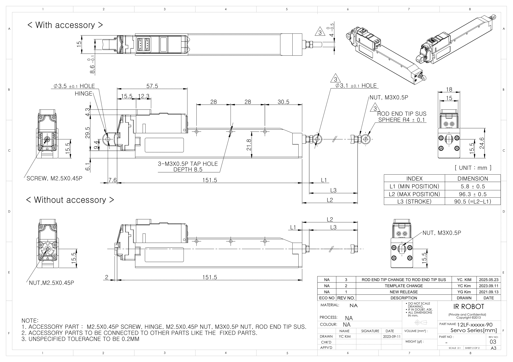
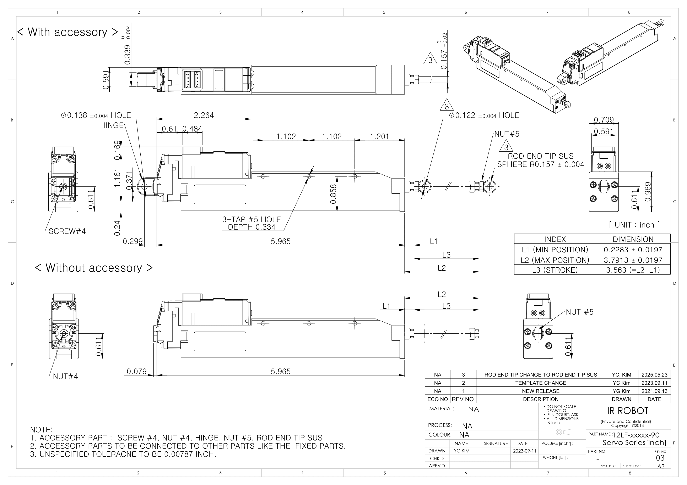

## 12Lf-xx-90 Uint : mm
  
**Download** <a href="./data/ENG-ver_12Lf-xxxxx-90-Servo-Series_mm__Rev03_20250526.pdf" download>PDF</a> <a href="./data/12Lf-xxxxx-90-Servo-Series_Rev03_20250523.step" download>STEP</a> <a href="./data/12Lf-xxxxx-90-Servo-Seriesmm_Rev03_20250523.DXF" download>DXF</a>
## 12Lf-xx-90 Uint : Inch
  
**Download** <a href="./data/ENG-ver_12Lf-xxxxx-90-Servo-Series_inch_Rev03_20250523.pdf" download>PDF</a> <a href="./data/12Lf-xxxxx-90-Servo-Series_Rev03_20250523.step" download>STEP</a> <a href="./data/12Lf-xxxxx-90-Servo-Seriesinch_Rev03_20250523.DXF" download>DXF</a>