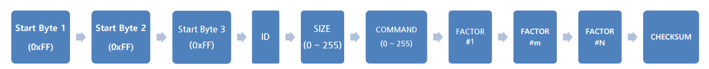

# 12Lf IRProtocol
## 1 개요
mightyZAP을 제어하기 위해서는 Protocol에 맞추어 통신을 해야하며, mightyZAP에서는 제어를 위한 전용 IR Protocol을 제공하고 있습니다.  
IR Protocol 을 지원하는 모델은 아래와 같습니다.
- D7/D12 Series
- L12 Series
- 12Lf Series
### 1.2 Packet Description
#### 1.2.1 Command Packet
mightyZAP에 동작을 수행할 수 있는 명령 Packet으로 다음과 같은 구조와 요소로 이루어져 있습니다.
**Structure**

**Element**

| Index | Data | 설명 |
| ---- | ---- | ---- |
| 0 | Start Bytes 1 | 시작 바이트 1 (0xFF) |
| 1 | Start Bytes 2 | 시작 바이트 2 (0xFF) |
| 2 | Start Bytes 3 | 시작 바이트 3 (0xFF) |
| 3 | ID | Servo ID (범위 0 ~253, Broadcast ID:254) |
| 4 | SIZE | Packet Size (COMMAND+FACTOR+CHECKSUM) |
| 5 | COMMAND | Instruction |
| 5+1 | FACTOR  1 | 첫 번째 Parameter |
| 5+m | FACTOR  M | m 번째 Parameter |
| 5+N | FACTOR  N | 마지막 Parameter |
| 5+N+1 | Check Sum | Check Sum = 0xff – ( LOWER_BYTE( ID + SIZE + COMMAND + FACTOR 1 + … + FACTOR N ) ) | 

**Element Descroption**
1. Header (3 Bytes)
	- Packet 시작을 인식하는 코드로 0xFFFFFF
	- Packet중 유일한 조합
2. ID (1 Byte)
	- MightyZAP의 다중연결 방식으로 Daisy Chain연결을 지원하기 위한 식별자 
	- 공장 초기값 ID : ID 0 
	- ID = 0 ~253 일 때, 미리 저장된 ID와 비교하여 선별적으로 동작함 
	- ID = 254 (0xFE) 일 때, Broadcasting Mode로 동작하며 Feedback Packet은 동작하지 않음
3. SIZE (1 Byte)
	- Packet의 Byte단위로 계산된 길이. 
	- SIZE데이터 이후에 발송할 데이터의 크기 (COMMAND + FACTOR + CHECKSUM) 
	- 즉, FACTOR의 Byte수에 2를 더한 수
4. COMMAND (1 Byte)
	- Packet의 발송 목적을 정의하는 명령 코드
		
| Function | CODE | Description |
| ---- | ---- | ---- |
| Echo | 0xF1 | Feedback Packet수신 |
| Load Data | 0xF2 | Address를 보내고 Data를 Feedback 받음 |
| Store Data | 0xF3 | Address와 Data를 보내고 저장 |
| Send Data | 0xF4 | Address와 Data를 발송하여 임시 보관시킴 |
| Excution | 0xF5 | Send Data를 통한 임시보관 정보를 실행시킴 |
| Factory Reset | 0xF6 | 공장 출하 상태인 기본 파라미터로 리셋 |
| Restart | 0xF8 | mightyZAP 시스템 재시작 |
| Symmetric Store | 0x73 | 다수  mightyZAP의 동일한 Address에 Data를 저장 |
5. FACTOR
	- COMMAND에 따른 추가 Packet 요소
6. CHECKSUM
	Packet의 데이터 누락 및 변조가 생겼는지 확인 하기 위한 검증 데이터이며 다음과 같은 관계식으로 생성됩니다
	- Checksum = 0xff – ( LOWER_BYTE( ID + SIZE + COMMAND + FACTOR 1 + … + FACTOR N ) )
	- LOWER_BYTE = 합산된 Data 값 중 하위 1byte만 취합니다. 
		  = 합산된 Data 값을 0x100으로 나누어 나머지만 취합니다.
	- 설명에 대한 공식은 아래와 같습니다.
		LOWER_BYTE( ID + SIZE + COMMAND + FACTOR 1 + ... + FACTOR N ) == ( ID + SIZE + COMMAND + FACTOR 1 + ... + FACTOR N ) % 0x100

#### 1.2.2 Feedback Packet
Command Packet 을 수신한 액츄에이터가 요청 정보를 포함한 회신을 하는 Packet 으로 다음과 같은 구조와 요소로 이루어져 있습니다.  
**Structure**  

**Element**  

| Index | Data | 설명 |
| ---- | ---- | ---- |
| 0 | Start Bytes 1 | 시작 바이트 1 (0xFF) |
| 1 | Start Bytes 2 | 시작 바이트 2 (0xFF) |
| 2 | Start Bytes 3 | 시작 바이트 3 (0xFF) |
| 3 | ID | Servo ID (범위 0 ~253, Broadcast ID:254) |
| 4 | SIZE | Packet Size (COMMAND + FACTOR + CHECKSUM) |
| 5 | ERROR | Error Code |
| 5+1 | FACTOR  1 | 첫 번째 Parameter |
| 5+m | FACTOR  M | m 번째 Parameter |
| 5+N | FACTOR  N | 마지막 Parameter |
| 5+N+1 | Check Sum | Check Sum = 0xff – ( LOWER_BYTE( ID + SIZE + COMMAND + FACTOR 1 + … + FACTOR N ) ) |

**Element Descroption**
1. Header (3 Bytes)
	- Packet 시작을 인식하는 코드로 0xFFFFFF
	- Packet중 유일한 조합
2. ID (1 Byte)
	- MightyZAP의 개별로 저장된 ID (0~253)
3. SIZE (1 Byte)
	- Packet의 Byte단위로 계산된 길이. 
	- SIZE데이터 이후에 발송할 데이터의 크기 (COMMAND + FACTOR + CHECKSUM) 
	- 즉, FACTOR의 Byte수에 2를 더한 수
4. COMMAND (1 Byte)
	- bit별로 동작 중에 발생한 오류 상태 표시
		
| Error | bit | Description | LED 표시 |
| ---- | ---- | ---- | ---- |
| Overload Error | 5 | F지정된 최대 Force로 현재의 하중을 제어할 수 없을 때 1로 설정됨 | Red 점멸 |
| Input voltage Error | 0 | 인가된 전압이 Control Table에 설정된 동작전압 범위를 벗어났을 경우 1로 설정됨 | Red 점등 |

5. FACTOR
	- COMMAND에 따른 추가 Packet 요소
6. CHECKSUM
	Packet의 데이터 누락 및 변조가 생겼는지 확인 하기 위한 검증 데이터이며 다음과 같은 관계식으로 생성됩니다
	- Checksum = 0xff – ( LOWER_BYTE( ID + SIZE + COMMAND + FACTOR 1 + … + FACTOR N ) )
	- LOWER_BYTE = 합산된 Data 값 중 하위 1byte만 취합니다. 
		  = 합산된 Data 값을 0x100으로 나누어 나머지만 취합니다.
	- 설명에 대한 공식은 아래와 같습니다.
		LOWER_BYTE( ID + SIZE + COMMAND + FACTOR 1 + ... + FACTOR N ) == ( ID + SIZE + COMMAND + FACTOR 1 + ... + FACTOR N ) % 0x100
## 2 Instruction 종류
### 2.1 Echo
단순한 Feedback Packet수신하는 명령으로 mightyZAP과의 통신 상태 확인으로 사용됩니다. 
#### 2.1.1 예제
ID '0'번인 mightyZAP과의 연결 상태 확인
##### 2.1.1.1 Command Packet
| HEADER | ID | Size | Command | Checksum |
| ---- | ---- | ---- | ---- | ---- |
| 0xFFFFFF | 0x00 | 0x02 | 0xF1 | 0x0c |
##### 2.1.1.1 Feedback Packet
| HEADER | ID | Size | Error | Checksum |
| ---- | ---- | ---- | ---- | ---- |
| 0xFFFFFF | 0x00 | 0x02 | 0x00 | 0xFD |
### 2.2 Factory Reset
mightyZAP의 파라미터(Memory 및 Parameter)를 기본값(Default)으로 변경하고 Option 에 따라 추가로 리셋여부를 결정하여 초기화 수행합니다.
mightyZAP을 리셋하기 위해서는 아래의 Option Data를 설정해야 합니다.
 - 해당 bit 가 '1'이면 Reset, '0'이면 Hold

| Option | Bit | 리셋 동작 |
| ---- | ---- | ---- |
| Servo ID | 0 | mightyZAP ID를 0으로 초기화 |
| Baudrate | 1 | 통신 속도를 32(57600 bps)로 설정 |
#### 2.2.1 예제
ID '1'번인 mightyZAP의ID 는 0(ID Default)으로 초기화하고 Baud Rate 는 현재 상태 유지하여 초기화 수행
##### 2.2.2.1 Command Packet
| HEADER | ID | Size | Command | Factor (option) | Checksum |
| ---- | ---- | ---- | ---- | ---- | ---- |
| 0xFFFFFF | 0x01 | 0x03 | 0xF6 | 0x01 | 0x04 |
##### 2.2.2.1 Feedback Packet
| HEADER | ID | Size | Error | Checksum |
| ---- | ---- | ---- | ---- | ---- |
| 0xFFFFFF | 0x01 | 0x02 | 0x00 | 0xFD |
### 2.3 Restart
mightyZAP의 시스템을 재 시작 합니다.  Overload Shutdown 해지 등 시스템 재 시작이 필요한 경우 실행합니다.  
Feedback Return Mode 2 에서만 Feedback 을 보냅니다. 
#### 2.3.1 예제
ID '0'번인 mightyZAP의 시스템 재 시작
##### 2.3.1.1 Command Packet
| HEADER | ID | Size | Command | Checksum |
| ---- | ---- | ---- | ---- | ---- |
| 0xFFFFFF | 0x00 | 0x02 | 0xF8 | 0x05 |
##### 2.3.1.1 Feedback Packet
| HEADER | ID | Size | Command | Checksum |
| ---- | ---- | ---- | ---- | ---- |
| 0xFFFFFF | 0x00 | 0x02 | 0xF8 | 0x05 |
### 2.4 Store Data
mightyZAP의 ID변경, 위치이동, Force limit, Stroke limit, Speed, Force On/Off 등 설정을 위해 Address와 Data 를 보내고 저장합니다.
Feedback Return Mode 2 에서만 Feedback 을 보냅니다. 
#### 2.4.1 ID  변경
##### 2.4.1.1 Description
12Lf Model의  ID 를 ID‘0’번에서  ‘1'로 지정하는 명령 패킷
- ID : 대상 mightyZAP의 ID
- Command : 시작 Address 부터 Data 를 차례대로 각각의 address 에 저장 
- Address : 12Lf Modeldml Data Map 에 명시된 ID 가 저장되는 Address 
- Data : 변경하고 싶은 Servo ID (address 0x03 에 0x01)
##### 2.4.1.2 Command Packet
| HEADER | ID | Size | Command | Factor #1 (Address) | Factor #2 (Data) | Checksum |
| ---- | ---- | ---- | ---- | ---- | ---- | ---- |
| 0xFFFFFF | 0x00 | 0x04 | 0xF3 | 0x03 | 0x01 | 0x04 |
#### 2.4.2 목표 위치 변경
##### 2.4.2.1 Description
12Lf mightyZAP의  목표 위치 값을 2047(0x07FF)으로 지정하는 명령 패킷
- ID : 대상 mightyZAP ID 
- Command : 시작 Address 부터 Data 를 차례대로 각각의 address 에 저장 
- Address : 12Lf Modeldml Data Map 에 명시된 목표 위치 값이 저장되는 Address 
- Data #1 : 변경하고 싶은 목표 위치 값의 하위 byte (address 0x86 에 0xFF) 
- Data #2 : 변경하고 싶은 목표 위치 값의 상위 byte (address 0x87 에 0x07) 
	※목표 위치 값 Hex 변환(10 진수à16 진수) : 204 -> 0x07FF
##### 2.4.2.2 Command Packet
| HEADER | ID | Size | Command | Factor #1 (Address) | Factor #2 (Data) | Factor #3 (Data) | Checksum |
| ---- | ---- | ---- | ---- | ---- | ---- | ---- | ---- |
| 0xFFFFFF | 0x01 | 0x05 | 0xF3 | 0x86 | 0xFF | 0x07 | 0x7A |
#### 2.4.3 Goal Speed 
##### 2.4.3.1 Description
12Lf mightyZAP의  Goal Speed 를 512(0x0200)로 지정하는 명령 패킷
- ID : 대상 mightyZAP ID 
- Command : 시작 Address 부터 Data 를 차례대로 각각의 address 에 저장 
- Address : 12Lf Modeldml Data Map 에 명시된 Goal Speed 값이 저장되는 Address 
- Data #1 : 변경하고 싶은 Goal Speed 값의 하위 byte (address 0x15 에 0x00)
- Data #2 : 변경하고 싶은 Goal Speed 값의 상위 byte (address 0x16 에 0x02)
	※Goal Speed값 Hex 변환(10진수à16진수): 512à0x0200
##### 2.4.3.2 Command Packet
| HEADER | ID | Size | Command | Factor #1 (Address) | Factor #2 (Data) | Factor #3 (Data) | Checksum |
| ---- | ---- | ---- | ---- | ---- | ---- | ---- | ---- |
| 0xFFFFFF | 0x01 | 0x05 | 0xF3 | 0x88 | 0x00 | 0x02 |  |
#### 2.4.4 Goal Current
##### 2.4.4.1 Description
12Lf mightyZAP의 Goal Current 를800(0x0320)으로 지정하는 명령 패킷
- ID : 대상 mightyZAP ID 
- Command : 시작 Address 부터 Data 를 차례대로 각각의 address 에 저장 
- Address : 12Lf Modeldml Data Map 에 명시된 Goal Current 값이 저장되는 Address
- Data #1 : 변경하고 싶은 Goal Current 값의 하위 byte (address 0x34 에 0x20)
- Data #2 : 변경하고 싶은 Goal Current 값의 상위 byte (address 0x35 에 0x03)
	※Goal Current값 Hex 변환(10진수->16진수) : 800->0x0320
##### 2.4.4.2 Command Packet
| HEADER | ID | Size | Command | Factor #1 (Address) | Factor #2 (Data) | Factor #3 (Data) | Checksum |
| ---- | ---- | ---- | ---- | ---- | ---- | ---- | ---- |
| 0xFFFFFF | 0x01 | 0x05 | 0xF3 | 0x88 | 0x00 | 0x02 |  |
#### 2.4.5 Goal Current
##### 2.4.5.1 Description
12Lf mightyZAP의 수축방향 한계위치 값(short stroke limit)을100(0x0064)으로 지정하는 명령패킷
- ID : 대상 mightyZAP ID 
- Command : 시작 Address 부터 Data 를 차례대로 각각의 address 에 저장 
- Address : 12Lf Modeldml Data Map 에 명시된 수축방향 한계 위치 값이 저장되는 Address
- Data #1 : 변경하고 싶은 목표 수축방향 한계 위치 값의 하위 byte (address 0x06 에 0x64)
- Data #2 : 변경하고 싶은 목표 수축방향 한계 위치 값의 상위 byte (address 0x07 에 0x00)
	※목표 스트로크 리미트 값 Hex 변환(10 진수->16 진수) : 100 -> 0x0064
##### 2.4.5.2 Command Packet
| HEADER | ID | Size | Command | Factor #1 (Address) | Factor #2 (Data) | Factor #3 (Data) | Checksum |
| ---- | ---- | ---- | ---- | ---- | ---- | ---- | ---- |
| 0xFFFFFF | 0x01 | 0x05 | 0xF3 | 0x06 | 0x64 | 0x00 | 0x9C |
#### 2.4.6 Force On/Off
##### 2.4.6.1 Description
12Lf mightyZAP의 모터 기동력을 끄는 명령 패킷
- ID : 대상 mightyZAP ID 
- Command : 시작 Address 부터 Data 를 차례대로 각각의 address 에 저장 
- Address : 12Lf Modeldml Data Map 에 명시된 Force 를 On/Off 하는 값이 저장되는 Address
- Data : Servo Motor 의 Force 를 On/Off 할 Data byte (address0x80 에 0x00(Off) / 0x01(On))
- Force off 후 다음 위치 명령을 내리면 자동으로 Force on 됩니다.
##### 2.4.6.2 Command Packet
| HEADER | ID | Size | Command | Factor #1 (Address) | Factor #2 (Data) | Checksum |
| ---- | ---- | ---- | ---- | ---- | ---- | ---- |
| 0xFFFFFF | 0x01 | 0x04 | 0xF3 | 0x80 | 0x00 | 0x87 |
#### 2.4.7 Feedback Return Mode
##### 2.4.7.1 Description
12Lf mightyZAP가 모든 명령에 대해 Feedback Packet을 전송하게 하는 명령 패킷
- ID : 대상 mightyZAP ID 
- Command : 시작 Address 부터 Data 를 차례대로 각각의 address 에 저장 
- Address : 12Lf Modeldml Data Map 에 명시된 Feedback Return Mode 를 설정하는 값이 저장되는
Address
- Data : Feedback Return Mode Data (address 0x10 에 0x02)
	1 : Load Data(0xF3) Command 에만 Feeadback Packet 을 전송
	2 : 모든 Command 에 대해 Feeadback Packet 을 전송)
##### 2.4.7.2 Command Packet
| HEADER | ID | Size | Command | Factor #1 (Address) | Factor #2 (Data) | Checksum |
| ---- | ---- | ---- | ---- | ---- | ---- | ---- |
| 0xFFFFFF | 0x01 | 0x04 | 0xF3 | 0x10 | 0x02 | 0xF5 |
### 2.5 Load Data
mightyZAP의 Address 를 보내고 Data 를 Feedback 받습니다..
#### 2.5.1 Present Position
##### 2.5.1.1 Description
12Lf Model의  I현재 위치값을 읽어 오는 명령 패킷
##### 2.5.1.2 Command Packet
| HEADER | ID | Size | Command | Factor #1 (Address) | Factor #2 (Length) | Checksum |
| ---- | ---- | ---- | ---- | ---- | ---- | ---- |
| 0xFFFFFF | 0x00 | 0x04 | 0xf2 | 0x8C | 0x02 | 0x7B |

- ID : 대상 mightyZAP의 ID
- Command : 시작 Address 부터 Data 를 차례대로 각각의 address 에 저장 
- Address : 12Lf Modeldml Data Map 에 명시된 현재 위치 값이 저장된 Address
- Length : Address 로 부터 읽어올 Byte 의 수(mightyZAP 위치 값은 2byte 로 이루어져 있습니다.)
##### 2.5.1.3 Feeback Packet
| HEADER | ID | Size | Error | Factor #1 | Factor #2 | Checksum |
| ---- | ---- | ---- | ---- | ---- | ---- | ---- |
| 0xFFFFFF | 0x00 | 0x04 | 0x00 | 0xFF | 0x07 | 0xF5 |

-  ID : mightyZAP ID
- Error : 동작 중에 발생한 요류 상태 표시
- Factor 1 : 현재 위치 값 하위 byte (ex> 0xff)
- Factor 2 : 현재 위치 값 상위 byte (ex> 0x07)
	※ 현재 위치 값 Hex 변환(16 진수à10 진수) : 0x07ff -> 2047
#### 2.5.2 Present Motor Operating Rate
##### 2.5.2.1 Description
12Lf Model의  현재 Operating Rate 값을 읽어 오는 명령 패킷
##### 2.5.2.2 Command Packet
| HEADER   | ID   | Size | Command | Factor #1 (Address) | Factor #2 (Length) | Checksum |
| -------- | ---- | ---- | ------- | ---------------------- | --------------------- | -------- |
| 0xFFFFFF | 0x00 | 0x04 | 0xF2    | 0x90                   | 0x02                  | 0x77     |

- ID : 대상 mightyZAP의 ID
- Command : 시작 Address 부터 Data 를 차례대로 각각의 address 에 저장 
- Address : 12Lf Modeldml Data Map 에 명시된 현재 Motor operating rate 값이 저장된 Address
- Length : Address 로 부터 읽어올 Byte 의 수(mightyZAP Present Motor Operating Rate 값은 2byte 로 이루어져 있습니다.)
##### 2.5.2.3 Feeback Packet
| HEADER | ID | Size | Error | Factor #1 | Factor #2 | Checksum |
| ---- | ---- | ---- | ---- | ---- | ---- | ---- |
| 0xFFFFFF | 0x00 | 0x04 | 0x00 | 0xFF | 0x03 | 0xF9 |

-  ID : mightyZAP ID
- Error : 동작 중에 발생한 요류 상태 표시
- Factor 1 : 현재 Motor operating rate 값 하위 byte (ex> 0xff)
- Factor 2 : 현재 Motor operating rate 값 상위 byte (ex> 0x03)
	※ 현재 Load 값 Hex 변환(16 진수à10 진수) : 0x03ff -> 1023
#### 2.5.3 Present Voltage
##### 2.5.3.1 Description
12Lf Model의  현재 Voltage값을 읽어 오는 명령 패킷
##### 2.5.3.2 Command Packet
| HEADER | ID | Size | Command | Factor #1 (Address) | Factor #2 (Length) | Checksum |
| ---- | ---- | ---- | ---- | ---- | ---- | ---- |
| 0xFFFFFF | 0x00 | 0x04 | 0xF2 | 0x92 | 0x01 | 0x76 |

- ID : 대상 mightyZAP의 ID
- Command : 시작 Address 부터 Data 를 차례대로 각각의 address 에 저장 
- Address : 12Lf Modeldml Data Map 에 명시된 현재 Voltage 값이 저장된 Address
- Length : Address 로 부터 읽어올 Byte 의 수(mightyZAP Voltage 값은 1byte 로 이루어져 있습니다.)
##### 2.5.3.3 Feeback Packet
| HEADER | ID | Size | Error | Factor #1 | Checksum |
| ---- | ---- | ---- | ---- | ---- | ---- |
| 0xFFFFFF | 0x00 | 0x03 | 0x00 | 0x7B | 0x81 |

-  ID : mightyZAP ID
- Error : 동작 중에 발생한 요류 상태 표시
- Factor 1 : 현재 Voltage 치 값 byte (ex> 0x7B)
	※ 현재 Load 값 Hex 변환(16 진수 -> 10 진수) : 0x7B -> 123(12.3V)
### 2.6 Send Data
mightyZAP의 Address와 Data를 임시 보관 시킵니다.
#### 2.6.1 Gaol Position
##### 2.6.1.1 Description
12Lf Model의  목표 위치 값 2047(0x07FF)을 임시 보관하는 명령 패킷
##### 2.6.1.2 Command Packet
| HEADER | ID | Size | Command | Factor #1 (Address) | Factor #2 (Data 1) | Factor #2 (Data 2) | Checksum |
| ---- | ---- | ---- | ---- | ---- | ---- | ---- | ---- |
| 0xFFFFFF | 0x01 | 0x05 | 0xF4 | 0x86 | 0xff | 0x07 | 0x79 |
##### 2.6.1.3 Feedback Packet
| HEADER | ID | Size | Error | Checksum |
| ---- | ---- | ---- | ---- | ---- |
| 0xFFFFFF | 0x01 | 0x02 | 0x00 | 0xFC |
### 2.7 Excution
Send Data를 통한 임시 보관 정보를 실행시킴
#### 2.7.1 Example
##### 2.7.1.1 Description
임시 보관된 모든 정보를 동시에 실행시키는 명령 패킷
Feedback Return Mode 2 에서만 Feedback 을 보냅니다. 
##### 2.7.1.2 Command Packet
| HEADER | ID | Size | Command | Checksum |
| ---- | ---- | ---- | ---- | ---- |
| 0xFFFFFF | 0x01 | 0x02 | 0xF5 | 0x07 |
##### 2.7.1.3 Feedback Packet
| HEADER | ID | Size | Error | Checksum |
| ---- | ---- | ---- | ---- | ---- |
| 0xFFFFFF | 0x01 | 0x02 | 0x00 | 0xFC |
### 2.8 Symmetric Store
다수 mightyZAP의 동일한 Address 에 Data 저장
#### 2.8.1 Goal Position
##### 2.8.1.1 Description
mightyZAP의 목표 위치 값을 지정하는 명령 패킷
##### 2.8.1.2 Command Packet
| HEADER | ID | Size | Command | Factor 1 (Address) | Factor 2 (Length) |
| ---- | ---- | ---- | ---- | ---- | ---- |
| 0xFFFFFF | 0x01 | 0x0A | 0x73 | 0x86 | 0x02 |

| Factor 3 (1> ID) | Factor 4 (1> Data 1) | Factor 4 (1> Data 2) | Factor 4 (2> ID) | Factor 7 (2> Data 1) | Factor 8 (2> Data 2) | Checksum |
| ---- | ---- | ---- | ---- | ---- | ---- | ---- |
| 0x01 | 0xFF | 0x03 | 0x02 | 0xFF | 0x07 | 0xF1 |

- 다수의 mightyZAP에 각각의 목표 위치 값을 동시에 지정하는 명령 패킷
- 개별적으로 mightyZAP 마다 목표 위치 명령을 주었을 때 보다 지연 없이 동시에 동기화 되어 움직임
- ID : Broadcast ID(모든 ID 의 mightyZAP에 명령을 전달)
- Command : Factor 에 명시된 ID 를(1>ID, 2>ID ⋯) 가진 mightyZAP에 동시에 데이터 전송
- Address : 12Lf Data Map에 명시된 mightyZAP의 현재 위치 값이 저장된 Address
- Length: Address 로 부터 읽어올 Byte 의 수 (mightyZAP의 위치 값은 2byte 로 이루어져있습니다.)
- Feedback Packet 은 회신되지 않습니다.
## Packet Test
