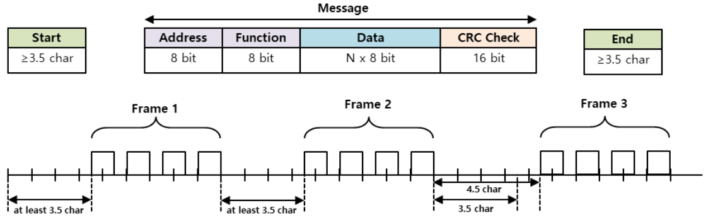

## 1 개요
MODBUS 프로토콜은 산업용 프로토콜로 PLC통신 등에 주로 사용되는 표준이 되는 프로토콜입니다.
주로 사용하는 방식은 RTU방식과 ASCII방식이 주로 사용되고, 요즘에는 TCP방식도 나와있습니다.

1979년부터 업계의 사실상 직렬 표준인 MODBUS는 수 백만 개의 자동화 장치가 지속적으로 통신할 수 있도록 지원하고 있습니다. 
MODBUS는 요청/응답 프로토콜이며 기능 코드별로 지정된 서비스를 제공합니다. 프레임의 구성은 Application Data Unit인 ADU와 Protocol Data Unit인 PDU로 구성되어 있습니다.

## 2 프레임 구조
### 2.1 Packet Discription
mightyZAP은 MODBUS-RTU 프로토콜 내용을 준수합니다.  
본 매뉴얼에 나오지 않은 사항들은 아래의 관련 표준 문서를 참조하여 주시기 바랍니다.  
#### 2.1.1 Packet Structure
MODBUS-RTU 프로토콜의 최대 송수신 패킷 길이는 256 Byte 입니다. 따라서 송수신 패킷의 총 길이가 256Byte 를 넘기지 않도록 주의하여 주십시오.  
MODBUS-RTU 통신 Mode 는 Packet 을 구분하기 위해서 아래 그림과 같이 시작과 끝 사이에 최소 3.5 Char 이상의 이 필요합니다.  

- 송신 패킷 구조

|      | Additional Address | Fucntion code | Data | <                  | <                  | Error Check |          |
| ---- | ------------------ | ------------- | ---- | ------------------ | ------------------ | ----------- | -------- |
| byte | 0                  | 1             | 2    | 
…
 | 
…
 | n-1         | n        |
| ^    | mightyZAP ID       | Function      | Data | 
…
 | 
…
 | CRC(MSB)    | CRC(LSB) |

- 수신 패킷 구조  
	[정상 응답]

|      | Additional Address | Fucntion code | Data | <                  | <                  | Error Check | <        |
| ---- | ------------------ | ------------- | ---- | ------------------ | ------------------ | ----------- | -------- |
| byte | 0                  | 1             | 2    | 
…
 | 
…
 | n-1         | n        |
| ^    | mightyZAP ID       | Function      | Data | 
…
 | 
…
 | CRC(MSB)    | CRC(LSB) |

	[비 정상 응답답]

|      | Additional Address | Fucntion code        | Data           | Error Check |          |
| ---- | ------------------ | -------------------- | -------------- | ----------- | -------- |
| byte | 0                  | 1                    | 2              | 3           | 4        |
| ^    | mightyZAP ID       | Function   + 0x80 | Exception code | CRC(MSB)    | CRC(LSB) |
#### 1.1.2 Packet Element 설명
<b>Node ID</b>
- mightyZAP의 IDF로 다중 연결 방식으로 Daisy Chain 연결 지원을  위한 식별자 입니다.  
- ID가 '0'일 경우 Broadcasting ID로 동작합니다.  
<b>Function Code</b>
- mightyZAP에서 지원하는 Modbus-RTU  표준 Function code는 다음과 같습니다.

| Function | Code | Description |
| ---- | ---- | ---- |
| Read Holding Register | 0x03 | mightyZAP의 Data를 읽어오기 |
| Write Single Register | 0x06 | mightyZAP의 특정 주소에 Data값을 Setting  하기 |
| Write Multiple Register | 0x10 | mightyZAP의 연속된 주소에 Data값을 Setting  하기 |
| SP  Function code | 0xxx |  해당 모델 사용자 매뉴얼을 참조하여주시기 바랍니다. |

- **Data** 송신 : Read Register 명령의 경우 Modbus 주소, 레지스터 개수, Byte 개수 등을 지정하게 되며, Write Register 명령의 경우 Modbus 주소, Byte 개수, 설정 할 값 등을 지정하게 됩니다.  
- **Data** 수신: Read Register 명령의 경우, 정상응답은 Node ID 와 Function Code 가 송신 때와 동일한 값으로 수신되며, Data 는 송신 때 보낸 Register 순서에 따라 각 Register 의 값이 수신됩니다.

Write Single Register 명령의 경우, 송신 때와 동일한 데이터가 수신됩니다. Write Multi  Register 의 경우에는 Write Multi Register 명령으로 데이터를 쓰고자 한 Register 의 시작 주소와 Register 개수가 수신됩니다.

이상응답의 경우에는 Node ID, Error Code, Exception Code 로 구성되며, 이상응답의 패킷 구조는 Function Code 와 관계없이 모두 동일합니다.

- CRC
16 비트 CRC 값을 입력합니다. 구성은 MSB/LSB 로 나누어 각각 1Byte 씩 전송합니다.

- Exception Code
mightyZAP에서 지원하는 모든 Function Code 의 이상 응답에 대한 Exception Code 는 아래와 같이 정의되어 있습니다.

| Exception Code |  | Description |
| ---- | ---- | ---- |
| 0x01 | Illegal Function | 지원하지 않는 Function Code |
| 0x02 | Illegal Data Address | 잘못된 레지스터 주소 |
| 0x03 | Illegal Data Value | 잘못된 데이터 값 |
| 0x04 | Slave Device Failure | 장치 고장, 파라미터 설정값 이상(ready) |
| 0x05 | Acknowledge | 데이터가 준비되지 않은 상태(ready) |
| 0x06 | Slave Device Busy | 파라미터 잠금 상태 |

### 프로토콜 Function Code 설명
#### Read Holding Register
단일 레지스터(16bit 데이터) 및 연속된 레지스터 블록(16bit 데이터 단위)의 값을 읽습니다.
- Request

|  | byte | Data |
| ---- | ---- | ---- |
| Function Code | 1 byte | 0x03 |
| Starting Addresse | 2 byte | 0x0000 to 0xffff |
| Quatity of Register | 2 bytes | 1 to 125(0x7d) |
- Request OK

|  | byte | Data |
| ---- | ---- | ---- |
| Function Code | 1 byte | 0x03 |
| Starting Addresse | 2 byte | 2 x N* |
| Quatity of Register | N* x 2 bytes |  |
*N = Quantity of Registers

- Request not OK  

|  | byte | Data |
| ---- | ---- | ---- |
| Error Code | 1 byte | 0x83 |
| Exception Code | 1 byte | 0x01 ~ 0x06 |
- example
#### Write Sing Register
단일레지스터(16bit 데이터)에 값을 씁니다.  
- Request

|  | byte | Data |
| ---- | ---- | ---- |
| Function Code | 1 byte | 0x06 |
| Starting Addresse | 2 bytes | 0x0000 to 0xffff |
| Quatity of Register | 2 bytes | 0x0000 to 0xffff |
- Request OK

|  | byte | Data |
| ---- | ---- | ---- |
| Function Code | 1 byte | 0x03 |
| Starting Addresse | 2 bytes | 0x0000 to 0xffff |
| Quatity of Register | 2 bytes | 0x0000 to 0xffff |
*N = Quantity of Registers

- Request not OK  

|  | byte | Data |
| ---- | ---- | ---- |
| Error Code | 1 byte | 0x86 |
| Exception Code | 1 byte | 0x01 ~ 0x06 |
- example
#### Write Multi Register(0x10)
연속된 레지스터 블록(16bit 데이터 단위)에 값을 씁니다.  
- Request

|  | byte | Data |
| ---- | ---- | ---- |
| Function Code | 1 byte | 0x06 |
| Starting Addresse | 2 bytes | 0x0000 to 0xffff |
| Quatity of Register | 2 bytes | 0x0000 to 0xffff |
| Bytes Count | 1Byte | 2 x N* |
| Registers Value | N* x 2 Bytes | value |
- Request OK

|  | byte | Data |
| ---- | ---- | ---- |
| Function Code | 1 byte | 0x10 |
| Starting Addresse | 2 bytes | 0x0000 to 0xffff |
| Quatity of Register | 2 bytes | 1 to 123(0x7b) |
*N = Quantity of Registers

- Request not OK  

|  | byte | Data |
| ---- | ---- | ---- |
| Error Code | 1 byte | 0x90 |
| Exception Code | 1 byte | 0x01 ~ 0x06 |
- example
## Packet Test
