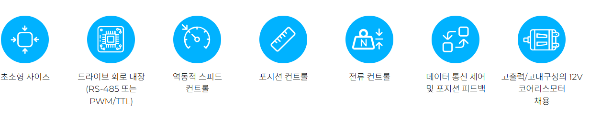
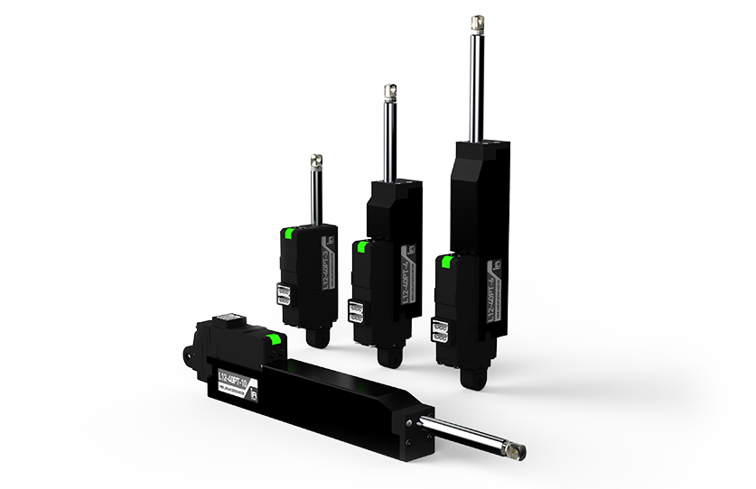

# 12Lf Servo Series
### 제품개요
통신제어를 통해 위치, 속도 및 전류 제어까지 가능한 mightyZAP 2세대 서보 제품군. MODBUS RTU와 IR Open 프로토콜 제공

### 제품군 특징
- 위치제어/위치피드백 기능 뿐만이 아니라, 다이나믹한 Current와 Speed 컨트롤이 가능한 새로운 제품군
- 드라이브 회로, 위치인식 센서, 12mm 직경의 coreless 모터, 기어박스 일체형
- 27/40/53/90mm stroke 옵션
- 각 스트로크별로 기어비에 따라 12N~100N의 정격 부하 구현
* speed는 force와 반비례하여, force가 강할수록 speed는 느려집니다.
- RS-485 또는 TTL/PWM 통신 지원
* TTL/PWM 통신 버전은 입력되는 TTL/PWM신호를 자동 인식하여 작동합니다. * PWM 통신을 사용하면 위치 명령만 가능할 뿐 feedback을 받을 수 없습니다
- MODBUS RTU 또는 IR Open Protocol (기본 : IR Open protocol)