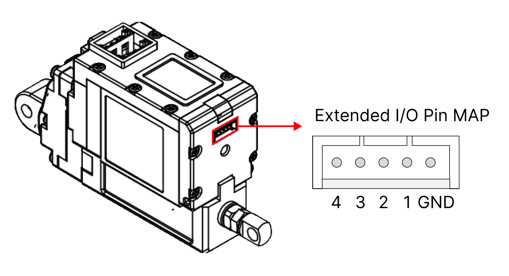
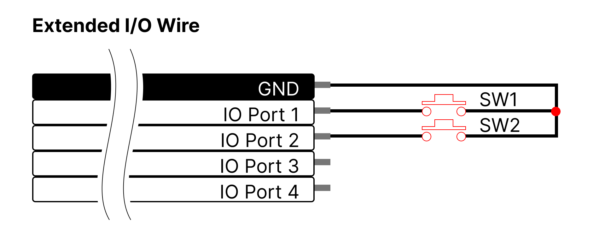

# 17Lf-xxF-27 Datasheet
## 1. Features / 주요 특장점
- Micro size / 마이크로 사이즈  
- Precise position control & feedback / 정밀 위치 제어 및 위치피드백
- Stall Force control by current feedback / 전류 피드백 통한 스톨 포스 제어
- Speed control (1000 resolution) / 속도 제어( 1000 해상도)
- Strong force comparing to the size / 체적 대비 강한 힘
- Built-in Drive Circuitry / 드라이브 회로 내장
- RS-485 communication / RS-485 통신 지원
- MODBUS RTU Protocol / MODBUS RTU 프로토콜
- Extended I/O Port /  확장 I/O Port 제공 
- Action function (No coding) / Action 기능 (코딩 불필요)
- Parameter programmable on the Manager software / 매니저 소프트웨어를 통한 Parameter 셋팅 가능 

## 2. Specification
### 2.1 Common Specifications / 공통 사양

| **Property** | Value |
| -------------------- | ---------------- |
| **Stroke / 스트로크** | 27mm |
| **Rated Load / 정격 부하** | 20N ⁓ 70N according to leadscrew pitch /  리드스크류 피치값에 따라 20N ⁓ 70N |
| **Recommended duty cycle at rated load** | Under 50%  /  50% 이하 |
| **Micro controller** | 32bit Arm Cortex |
| **Position Resolution** | 10000 Resolution (A/D Converter) |
| **Input Voltage / 입력 전압** | 12.0V(Rated/정격), 8V ⁓ 13 V(Operating/동작) |
| **Motor Type / Watt** | Coreless DC Motor / 3.8 Watt |
| **Current consumption / 소모전류** | 30mA(Idle/대기), 400mA(Rated/정격), 1.6A(Stall/최대) |
| **Position repeatability / 반복정밀도** | Unidirectional less than +/-0.03mm(30um) /  단방향 +/-0.03mm(30um) 이하 |
| ^ | Bydirectional less than +/-0.06mm(60um)  / 양방향 +/-0.06mm(60um) 이하 |
| **Current Tolerance / 전류값오차** | ±15% at Over 50mA |
| **Position sensor / 위치센서** | 10kΩ linearity potentiometer |
| **Size, Weight / 크기,무게** | 57.5(L)x 40.6(W)x 23(H)mm / 65.5g [+/-5%] |
| **Communication / 통신** | RS-485 |
| **Protocol** | MODBUS RTU |
| **Operating Temperatures / 동작온도** | -10℃ ⁓ 60℃ |
| **Ingress protection / 방수방진** | IP54 |
| **Mechanical Backlash / 기구백래쉬** | 0.03mm(30um) |
| **Audible Noise / 가청소음** | Max. 50db at 1m |
| **Gear ratio / 기어비** | 9.3 : 1 |
| **Gear type / 기어 타입** | Engineering Plastic |
| **Rod type / Rod 타입** | Stainless Steel |
| **Standard Accessory / 표준 악세서리** | 1 x Hinge base   1 x Hinge   1 x Hinge shaft   1 x Rod end tip   2 x M3 NUT   3 x M2.5x6 screws   1 x RS485 Molex wire harness (200mm)    1 x Extended I/O Molex wire harness (200mm)   1 x M3 spanner   1 x Socket set screw |
| **Connector Type (Male) in the Actuator / 커넥터 타입 (액츄에이터 쪽)** | MOLEX 53253-0470 |
| **Wire Harness / 와이어 하네스** | Molex(51065-0400) to Molex(51065-0400)/ 200mm / 0.08x60(22AWG) |
| **Extended I/O Wire Harness / 확장 IO 포트용 와이어하네스** | Molex(51021-0500), 5pins / 200mm length, 0.16 x 7 (26AWG) |

### 2.2 Voltages / 전압  
| Parameter                          | Min  | Norm | Max  | Unit |     Note      |
| :--------------- | :--: | :--: | :--: | :--: | :-----------: |
| **Supply voltage/ 공급 전압**          |  8   |  12  |  13  |  V   |            |
| **Logic input voltage / 로직 인가 전압** | -7.0 |  -   | 12.0 |  V   | RS-485 D-, D+ |

### 2.3 Currents / 전류
| Parameter                                           | Min | Norm | Max | Unit | Note                                                |
| :-------------- | :-- | :--- | :-- | :--- | :----------- |
| **Maximum peak Current  / 최대 피크 전류** |     | ≤1.6 |     | A    | Stall Current / 스톨전류 |
| **No Load Current  / 무 부하 전류** |     | ≤300 |     | mA   | No Load / 무부하시 전류 |
| **Rated Load Current  /정격 부하 시 전류** | | ≤400 | | mA | at over Goal current800mA setting / 골커런트 800mA 이상설정 |
| **Max Applicable Load Current /  최대 허용 부하 시 전류** | | ≤600 |     | mA   | at Goal current 1.6Asetting    / 골커런트1.6A설정 시    |
| **Idle Current / 대기전류** |     | ≤30  |     | mA   |                                                     |

### 2.4 Temperatures / 온도
| Parameter                   | Min | Norm | Max | Unit | Note |
| :-------------------------- | :-: | :--: | :-: | :--: | :--: |
| **StorageTemp. / 보관온도**     | -20 |  -   | 70  |  ℃   |      |
| **Operating Temp. / 동작온도** | -10 |  -   | 60  |  ℃   |      |

### 2.5 Strokes / 스트로크
| Parameter                   | Min  | Norm | Max  | Unit | Note |
| :-------------------------- | :--- | :--- | :--- | :--- | :--- |
| **MIN Position / 최소 수축 위치** | 3.3  | 3.8  | 4.3  | mm   |      |
| **MAX Position / 최대 확장 위치** | 30.3 | 30.8 | 31.3 | mm   |      |
| **Stroke length/ 스트로크**     |      | 27.0 |      | mm   |      |

⁕매니저 소프트웨어 또는 파라메터 맵의 Min / Max Position Calibration 기능으로 Min / Max 위치값 동기화 가능.  

### 2.6 No Load Speed / 무부하 속도
| Parameter                                   | Min   | Norm  | Max   | Unit | Note        |
| :------------------------------------------ | :---- | :---- | :---- | :--- | :---------- |
| Maximum Speed at 12.0V  / 최대 속도 at 12.0V | 105.3 | 117.0 | 128.7 | mm/s | 17Lf-20F-27 |
| ^                                          | 81    | 90    | 99    | mm/s | 17Lf-35F-27 |
| ^                                          | 27    | 30    | 33    | mm/s | 17Lf-70F-27 |
### 2.7 Load / 부하
| Parameter Parameter          | Rated | Unit | Note          |
| :----------------------------- | :---: | :--: | :---------- |
| Load at 12.0V  부하 at 12.0V |  20   |  N   | 17Lf-20F-27 |
| ^                             | 4.49  | lbf  | ^            |
| ^                             | 2.04  | kgf  | ^            |
| ^                             |  35   |  N   | 17Lf-35F-27 |
| ^                             | 7.86  | lbf  | ^            |
| ^                             | 3.57  | kgf  | ^            |
| ^                             |  70   |  N   | 17Lf-70F-27 |
| ^                             | 15.73 | lbf  | ^            |
| ^                             | 7.14  | kgf  | ^            |

### 2.8 Self Lock Feature / 셀프-락 기능
| Parameter  | Min |     Norm      | Max | Unit | Note        |
| :--------- | :-: | :-----------: | :-: | :--: | :---------- |
| Seklf Lock |     |    N/A(불가)    |  -  |      | 17Lf-20F-27 |
| ^          |  -  |    N/A(불가)    |  -  |      | 17Lf-35F-27 |
| ^          |  -  | Available(가능) |  -  |      | 17Lf-70F-27 |

## 3. Reference Data / 참고 자료
### 3.1 Voltage Vs Speed
입력 전압에 따른 무 부하 시 속도 변화에 대한 그래프 입니다. 해당 Data는 오차를 포함하고 있음으로 참고로 사용하시면 됩니다.

>[!note] Note  
>Goal Current 800에서 Test한 Data입니다.

### 3.2 Voltage Vs Stall Force 
입력 전압에 따른  Stall Force를 측정한 Data입니다. 해당 Data는 오차를 포함하고 있음으로 참고로 사용하시면 됩니다.

>[!note] Note  
>Goal Current 800에서 Test한 Data입니다.

>[!warning] CAUTION 
>각 Force 값의 오차는 +/- 15% 입니다. 

### 3.3 Goal Speed Vs Speed  
Goal Speed Parameter 값의 변화에 따른 무 부하 속도 변화를 나타냅니다.
부하에 따라 최대 속도는 줄어 들거나 최대 속도에 도달하는 시간이 길어 질 수 있습니다. 
  
>[!note] Note  
>Goal Current 800에서 Test한 Data입니다.

### 3.4 Goal Current vs Stall Force  
Goal Current 설정값에 대한 mightyZAP의 Stall Force를 나타냅니다. 

Stall Force 측정 방식은 속도 값을 최소한으로 하여 순수 전류 값에 대한 힘만 측정하였습니다.     
>[!warning] CAUTION
>각 Goal Current 값에 대한 Stall Force값의 오차는 +/- 15%입니다.
>붉은색으로 표기된 부분은 내부 부하(200mA이하의 경우) 및 발열(1100mA이상의 경우)에 의해  오차가 큼으로 참고용으로만 사용하여 주시기 바랍니다. 
>지속적인 부하가 발생하여 1A 이상의 전류가 흐를 경우 전류값이 점점 하락하여 1A로 수렴이 되고, overload(과부하) 보호 기능이 활성화되어 있는 경우 수초내에 overload alarm과 shutdown이 진행됩니다.

>[!tip] TIP  
>해당 자료는 모터의 힘을 나타내는 자료로, 액츄에이터에 가해지는 실제 부하량의 3배에 해당하는 Goal current로 셋팅하는 것을 추천 드립니다.  
>실제 부하와 모터가 내는 힘의 차이가 적을수록 모터의 속도가 줄게 되며, 이것이 같을 경우 모터가 움직이지 않습니다.  

>[!warning] CAUTION : 최대허용 부하 (정격부하의 2배) 설정시
>mightyZAP은 최대 정격부하의 2배 부하까지 사용가능하며, 이 경우에는 Duty Rate를 20% 이하로 적용해야 합니다.
>
>**EX>**
>
>|Load|Goal Current|Duty rate|Load|Goal Current|Duty Rate|
>|---|---|---|---|---|---|
>|20N(Rated)|800|Max. 50%|35N(Rated)|800|Max. 50%|
>|40N(Max)|1600|Max. 20%|70N(Max)|1600|Max. 20%|
>

### 3.5 Goal Current vs Speed at Rated Load  
정격 부하 시 Goal Current  값에 대한 mightyZAP의  속도 변화를 나타냅니다.  
  
정격 부하 속도의 경우 무부하 최대 속도 대비 모델에 따라 약 80 ~ 90% 대의 성능을 보여줍니다. 
>[!Note] Note
>정격 부하 상태에서 측정한 Data입니다.

 >[!warning] CAUTION  
>Speed Data는 약 +/-10% 오차를 가지고 있습니다.
>붉은색으로 표기된 부분은 해당 Goal Current 값에서의 Stall Force와 정격부하가 비슷한 구간으로 mightyZAP이 움직이지 않을 수 있습니다.  참고용으로만 사용하여 주시기 바랍니다.
 
### 3.6 PIN Map
##### 3.6.1 RS-485 PIN Map
##### 3.6.1.1 PIN MAP Table

| PIN NUMBER(COLOR) | PIN NAME&nbsp; | 
FUNCTION
 |
| :---------------: | :------------: | :-----------------: |
|     1(YELLOW)     |       D-       |       RS-485-       |
|     2(WHITE)      |       D+       |       RS-485+       |
|      3(RED)       |      VCC       |       Power +       |
|     4(BLACK)      |      GND       |       Power -       |

사용자 보드를 사용할 경우 아래와 같이 통신 회로를 구현하시면 됩니다.

#### 3.6.2 Extended I/O Port
##### 3.6.2.1 PIN Map Table
>[!warning] CAUTION
>Extended I/O는 Isolated  되어 있지 않음으로, 안전을 위해 별도의 Photo Coupler나 Relay를 이용하여 Isolated 회로를 구현하시거나 사용에 유의하여 주시기 바랍니다.

| PIN NUMBER(COLOR) |   PIN NAME    | FUNCTION                                                                            |
| :---------------: | :-----------: | :---------------------------------------------------------------------------------- |
|    GND (BLACK)    |      GND      | GND                                                                                 |
| 1 (WHITE) | Extended IO 1 | Switch, JOG, Action Next, Action Enable, Force Off, Stop, Pause, Alarm Out, Restart |
| 2 (WHITE) | Extended IO 2 | Switch, JOG, Action Next, Action Enable, Force Off, Stop, Pause, Alarm Out, Restart |
| 3 (WHITE) | Extended IO 3 | Action Enable, Force Off, Stop, Pause, Alarm Out, Restart                           |
| 4 (WHITE) | Extended IO 4 | Action Enable, Force Off, Stop, Pause, Alarm Out, Restart                           |
>[!note] 
>각 I/O기능에 대한 설명은 17Lf 사용자 설명서  [[7Lf User Manual_kor#2.4.18 Extended I/O Control|17Lf 사용자 설명서 2.18 Extended I/O Control]] 을 참조사여주시기 바랍니다.

**Extended I/O Pin Map**

**Extended I/O Wire**

##### 3.6.2.2 Circuit connection according to function  / 기능에 따른 회로 연결
- **Switch/ JOG**  
	- Switch : SW1(Short Stroke Limit), SW2(Long Stroke Limit) 를 누르면 각 위치로 모터가 이동합니다.
	- JOG : SW1(Short Stroke Limit), SW2(Long Stroke Limit) 를 누르면 각 방향으로 누르는 동안 모터가 이동합니다.

- **Action Enable / Force Off / Stop / Pause / Restart**
	- Action Enable : 내부 Action 동작을 Start/Stop 할 수 있습니다.
	- Force Off : 모터의 기동력을 On/Off로 변경 할 수 있습니다.
	- Stop : 모터가 정지하고 정지된 위치를 목표 위치로 설정합니다.
	- Pause : 일시 정지로 Switch를 다시 누르면 원래의 목표 위치로 이동합니다.
	- Restart : 모터의 시스템을 재 시작 합니다.
  
- **Alarm Out**
	- Hardware Error 가 발생할 경우 ON 됩니다.
  
  
##### 3.6.2.3 Isolated Circuit /  Isolated 회로
  - **Switch/ JOG / Action Enable / Force Off / Stop / Pause / Restart**
  
  - **Alarm Out**
  
  