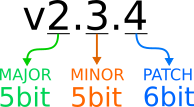
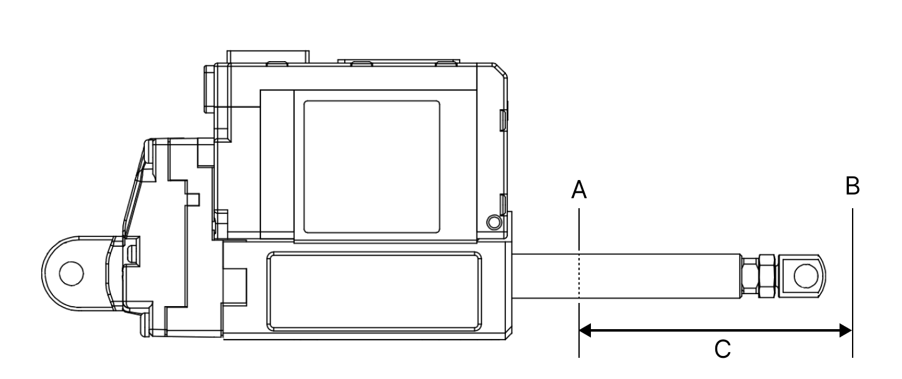
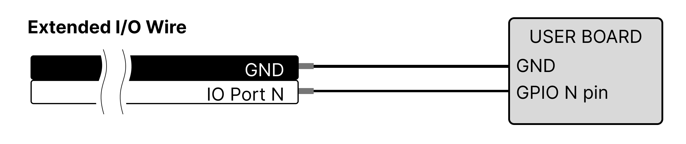
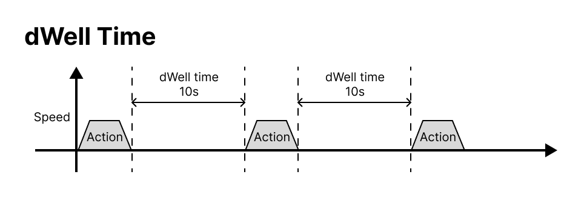
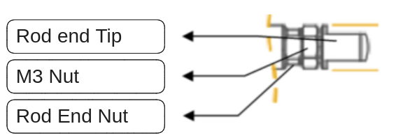

# 17Lf Series Manual

#### 제품군을 확인하세요!  

모델번호가 17Lf-로 시작하나요?  

> **본 메뉴얼은 MODBUS RTU protocol을 제공하는 17Lf 시리즈 mightyZAP 전용 매뉴얼입니다.**  **12Lf, L12, D12/7 시리즈 사용자분들께서는 별도의 전용 매뉴얼을 참고하시기 바랍니다.**  

## 1. Introduction

mightyZAP 마이크로 선형 서보 액추에이터는 다양한 산업 분야의 좁은 공간에서, 위치제어, 전류제어, 속도제어를 동반한 견고하고 정밀한 리니어 모션을 위해 설계되었습니다. 17Lf 서보 시리즈는 17mm 직경 DC 모터를 갖춘 mightyZAP 서보 액추에이터로, 12Lf 시리즈 대비, 유사한 정격 부하 사양에서 향상된 내구성과 더 빠른 속도를 제공합니다. 전반적인 기능은 12Lf 시리즈와 거의 동일하지만, 확장 I/O 포트를 통해 사용자 확장성이 향상되어 더욱 쉽고 편리하게 제어할 수 있습니다. MODBUS RTU 프로토콜을 이용한 RS-485 통신만 제공됩니다. 

> [!danger] 주의  
>
> 1. 정격 부하 이상의 힘이 지속적으로 가해질 경우 모터가 소손될 수 있습니다.
> 2. Rod End Tip 장착 시 무리하게 Rod에 비트는 힘을 가하게 되면 내부 부품 파손의 원인이 됩니다.   (동봉된 M3 스패너로 rod를 고정 후 rod end tip류를 장착하십시오.)
> 3. 제품의 사용 환경을 준수하세요 (전압 : 8V\~13V(정격전압 12V),  동작 온도 : -10도 \~ +60도)
> 4. 최적의 수명 관리를 위해 Duty Rate 50%를 넘지 않고, 최대 연속 동작 시간 30초를 넘지 말아 주시기 바랍니다.
> 5. 오배선에 유의 하여 주시기 바랍니다.
>    자세한 사항은 \[[#3.1 사용 주의 사항]] 을 참조 하여 주시기 바랍니다.

> [!warning] 취급 및 보관 
>
> * 연속 동작 직후 mightyZAP의 케이스가 뜨거울 수 있습니다. 화상에 주의하십시오.
> * mightyZAP을 물기, 먼지, 기름으로부터 멀리 하십시오.
> * 본 제품은 실내 용도로 설계된 제품입니다. 실외 사용을 금합니다.
> * 어린이의 손이 닿지 않는 곳에 제품을 보관하십시오. 성인이 사용 시에도 모터의 동작 시 발생할 수 있는 신체 상해에 유의하십시오.
>    자세한 사항은 \[[#3.1 사용 주의 사항]] 을 참조 하여 주시기 바랍니다.

### 1.2 사양

#### 1.2.1 17Lf 시리즈 주요 사양

| 
정격부하
 | 
Stroke
 | 
Model
 | 
최고 속도 (무부하)
 | 
전류대비 스톨포스 (1.6A/800mA /200mA)
 | 
Mechanical   Self Lock   (Z축 사용)
 | 
Lead Screw  / Gear Ratio  / Gear Type
 |
| --------------------- | ----------------------- | ---------------------- | ------------------------------- | ---------------------------------------------------- | ------------------------------------------------------- | ------------------------------------------------------------ |
| 17N                   | 37mm                    | 17Lf-17F-37            | 82mm/s                          | 90N / 58N / 23N                                      | 없음 (Z축 적용 주의)                                        | Lead Angle 20° / 10:1   /Engineering  Plastic Gears    |
| ^                     | 50mm                    | 17Lf-17F-50            | ^                               | ^                                                    | ^                                                       | ^                                                            |
| ^                     | 87mm                    | 17Lf-17F-87            | ^                               | ^                                                    | ^                                                       | ^                                                            |
| 20N                   | 27mm                    | 17L-20F-27             | 117mm/s                         | ^                                                    | ^                                                       | Lead Angle 22.2° / 9.3:1  /Engineering Plastic Gears      |
| 27N                   | 37mm                    | 17Lf-27F-37            | 82mm/s                          | 96N / 68N / 27N                                      | ^                                                       | Lead Angle 15° / 10:1   /Engineering  Plastic Gears    |
| ^                     | 50mm                    | 17Lf-27F-50            | ^                               | ^                                                    | ^                                                       | ^                                                            |
| ^                     | 87mm                    | 17Lf-27F-87            | ^                               | ^                                                    | ^                                                       | ^                                                            |
| 35N                   | 27mm                    | 17Lf-35F-27            | 90mm/s                          | ^                                                    | ^                                                       | Lead Angle 17° / 9.3:1 /   Engineering Plastic Gears      |
| 50N                   | 37mm                    | 17Lf-50F-27            | 28mm/s                          | 182N / 129N / 50N                                    | 있음 (Z축 적용 가능)                                        | Lead Angle 5° / 10:1   /Engineering  Plastic Gears     |
| ^                     | 50mm                    | 17Lf-50F-50            | ^                               | ^                                                    | ^                                                       | ^                                                            |
| ^                     | 87mm                    | 17Lf-50F-87            | ^                               | ^                                                    | ^                                                       | ^                                                            |
| 70N                   | 27mm                    | 17Lf-70F-27            | 32mm/s                          | ^                                                    | ^                                                       | ^                                                            |

#### 1.2.2 공통 사양서

| Item                                       | Stroke      | <       | Unidirectional                                                                                                                                                                                        |
| ------------------------------------------ | ----------- | ------- | ----------------------------------------------------------------------------------------------------------------------------------------------------------------------------------------------------- |
| **위치정밀도   (반복정밀도)**                     | 27mm / 40mm | <       | 30μm (0.03mm)                                                                                                                                                                                         |
| ^                                          | 53mm        | <       | 40μm (0.04mm                                                                                                                                                                                          |
| ^                                          | 90mm        | <       | 50μm (0.05mm))                                                                                                                                                                                        |
| **기구 백래쉬**                                 | <           | <       | 0.03mm (30μm)                                                                                                                                                                                         |
| **Rod 타입**                                 | <           | <       | Metal Alloy Rod                                                                                                                                                                                       |
| **모터타입**                                   | <           | <       | Coreless DC                                                                                                                                                                                           |
| **정격인가전압**                                 | <           | <       | 12V                                                                                                                                                                                                   |
| **Watt**                                   | <           | <       | 3.8W                                                                                                                                                                                                  |
| **권장 Duty Cycle**                          | <           | <       | 최대 50%                                                                                                                                                                                                |
| **전류값 오차**                                 | <           | <       | ±15% at Over 50mA                                                                                                                                                                                     |
| **위치인식센서**                                 | <           | <       | 10KΩ linear Potentiometer                                                                                                                                                                             |
| **인가 전압범위**                                | <           | <       | 8~13V DC (정격 12V DC)                                                                                                                                                                                  |
| **소모전류**                                   | Idle        | <       | 20mA                                                                                                                                                                                                  |
| ^                                          | Rated       | <       | 400mA                                                                                                                                                                                                 |
| ^                                          | Stall       | Default | 800mA                                                                                                                                                                                                 |
| ^                                          | ^           | MAX     | 1.6A                                                                                                                                                                                                  |
| **가청 소음**                                  | <           | <       | 약 50db at 1m                                                                                                                                                                                          |
| **LED 표시**                                 | <           | <       | 2가지 에러표시 (Input voltage, Overload)                                                                                                                                                                    |
| **펄스방식 / 펄스범위**                            | <           | <       | PWM (PT version, RC모형 송수신용 신호)  / 900μs(수축)-1500 μs(센터)-2100μs (확장)                                                                                                                                |
| **데이타 통신방식 / 프로토콜**                        | <           | <       | RS-485(Modbus-RTU)                                                                                                                                                                                    |
| **Ingress Protection**                     | <           | <       | IP-54 (Dust &amp; Water Tight)                                                                                                                                                                        |
| **스크로크별 크기/무게**  (크기는 로드엔드 / 힌지 제외)  | **27mm**    | <       | 57.5x40.6x23mm / 65.5g                                                                                                                                                                                |
| ^                                          | **40mm**    | <       | 86.8x57.9x23mm / 113.5g                                                                                                                                                                               |
| ^                                          | **53mm**    | <       | 111.5x57.9x23mm / 140g                                                                                                                                                                                |
| ^                                          | **90mm**    | <       | 151.5x57.9x23mm / 188g                                                                                                                                                                                |
| **동작온도 조건**                                | <           | <       | \-10℃ ~ 60℃                                                                                                                                                                                           |
| **와이어 하네스**                                | <           | <       | **통신/전원** :  Molex to Molex Type  (Molex 0510650400, 4pins)  / 200mm length, 0.08×60(22AWG)   **I/O Port Wire harness** :  Molex 510210500, 5pins  / 200mm length, 0.16 x 7 (26AWG) |

#### 1.2.3 Motor 성능 곡선

 
## 2. Control Table
Control Table은 mightyZAP을 구동 및 제어하기 위한 Parameter와 현재 상태를 나타내는 Parameter로 이루어져 있습니다.   
사용자는 통신 Packet을 이용하여 특정 Parameter의 Data를  읽어 mightyZAP의 상태를 확인하거나, Data를 변경하여 mightyZAP을 제어할 수 있습니다.  

> [!note] Note 
>17Lf 시리즈는 MODBUS-RTU 프로토콜 만을 제공합니다.  (IR Open프로토콜 미지원)
>통신 Packet에 대한 자세한 내용은 \[[17Lf Modbus RTU_kor|MODBUS RTU]]를 참고하여 주시기 바랍니다.

### 2.1 Description

#### 2.1.1 Memory Type

Control Table은 2개의 영역으로 구분됩니다. Data를 변경한 후 전원을 꺼도 Data가 유지가 되는  Non-Volatile Memory(ROM)와 전원이 꺼지면 Data가 초기화 되는 Volatile Memory(RAM)가 있습니다.    

* **Non-Volatile Memory (ROM)** : 데이터 수정 시 약 250ms의 시간이 걸릴 수 있습니다. 또한 메모리를 저장 중에는 통신이 제한 될 수 있습니다.  일반적으로 동작 전 설정 사항을 정할 때에만 사용합니다. 저장된 값은 전원 재인가 후에도 초기화되지 않습니다. 
* **Volatile Memory(RAM)** :  실시간으로 데이터를 자주 변경할 때 사용합니다. 일반적인 동작 제어 파라메터들로 구성 되어있습니다. 전원이 재인가 되면 초기화 됩니다.  

#### 2.1.2 Address

본 문서에서 Address는 Control Table에서 Data Adress를 의미합니다.

#### 2.1.3 Size

mightyZAP 17Lf 시리즈의 모든 Parameter의 Data Size는 2byte 로 되어있습니다.

#### 2.1.4 Access  (접근 권한)

Control Table Data는 'R', 또는 'RW'로 표기됩니다. 'R'은 읽기 전용(Read Only)을 의미하고, 'RW'는  읽기와 쓰기가 모두 가능합니다.\
읽기 전용 권한은 주로 서보 액츄에이터의 기본 정보 또는 모니터링 용으로 사용되고, 읽기 쓰기 권한은 mightyZAP 제어 용도로 사용됩니다.  

**Modbus RTU에서는 각 권한에 따라 아래의 명령을 사용하여 통신을 하실 수 있습니다.** 

* Read 권한 : Modbus RTU 에서 Read Holding Register 명령을 이용하여 데이터를 읽어옵니다.
* Wirte 권한 : Write Single Register 명령을 이용하여 원하는 데이터를 쓰고, Read Holding Register를 이용하여 입력되어 있는 데이터를 확인할 수 있습니다.

#### 2.1.5 Default

Default 값은 초기 설정 값(공장 출하 설정 값)입니다. Non-Volatile Memory 영역의 값은 사용자가 수정할 경우 변경한 값으로 default값에 적용되며, Volatile Memory 영역은 전원이 인가 되었을 때의 현재 상태 값으로 default 값을 표시합니다.

### 2.2 Non-volatile Memory (ROM)

| 
Register Number
 | 
Address
 | 
Name
     | 
Description
 | Access | 
Default
 |
| ----------------------------------- | ------------------------ | ------------------------- | ---------------------------- | ------ | ------------------------ |
| 40001                               | 0 (0x00)                 | Serial Number             | Model Serial Nu mber         | R      |                          |
| 40002                               | 1 (0x01)                 | Firmware Version          | 펌웨어 버전 정보                    | R      |                          |
| 40005                               | 4 (0x04)                 | mightyZAP ID              | mightyZAP ID                 | RW     | 1(0x01)                  |
| 40006                               | 5 (0x05)                 | mightyZAP Baudrate        | 통신 속도                        | RW     | 32(0x20)                 |
| 40010                               | 9 (0x09)                 | Alarm LED                 | 하드웨어 에러 알람 LED 표시            | RW     | 33(0x21)                 |
| 40011                               | 10 (0x0A)                | Alarm Shutdown            | 하드웨어 에러 셧다운 기능               | RW     | 33(0x21)                 |
| 40012                               | 11 (0x0B)                | Short Stroke Limit        | 수축 방향 한계 위치 값                | RW     | 0(0x00)                  |
| 40013                               | 12 (0x0C)                | Long Stroke Limit         | 확장 방향 한계 위치값                 | RW     | 개별 Spec                  |
| 40014                               | 13 (0x0D)                | Start Compliance Margin   | 시작 Compliance Margin         | RW     | 20(0x14)                 |
| 40015                               | 14 (0x0E)                | End Compliance Margin     | 종료 Compliance Margin         | RW     | 8(0x08)                  |
| 40016                               | 15 (0x0F)                | Acceleration              | 가속도                          | RW     | 개별 Spec                  |
| 40017                               | 16 (0x10)                | Deceleration              | 감속도                          | RW     | 개별 Spec                  |
| 40018                               | 17 (0x11)                | Min Position Calibration  | Min Position Trim            | RW     | 개별 Spec                  |
| 40019                               | 18 (0x12)                | Max Position Calibration  | Max Position Trim            | RW     | 개별 Spec                  |
| 40020                               | 19 (0x13)                | Motor Operating Rate Limt | 모터 가동률 한계값(PWM)              | RW     | 1000                     |
| 40021                               | 20 (0x14)                | Speed Limit               | 속도 상한 값                      | RW     | 1000                     |
| 40022                               | 21 (0x15)                | Current Limit             | 전류 상한 값                      | RW     | 800                      |
| 40023                               | 22 (0x16)                | Current I Gain            | 전류 I Gain                    | RW     | 개별 Spec                  |
| 40024                               | 23 (0x17)                | Current P Gain            | 전류 P Gain                    | RW     | 개별 Spec                  |
| 40025                               | 24 (0x18)                | Speed D Gain              | 속도 D Gain                    | RW     | 개별 Spec                  |
| 40026                               | 25 (0x19)                | Speed I Gain              | 속도 I Gain                    | RW     | 개별 Spec                  |
| 40027                               | 26 (0x1A)                | Speed P Gain              | 속도 P Gain                    | RW     | 개별 Spec                  |
| 40041                               | 40 (0x28)                | Indirect Addess 0         | 간접 주소 0                      | RW     | 0(0x00)                  |
| 40042                               | 41 (0x29)                | Indirect Addess 1         | 간접 주소 1                      | RW     | 0(0x00)                  |
| 40043                               | 42 (0x2A)                | Indirect  Addess 2        | 간접 주소 2                      | RW     | 0(0x00)                  |
| 40044                               | 43 (0x2B)                | Indirect  Addess 3        | 간접 주소 3                      | RW     | 0(0x00)                  |
| 40045                               | 44 (0x2C)                | Indirect Addess 4         | 간접 주소 4                      | RW     | 0(0x00)                  |
| 40046                               | 45 (0x2D)                | Indirect  Addess 5        | 간접 주소 5                      | RW     | 0(0x00)                  |
| 40047                               | 46 (0x2E)                | Indirect Addess 6         | 간접 주소 6                      | RW     | 0(0x00)                  |
| 40048                               | 47 (0x2F)                | Indirect  Addess 7        | 간접 주소 7                      | RW     | 0(0x00)                  |
| 40049                               | 48 (0x30)                | Indirect  Addess 8        | 간접 주소 8                      | RW     | 0(0x00)                  |
| 40050                               | 49 (0x31)                | Indirect Addess 9         | 간접 주소 9                      | RW     | 0(0x00)                  |
| 40051                               | 50 (0x32)                | Extened Port Setting 0    | 확장 Port 0 기능 설정              | RW     | 0(0x00)                  |
| 40052                               | 51 (0x33)                | Extened Port Setting 1    | 확장 Port 1 기능 설정              | RW     | 0(0x00)                  |
| 40053                               | 52 (0x34)                | Extened Port Setting 2    | 확장 Port 2 기능 설정              | RW     | 0(0x00)                  |
| 40054                               | 53 (0x35)                | Extened Port Setting 3    | 확장 Port 3 기능 설정              | RW     | 0(0x00)                  |
| 40061                               | 60 (0x3C)                | Action 0 Type             | Action 0 동작 형식               | RW     | 0(0x00)                  |
| 40062                               | 61 (0x3D)                | Action 0 distance         | Action 0 이동 거리               | RW     | 0(0x00)                  |
| 40063                               | 62 (0x3E)                | Action 0 Repeat Type      | Action 0 반복 형식               | RW     | 0(0x00)                  |
| 40064                               | 63 (0x3F)                | Action 0 Repeat Count     | Action 0 반복 횟수               | RW     | 0(0x00)                  |
| 40065                               | 64 (0x40)                | Action 0 Repeat Time      | Action 0 반복 회당 시간설정          | RW     | 0(0x00)                  |
| 40066                               | 65 (0x41)                | Action 0 Goal Speed       | Action 0 Goal Speed          | RW     | 0(0x00)                  |
| 40067                               | 66 (0x42)                | Action 0 Goal Current     | Action 0 Goal Current        | RW     | 0(0x00)                  |
| 40068                               | 67 (0x43)                | Action 0 Accleration      | Action 0 Acceleration        | RW     | 0(0x00)                  |
| 40069                               | 68 (0x44)                | Action 0 Delceration      | Action 0 Deceleration        | RW     | 0(0x00)                  |
| 40070                               | 69 (0x45)                | Action 0 Stop             | Action 0 정지 형식               | RW     | 0(0x00)                  |
| 40071                               | 70 (0x46)                | Action 1 Type             | Action 1 동작 형식               | RW     | 0(0x00)                  |
| 40072                               | 71 (0x47)                | Action 1 distance         | Action 1 이동 거리               | RW     | 0(0x00)                  |
| 40073                               | 72 (0x48)                | Action 1 Repeat Type      | Action 1 반복 형식               | RW     | 0(0x00)                  |
| 40074                               | 73 (0x49)                | Action 1 Repeat Count     | Action 1 반복 횟수               | RW     | 0(0x00)                  |
| 40075                               | 74 (0x4A)                | Action 1 Repeat Time      | Action 1 1회 동작 시간            | RW     | 0(0x00)                  |
| 40076                               | 75 (0x4B)                | Action 1 Goal Speed       | Action 1 Goal Speed          | RW     | 0(0x00)                  |
| 40077                               | 76 (0x4C)                | Action 1 Goal Current     | Action 1 Goal Current        | RW     | 0(0x00)                  |
| 40078                               | 77 (0x4D)                | Action 1 Accleration      | Action 1 Acceleration        | RW     | 0(0x00)                  |
| 40079                               | 78 (0x4E)                | Action 1 Delceration      | Action 1 Deceleration        | RW     | 0(0x00)                  |
| 40080                               | 79 (0x4F)                | Action 1 Stop             | Action 1 정지 형식               | RW     | 0(0x00)                  |
| 40081                               | 80 (0x50)                | Action 2 Type             | Action 2 동작 형식               | RW     | 0(0x00)                  |
| 40082                               | 81 (0x51)                | Action 2 distance         | Action 2 이동 거리               | RW     | 0(0x00)                  |
| 40083                               | 82 (0x52)                | Action 2 Repeat Type      | Action 2 반복 형식               | RW     | 0(0x00)                  |
| 40084                               | 83 (0x53)                | Action 2 Repeat Count     | Action 2 반복 횟수               | RW     | 0(0x00)                  |
| 40085                               | 84 (0x54)                | Action 2 Repeat Time      | Action 2 1회 동작 시간            | RW     | 0(0x00)                  |
| 40086                               | 85 (0x55)                | Action 2 Goal Speed       | Action 2 Goal Speed          | RW     | 0(0x00)                  |
| 40087                               | 86 (0x56)                | Action 2 Goal Current     | Action 2 Goal Current        | RW     | 0(0x00)                  |
| 40088                               | 87 (0x57)                | Action 2 Accleration      | Action 2 Acceleration        | RW     | 0(0x00)                  |
| 40089                               | 88 (0x58)                | Action 2 Delceration      | Action 2 Deceleration        | RW     | 0(0x00)                  |
| 40090                               | 89 (0x59)                | Action 2 Stop             | Action 2 정지 형식               | RW     | 0(0x00)                  |
| 40091                               | 90 (0x5A)                | Action 3 Type             | Action 3 동작 형식               | RW     | 0(0x00)                  |
| 40092                               | 91 (0x5B)                | Action 3 distance         | Action 3 이동 거리               | RW     | 0(0x00)                  |
| 40093                               | 92 (0x5C)                | Action 3 Repeat Type      | Action 3 반복 형식               | RW     | 0(0x00)                  |
| 40094                               | 93 (0x5D)                | Action 3 Repeat Count     | Action 3 반복 횟수               | RW     | 0(0x00)                  |
| 40095                               | 94 (0x5E)                | Action 3 Repeat Time      | Action 3 1회 동작 시간            | RW     | 0(0x00)                  |
| 40096                               | 95 (0x5F)                | Action 3 Goal Speed       | Action 3 Goal Speed          | RW     | 0(0x00)                  |
| 40097                               | 96 (0x60)                | Action 3 Goal Current     | Action 3 Goal Current        | RW     | 0(0x00)                  |
| 40098                               | 97 (0x61)                | Action 3 Accleration      | Action 3 Acceleration        | RW     | 0(0x00)                  |
| 40099                               | 98 (0x62)                | Action 3 Delceration      | Action 3 Deceleration        | RW     | 0(0x00)                  |
| 40100                               | 99 (0x63)                | Action 3 Stop             | Action 3 정지 형식               | RW     | 0(0x00)                  |
| 40101                               | 100 (0x64)               | Action 4 Type             | Action 4 동작 형식               | RW     | 0(0x00)                  |
| 40102                               | 101 (0x65)               | Action 4 distance         | Action 4 이동 거리               | RW     | 0(0x00)                  |
| 40103                               | 102 (0x66)               | Action 4 Repeat Type      | Action 4 반복 형식               | RW     | 0(0x00)                  |
| 40104                               | 103 (0x67)               | Action 4 Repeat Count     | Action 4 반복 횟수               | RW     | 0(0x00)                  |
| 40105                               | 104 (0x68)               | Action 4 Repeat Time      | Action 4 1회 동작 시간            | RW     | 0(0x00)                  |
| 40106                               | 105 (0x69)               | Action 4 Goal Speed       | Action 4 Goal Speed          | RW     | 0(0x00)                  |
| 40107                               | 106 (0x6A)               | Action 4 Goal Current     | Action 4 Goal Current        | RW     | 0(0x00)                  |
| 40108                               | 107 (0x6B)               | Action 4 Accleration      | Action 4 Acceleration        | RW     | 0(0x00)                  |
| 40109                               | 108 (0x6C)               | Action 4 Delceration      | Action 4 Deceleration        | RW     | 0(0x00)                  |
| 40110                               | 109 (0x6D)               | Action 4 Stop             | Action 4 정지 형식               | RW     | 0(0x00)                  |

### 2.3 Volatile Memory(RAM)

| Register Number | Address    | Name                   | Description            | Access       | Default       |
| --------------- | ---------- | ---------------------- | ---------------------- | ------------ | ------------- |
| 40201           | 200 (0xC8) | Force On/Off           | 모터 출력 끄고 켜기            | RW           | 1(0x01)       |
| 40202           | 201 (0xC9) | Actuator Pause         | 모터 일시 정지               | RW           | 0(0x00)       |
| 40203           | 202 (0xCA) | Actuator Stop          | 모터 일시 정지               | RW           | 0(0x00)       |
| 40204           | 203 (0xCB) | LED Color              | LED On/Off             | RW           | 0(0x00)       |
| 40205           | 204 (0xCC) | Hardware Error         | Hardware Error         | R            | 0(0x00)       |
| 40206           | 205 (0xCD) | Goal Position          | 목표 위치 값                | RW           |               |
| 40209           | 208 (0xD0) | Goal Speed             | 목표 속도 값                | RW           | Speed Limit   |
| 40210           | 209 (0xD1) | Goal Current           | 최대 전류 값                | RW           | Current Limit |
| 40211           | 210 (0xD2) | Present Position       | 현재 위치 값                | R            |               |
| 40212           | 211 (0xD3) | Present Current        | 현재 소비 전류 값             | R            |               |
| 40214           | 213 (0xD5) | Present Motor PWM      | 모터 입력 PWM              | R            |               |
| 40215           | 214 (0xD6) | Present Voltage        | 현재 전압 값                | R            |               |
| 40216           | 215 (0xD7) | Moving                 | 모터 동작 유무               | R            |               |
| 40218           | 217 (0xD9) | Present Overload Value | Present Overload Value | R            |               |
| 40221           | 220 (0xDC) | Action Enable          | Action 기능 켜기/끄기        | RW           |               |
| 40231           | 230 (0xE6) | Reset                  | Parameter Reset        | W            |               |
| 40232           | 231 (0xE7) | Restart                | System Restart         | W            |               |
| 40241           | 240 (0xF0) | Indirect Data 0        | 간접 주소 0 데이터 값          | 사용자설정에 따라 변경 |               |
| 40242           | 241 (0xF1) | Indirect  Data 1       | 간접 주소 1 데이터 값          | ^            |               |
| 40243           | 242 (0xF2) | Indirect Data 2        | 간접 주소 2 데이터 값          | ^            |               |
| 40244           | 243 (0xF3) | Indirect  Data 3       | 간접 주소 3 데이터 값          | ^            |               |
| 40245           | 244 (0xF4) | Indirect Data 4        | 간접 주소 4 데이터 값          | ^            |               |
| 40246           | 245 (0xF5) | Indirect  Data 5       | 간접 주소 5 데이터 값          | ^            |               |
| 40247           | 246 (0xF6) | Indirect  Data 6       | 간접 주소 6 데이터 값          | ^            |               |
| 40248           | 247 (0xF7) | Indirect Data 7        | 간접 주소 7 데이터 값          | ^            |               |
| 40249           | 248 (0xF8) | Indirect Data 8        | 간접 주소 8 데이터 값          | ^            |               |
| 40250           | 249 (0xF9) | Indirect Data 9        | 간접 주소 9 데이터 값          | ^            |               |

### 2.4 Control Table Discription

#### 2.4.1  Model Serial Number

mightyZAP Model을 식별하기 위한 생산로트 번호입니다.

#### 2.4.2 Firmware Version

해당 제품의 펌웨어 버전이 표기되며, Semantic Versioning 방식으로 표기합니다. 
**Semantic Versioning**
	major.minor.patch
	- major : 전반적인 펌웨어 개편 또는 주요 기능 수정 및 추가
	- minor : 기능 수정 및 기능이 추가된 경우
	- patch :  버그 수정 및 코드 보완이 추가된 경우

   

#### 2.4.3 mightyZAP ID

통신 상에서 mightyZAP을 식별 하기 위한 고유 번호, Daisy-chain 방식으로 연결된 mightyZAP들은 서로 다른 ID가 할당되어야 합니다.  

| value | Description                                       |
| ----- | ------------------------------------------------- |
| 0     | Broadcast ID (Feedback  없이 쓰기만 가능하고 읽기는 불가능 합니다.) |
| 1~247 | mightyZAP ID (default ID 1)                       |

> [!NOTE] Daisy-cahin Connection
> ID 번호가 N번인 mightyZAP 서보에 Command Packet 을 전송할 경우 여러 개의 mightyZAP 중 ID가 N번에 해당하는 서보만이 Feedback Packet을 return하고, 그 Command를 수행합니다.  
>
> 

> [!warning]  Unique ID  
> * 연결된 mightyZAP의 ID가 중복되지 않도록 주의해야 합니다. 중복된 ID가 있을 경우 통신 오류가 발생하여 정상적인 통신이 이루어지지 않습니다.   
> * 최대 247개의 ID 설정이 가능하지만 표준 규정상 하나의 노드에 연결 가능한 mightyZAP은 이론적으로 최대 32개입니다.
> * 서보액츄에이터의 ID는 출하 시 기본 ID가 1로 설정되어 있으므로 1이 아닌 ID로 변경하고 서보를 한 개씩 Daisy-Chain 연결망에 연결하면서 ID를 변경하면 편리합니다.

#### 2.4.4 Baudrate

mightyZAP과 사용자의 제어기가 통신을 하기 위한 통신 속도 입니다.
설정된 값을 적용하기 위해서는 mightyZAP을 재 시작 해야 합니다.

| 설정값       | 통신 속도 (bps)     |
| --------- | --------------- |
| 8(0x08)   | 115200          |
| 16(0x10)  | 57600 (default) |
| 32(0x20)  | 38400           |
| 64(0x40)  | 19200           |
| 128(0x80) | 9600 bps        |

#### 2.4.5 Alarm LED

Hardware Error 가 발생 했을 때, 해당 Alarm LED  bit 가 세팅 되어 있는 경우 LED표시를 실행합니다. (1 = 활성 / 0 = 비활성)

| Bit   | Name                | LED Indicate | Description                                  |
| ----- | ------------------- | ------------ | -------------------------------------------- |
| Bit 6 | Overload Error      | RED 점멸       | 일정 시간 이상 동안 부하가 발생한 경우 (duty rate 50%이상일 경우) |
| Bit 0 | Input Voltage Error | RED 지속 점등    | 인가된 전압이 동작 범위를 벗어난 경우 (동작범위 : 8~13V)         |

모든 Alarm은 시스템을 재 시작해야 사라지게 됩니다.\
하지만 저전압 Input Voltage LED Alarm의 경우 원인이 해결 되면 LED가 꺼지게 됩니다.

> [!note] NOTE
> Hardware Error에 대한 자세한 설명은 \[[#2.4.24 Hardware Error]]를 참조하여 주시기 바랍니다. 

#### 2.4.6 Alarm Shutdown

Hardware Error 가 발생 했을 때, 해당 Alarm Shutdown bit 가 세팅 되어 있는 경우 모터를 Shutdown 합니다. (1 = 활성 / 0 = 비활성)

| Bit   | Name                | Description                                  |
| ----- | ------------------- | -------------------------------------------- |
| Bit 6 | Overload Error      | 일정 시간 이상 동안 부하가 발생한 경우 (duty rate 50%이상일 경우) |
| Bit 0 | Input Voltage Error | 인가된 전압이 동작 범위를 벗어난 경우 (동작범위 : 8~13V)         |

Shutdown은 Hardware Error가 발생할 경우, 모터를 Force Off 상태 즉, 모터에 전원 공급을 중단한 상태가 됩니다. Shutdown에 의해 설정된 Force Off는 시스템 재시작으로만 해지가 됩니다.
하지만 저전압 Input Volatage에 의한 Shutdown의 경우 정상 전압으로 될 경우 다시 Force On 됩니다. Shutdown 기능은 활성된 상태로 출하되며, 사용자에 의해 비활성화가 가능하지만, 제품의 보호 차원에서 비활성화는 추천되지 않습니다. 

> [!note] NOTE
> Hardware Error에 대한 자세한 설명은 \[[#2.4.24 Hardware Error]]를 참조하여 주시기 바랍니다.

#### 2.4.7 Short/Long Stroke Limit

| Parameter          | Range      | Description             |
| ------------------ | ---------- | ----------------------- |
| Short Stroke Limit | 0 ⁓ 10,000 | Goal Position 최소 입력 하한값 |
| Long Stroke Limit  | 0 ⁓ 10,000 | Goal Position 최대 입력 상한값 |

Short/Long Stroke Limit은 Goal Position 범위의 상한(long)/하한(short)을 각각 0~10,000으로 제한합니다.
따라서 Goal Position값은 Short Stroke Limit(A) 값보다 작을 수 없고, Long Stroke Limit(B) 값보다 커서는 안됩니다.
Goal Position값이 Short Stroke Limit 값보다 작을 경우 또는 Long Stroke Limit 값보다 클 경우 Stroke Limit값으로 치환됩니다.\
반드시 사용해야 하는 파라메터는 아니지만, 사용자의 어플리케이션에 따라 스트로크 리미트를 설정함으로써 실수로 인한 미연의 사고를 방지할 수 있는 파라메터입니다.

> [!note] NOTE
> mightyZAP이 사용자의 Application에 설치 되어 동작하기 전에 , 실제 가동 가능한 범위를 측정하여 Short Stroke Limit/Long Stroke Limit를 설정하신 후 사용하는 것을 추천 드립니다.\
> 설치된 사용자 기구물의 기구 한계 밖의 위치 이동값을 입력할 경우 생길 수 있는 사용자 어플리케이션의 파손이나 액츄에이터의 오버로드 또는 파손을 방지할 수 있습니다.
> 자세한 내용은 \[[#3. 유의 사항]]을 확안하여 주시기 바랍니다.

#### 2.4.8 Start Compliance Margin

> [!TIP] Compliance Margin이란?
> Compliance Margin이란 이동 명령을 통해 Actuator를 구동 시작 시키거나 혹은 명령 수행을 완료 시키기 위한 최소 값의 크기입니다. 일반적인 경우 한 가지의 Compliance Margin 값을 통해, 구동 시작이나 구동 완료를 시키는 것이 보통이지만 당사 mightyZAP은 시작 시와 완료 시의 Compliance Margin을 각각 개별로 설정해서, 우수한 반복 위치 정밀도를 가지면서도, 안정적인 동작이 가능하게 설계가 되었습니다.
> 일반적으로 Compliance Margin을 조정하는 경우는 디폴트 값보다 크게 해서 정밀도를 일부 희생하더라도 외압이나 노이즈 등이 발생하는 불안정된 환경에서도 안정적으로 동작이 될 수 있도록 하는 경우가 대부분입니다.   반대로 Compliance Margin을 디폴트 값 보다 더 줄여서 사용하는 경우는 정밀도는 좋아지는 대신에 동작 안정성을 해칠 수 있으므로 특별한 주의를 요합니다.  

Start Compliance Margin은 mightyZAP이 Goal Position 위치 값으로 이동 하기 위한  최소 위치 편차(마진) 값 입니다. 

| Range   | Description              |
| ------- | ------------------------ |
| 0 ⁓ 255 | 이동 하기 위한  최소 위치 편차(마진) 값 |

<b>Start Compliance Margin은 다음의 2가지의 경우에 적용이 됩니다.</b>

1. 현재 위치에서 다른 위치로 이동하기 위해 Goal Position 값을 변경하는 경우
   mightyZAP이 위치 이동을 시작하기 위한 최소 마진 값으로 현재 위치 값과 Goal Position 값의 차이가 +Margin 값보다 크거나 -Marign 값보다  작을 경우에만 액츄에이터는 구동을 시작합니다.

> [!info] 예시 1
> **Start Compliance Margin 보다 작게  Goal Position을 변경한 경우**
>
> * Start Compliance Margin : 20
> * Present Positon  : 1000
> * Goal Position : 1000 -> 1010으로 변경할 경우
> * 결과 : 위치 편차가 Margin 값 보다 작아 위치 변동이 발생하지 않는다  

> [!info] 예시 2 
> **Start Compliance Margin 보다 크게  Goal Position을 변경한 경우** 
>
> * Start Compliance Margin : 20
> * Present Positon  : 1000
> * Goal Position : 1000 -> 950으로 변경할 경우
> * 결과 : 위치 편차가 Margin보다 커 모터가 동작되어 Present Position 값이 950으로 변경

2. 정지 위치에서 외력에 의해 위치가 변화가 생긴 경우\
   물리적인 외압이나 노이즈 등에 의해서 최종 명령받은 Goal Position 값과 현재 위치 값의 차이가(절대값) Margin 값보다 크게 위치 변화가 일어나면 위치 보정을 위해 mightyZAP이 동작합니다.
   그러므로 Start Compliance Margin 값이 클수록 외압이나 노이즈의 발생 혹은 유격이 늘어나는 환경에서도 안정적인 동작을 하게 되지만, 원하는 위치로 정확한 구동을 하기 위한 민감도는 떨어집니다.

> [!info] 예시 1
> **외부 힘에 의해 위치 편차가 발생한 경우**
>
> * Start Compliance Margin : 20
> * Goal Position : 1000
> * Present Positon  : 1000 -> 1010으로 변경된 경우
> * 결과 : 위치 편차가 Margin 값 보다 작아 위치 변동이 발생하지 않는다 

> [!info] 예시 2 
> **외부 힘에 의해 위치 값이 크게 변경된 경우** 
>
> * Start Compliance Margin : 20
> * Goal Positon  : 1000
> * Present Position : 1000 -> 950으로 변경할 경우
> * 결과 : 위치 편차가 Margin보다 커 모터가 동작되어 Present Position 값이 1000으로 변경

> [!tip] TIP
> Start Compliacne  Margin을 크게 설정할 경우, 외부 변화에 둔감하게 동작하여 위치 정밀도는 떨어질 수 있으나, 사용자가 제어하지(의도하지) 않은 모터의 잦은 동작을 막아 동작 안전성 및 내구성에 좋습니다.    

> [!Caution] 주의
> Start compliance margin은 End Compliance Margin 보다 반드시 커야 합니다. 낮게 설정이 될 경우 오동작이 일어나게 됩니다.

> [!Caution] 주의
> default로 설정된 값은 최소한의 안정성을 위해 선정된 값으로 default 값 아래로 낮추는 것은 추천 드리지 않습니다.  

#### 2.4.9 End Compliance Margin

End Compliance Margin은 mightyZAP이 정지하기 위한 최대 위치 편차 값입니다.  

> [!TIP] Compliance Margin이란?
> Compliance Margin이란 이동 명령을 통해 Actuator를 구동 시작 시키거나 혹은 명령 수행을 완료 시키기 위한 최소 값의 크기입니다. 일반적인 경우 한 가지의 Compliance Margin 값을 통해, 구동 시작이나 구동 완료를 시키는 것이 보통이지만 당사 mightyZAP은 시작 시와 완료 시의 Compliance Margin을 각각 개별로 설정해서, 우수한 반복 위치 정밀도를 가지면서도, 안정적인 동작이 가능하게 설계가 되었습니다.
> 일반적으로 Compliance Margin을 조정하는 경우는 디폴트 값보다 크게 해서 정밀도를 일부 희생하더라도 외압이나 노이즈 등이 발생하는 불안정된 환경에서도 안정적으로 동작이 될 수 있도록 하는 경우가 대부분입니다.   반대로 Compliance Margin을 디폴트 값 보다 더 줄여서 사용하는 경우는 정밀도는 좋아지는 대신에 동작 안정성을 해칠 수 있으므로 특별한 주의를 요합니다. 

| Range   | 동작 상태                  |
| ------- | ---------------------- |
| 0 ⁓ 255 | 정지하기 위한 최대 위치 편차(마진) 값 |

mightyZAP이 위치 편차를 줄이기 위해 동작 중일 때 적용이 되며, Present Position과 Goal Position의 편차가 End Compliance Margin 보다 작을 경우 mightyZAP이 정지 합니다.  

예를 들어 mightyZAP에 위치 값 1000 위치로 이동 명령을 내렸을 경우, 기구적인 오차나 회로적인 오차, 가속도 등으로 인해서 물리적으로 정확히 1000 이라는 위치 값에 멈출 수가 없다고 가정할 때, 어느 정도의 오차 범위 내에서 명령 수행이 되었다고 인정을 하는 값이 End Compliance Margin입니다.  

> [!info] 예시 1
> **Goal Position이 1000일 경우**
>
> * End Compliance Margin : 8
> * Goal Position : 1000
> * Present Positon  : 992 일 경우
> * 결과 : 위치 종료로 보고 Motor에 전기적 Break를 건다. 그러나 부하에 따른 관성에 의해 추가적으로 이동한다. 
> * 전기적 Break 후 Present Position : 998

**기본 개념**
End Compliance Margin에 대한 기본적인 개념은 다음과 같습니다.
진행 방향에서의 End Complilance Margin 위치에서 mightyZAP은 내부적으로 정해진 전기적 브레이크 명령을 내립니다. 이때 mightyZAP은 전기적인 브레이크, 내부적인 마찰과 관성등에 의해 일정 거리를 이동한 후 정지하게 됩니다.  전기적 브레이크 후 이동한 거리가 End Compliance Margin의 값과 동일하게 하게 면,  명령을 내린 목표위치에 가장 가깝게 됩니다. 
]]
**End Compliance 줄이기**
부하가 적은 환경에서는 반복 정밀도를 높이기 위해 End compliance Margin을 줄이는 것이 효과적일 수 있습니다. 그렇지만 관성에 의해 밀리는 거리가 End Compliance Margin보다 길 경우 목표 위치를 벗어나 정지하게 되거나 그 이상의 거리를 이동한 후 정지 할 수 있습니다.
  
**Start Compliance Margin과 End Compliance Margin과의 관계**
Start Compliance Margin과 End Compliance Margin과의 거리가 가깝거나 같을 경우 문제가 발생할 수 있습니다.
상황 1.  Start Margin과 End Margin이 모두 작은 경우
아래의 이미지와 같이 Start Margin과 End Margin이 모두 작은 경우, 부하가 크거나 관성이 있는 환경에서는 반대편 Start Margin까지 벗어나게 되어 Overshoot 가 발생할 수 있습니다.
![[eManual/Actuator/Mini 17Lf/img/StartEndMargin.gif]]
상황 2.  Start Margin 과 End Margin이 같은 경우
Start Margin 과 End Margin 거의 같고 부하가 적고 관성이 적은 제품을 제어할 경우 위치 오차와 노이즈로 아래와 같이 정상적으로 정지를 못하고 진동할 수 있습니다.
![[./img/StartEndMargin.gif|700]]

> [!tip] TIP
> End Compliance Margin은 작을 수록 위치 정밀도가 높아지나, 일정 값 이하로 줄일 경우 그 효과가 미미해 집니다.  
>
>[!Caution] 주의
> Start Compliance margin은 End Compliance Margin 보다 반드시 커야 합니다. 낮게 설정이 될 경우 오동작이 일어나게 됩니다.
>
> [!Caution] 주의
> default로 설정된 값은 최소한의 안전성을 위해 선정된 값으로 default 값 아래로 낮추는 것은 추천 드리지 않습니다.  

#### 2.4.10 Acceleration/Deceration

| Parameter    | Description | range    | Unit |
| ------------ | ----------- | -------- | ---- |
| Acceleration | 모터 가속 시간    | 0 ⁓ 1000 | msec |
| Deceleration | 모터 감속 시간    | 0 ⁓ 1000 | msec |

각각은 mightyZAP의 가속과 감속을 제어하는 Parameter 입니다.
동작 시작시와 종료시의 가감속을 제어하여 동작의 부드러움을 조정함으로써  모터의 진동 등을 줄이기 위한 제어 방법입니다.  Parameter에 입력된 값은 가감속 제어를 하는 시간을 의미하며 부하에 따라 제어 시간이 늘어날 수 있으며 절대적인 값은 아닙니다.
너무 긴 시간 동안 가감속을 할 경우 제어 값이 충분하지 않아 정지한 것처럼 보일 수도 있습니다. 반대로 가속 시간이 짧을 경우 초기 동작 시 모터 또는 제어 대상에 충격을 줄 수 있으며, 모터 내구성에 좋지 않습니다.  감속 시간이 짧을 경우 감속 시간이 거의 없이 최대 속도에서 정지하여 관성에 의해 이동하는 거리가 늘어나게 되고 Overshoot가 발생할 수 있습니다.      

#### 2.4.11 Min/Max Position Calibration

| Parameter                | Description            | Range    |
| ------------------------ | ---------------------- | -------- |
| Min Position Calibration | Goal Position 최소 위치 조정 | 0 ⁓ 1000 |
| Max Position Calibration | Goal Position 최대 위치 조정 | 0 ⁓ 1000 |

Min/Max Position Calibration Parameter는 mightyZAP의 Goal Position이 최소/최대 값일 때의 Rod의 위치 값을 조절하는 Parameter이다. 

이해를 위해 아래의 이미지를 참조하여 주시기 바랍니다.

* Min Position Calibration
  		 Min Position Calibration은 Rod의 시작위치값을 조정하는 파라메터로, Min Position Calibration 값을 늘릴 경우 Goal Position '0'일 때의 Min Position 위치가  늘어나게 되며 전체 동작 Stroke가 줄어들게 됩니다.
  		 Min Position Calibration 값을 줄일 경우 Goal Position '0'일 때의 Min Position 위치가 줄어들게 되며 전체 동작 stroke가 늘어나게 됩니다. 하지만 양 끝단의 비선형 구간이 늘어나게 됩니다.
* Max Position Calibration
  	  Max Position Calibration 은 Rod의 끝 위치값을 조정하는 파라메터로, Max Position Calibration 값을 늘릴 경우 Goal Position 최대 값일 때의 Max Position 위치가 줄어들게 되며 전체 동작 Stroke가 줄어들게 됩니다.
  	  Max Position Calibration 값을 줄일 경우 Goal Position 최대 값일 때의 Max Position 위치가 늘어나게 되며 전체 동작 stroke도 늘어나게 됩니다. 하지만 양 끝단의 비선형 구간이 늘어나게 됩니다.
    

  > [!tip] TIP
  > Min / Max position calibration 파라메터는 보통 별도 조정을 하지 않아도 됩니다. 다만, 여러개의 동일모델 액츄에이터의 시작 및 끝 위치를 정확하게 일치시키기를 원하는 경우, 필요에 따라 사용을 하시면 됩니다. 

#### 2.4.12 Motor Operating Rate Limit

mightyZAP의 모터를 제어하기 위해 사용되는 모터 PWM (가동률)의 최대 값 설정 Parameter 입니다. 설정 값을 200 이하로 설정한 경우, 모터가 동작하지 않을 수도 있습니다. Motor Operaing Rate를 변경하면 Stall Foce 와 Speed가 변경 됩니다.

| value         | Description            |
| ------------- | ---------------------- |
| -1000 ⁓ 1000 | 모터에 공급하는 PWM 의 최대 값 설정 |

> [!tip] TIP
> Motor Operating Rate의 "모터 PWM"은 당사 제품의 위치 제어 신호용 PWM과 다른 개념입니다.

#### 2.4.13 Speed Limit

mightyZAP의 최대 이동 속도 제한 값입니다. 비휘발성 파라메터로서, 전원이 꺼져도 메모리에 저장이 됩니다. 휘발성 파라메터인 Goal Speed도 동일한 기능을 하지만, 메모리에 저장이 되지는 않습니다.  저장횟수에 제한이 있으므로, 빈번한 속도 제어를 위해서는 Goal Speed 파라메터를 사용하시기 바랍니다. 

| value    | Description           |
| -------- | --------------------- |
| 0 ⁓ 1000 | mightyZAP 최대 속도 제한 설정 |

Speed Limit를 낮게 설정하여도 최대 Force에는 영향을 주지 않지만, 최대 전류까지 도달하는 시간은 다를 수 있습니다. 속도의 값이 낮을 수록 최대 전류까지 도달하는 시간이 길어집니다.
Speed Limit를 변경할 경우, Goal Speed도 같이 변경됩니다. 또한 전원 인가 시 Speed Limit의 값을 Goal Speed에 적용합니다.  

> [!tip] TIP -  부하에 따른 Speed Setting\
> 부하에 따라 최대 속도가 변경 될 수 있습니다. 이때  Speed Limit/Goal Speed 값도 같이 변경해주면 더욱 안정적으로 제어가 됩니다.
>
> [!tip] TIP
> Goal Speed를 변경하여도 Speed Limit는 변하지 않습니다.  

#### 2.4.14 Current Limit

모터 가동 중 최대 전류 값을 제한 합니다. 해당 기능을 이용하여 mightyZAP의 최대 Force를 제한 할 수 있습니다.    휘발성 파라메터인 Goal Current도 동일한 기능을 하지만, 메모리에 저장이 되지는 않습니다.  저장횟수에 제한이 있으므로, 빈번한 속도 제어를 위해서는 Goal Current 파라메터를 사용하시기 바랍니다. 

| value   | Description           | Unit | Note                             |
| ------- | --------------------- | ---- | -------------------------------- |
| 0 ⁓1600 | mightyZAP 최대 전류 제한 설정 | mA   | default : 800   오차 범위 +/- 15% |

Current Limit는 비 휘발성 Parameter로 전원이 끊어져도 변경된 Data 를 유지합니다. Current Limit 값이 변경되면 Goal Current 값도 같이 변경됩니다.
Current Limit를 높게 설정할수록 과부하 상황에서 모터가 낼 수 있는 최대 force도 올라가지만, 모터 수명 단축의 원인이 될 수도 있습니다.
제품마다 내부 기구 저항 편차에 따라 저전류(200mA 이하) 설정에서는 mightyZAP의 동작이 불규칙하거나 움직이지 않을 수도 있습니다. 충분한 테스트 후 전류 설정을 하여 주시기 바랍니다.

> [!tip] TIP - Speed 오차 누적으로 인한 떠는 현상
> Current Limit 값을 낮출 경우  Force 뿐만 아니라 Speed도 줄어 들게 됩니다. 이때 Speed Limit/Goal Speed 값을 같이 낮춰 주지 않을 경우 속도 오차 값 누적으로 최종 위치에서 바운딩 현상이 나타날 수 있습니다
> 바운딩 또는 떠는 현상이 나타날 경우 Speed Limit/Goal Speed를 줄여 주시면 됩니다.

> [!tip] TIP - Current Limit/Goal Current 에 따른 Force와 무 부하 Speed
> Current Limit/Goal current 값에 대한 동작 특성은  모터 성능 곡선 및 Datasheet를 참조하여 주시기 바랍니다.

#### 2.4.15 Current PI Control

| Parameter      | Description      | Range   |
| -------------- | ---------------- | ------- |
| Current P Gain | Current PI 비례 제어 | 0 ⁓ 255 |
| Current I Gain | Current PI 적분 제어 | 0 ⁓ 255 |

모터의 전류 제어를 위한 PI Gain값입니다.  PI제어는 민감한 제어의 영역이므로 제어에 주의가 요구됩니다. 기본 값보다 큰 PI Gain 값을 적용할 경우 Goal Current 오차에 대해 거칠게 동작할 수 있습니다.  정해진 값보다 작은 PI Gain 값을 적용할 경우 Goal Current 오차에 부드럽게 동작하나 Goal Current 값 과의 오차가 크게 나타날 수 있습니다.

> [!warning] WARNING
> PI값을 변경하기 전에 [[#2.4.10 Acceleration/Deceration]]을 먼저 적용하고 테스트하여 주시기 바랍니다.
> PI값을 수정하시기 전에 PID에 대한 충분히 숙지하신 후에 해당 값을 변경하여 주시기 바랍니다.

#### 2.4.16 Speed PID Control

| Parameter    | Description     | Range   |
| ------------ | --------------- | ------- |
| Speed P Gain | Speed PID 비례 제어 | 0 ⁓ 255 |
| Speed I Gain | Speed PID 적분 제어 | 0 ⁓ 255 |
| Speed D Gain | Speed PID 미분 제어 | 0 ⁓ 255 |

속도 PID 제어의 Gain 값입니다.  PID 제어는 민감한 영역으로, 다른 자료를 통해 미리 스터디하여 주시기 바랍니다. Gain보다 큰 값을 넣을 경우 속도 및 위치 오차에 대해 빠르게 반응하여 목표한 위치에 도달하여 정지하는 데 가지의 시간이 줄어 들게 됩니다. 
하지만, 너무 큰 Gain값을 적용할 경우  오차에 대해 거칠게 동작하여 Overshoot 도는 과도 응답 상태로 정해진 위치 값을 정지하지 못하고 모터가 진동할 수 있습니다.
또한 외란에 민감하게 반응하여 목표 값 응답이 나빠지게 됩니다.

반대로 Gain값을 기본값보다 적게 적용할 경우 목표 위치까지 도달하는 시간이 증가 할 수 있지만, 모터의 동작이 부드러워 질 수 있습니다. 하지만 과도하게 적은 Gain 값은 목표 위치에 도달하지 못하게 할 수도 있습니다.
PID 값을 수정하실 때는 기본 값에서 작은 값을 가 감하여 테스트 하시기 바랍니다.

> [!warning] Warning
> PID값을 변경하기 전에 \[[#2.4.10 Acceleration/Deceration]]을 먼저 적용하고 테스트하여 주시기 바랍니다.
> PID값을 수정하시기 전에 PID에 대한 충분히 숙지하신 후에 해당 값을 변경하여 주시기 바랍니다.  
>
> [!tip] [ 일반적인 PID값 제어 방법 ]
> ![[PID_Compensation_Animated.gif]]
>  [참고 문헌]  <https://commons.wikimedia.org/wiki/File:PID_Compensation_Animated.gif> 

#### 2.4.17 Indirect Address

사용자는 해당 기능을 이용하여, 서로 떨어져 있는 여러 Parameter를 모아서 이용할 수 있습니다.   

| Parameter          | Description  | Range     |
| ------------------ | ------------ | --------- |
| Indirect Address N | 사용자 간접 주소 지정 | 0 ⁓ 65535 |

보통은 서로 떨어져 있는 address의 Parameter들의 데이터를 변경할 경우 각 Parameter 개별로 통신을 해야 합니다. 하지만 이러할 경우 통신 시간이 길어지게 됩니다.
연속된 Address는 한번의 통신 패킷으로 데이터를 적용할 수 있어 통신 효율성이 좋습니다.

그러므로, 서로 떨어져 있는 Parameter를 연속된 Address 로 설정하기 위해 Indirect Address와 Indirect Data를 사용합니다.
-  연속된 Address로 설정할 Parameter들을 Indirect Adress에 연속되게 설정합니다.

* Indirect Address 에 특정 Parameter Address를 설정하고 Indirect Data에서 데이터를 읽거나 쓰면 됩니다.

[Example]

* 사용하려고 하는 Parameter를 Data Map을 참조하여 Indirect Address 에 세팅합니다.
    이때 쓰기용과 읽기용 파라메터들은 그룹핑을 하여 나누어 설정하는 것이 좋습니다. (빨간선 : 쓰기용, 파란선 : 읽기용)
* Indirect Address 설정이 완료되면, 실사용 시에는 Indirect Data 파라메터에 데이터를 쓰고 읽으면,  Original Parameter Data의 값을 읽고 쓰는 것과 동일한 결과를 얻을 수 있습니다.

  > [!tip] TIP
  > Total Manager를 통해 Indricet Address 설정을 쉽게 사용할 수 있습니다.
  > 사용 빈도가 높은 Parameter는 Select Box에 Option으로 추가 하였으며, 등록되지 않은 주소의 경우 'User Input' Option을 선택 하신 Select Box 옆 Test Box에 직접 작성하여 저장하여 주시면 됩니다.
  > 

#### 2.4.18 Extended I/O Control

Extended I/O는 RS485 통신으로 제공하지 못하는 추가적인 기능을 제공하는 Port 입니다.  4개의 I/O Port를 제공하며 아래와 같은 기능을 제공합니다.   

| IO PORT   | Function                                                                     |
| --------- | ---------------------------------------------------------------------------- |
| IO Port 1 | Switch, JOG, , Action Enable, Force Off,  Stop, Pause, Alarm Out, Restart |
| IO Port 2 | Switch, JOG,  Action Enable, Force Off,  Stop, Pause, Alarm Out, Restart  |
| IO Port 3 | Action Enable, Force Off, Stop, Pause,  Alarm Out, Restart                |
| IO Port 4 | Action Enable, Force Off, Stop, Pause,  Alarm Out, Restart                |

Extended I/O Control은 스위치 또는 내부 \[[#2.4.19 Action Control|Action control]] 기능을 이용하여 사용자가 Programming 없이 제어가 가능합니다.
또한, Extended I/O 기능 중 Output으로 사용되는 기능을 사용할 경우 mightyZAP의 상태를 Digital Signal로 출력 합니다.

Extended I/O의 회로 구성은 각 기능에 따라 다르게 구성이 되며 외부 전원이 필요하지 않습니다.  각 기능 설명에 명시된 회로 구성대로 배선해야 mightyZAP 에 문제가 발생하지 않습니다.  

> [!note] NOTE
> 연결 Connector는 동봉된 Extended Wire를 사용하여 주시기 바랍니다.
>
> [!warning] Extended I/O 수정 방법
> 해당 값을 설정하기 위해서는 당사의 Manager Program을 사용하여 주시기 바랍니다.
> 변경된 사항을 적용하기 위해서는 시스템을 재 시작해야 합니다.
>  

**Extended I/O Connect Pin MAP**

**Function Description**

* **Switch**
  		IO Port 1번과 2번을 Switch 기능으로 입력하여 사용할 수 있으며, 1번은 short stroke(수축방향), 2번은 long stroke(확장방향)를 담당합니다.  어느 한쪽 포트를 프로그램에서 지정 시 나머지 IO Port는 자동으로 지정 됩니다.  해당 기능은 아래 그림과 같이 회로를 구성하며, 각 버튼을 한 번만 누르면 Short stroke Limit(IO Port1) / Long Stroke Limit(IO port2) 값으로 끝까지 이동을 합니다. 한 방향의 끝까지 도착하기 전에 반대 방향의 스위치를 누르면 곧바로 방향전환을 하여 끝까지 동작합니다. 
  		
* **JOG**
  		IO Port 1 또는 2번을 Jog 기능으로 입력하여 사용할 수 있으며, 1번은 short stroke(수축방향), 2번은 long stroke(확장방향)를 담당합니다.  어느 한쪽 포트를 프로그램에서 지정 시 나머지 IO Port는 자동으로 지정 됩니다. 해당 기능은 아래 그림과 같이 회로를 구성하며, 각 버튼을 누르고 있을때만 Short stroke Limit(IO Port1) / Long Stroke Limit(IO port2)  방향으로 동작하고, 버튼을 놓게 되면 정지합니다.
  		
* **Action Enable**
  		Action 기능을 사용하기 위한 입력기능입니다.  아래 IO port N으로 표시된 기능들은 IO port#1~4에서 지정이 가능합니다. 
  		( 자세한 내용은 [[#2.4.19 Action Control]]을 참조하여 주시기 바랍니다. )\
  		
* **Force Off**
  		해당 기능은 Force off 기능을 해당 I/O Port에 적용하여 모터의 전원을 차단하는 입력기능입니다.  선택한 I/O port에 스위치 회로를 연결하여 버튼을 누르면 Force On/Off Toggle 기능을 수행합니다.  Force Off 기능 실행시, mechanical self-lock기능이 없는 mightyZAP은 설치방향, 부하량에 따라 위치고수를 못할 수도 있습니다. 
  		
* **Stop**
  		해당 기능은 입력 기능으로 Stop 기능을 해당 I/O Port에 적용하며, 이때 모터의 전원은 차단되지 않습니다. 선택한 I/O Port에 스위치 회로를 연결하여 버튼을 누르면 mightyZAP이 정지합니다.  이는 완전 정지명령으로써, Goal Position 값도 정지한 현재 위치로 변경됩니다. 
    정지 한 후에는 자동으로 Stop Paremeter가 리셋 됩니다. 
  		
* **Pause**
  		해당 기능은 입력 기능으로 Pause 기능을 해당 I/O Port에 적용합니다. 선택한 I/O Port에 스 위치 회로를 연결하여 버튼을 누르면 Pause Toggle 기능을 수행합니다.
  		이는 일시 정지 명령으로 이동 중 Pause 명령이 내려지면, 현재 위치에서 정지하고, 현재 위치를 유지합니다. Pause 명령이 해지 되면 Goal Position 값으로 다시 이동합니다.
  		
* **Alarm Out**
  		해당 기능은 출력 기능으로 Hardware Error 가 발생 시 'High' 신호를 내보냅니다.
  		
  		
* **Restart**
  		해당 기능은 입력 기능으로 Restart 기능을 담당합니다.  Hardware Error 등의 문제로 mightyZAP이 정지한 경우 또는 시스템을 재 시작이 필요한 경우 해당 기능을 이용하여 외부에서 restart 기능을 사용할 수 있습니다.
  		

#### 2.4.19 Action Control

Action 기능은 통신 및 외부 제어기 없이 mightyZAP을 제어하기 위한 방법으로 총 5개의 Action을 작성 할 수 있습니다.  사용자는 특정 모션을 Total Manager 소프트웨어 상에서 작성하여, 액츄에이터에 저장, 사용할 수 있으며, 그후 I/O포트(\[[#2.4.18 Extended I/O Control]])를 통해 저장된 모션을 제어할 수 있습니다.

<b>Action 실행과 종료</b>
Action 기능을 실행 및 종료 시키는 방법은 2가지가 있습니다.  

* [[#2.4.34 Action Enable]]에 '0',또는 '1'의 값으로 실행 및 정지 할 수 있습니다. (0 : 정지 / 1: 실행)
* [[#2.4.18 Extended I/O Control]]에서 Action Enable 기능을 이용하여 실행 및 정지 할 수 있습니다.

하나의 Action은 총 10개의 Parameter 속성을 가지고 있으며, 크게 Action Setting, Repeat Setting, and Moving Setting으로 나뉠 수 있습니다.

<b>Action Setting</b>
Action Setting은 모터가 움직이는 방식, 즉, Action Type과 그에 대한 Action Data를 설정합니다.  Action type 은 아래와 같이 구분됩니다.

* Goal Position: Action Type을 Goal Position으로 설정한 후, Action Data에 Goal Position에 대한 절대 위치 값을 입력하고 해당 위치로 한번에 이동합니다.
* Goal Distance : Goal Distance로 설정 후, Action Data에 Goal Distance 값을 입력하여 현재 위치로부터 Action Data값을 가감하여 위치 이동을 합니다. Goal Position 과 다르게 절대 위치 값이 아닌 상대적인 값으로 동작합니다.
  <b>Repeat Setting</b>
  Action Setting에서 설정된 내용에 대한 반복 횟수 또는 1회 동작에 대한 동작 시간 등을 설정하는 Parameter 입니다.
  **Repeat type**  
* **Interval** : Repeat Time에 의해 설정된 시간 간격마다 Action을 수행합니다.  일정한 시간마다 반복된 동작이 필요할 경우 사용합니다. 
* **dWellTime** : Action 명령에 의해 위치 이동이 완료되어 정지하는 시간을 설정합니다. 동작 완료 후 일정한 시간 동안 위치를 유지해야  할 때 사용합니다.
     
     
  **Repeat time**
  Interval 또는 dWell Time으로 설정할 시간 값을 입력합니다.  

| Range (msec) | Description               |
| ------------ | ------------------------- |
| 0 ⁓ 65535    | Interval 또는 dWell Time 시간 |

**Repeat Count**
하나의 Action을 반복할 횟수를 지정합니다.

| value    | Description          |
| -------- | -------------------- |
| 1 ~ 1000 | 반복횟수                 |
| 0        | '0'을 입력해도 1회는 실행합니다. |

<b>Moving Setting</b>
Moving Setting은 각 Action의 Goal Speed, Goal Current, Acceleration, Deceleration 등 동작 특성을 설정합니다.  

<b>Index Setting</b>
Index Action은 한 Action 종료 후 상태를 설정합니다.  

| value  | Description                                                                                           |
| ------ | ----------------------------------------------------------------------------------------------------- |
| Stop   | 모든 Action을 종료합니다. 다음 Action Enable 신호가 오기 전까지 대기합니다.                                                  |
| Next   | 다음 Index를 실행합니다.                                                                                      |
| Repeat | Index 0부터 다시 시작하여 Action 정지 명령이 있을 때 까지 모든 Action을 무한 반복 실행합니다. (Index 0부터 Repeat가 입력된 Index까지 반복 수행) |

#### 2.4.20 Force On/Off

| value | Description                      |
| ----- | -------------------------------- |
| 0     | 모터의 전원을 차단하여 기동력이 발생 되지 않도록 합니다. |
| 1     | 모터의 전원을 인가하여 기동력이 발생하도록 합니다.     |

Force ON/OFF를 실행 합니다. 전원이 인가 되면 자동으로 Force ON으로 설정됩니다.
Force Off 명령 시 즉시 모터의 전원을 차단하여 모터의 동작을 중지합니다. Self Lock을 지원하지 않는 제품의 경우 외부의 힘에 의해 위치 값이 변경될 수 있습니다.
Force Off 후 별도의 명령(Force ON) 없이, Goal Position 명령 시 자동으로 Force ON되어 집니다.     

> [!tip] TIP
> Mechanical Self Lock이 지원 되는 제품의 경우, 위치 이동 완료 후 진동 및 외력 등에 의한 빈번한 위치 변동 요인에 의해 모터에 스트레스를 주는 경우를 막기 위해 Force Off 명령사용을 고려해볼 수 있습니다.   모터가 쉬지 못하고 지속적으로 동작하게 될 경우 모터의 수명에 영향을 주거나 Overload 발생의 원인이 될 수 있습니다.

#### 2.4.21 Actuator Pause

| value | Description                                   |
| ----- | --------------------------------------------- |
| 0     | 모터의 위치 이동을 일시 정지를 해지합니다.                      |
| 1     | 모터의 위치 이동을 일시 정지 합니다. 이 때 모터에는 여전히 전원이 공급됩니다. |

mightyZAP의 일시 정지 명령으로 이동 중 Pause 명령이 내려지면, 현재 위치에서 정지하고, 현재 위치를 유지합니다. Pause 명령이 해지 되면 Goal Position 위치로 다시 이동합니다.  Pause 상태에서도 모터 전원은 계속 공급됩니다.

#### 2.4.22 Actuator Stop

| value | Description                                   |
| ----- | --------------------------------------------- |
| 1     | 위치 이동을 정지하고 Goal Position 값을 현재 위치 값으로 변경합니다. |

mightyZAP이 완전 정지하고, Goal Position 위치가 정지한 현재 위치로 변경됩니다. 
mightyZAP이 정지 한 후에는 자동으로 Stop Parameter가 리셋 됩니다.  Stop 상태에서도 모터 전원은 계속 공급됩니다.

#### 2.4.23LED

Error가 표시 되지 않을 때의 LED 표시를 사용자가 취향대로 제어하여 디스플레이 효과를 낼 수 있습니다.  (Error 표시가 우선)  

| bit | Description |
| --- | ----------- |
| 0   | RED LED     |
| 1   | GREEN LED   |

#### 2.4.24 Hardware Error

mightyZap이 동작 중 발생하는 위험 상황 중 아래의 상황에 대하여 스스로 감지하고, 다양한 방법으로 스스로를 보호할 수 있습니다.
각  Bit들은 중복되어 설정이 되며, Alarm Shutdown, Alarm LED,  Extend IO 기능을 이용하여 Error 발생 시에 대한 조치를 할 수 있습니다.
일반적으로 추천하는 방법은 [[#2.4.6 Alarm Shutdown|Alarm Shutdown]] 기능을 이용하여 해당 Error가 발생 할 경우, Force Off를 활성화하여,  mightyZap과  사용자의 System을 보호하는 것이 좋습니다.
ShutDown 기능을 설정하였을 경우 Restart 기능을 사용하지 않는 이상 모터가 동작하지 않습니다. 아래 두가지 에러에 대해 LED알람과 shutdown 기능은 출하시 기본으로 설정됩니다.  

| Bit   | Name                | Description                  |
| ----- | ------------------- | ---------------------------- |
| Bit 6 | Overload Error      | 일정 시간 이상 동안 과부하가 발생한 경우      |
| Bit 0 | Input Voltage Error | 인가된 전압이 동작 범위(8~13V)를 벗어난 경우 |

<b>Overload  Error</b>
  17Lf 시리즈의 Overload 측정 방식은 연속 누적 동작 시간 측정과, 누적 동작 전류 측정 2가지가 있습니다.  두 가지 조건 중 한가지 조건이라도 충족하게 되면 Overload error로 인식됩니다. 

* **누적 동작 시간 측정**
  누적된 동작 시간이 30초가 넘으면 Overload (과부하)로 인식합니다.
  아래의 이미지를 보면 동작 중에는 누적량이 증가하고 하고 쉬는 동안에는 감소하는 것을 확인 할 수 있습니다. 그러다 누적량이 30 초를 넘게 되면 Overload가 발생하게 됩니다.(duty rate 50% 이하 조건으로 사용시 overload가 발생하지 않습니다. )
  
  	
* **누적 동작 전류 측정**
  누적 동작 전류 측정 방식은 동작 중 발생하는 누적된 전류의 양을 측정하는 방식으로, 아래의 식과 같이 누적전류가 계산됩니다.  액츄에이터에 적용되는 실제 부하에 따른 소모전류와 관계가 있습니다. 
  $$ i^2t = i^2*{peak}t-i^2*{norm}t=(I^2*{peak}-i^2*{norm})t$$

    I2T 보호는 모터의 열 모델링을 기반으로 한 모터 과부하 보호 방법으로, 일종의 Sensorless 모터 과열 보호 장치 입니다.
    아래의 그림은 전류 누적과 Overload 발생에 대한 예 입니다.
  
   (mightyZAP의 Inorm 는 60mA 이하의 적은 전류량으로 설정 되어있습니다.)
    동작 중에는 전류를 누적하고 정지 시에는 정격 전류량 만큼 감소합니다.
    누적량이 한계 값을 넘게 되면 Overload에 걸리게 되며 정격 부하로 30초 동안 동작한 경우의 I2T 양이 Overload에 걸리게 됩니다.
    즉, 정격 부하로 30초 동안 연속 동작이 가능합니다.  

> [!tip] TIP
>   I2t 의 값은 [[#2.4.33 Present Overload Value]]에서 백분율 값으로 확인이 가능합니다.

  <b>Input Voltage  Error</b>  

* Low Input Voltage
  		  입력 전압이 8V 이하일 경우 Error가 발생합니다. 입력 전압이 8V 이상으로 올라가면 Error가 해지 됩니다.
* High Input Voltage
  	  입력 전압이 13V 이상일 경우 Error가 발생합니다. High Input Voltage Error는 시스템을 재 시작해야 해지가 됩니다. 

  > [!note] 전압 측정
  > migtyZAP에서 측정되는 전압은 약 +/- 0.4V의 오차가 있습니다. 

#### 2.4.25 Goal Position

위치 이동 명령으로 migthtyZAP을 이동 시키고자 할 때 사용하는 목표 위치 값입니다. Goal Position은 [[#3.1.5 Stroke Limit 설정|Stroke Limit]] 설정 제한 값 까지 입력이 가능합니다.
(즉, stroke limit 범위 밖으로는 위치 명령을 내려도 stroke limit위치까지만 움직입니다)

| Range     | Description                                                                  |
| --------- | ---------------------------------------------------------------------------- |
| 0 ⁓ 10000 | mightyZap의 이동 목표 위치값을 설정합니다. (각 모델의 Stroke 길이와 상관없이 위치 해상도는 모두 10000입니다.) |

> [!tip] TIP
> 사용하고 계신 Stoke 의 최대 길이를 참조하시여 위치 값을 계산하시기 바랍니다.
> $$ Position = Full Stroke\times\frac{PresentPosition}{10000}$$

#### 2.4.26 Goal Speed

mightyZAP의 동작 속도를 변경할 때 사용합니다.
초기 전원 인가 시 비휘발성 파라메터인 Speed Limit에서 값을 불러와 휘발성 파라메터인 Goal Speed에 저장합니다. 동작중 빈번한 속도 변경은 휘발성 파라메터인 Goal Speed를 사용하여 주십시오.  

| Range    | Description        | 비고      |
| -------- | ------------------ | ------- |
| 0 ⁓ 1000 | mightyZap의 최대 속도 값 | +/- 10% |

( 0일 때 기동력 OFF 상태이고 1000일 때 최대 속도를 냅니다. )
Goal Speed값을 이용하여 실제 예상되는 속도 계산값은 아래와 같습니다. 
$$ TargetSpeed = MaxSpeed\times\frac{GoalSpeed}{1000}$$
[[#2.4.13 Speed Limit|Speed Limit]] 명령은 초기 설정 값으로 사용하며, 실시간 속도 변경이 필요한 경우 Goal Speed 를  사용합니다.  

Goal Speed를 변경해도 Force에 영향을 주지 않습니다.
다만, 너무 낮은 값을 설정 시 모터의 반응이 늦어지거나 움직이지 못할 수 있습니다.

#### 2.4.27 Goal Current

모터의 최대 전류를 제한합니다. 전류 값을 제한하여 mightyZAP의 최대 Stall Force를 제한 할 수 있습니다. 각 Goal Current 값에 대한 Stall Force는 Datasheet를 참조하여 주시기 바랍니다.  

| Range    | Description           |
| -------- | --------------------- |
| 0 ⁓ 1600 | mightyZap의 최대 전류 설정 값 |

초기 전원 인가 시 비휘발성 파라메터인 [[#2.4.14 Current Limit|Current LImit]]에서 값을 불러와 휘발성 파라메터인 Goal Current에 저장합니다. 동작중 빈번한 전류 변경은 휘발성 파라메터인 Goal Current를 사용하여 주십시오.  

> [!note] Note - Goal Current를 이용한 Force 제한
> Goal Current를 조절하면 모터가 낼 수 있는 최대 힘을 조절할 수 있습니다. 제어 대상 및 사용자의 어플리케이션에 따라 특정 Force 이상을 넘어가는 것을 제한하고 자 할 때 사용하시면 됩니다.
> 지나치게 낮은 Goal Current는 모터의 내부 자체  기구 부하를 이기지 못해 동작하지 않을 수 있습니다. (200mA 이상 권장) 
> Datasheet의 Goal Current Vs Stall Force 그래프를 참조하신 후 적절한 값을 적용하시기 바랍니다. 또한 해당 값은 약 +/- 15%의 오차를 포함합니다.  
>
> [!warning] Warning - Over Current
> Goal Current 800  이상 또는 1600- 설정으로 지속적인 사용시 모터에 무리가 발생합니다. 지속적으로 사용하는 구간이 아닌 특정상황에서 잠시 사용하는 구간입니다.  지속 적으로 사용할 경우 overload Error가 발생하거나 모터의 수명이 짧아지게 됩니다.

#### 2.4.28 Present Postion

mightyZAP의 현재 위치 값을 나타냅니다.  

| Range     | Description |
| --------- | ----------- |
| 0 ⁓ 10000 | 현재 위치 값     |

사용중인 mightyZAP 의 최대 stroke 길이를 참조하여 위치 값을 계산하시기 바랍니다.
$$ Position = Full Stroke\times\frac{PresentPosition}{10000}$$
정지한 이후에도 미세한 위치 변동은 나타날 수 있으며 이는 정상 동작입니다.   

#### 2.4.29 Present Current

모터의 현재 전류 사용 값입니다. 

| Range    | Description | Unit | 오차     |
| -------- | ----------- | ---- | ------ |
| 0 ⁓ 1600 | 현재 전류 값     | mA   | +/-15% |

Present Current는 오차를 포함하고 있음으로 참고 용으로 사용하여 주시기 바랍니다.

#### 2.4.30 Present Motor Operating Rate

모터에 공급되는 모터 PWM값을 나타냅니다. (통신용 PWM과의 오해를 방지하기 위해 Motor Operating Rate(모터 가동율)이라는 용어를 사용합니다. )   

| Range          | Description       |
| -------------- | ----------------- |
| -10000 ⁓ 1000 | Motor에 공급되는 PWM 값 |
| 0              | Motor 정지 상태       |

Motor Operating Rate는 Goal Speed, Goal Current 셋팅 등에 따라 값이 달라집니다.   

#### 2.4.31 Present Voltage

입력 전압 값을 나타내며 단위는 0.1[V] 입니다.

| Range   | Description | Unit |
| ------- | ----------- | ---- |
| 0 ⁓ 130 | 현재 입력 전압    | [v] |

#### 2.4.32 Moving

모터의 동작 유무를 나타냅니다.  모터가 동작하면 ON되고 목표 위치에 도달할 경우 OFF 됩니다.

<table>
</table>

| value | Description     |
| ----- | --------------- |
| 0     | mightyZAP 정지 상태 |
| 1     | mightyZAP 동작 중  |

#### 2.4.33 Present Overload Value

Overload의 기준이 되는 전류 누적량을 백분율로 표시합니다. 

| Range   | Description         | Unit |
| ------- | ------------------- | ---- |
| 0 ⁓ 100 | Overload 전류 누적량 백분율 | %    |

모터가 동작 할 경우 전류값이 누적되어 값이 상승하고 모터가 정지 할 때 값이 감소됩니다. 누적되는 값은 부하 정도에 따라 다르며, 감소 되는 값은 모터 정지 시 정격 전류 기준값으로 감소됩니다.
Overload에 관한 자세한 사항은 [[#2.4.24 Hardware Error]] 에서 확인하여 주시기 바랍니다.
최대 값은 100으로 표시하며, 해당 값이 100이 될 경우 Overload Error 가 발생하게 됩니다.
Overload Error가 발생하지 않도록 <u>Overload value 값을 90 이하</u>로 관리하여 주시기 바랍니다.  

> [!tip] TIP
> 동작 Dutyrate를 50%이하로 관리하여 주시며, 최대 연속 동작 시간이 30초가 넘지 않아야 합니다. 자세한 사항은 \[[#2.4.24 Hardware Error]]와 \[[#3.1.3 Duty Rate]]를 참조하여 주시기 바랍니다.

#### 2.4.34 Action Enable

[[#2.4.19 Action Control]]로 작성된 Action을 실행할 때 사용합니다. Action Parameter 를 작성하였어도 <u>Action Enable을 활성화 하지 않으면 Action은 동작하지 않습니다</u>. 

| value | Description    |
| ----- | -------------- |
| 0     | Action Disable |
| 1     | Action Enable  |

> [!tip] TIP
> Action에 대한 자세한 사항은 \[[#2.4.19 Action Control]]을 참조하여 주시기 바랍니다.

#### 2.4.35 Indirect Data

indirect Address로 설정된 Paramter들의 Data를 읽고 쓸 수 있는 Parameter입니다.
자세한 사항은 [[#2.4.17 Indirect Address]]를 참조하여 주시기 바랍니다.

#### 2.4.36 Reset

ID, Baudrate, Protocol, Min/Max Position Calibration을 제외한 모든 Parameter가 초기화 됩니다.  Reset이 완료되면 mightyZAP의 시스템이 재 시작 되어 LED가 2번 깜빡입니다.  

> [!tip] TIP
>  모든 데이터를 초기화하기 위해서는  당사의 Manager 프로그램을 이용하여 Factory Reset을 진행하여 주시기 바랍니다.

#### 2.4.37 Restart

Baudrate, Protocol 변경 후 적용을 위해  또는 Hardware Error 인해 Shutdown이 발생하여 시스템을 재시작 해야 하는경우 Restart Parameter 에 '1'로 세팅하여 진행할 수 있습니다.

## 3. 유의 사항

### 3.1 사용 주의 사항

아래 주의 사항은 사용시 각별히 주의를 요하는 사항이므로, 반드시 숙지를 하여 주십시오. 아래 사항을 준수하지 못해 발생한 문제에 대해서는 보증 서비스를 받을 수 없음을 알려드립니다.

#### 3.1.1 Rod 관리

* 제품 동작 시 로드(Rod)를 무리한 힘으로 누르지 마십시오. 정격 부하 이상의 힘이 지속적으로 가해질 경우 모터가 소손될 수 있습니다.
* Rod End Tip 체결 시 무리하게 Rod를 비틀어 돌리지 마십시오.(주의) Rod End Tip 장착 시 본체가 고정된 상태에서 무리하게 Rod에 비트는 힘을 가하게 되면 내부 부품(EngineeringPlastic Rod-Insert) 파손의 원인이 됩니다.
  
     파손 방지를 위해 아래를 참고하십시오.
  	**체결 방법 – M3스패너 사용**
  	1) 동봉된 M3 스패너(⑤)로 Rod-End (⑥)를 고정합니다. M3 너트(②)를 조이면서 로드(①)가 심하게 돌아가며 내부 부품이 파손되는 것을 방지하기 위함입니다.
      2) 필요에 따라 무두볼트(③) 또는 로드엔드 팁(④)을 완전히 조이기 전 적정 위치까지 돌려 장착합니다.
      3) 로드엔드 팁(④)의 각도를 원하는 각도로 맞춘 후 M3 동봉된 다른 스패너(⑦)를 사용하여 M3 너트(②)를 조여서 위치를 고정합니다(아래 그림과 같이 Rod-End (⑥)는 M3 스패너(⑤)로 고정된 상태에서 진행).
       <u>**주의**</u> : Rod-End의 M3규격 탭핑홀을 통해 기본제공 악세서리인 로드엔드 팁(④) 또는 무두볼트를 체결할 수 있으며, 고객사의 필요에 따라 M3규격의 다른 가공품 장착도 가능합니다. 단, Rod End에 대상물을 체결 시, M3 스패너로 Rod-End(⑥)를 반드시 고정하여 주시기 바랍니다. M3 스패너로 Rod-End(⑥)를 고정하지 않고 무리하게 Rod(①)에 비트는 힘을 가하게 되면, 내부 부품 파손의 원인이 됩니다.
  	

#### 3.1.2 전원 관리

mightyZAP에 DC 정전압 장치를 사용하여 정격 전압에 맞게 전원인가를 하여 주십시오. 전원 입력은  8.0 ~ 13V (액츄에이터의 정격전압은 12V)를 인가 해 주셔야 합니다.  13V이상의 과전압이 들어가면 제품 파손 의 원인이 됩니다.
또한, 하나의 전원에 여러 개의 mightyZAP을 연결 하였을 경우 최대 허용 전류를 계산하여 사용하여 주시기 바랍니다. 기본 설정에서 하나의 mightyZAP에서 사용하는 최대 전류는 800mA로 아래와 같이 계산하여 주시면 됩니다. (단, 전류 리미트를 사용자가 변경하면 최대전류치도 변경됩니다.)

> [!tip] TIP  
>
> * 예를 들어 3개의 mightyZAP을 연결하여 사용하는 경우
>    800mA x 3EA = 2.4A
>   안전성을 고려하여 500mA 이상 높은 3A 이상의 Power Source를 사용하시기 바랍니다.

*정격 부하에 최대 속도로 동작 할 경우 약 600mA 가 소모 됩니다. (기동 토크 제외)*

#### 3.1.3 Duty Rate

 mightyZAP의 수명은 모터에 가해지는 부하(load)의 정도, 연속 반복 동작 횟수 및 각 mightyZAP동작 사이의 cooling time(Duty Cycle) 등의 요인에 의해 달라질 수 있습니다.

* 반드시 정격 부하 이하 조건에서 사용하여 주십시오.
  예를 들어 12Lf-20PT-27 제품의 경우 정격 부하는 20N(약 2kg)입니다. 즉, 12Lf-20PT-27 제품의 경우 20N 이하의 부하로 사용하셔야 제품의 수명을 극대화할 수 있습니다. 정격 부하 대비 작은 부하를 가할 수록 mightyZAP의 수명은 향상됩니다.
* Duty Cycle은 50% 이하로 설정하여 주십시오. DC 모터 특성 상, 쉬지 않고 지속적으로 움직이는 작업을 수행할 경우, 모터는 과부하에 걸리고, 모터를 보호하기 위해 Overload 보호 기능이 작동되어 모터 전원이 꺼지게 됩니다.
  그러므로 모터 동작 시간 대비 일정 시간 쉴 수 있도록 Duty Cycle을 설정해 주어야 합니다.
  Duty Cycle이란 DC모터가 동작하는 시간 대비 쉬어주는 시간의 주기입니다.  즉, Duty Cycle 50%는 mightyZAP가 50%의 시간을 동작하면 50%의 시간은 쉬는 것을 의미하며,  Duty Cycle이 50%일 때 mightyZAP의 효율적인 수명 관리가 가능합니다.
  최적의 수명 관리를 위해, 적용 시 최대 Duty Cycle은 50%를 넘지 않도록 해주십시오. Duty Cycle이 적어질수록 mightyZAP의 수명은 연장됩니다.  
* 설비 운용 중, mightyZAP을 사용하지 않는 상황 에서는, mightyZAP에 [[#2.4.20 Force On/Off|Force On/Off]] 명령을 내려mightyZAP의 수명을 늘릴 수 있습니다.

#### 3.1.4 배선

오배 선에 유의하십시오.당사가 제공하는 커넥터가 장착된 wire harness를 사용하여 배선할 경우 오배 선의 확률은 거의 없습니다.
다만, 사용자의 필요에 따라 당사 제공 커넥터가 아닌 납땜, 혹은 제 3의 커넥터를 활용하게 될 경우, 통신/전원 라인 사이의 오배 선에 유의하여 주십시오. 오배선을 하게 될 경우, PCB Board 또는 특정 전장 부품이 소손되어 치명적인 손상을 가져올 수 있습니다. Pin Map을 참고하여 오배 선을 방지하십시오. 사용자 매뉴얼의 배선 Pin map [[#4.1.2 핀맵 / 커넥터 자료]]을 참고하여 오배선이 되지 않도록 유의하여 주십시오. 

#### 3.1.5 Stroke Limit 설정

기구적인 limit설정과 위치 이동 명령 범위를 일치해 주세요. mightyZAP의 설치 시, mightyZAP이 움직일 수 있는 기구적인 한계 치를 설정하게 됩니다. 기구적인 limit 설정 후, mightyZAP의 위치 명령은 반드시 이 한계 내에서 이루어져야 하며, 그렇지 않을 경우 mightyZAP에 큰 부하를 주어서 Overload 보호 기능이 작동되고, 이것이 지속적으로 반복될 경우 mightyZAP의 수명에 영향을 주게 됩니다.
Overload 보호 기능을 사용자가 해제한 경우 mightyZAP이 소손 될 수도 있습니다. 정밀한 위치 제어 특성 상 기구적인 리미트 내에서 위치 명령을 주도록 설계가 되었는지 반드시 재 점검 및 주의를 하여 주시기 바랍니다.

#### 3.1.6 동기 제어

가급적 다수 개의 mightyZAP을 하나의 대상체에 동기 제어하지 마십시오. 동일 모델 이더라도 다수 개의 mightyZAP 사이에는 미세한 속도 차이가 존재하며, 동일한 대상에 대해 모션 동기화를 시켰을 때 도달하는 위치 값은 동일하더라도 속도 및 가감속 차이로 인한 위치 차이로 인해 각각의 mightyZAP이 과부하될 수 있습니다.

#### 3.2 기타 주의 사항

* 작동 직후 mightyZAP의 케이스가 뜨거울 수 있습니다. 화상에 주의하십시오.
* mightyZAP을 물기, 먼지, 기름으로부터 멀리 하십시오.
* 본 제품은 실내 용도로 설계된 제품입니다. 실 외 사용을 금합니다.
* 어린이의 손이 닿지 않는 곳에 제품을 보관하십시오. 성인이 사용 시에도 모터의 동작 시 발생할 수 있는 신체 상해에 유의하십시오.

### 3.2 제품 보관

아래 극심한 환경에서 제품을 사용하거나 보관하지 마십시오. 오작동이나 제품의 파손을 불러올 수 있습니다.

* 섭씨 70도 이상의 고온 환경 또는 섭씨 영하 20도 이하의 저온 환경
* 직사광선 또는 화기 근처 / 고온 다습하고 먼지가 많은 장소 / 진동이 심한 장소 / 정전기를 유발할 수 있는 장소

### 3.3 보증 및 수리

mightyZAP의 보증 기간은 구매 일부터 1년입니다. 보증 수리를 받기 위해서는 제품 구매 일을 증명할 수 있는 영수증 등을 지참 하시어 구매처 또는 본사 고객 만족실(cs@mightyzap.com)로 문의를 하여 주시기 바랍니다. 단, 정상적인 기어의 마모, 와이어 피복의 벗겨짐, 모터의 소손 등 사용자의 오용과 과실에 따르는 문제는 보증에서 제외됩니다. 또한, 임의 분해 및 임의 수리에 따르는 고장 또한 보증 대상에서 제외되오니, 모든 수리는 지정된 업체에 의해 진행되어야 함을 이해하여 주시기 바랍니다.

## 4. 참고 자료

### 4.1 악세사리

#### 4.1.1 기본 악세사리

제품 구매시 기본적으로 포함되어 있는 표준 기본 악세서리입니다. 

> [!warning] Warning
> 3번 M3 너트는 Hinge Shaft  고정과 더불어, Rod End Tip과 Rod End Nut 사이에 스토퍼로 체결하여 사용하시기 바랍니다.
> 

#### 4.1.2 핀맵 / 커넥터 자료

mightyZAP 17Lf Model을 제어하기 위해 RS-485 통신을 사용합니다.
RS-485 Connecter의 Pin Map은 아래와 같습니다.  

| PIN NUMBER(COLOR) | PIN NAME | FUNCTION(RS485) |
| ----------------- | -------- | --------------- |
| 1(황색)             | D-       | RS485 -         |
| 2(백색)             | D+       | RS485 +         |
| 3(적색)             | VCC      | 전원 +            |
| 4(흑색)             | GND      | 전원 -            |

사용자 개인 보드를 사용할 경우 아래와 같이 통신 회로를 구현하시면 됩니다.  

위의 회로도에서 Direction Port 핀을 제어하여 RS485의 Tx 및 Rx 모드를 변환할 수 있습니다.

* Direction Port의 신호  Level이 Low인 경우 : RS 485의 Data 신호를 사용자 보드의 U ART Rx에 수신 하게 설정
* Direction Port의 신호  Level이 High인 경우 : RS 485의 Data 신호에 사용자 보드의 UART Tx의 데이터를 보내도록 설정

  > [!warning] 주의
  > 그림과 같이 통신 제어기와 mightyZAP의 GND는 서로 연결이 되어야 합니다.

#### 4.1.3 별매 악세사리

**PC USB Interface** 
당사에서 제공하는 PC 소프트웨어나 PC를 제어기로 하는 고객들을 위한 USB to RS-485 컨버터입니다. IR-USB02 을 사용하면 PC 를 통하여 아래와 같은 제어를 할 수 있으며, 액츄에이터 초기 구매시 구동테스트, 파라메터 셋팅 및 모니터링, 향후의 펌웨어 업데이트 등을 위해 대부분 구매하는 <u>필수 악세서리</u>입니다. 
전용 PC 소프트웨어 mightyZAP Manager 가 제공됩니다.  

* 운용 파라메터 및 저장 메모리 셋팅
* 모션 테스트
* 전압, 온도, 현재 위치, 전류, 전압, 모터 가동률 모니터링
* 시스템 초기화 및 펌웨어 업데이트
  
  액츄에이터를 PC와 연결하여 당사에서 제공하는 Total Manager software를 통해 다양한 파라메터 셋팅, 모션 테스트, 모니터링 등을 할  수 있습니다. 
  

**기타 별매 악세서리** 
그외 제어보드류, 고정 브라켓류, 길이 확장 와이어 하네스류, 몇가지 로드엔드 팁 등의 다양한 별매 악세서리들이 구비되어 있습니다. 당사 웹사이트의 [별매 악세서리 페이지](https://mightyzap.com/ko/linear_actuator_acc_board/)로 연결합니다.
