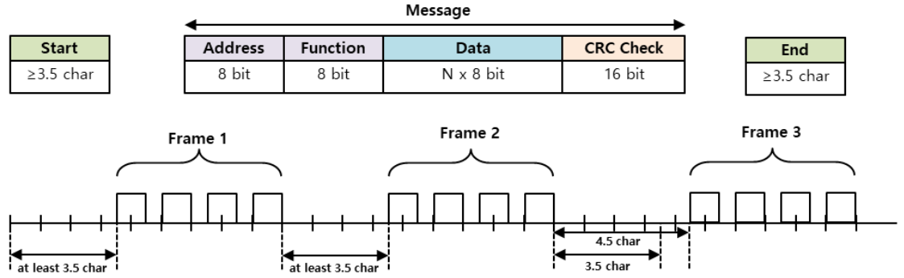

# 17Lf Series ModbusRTU Manual
## 1 개요
MODBUS 프로토콜은 산업용 프로토콜로 PLC통신 등에 주로 사용되는 표준이 되는 프로토콜입니다.
주로 사용하는 방식은 RTU방식과 ASCII방식이 주로 사용되고, 요즘에는 TCP방식도 나와있습니다.

1979년부터 업계의 사실상 직렬 표준인 MODBUS는 수 백만 개의 자동화 장치가 지속적으로 통신할 수 있도록 지원하고 있습니다. 
MODBUS는 요청/응답 프로토콜이며 기능 코드별로 지정된 서비스를 제공합니다. 프레임의 구성은 Application Data Unit인 ADU와 Protocol Data Unit인 PDU로 구성되어 있습니다.

## 2 프레임 구조
### 2.1 Packet Discription
mightyZAP은 MODBUS-RTU 프로토콜 내용을 준수합니다.  
본 매뉴얼에 나오지 않은 사항들은 아래의 관련 표준 문서를 참조하여 주시기 바랍니다.  
#### 2.1.1 Packet Structure
MODBUS-RTU 프로토콜의 최대 송수신 패킷 길이는 256 Byte 입니다. 따라서 송수신 패킷의 총 길이가 256Byte 를 넘기지 않도록 주의하여 주십시오.  
MODBUS-RTU 통신 Mode 는 Packet 을 구분하기 위해서 아래 그림과 같이 시작과 끝 사이에 최소 3.5 Char 이상의 이 필요합니다.  

- 송신 패킷 구조

|      | Address      | Fucntion code | Data | <                  | <                  | Error Check | <        |
| ---- | ------------ | ------------- | ---- | ------------------ | ------------------ | ----------- | -------- |
| byte | 0            | 1             | 2    | 
…
 | 
…
 | n-1         | n        |
| 내용   | mightyZAP ID | Function      | Data | 
…
 | 
…
 | CRC(MSB)    | CRC(LSB) |

- 수신 패킷 구조  - 정상 응답

|      | Address      | Fucntion code | Data | <                  | <                  | Error Check | <        |
| ---- | ------------ | ------------- | ---- | ------------------ | ------------------ | ----------- | -------- |
| byte | 0            | 1             | 2    | 
…
 | 
…
 | n-1         | n        |
| 내용   | mightyZAP ID | Function      | Data | 
…
 | 
…
 | CRC(MSB)    | CRC(LSB) |

- 수신 패킷 구조  - 비 정상 응답

|      | Address      | Fucntion code        | Data           | Error Check | <        |
| ---- | ------------ | -------------------- | -------------- | ----------- | -------- |
| byte | 0            | 1                    | 2              | 3           | 4        |
| 내용   | mightyZAP ID | Function   + 0x80 | Exception code | CRC(MSB)    | CRC(LSB) |
#### 2.1.2 Packet Element 설명
##### 2.1.2.1 Start
-  서로 다른 Frame 간의 구별을 위한 최소한의 시간을 의미합니다.
- 통신 속도 57600bps에서 1bit의 전송 시간은 0.017msec이고, Start time이  3.5 character time(1 character = 8bit)임으로 최소 start time은 0.486msec 입니다.
- Start time 이내의 다른 frame 이 전송되면, 이전  frame 의 연속된 데이터로 인식 합니다.
##### 2.1.2.2 Address
- mightyZAP의 ID로 다중 연결 방식으로 Daisy Chain 연결 지원을  위한 식별자 입니다.  
- ID가 '0'일 경우 Broadcasting ID로 동작합니다.  
##### 2.1.2.3 Function Code
- mightyZAP에서 지원하는 Modbus-RTU  표준 Function code는 다음과 같습니다. 

| Function                | Code | Description                           |
| ----------------------- | ---- | ------------------------------------- |
| Read Holding Register   | 0x03 | mightyZAP의 Data를 읽어오기                 |
| Write Single Register   | 0x06 | mightyZAP의 특정 주소에 Data값을 Setting  하기  |
| Write Multiple Register | 0x10 | mightyZAP의 연속된 주소에 Data값을 Setting  하기 |

##### 2.1.2.4 Data
<b>송신</b>
- Read Register 명령의 경우 Modbus 주소, 레지스터 개수, Byte 개수 등을 지정하게 되며, Write Register 명령의 경우 Modbus 주소, Byte 개수, 설정 할 값 등을 지정하게 됩니다.   
<b>수신</b>
- Read Register 명령의 경우, 정상 응답은 Node ID 와 Function Code 가 송신 때와 동일한 값으로 수신 되며, Data 는 송신 때 보낸 Register 순서에 따라 각 Register 의 값이 수신 됩니다.
- Write Single Register 명령의 경우, 송신 때와 동일한 데이터가 수신됩니다. Write Multi  Register 의 경우에는 Write Multi Register 명령으로 데이터를 쓰고자 한 Register 의 시작 주소와 Register 개수가 수신됩니다.
- 이상응답의 경우에는 Node ID, Error Code, Exception Code 로 구성되며, 이상응답의 패킷 구조는 Function Code 와 관계없이 모두 동일합니다.

##### 2.1.2.5 CRC
- 16 비트 CRC 값을 입력하며 2 byte로 구성됩니다.
- 전송 순서는 하위 1byte, 상위 1byte순 입니다.
- CRC Check Method 는 CRC-16(X^16 + X^15+X^2+1) 입니다
  인터넷에서 CRC-16 Modbus 계산기를 검색하시어 사용하시면 쉽게 계산 값을 얻을 수 있습니다.
##### 2.1.2.6 Exception Code
- mightyZAP에서 지원하는 모든 Function Code 의 이상 응답에 대한 Exception Code 는 아래와 같이 정의되어 있습니다.

| Exception Code |  | Description |
| ---- | ---- | ---- |
| 0x01 | Illegal Function | 지원하지 않는 Function Code |
| 0x02 | Illegal Data Address | 잘못된 레지스터 주소 |
| 0x03 | Illegal Data Value | 잘못된 데이터 값 |
| 0x04 | Slave Device Failure | 장치 고장, 파라미터 설정값 이상(ready) |
| 0x05 | Acknowledge | 데이터가 준비되지 않은 상태(ready) |
| 0x06 | Slave Device Busy | 파라미터 잠금 상태 |

### 2.2 프로토콜 Function Code 설명
#### 2.2.1 Read Holding Register (0x03)
단일 레지스터(16bit 데이터) 및 연속된 레지스터 블록(16bit 데이터 단위)의 값을 읽습니다.
##### 2.2.1.1 Packet Description
<b>Request Frame</b>

|            | Address | Fucntion code | Starting Address | Quantity of Register |  CRC   |
| ---------- | :-----: | :-----------: | :--------------: | :------------------: | :----: |
| Size(byte) | 1 byte  |    1 byte     |      2 byte      |        2 byte        | 2 byte |
| Data       |         |     0x03      | 0x0000 to 0xffff |    1 to 125(0x7d)    |        |

<b>Request OK</b>

|            | Address | Fucntion code | Byte Count | Register Value |  CRC   |
| ---------- | :-----: | :-----------: | :--------: | :------------: | :----: |
| Size(byte) | 1 byte  |    1 byte     |   1 byte   |  N* x 2 bytes  | 2 byte |
| Data       |         |     0x03      |   2 x N*   |                |        |

*N = Quantity of Registers

<b>Request not OK</b>

|            | Address | Error code | Exception Code |  CRC   |
| ---------- | :-----: | :--------: | :------------: | :----: |
| Size(byte) | 1 byte  |   1 byte   |     1 byte     | 2 byte |
| Data       |         |    0x83    |  0x01 to 0x06  |        |
##### 2.2.1.2 frame detail
- **Address**  
  데이터를 읽고 자 하는  mightyZAP의 ID를 의미 합니다.
- **Function Code** 
  Read Holding Register 명령의 의미하는 code 0x03
- **Starting Address** 
  읽고자 하는 데이터의 시작 주소를 의미하며 2 byte로 구성됩니다.
- **Quantity of Register** 
  읽고자 하는 데이터의 크기를 의미하며 2 byte로 구성됩니다.
- **CRC** 
  CRC 에러 체크 방법을 이용하며 2 byte로 구성됩니다.
- **Byte Count** 
  응답하는 데이터의 수를 의미 합니다.
- **Register Value** 
  요청 프레임의 Address를 시작 주소로 하여 바이트 단위로 데이터를 송신합니다. 이때 데이터는 워드 타입이므로 바이트 수에 2배를 해준 크기와 동일합니다.
- **Error code** 
  Error code는  Function Code 에 80(Hex)값을 더하여 표현되며 Read Holding register의 경우 83(Hex)으로 전송됩니다.
- **Exception code** 
  상세 에러 내역을 의미하며 1바이트로 구성됩니다.
##### 2.2.1.3 Example
<b>Example</b> #1 - Read Present Position (0xD2)
- Request 

| Address | Fucntion  code | Starting  Address Hi | Starting  Address Lo | Quantity of Register Hi | Quantity of Register Lo | CRC Lo | CRC hi |
| :-----: | :---------------: | :---------------------: | :---------------------: | :---------------------: | :---------------------: | :----: | :----: |
|  0x01   |       0x03        |          0x00           |          0xD2           |          0x00           |          0x01           |  0x24  |  0x33  |
- Request OK -Present Position Data :1000

| Address | Fucntion  code | Byte  Count | Register  value Hi | Register  value Lo | CRC  Lo | CRC  hi |
| :-----: | :---------------: | :------------: | :-------------------: | :-------------------: | :--------: | :--------: |
|  0x01   |       0x03        |      0x02      |         0x03          |         0xe8          |    0xB8    |    0xFA    |
 - Request Not OK 
 
| Address | Error  code | Exception  Code | CRC  Lo | CRC  hi |
| :-----: | :------------: | :----------------: | :--------: | :--------: |
|  0x01   |      0x83      |        0x04        | CRC  Lo | CRC  hi |

<b>Example</b> #2 - Read Present Current (0xD3)
- Request

| Address | Fucntion  code | Starting  Address Hi | Starting  Address Lo | Quantity of Register Hi | Quantity of Register Lo | CRC Lo | CRC hi |
| :-----: | :---------------: | :---------------------: | :---------------------: | :---------------------: | :---------------------: | :----: | :----: |
|  0x01   |       0x03        |          0x00           |          0xD3           |          0x00           |          0x01           |  0x75  |  0xf3  |
- Request OK -Present Current Data : 426

| Address | Fucntion  code | Byte  Count | Register  value Hi | Register  value Lo | CRC  Lo | CRC  hi |
| :-----: | :---------------: | :------------: | :-------------------: | :-------------------: | :--------: | :--------: |
|  0x01   |       0x03        |      0x02      |         0x01          |         0xAA          |    0x39    |    0xAB    |
 - Request Not OK 

| Address | Error  code | Exception  Code | CRC  Lo | CRC  hi |
| :-----: | :------------: | :----------------: | :--------: | :--------: |
|  0x01   |      0x83      |        0x04        |    0x40    |    0xF3    |
#### 2.2.2 Write Single Register
단일레지스터(16bit 데이터)에 값을 씁니다.  
##### 2.2.2.1 Packet Description
<b>Request</b>  

|            | Address | Fucntion code | Register Addresse |  Register Value  |  CRC   |
| ---------- | :-----: | :-----------: | :---------------: | :--------------: | :----: |
| Size(byte) | 1 byte  |    1 byte     |      2 byte       |      2 byte      | 2 byte |
| Data       |         |     0x06      | 0x0000 to 0xffff  | 0x0000 to 0xffff |        |

<b>Request OK</b>  

|            | Address | Fucntion code | Register Addresse |  Register Value  |  CRC   |
| ---------- | :-----: | :-----------: | :---------------: | :--------------: | :----: |
| Size(byte) | 1 byte  |    1 byte     |      2 byte       |      2 byte      | 2 byte |
| Data       |         |     0x06      | 0x0000 to 0xffff  | 0x0000 to 0xffff |        |

*N = Quantity of Registers

<b>Request not OK</b>  

|            | Address | Error code | Exception Code |  CRC   |
| ---------- | :-----: | :--------: | :------------: | :----: |
| Size(byte) | 1 byte  |   1 byte   |     1 byte     | 2 byte |
| Data       |         |    0x86    |  0x01 to 0x06  |        |
##### 2.2.1.2 frame detail
- **Address** 
  데이터를 쓰려고하는  mightyZAP의 ID를 의미 합니다.
- **Function Code** 
  Write Single Register 명령의 의미하는 code 0x06
- **Register Addresse** 
  쓰기 원하는 데이터의 주소를 의미하며 2 byte로 구성됩니다.
- **Register Value** 
  쓰기 원하는 데이터의 값으로 2 byte로 구성됩니다.
- **CRC** 
  CRC 에러 체크 방법을 이용하며 2 byte로 구성됩니다.
- **Error code** 
  Error code는  Function Code 에 80(Hex)값을 더하여 표현되며 Read Holding register의 경우 83(Hex)으로 전송됩니다.
- **Exception code** 
  상세 에러 내역을 의미하며 1바이트로 구성됩니다.
##### 2.2.2.2 Example
<b>Example</b> #1 - Write Goal Position (0xCD)
- Request - Goal Position Data : 1000

| Address | Fucntion  code | Register Address Hi | Register  Address Lo | Register Value Hi | Register Value Lo | CRC Lo | CRC hi |
| :-----: | :---------------: | :--------------------: | :---------------------: | :---------------: | :---------------: | :----: | :----: |
|  0x01   |       0x06        |          0x00          |          0xCD           |       0x03        |       0xE8        |  0x18  |  0x8B  |
- Request OK 

| Address | Fucntion  code | Register Address Hi | Register  Address Lo | Register Value Hi | Register Value Lo | CRC Lo | CRC hi |
| :-----: | :---------------: | :--------------------: | :---------------------: | :---------------: | :---------------: | :----: | :----: |
|  0x01   |       0x06        |          0x00          |          0xCD           |       0x03        |       0xE8        |  0x18  |  0x8B  |
 - Request Not OK

| Address | Error  code | Exception  Code | CRC  Lo | CRC  hi |
| :-----: | :------------: | :----------------: | :--------: | :--------: |
|  0x01   |      0x86      |        0x04        | CRC  Lo | CRC  hi |
<b>Example</b> #2 - Write Goal Current (0xD3)
- Request - Goal Current Data : 800

| Address | Fucntion  code | Register Address Hi | Register  Address Lo | Register Value Hi | Register Value Lo | CRC Lo | CRC hi |
| :-----: | :---------------: | :--------------------: | :---------------------: | :---------------: | :---------------: | :----: | :----: |
|  0x01   |       0x06        |          0x00          |          0xD1           |       0x03        |       0x20        |  0xD8  |  0xDB  |
- Request OK 

| Address | Fucntion  code | Starting  Address Hi | Starting  Address Lo | Quantity of Register Hi | Quantity of Register Lo | CRC Lo | CRC hi |
| :-----: | :---------------: | :---------------------: | :---------------------: | :---------------------: | :---------------------: | :----: | :----: |
|  0x01   |       0x06        |          0x00           |          0xD1           |          0x03           |          0x20           |  0xD8  |  0xDB  |

- Request Not OK

| Address | Error  code | Exception  Code | CRC  Lo | CRC  hi |
| :-----: | :------------: | :----------------: | :--------: | :--------: |
|  0x01   |      0x86      |        0x04        |    0x40    |    0xF3    |
#### 2.2.3 Write Multi Register(0x10)
연속된 레지스터 블록(16bit 데이터 단위)에 값을 씁니다.  
##### 2.2.3.1 Packet Description
<b>Request</b>  

|            | Address | Fucntion code | Starting Address |    Quantity of Register    | Byte Count | Registers Value |  CRC   |
| ---------- | :-----: | :-----------: | :--------------: | :------------------------: | ---------- | --------------- | :----: |
| Size(byte) | 1 byte  |    1 byte     |     2 bytes      |          2 bytes           | 1Byte      | N* x 2 Bytes    | 2 byte |
| Data       |         |     0x10      | 0x0000 to 0xffff | 0x0000 to 1 to 0x007B(123) | 2 x N*     | value           |        |

<b>Request OK</b>  

|            | Address | Fucntion code | Starting Address |    Quantity of Register    |  CRC   |
| ---------- | :-----: | :-----------: | :--------------: | :------------------------: | :----: |
| Size(byte) | 1 byte  |    1 byte     |     2 bytes      |          2 bytes           | 2 byte |
| Data       |         |     0x10      | 0x0000 to 0xffff | 0x0000 to 1 to 0x007B(123) |        |

*N = Quantity of Registers

<b>Request not OK</b>  

|            | Address | Error code | Exception Code |  CRC   |
| ---------- | :-----: | :--------: | :------------: | :----: |
| Size(byte) | 1 byte  |   1 byte   |     1 byte     | 2 byte |
| Data       |         |    0x90    |  0x01 to 0x06  |        |
##### 2.2.3.2 frame detail
- **Address** 
  데이터를 쓰려고하는  mightyZAP의 ID를 의미 합니다.
- **Function Code** 
  Write Multi Register 명령의 의미하는 code 0x10
- **Start Addresse** 
  연속해서 쓰기 원하는 데이터의 시작 주소를 의미하며 2 byte로 구성됩니다.
- **Quantity of Register** 
  쓰기  원하는 데이터의 크기를 의미하며 2 byte로 구성됩니다.
- **Byte Count** 
  연속해서 쓰기 원하는 데이터의 수를 의미 합니다.
- **Registers Value** 
  쓰기 원하는 데이터의 값으로 2 byte를 한 세트로 구성됩니다. Byte Count에 입력 한 수 만큼의 데이터 세트를 추가해야 합니다
- **CRC** 
  CRC 에러 체크 방법을 이용하며 2 byte로 구성됩니다.
- **Error code** 
  Error code는  Function Code 에 80(Hex)값을 더하여 표현되며 Read Holding register의 경우 0x90으로 전송됩니다.
- **Exception code** 
  상세 에러 내역을 의미하며 1바이트로 구성됩니다.
##### 2.2.3.3 Example
<b>Example</b> #1 - Multi Write Goal Speed(0xD0) & Goal Current (0xD1)
- Request - Goal Speed Data : 1000, Goal Current Data : 800

| Address | Fucntion  code | Starting Address Hi | Starting  Address Lo | Quatity of Register Hi | Quatity of Register Lo | Byte Count | Register Value Hi | Register Value Lo | Register Value Hi | Register Value Lo | CRC Lo | CRC hi |
| :-----: | :---------------: | :--------------------: | :---------------------: | :--------------------: | :--------------------: | ------------- | -------------------- | -------------------- | -------------------- | -------------------- | :----: | :----: |
|  0x01   |       0x10        |          0x00          |          0xD0           |          0x00          |          0x02          | 0x04          | 0x03                 | 0xE8                 | 0x03                 | 0x20                 |  0x7F  |  0xAB  |
- Request OK 

| Address | Fucntion  code | Starting Address Hi | Starting  Address Lo | Quatity of Register Hi | Quatity of Register Lo | CRC Lo | CRC hi |
| :-----: | :---------------: | :--------------------: | :---------------------: | :--------------------: | :--------------------: | :----: | :----: |
|  0x01   |       0x10        |          0x00          |          0xD0           |          0x00          |          0x02          |  0x40  |  0x31  |
 
- Request Not OK

| Address | Error  code | Exception  Code | CRC  Lo | CRC  hi |
| :-----: | :------------: | :----------------: | :--------: | :--------: |
|  0x01   |      0x83      |        0x04        |    0x40    |    0xF3    |
## 3. Packet Test

