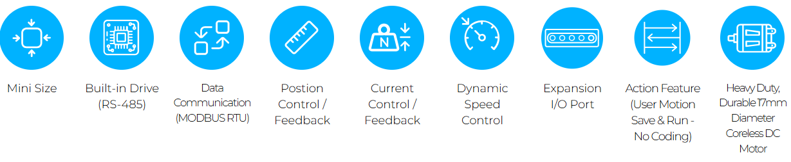
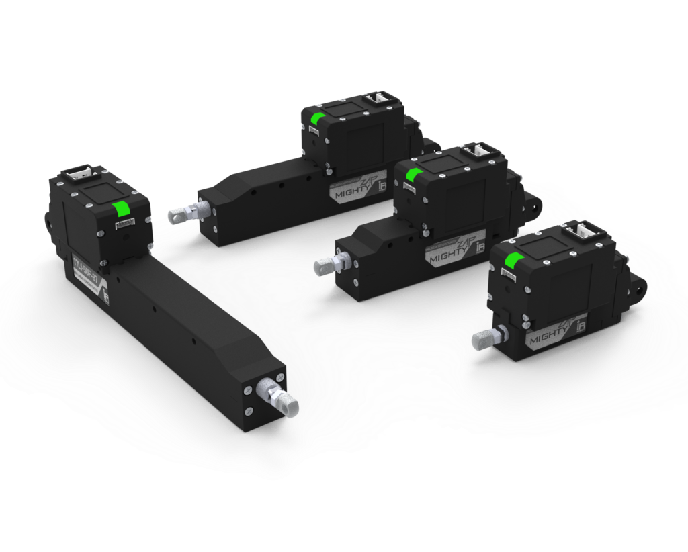

# Overview
- 17mm 직경의 모터를 적용하여, 기존 제품 대비 내구성이 개선되었고, 동일 정격부하 사양에서 더 빠른 속도를 제공하는 서보 신제품군.
- 모든 기능은 12Lf 시리즈와 동일하나, RS-485통신, MODBUS RTU 프로토콜만 제공하며 확장 I/O포트를 장착하여 사용자 확장성 개선.

## Features
- 드라이브 회로, 위치인식 센서, 17mm 직경의 coreless 모터, 기어박스 일체형
- 17mm 직경의 DC 모터 채용으로 12Lf 시리즈의 동급 정격부하 모델 대비 더 빠른 속도 및 더욱 우수한 내구성 제공
- 위치제어/위치피드백 기능 뿐만이 아니라, 다이나믹한 Current와 Speed 컨트롤이 가능한 새로운 제품군
- 4개의 확장 I/O 포트를 통한 코딩없는 간편한 디지털 I/O제어 가능
- Action기능을 통해 사용자 모션을 손쉽게 저장, 확장 I/O를 통해 실행 
- 27/37/50/87mm(*) stroke 옵션
    – (*): Total Manager software를 통해 Long stroke limit 설정시의 각 3mm 스트로크 추가 가능
- 각 스트로크별로 리드각에 따라 17N~70N의 정격 부하 구현
    – speed는 정격부하와 반비례하여, 정격부하가 높을수록 speed는 느려집니다.
- RS-485 MODBUS-RTU 지원 (IR open 프로토콜 미지원)

