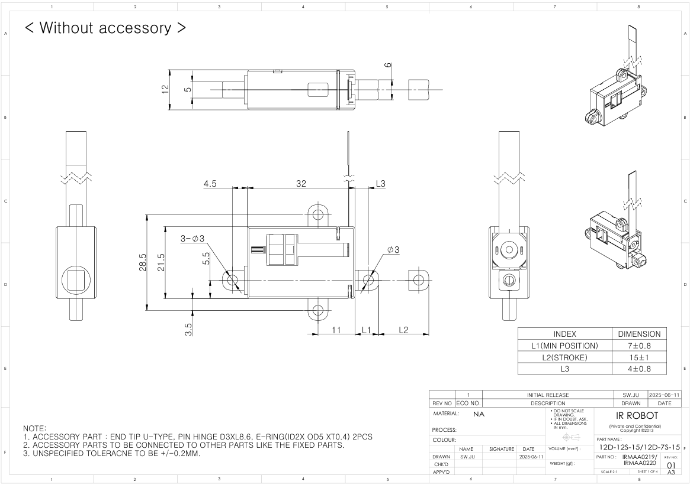
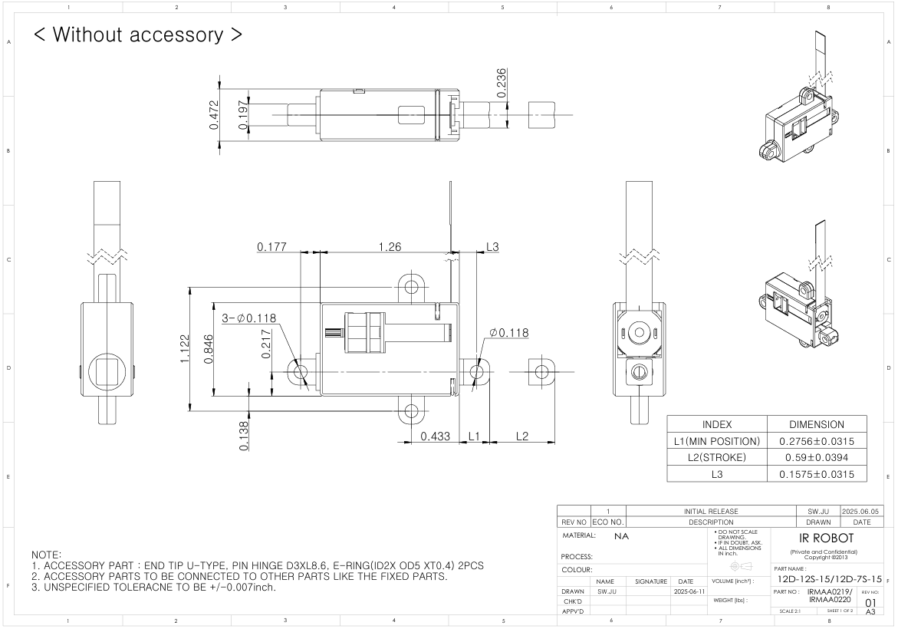

# 12D Nano Limit Switch Drawings
## # 12D Nano Limit Switch Uint : mm
  
**Download** <a href="./data/ENG-ver_IRMAA02190220-12D-12S7S-15_mm_Rev01_20250605.pdf" download>PDF</a> <a href="./data/IRMAA02190220_without-Accessory_12D-12S7S-15_Rev01_20250605.step" download>STEP</a> <a href="./data/IRMAA02190220-12D-12S7S-15_mm_Rev01_20250605.DXF" download>DXF</a>
## # 12D Nano Limit Switch : Inch
  
**Download** <a href="./data/ENG-ver_IRMAA02190220-12D-12S7S-15_inch_Rev01_20250605.pdf" download>PDF</a> <a href="./data/IRMAA02190220_with-Accessory_12D-12S7S-15_Rev01_20250605.step" download>STEP</a> <a href="./data/ENG-ver_IRMAA02190220-12D-12S7S-15_inch_Rev01_20250605.DXF" download>DXF</a>
