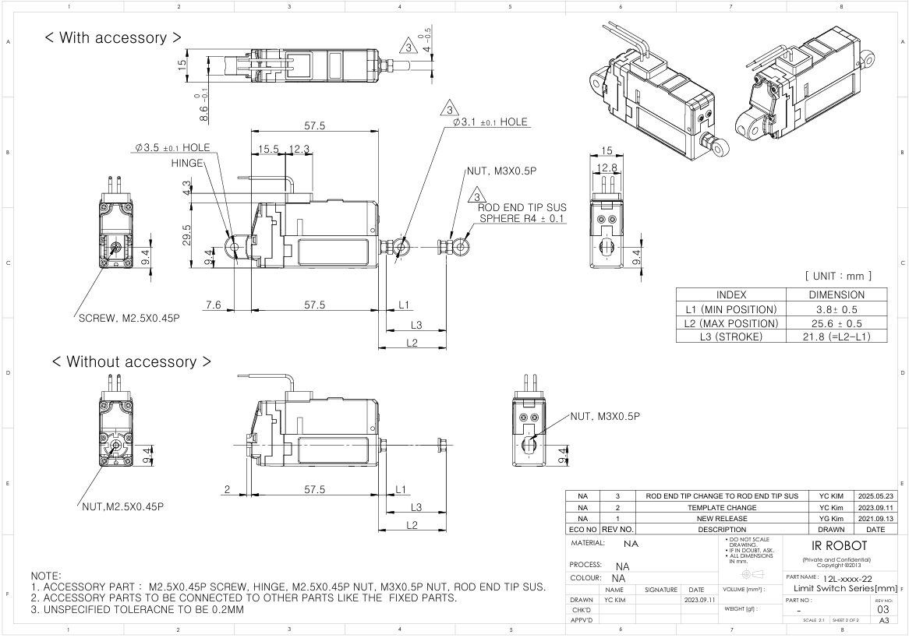
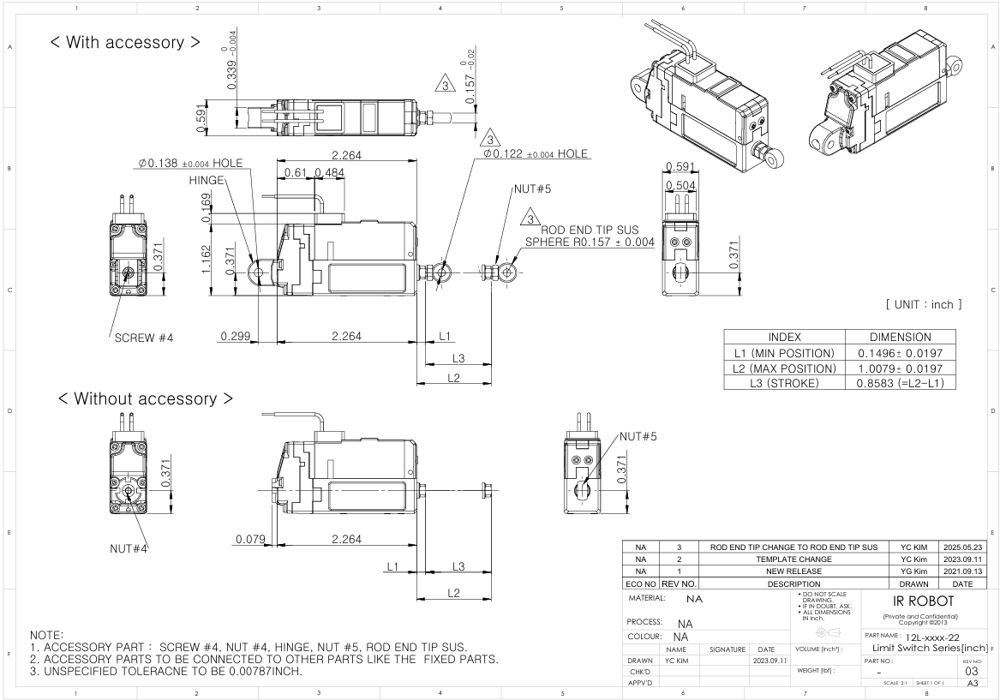

# 12L Limit Switch Drawings
## # 12L Limit Switch Uint : mm
  
**Download** <a href="./data/ENG-ver_12L-xxxx-22-Limit-Swich-Series_mm_Rev03_20250523.pdf" download>PDF</a> <a href="./data/12L-xxxx-22-Limit-Switch-Series_Rev03_20250523.step" download>STEP</a> <a href="./data/12L-xxxx-22-Limit-Switch-Seriesmm_Rev03_20250523.DXF" download>DXF</a>
## # 12L Limit Switch : Inch
  
**Download** <a href="./data/ENG-ver_12L-xxxx-22-Limit-Swich-Series_inch_Rev03_20250523.pdf" download>PDF</a> <a href="./data/12L-xxxx-22-Limit-Switch-Series_Rev03_20250523.step" download>STEP</a> <a href="./data/12L-xxxx-22-Limit-Switch-Seriesinch_Rev03_20250523.DXF" download>DXF</a>
