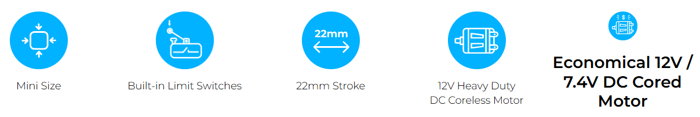

# 12L / 12D MINI Limit Switch Series
## Overview
통신제어 없이 내장 리미트 스위치를 통해 간단한 2점 위치 제어가 가능한 심플한 리미트 스위치 제품군

## Features
- 내장된 위치인식 센서가 아닌 리미트 스위치를 장착하여 두 지점간 위치를 왕복하는 제품
- 회로, 리미트 스위치, DC 모터, 기어박스, 리드스크류, 로드 등이 집적된 Compact한 사이즈
- 포지션 컨트롤 및 포스 컨트롤 제품 대비 저렴한 가격
- 쉽고 간단한 설치로 바로 동작 가능(통신제어 불필요)
- 12mm 직경의 12V Coreless Motor 라인업과 12V/7.4V Cored Motor 라인업
- 22mm stroke (더 긴 스트로크 제품은 추후 출시 예정)
- 기어비에 따라 12~100N의 정격부하 구현
- 외부 스위치를 추가하여 22mm 내에서 자유롭게 길이를 조절할 수 있음