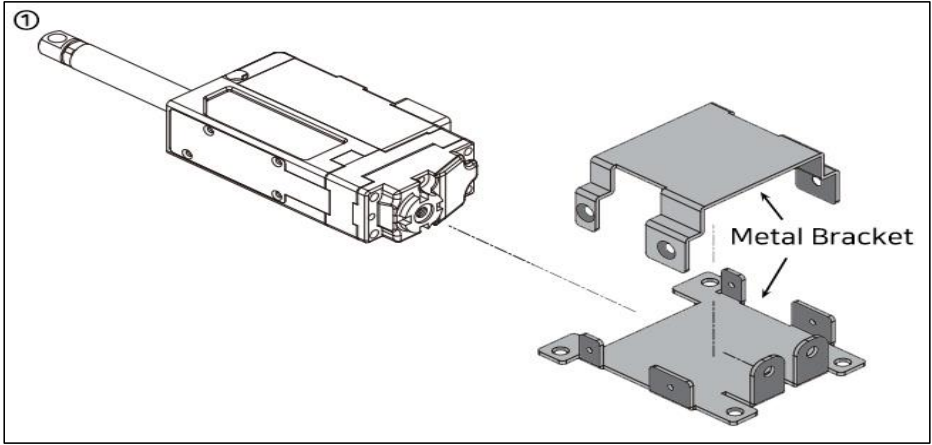
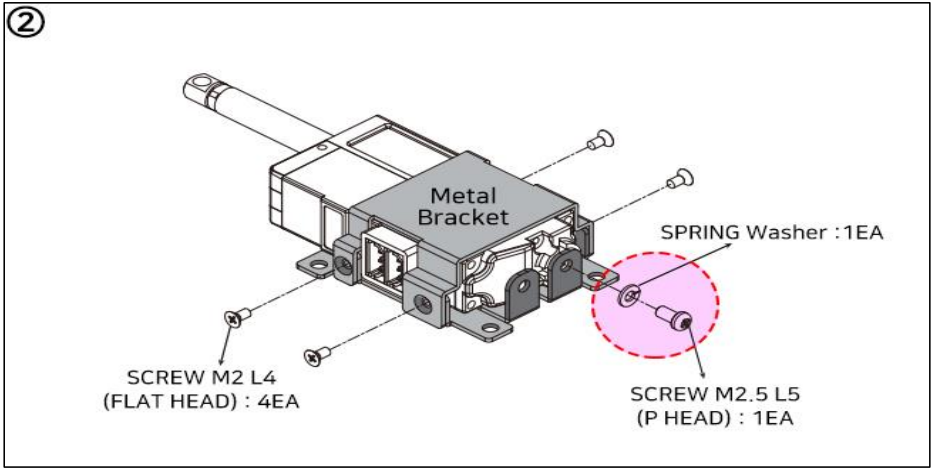
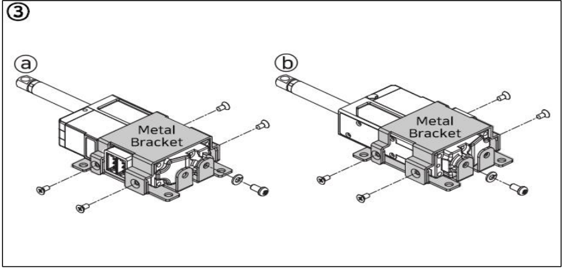
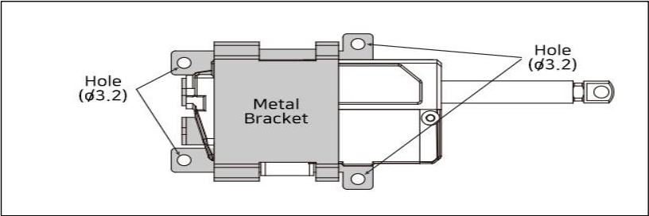

# IR-MB02 Assemble
## Using Lateral Mounting Metal Barcket(IR-MB02) (IR-MB02 which is dedicated for 26mm, 27mm stroke version Lateral mounting)
This is the most common method to mount mightyZAP. 
Fix mightyZAP using dedicated metal bracket IR-MB02.
1) **Separate the metal brackets from the top and bottom as shown in the figure below.** mightyZAP can be mounted by IR-MB02 without directivity.
   
2) **Make sure to put spring washer before M2.5 L5 screw is applied.**
   (See Red circle on image ② below.) Otherwise, it may damage the servo motor inside. Tighten the metal bracket with 4pcs of M2 L2 screw.
   
3) **mightyZAP can be mounted by IR-MB02 without directivity.**
   See Installation method ⓐ and ⓑ below. 

4) **Mounting assembled metal brackets** 
   Apply M3 screws to 4 x M3 mounting holes. (M3 screws are not included.)
