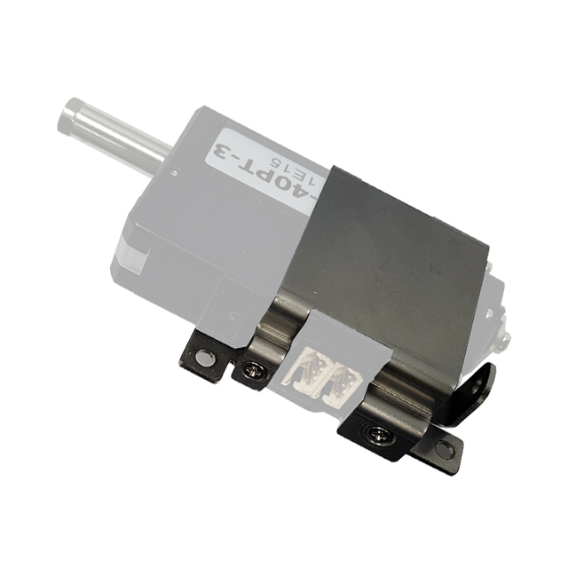

# IR-MB02 Drawing
## [IR-MB02] Metal Bracket 3D / 2D Drawings (26, 27mm Stroke only) - Lateral mounting

3D and 2D drawings for New metal bracket, IR-MB02.
The IR-MB02 is for 22mm, 26mm, 27mm stroke actuators of 12Lf, L12, D12, D7, 12L, 12D series, **Lateral mounting**.
### Note: Product Compatibility by Bracket Model
- IR-MB02: Lateral mounting bracket for 22mm, 26mm, 27mm stroke actuators of 12Lf, L12, D12, D7, 12L, 12D series
- IR-MB03: ​​Dedicated bracket for 40~96mm stroke actuators of 12Lf, L12 series
- IR-MB04: Vertical mounting bracket for 22mm, 26mm, 27mm stroke actuators of 12Lf, L12, D12, D7, 12L, 12D series
- IR-MB05: Lateral mounting bracket for 27mm stroke actuators of 17Lf series
- IR-MB06: Vertical mounting bracket for 27mm stroke actuators of 17Lf series
- IR-MB07: Dedicated bracket for 37, 50, 87mm stroke actuators of 17Lf series
## Drawing File : mm - data 없음

Download** : <a class="downloadbtn" href="./data/MB02.step" download> STEP </a>  <a  class="downloadbtn" href="./data/MB02.DXF" download> DXF </a>   

## Drawing File Uint : Inch