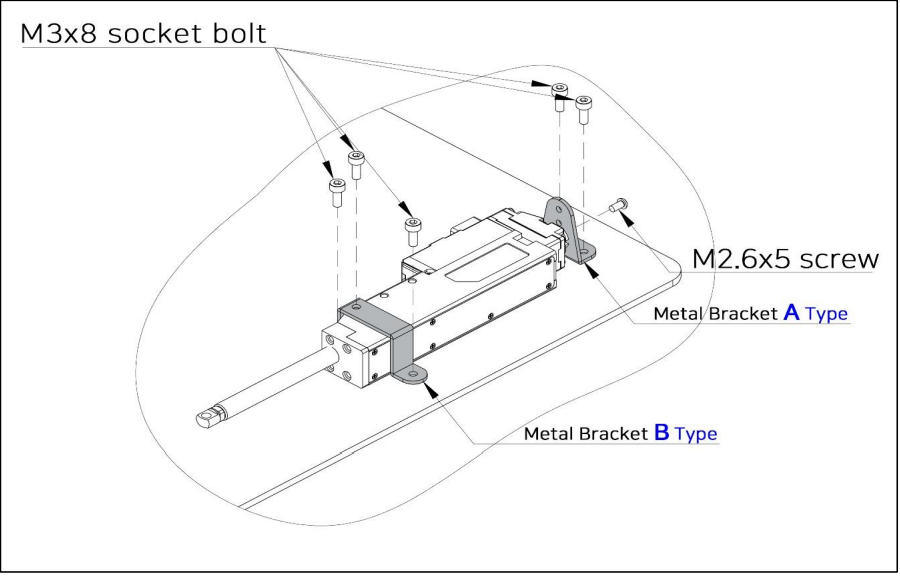
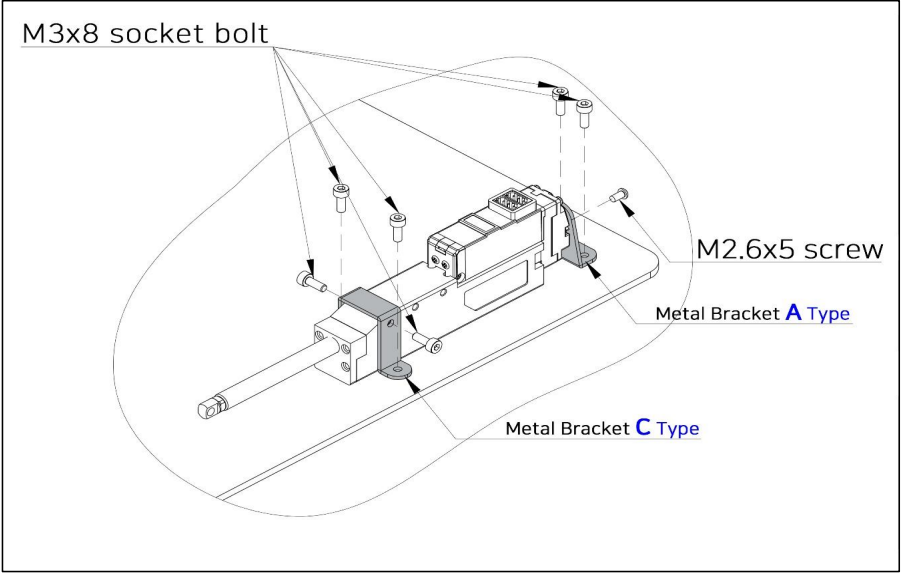

## Metal Barcket (IR-MB03 which is dedicated for 40mm ~ 96mm Stroke Version)

- Mount mightyZAP laterally or longitudinally using the M3 bolt as shown in Figure Method 1) and Method 2). 
- If necessory, bracket A, B, C can be purchased individually.

1) **Lateral Mounting**

2) **Longitudinal Mounting**
