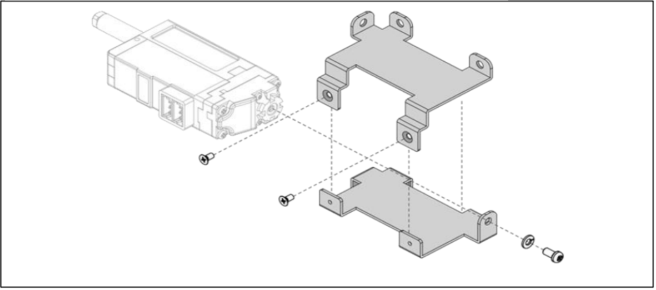
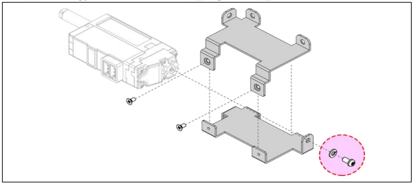
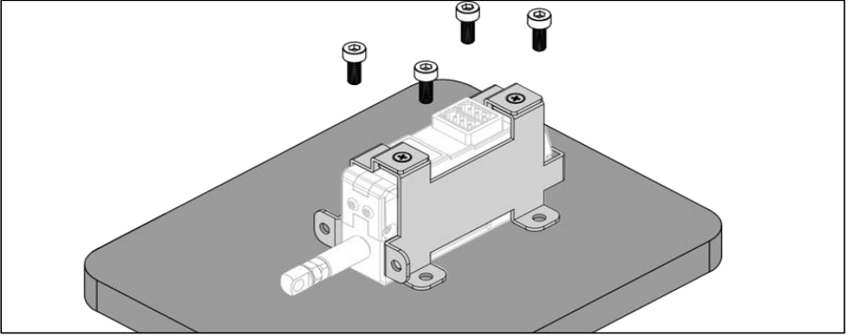
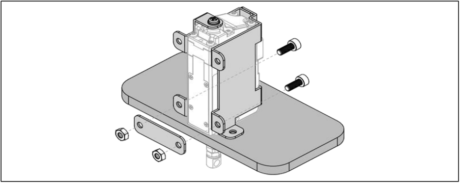
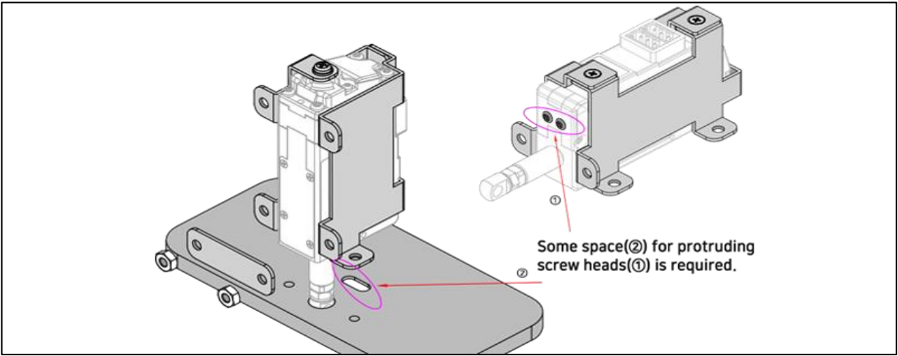

# IR-MB04 Assemble
## Using Vertical Mounting Metal Barcket(IR-MB04) (IR-MB04 which is dedicated for 26mm, 27mm stroke version Vertical mounting)

1. **Separate the metal brackets from the top and bottom as shown in the figure below.**
   As shown in the figure below, pay attention to the direction of the actuator for proper mounting.

2. **Make sure to put spring washer before M2.5 L5 screw is applied.**
   (See Red circle on image below.) Otherwise, it may damage the servo motor inside.
   Then, tighten the metal brackets with 2pcs of M2 L4 screw.

3. **Mounting assembled metal brackets** 
	1) Bottom Side Mounting

	2) Front Side Mounting

4. **CAUTIONS**
   For front mounting, some space(②) for protruding screw heads(①) is required.
