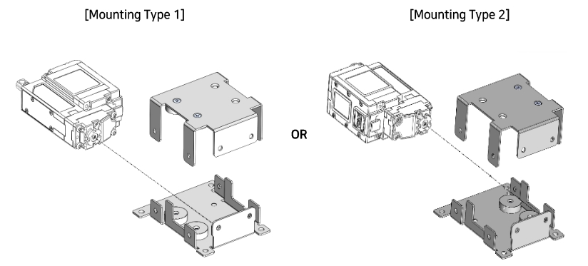
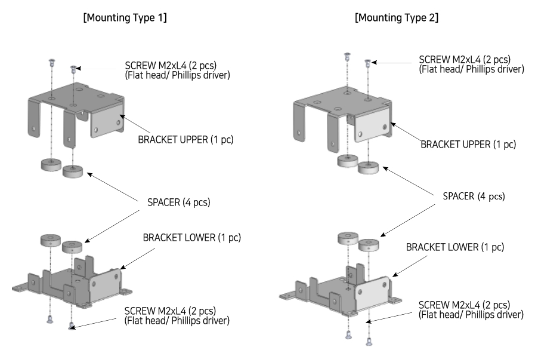
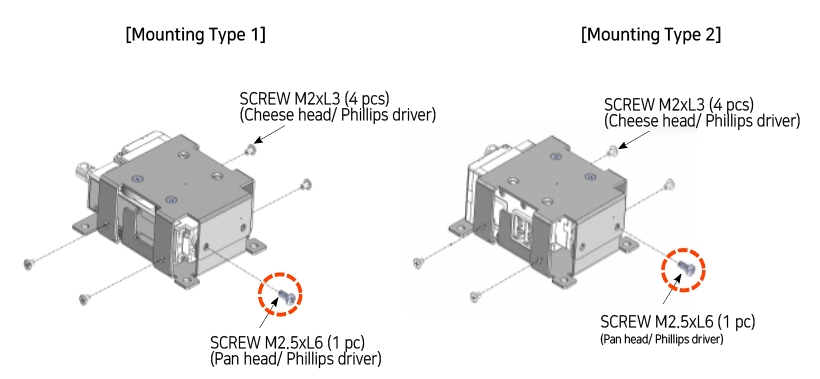

## Using Metal Barcket(IR-MB05)

- The IR-MB05 metal bracket dedicated to the 17Lf 27mm stroke series allows the servo actuator to be mounted horizontally without any directional restrictions.
- For Lateral Mounting
- Not applicable to models other than 17Lf 27mm stroke series

**Choose preferred mounting direction, then follow the instruction**

- **Step. 1**

- **Step. 2**

- **Step. 3**

>[!warning] Caution
>When fastening the Screw M2.6xL6 indicated by the red circle in the image above, be sure to use the screw screw included in the bracket.
>(Pay attention to the length of screw)  Otherwise, it may result in damage to the product.