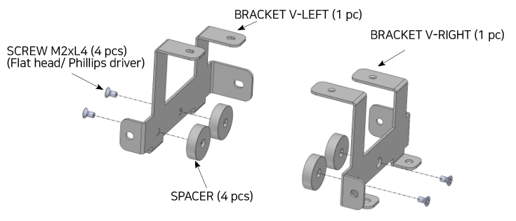
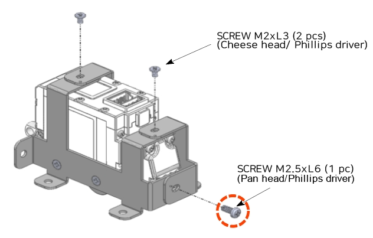
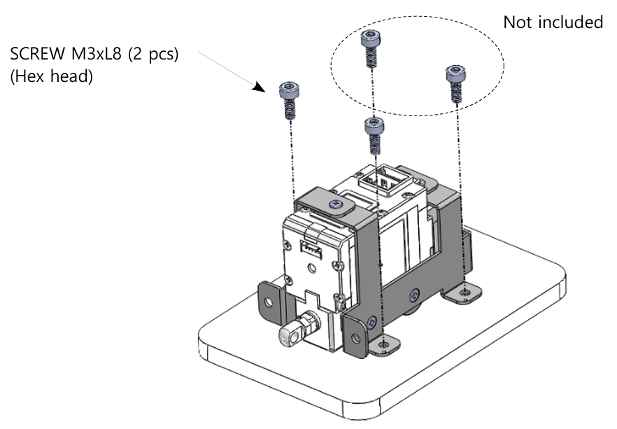
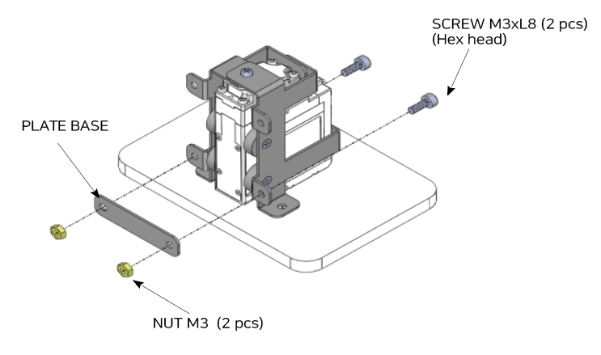

## Using Metal Barcket(IR-MB06)

The IR-MB06 metal bracket dedicated to the 17Lf 27mm stroke series allows the servo actuator to be mounted vertically.
- **For Vertical Mounting**
- **Not applicable to models other than 17Lf 27mm stroke series**

>[!warning] Caution
>The cutting-edges of the metal bracket (IR-MB06) may be sharp when assembling.
>Be sure to wear gloves to prevent injury.

**Step. 1 Assemble the spacers as shown below.**

**Step. 2 Fasten the screws as shown below.  Pay attention to the screw specifications.**

>[!warning] Caution
>When fastening the Screw M2.6xL6 indicated by the red circle in the image above, be sure to use the screw screw included in the bracket.
>(Pay attention to the length of screw)  Otherwise, it may result in damage to the product.

**Step. 3 Fasten the Hex Head screws as shown below.  Only 2 Hex Head screws are included.**

**Step. 4  Alternatively, mount the bracket as shown below using the included plate.**
