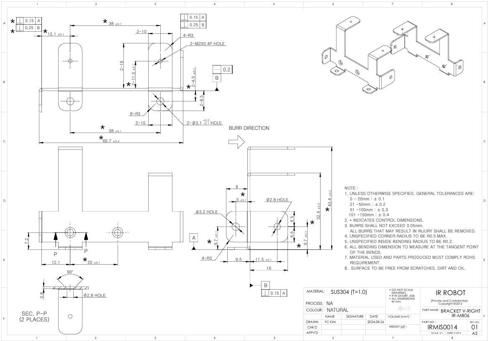

# IR-MB06 Drawing
## [IR-MB06] Metal bracket 3D / 2D drawings (for 17Lf series 27mm stroke only) - For VERTICAL mounting

Here are 3D(STEP)/2D(DXF) drawings for the metal bracket IR-MB06 which is dedicated for 17Lf series, 27mm stroke actuators' VERTICAL mounting.
  
**Note: Product Compatibility by Bracket Model**
- IR-MB02: Lateral mounting bracket for 22mm, 26mm, 27mm stroke actuators of 12Lf, L12, D12, D7, 12L, 12D series
- IR-MB03: ​​Dedicated bracket for 40~96mm stroke actuators of 12Lf, L12 series
- IR-MB04: Vertical mounting bracket for 22mm, 26mm, 27mm stroke actuators of 12Lf, L12, D12, D7, 12L, 12D series
- IR-MB05: Lateral mounting bracket for 27mm stroke actuators of 17Lf series
- IR-MB06: Vertical mounting bracket for 27mm stroke actuators of 17Lf series
- IR-MB07: Dedicated bracket for 37, 50, 87mm stroke actuators of 17Lf series
### MB-06 Drawing  Uint : mm
#### MB-06 V-LEFT

**Download** : <a class="downloadbtn" href="./data/ENG-IRMIS00013 BRACKET V-LEFT, IR-MB06_Rev01_20240826.pdf" download> PDF </a> / <a  class="downloadbtn" href="./data/ENG-IRMIS00013 BRACKET V-LEFT, IR-MB06_Rev01_20240826.DXF" download> DXF </a> / <a  class="downloadbtn" href="./data/IR-MB06_Rev01_20240826.step" download> STEP </a>

#### MB-06 V-RIGHT

**Download** : <a class="downloadbtn" href="./data/ENG-IRMIS00014 BRACKET V-RIGHT, IR-MB06_Rev01_20240826.pdf" download> PDF </a> / <a  class="downloadbtn" href="./data/ENG-IRMIS00014 BRACKET V-RIGHT, IR-MB06_Rev01_20240826.DXF" download> DXF </a> / <a  class="downloadbtn" href="./data/IR-MB06_Rev01_20240826.step" download> STEP </a>
#### MB-06 PLATE BTM

**Download** : <a class="downloadbtn" href="./data/ENG-IRMIS00015 PLATE BTM, IR-MB06_Rev01_20240826.pdf" download> PDF </a> / <a  class="downloadbtn" href="./data/ENG-IRMIS00015 PLATE BTM, IR-MB06_Rev01_20240826.DXF" download> DXF </a> / <a  class="downloadbtn" href="./data/IR-MB06_Rev01_20240826.step" download> STEP </a>

#### MB-06 SPACER

**Download** : <a class="downloadbtn" href="./data/ENG-IRMIT0115 SPACER OD13.4XH4, IR-MB05&06_Rev01_20240826.pdf" download> PDF </a> / <a  class="downloadbtn" href="./data/ENG-IRMIT0115 SPACER OD13.4XH4, IR-MB05&06_Rev01_20240826.DXF" download> DXF </a> / <a  class="downloadbtn" href="./data/IR-MB06_Rev01_20240826.step" download> STEP </a>

