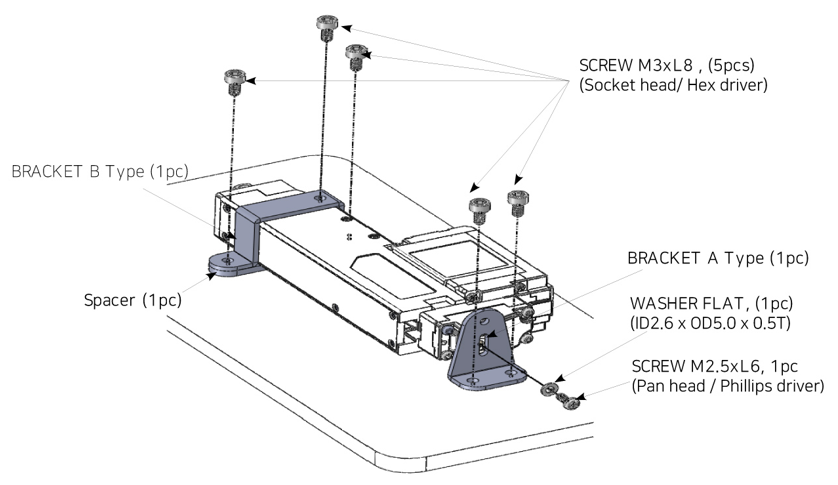
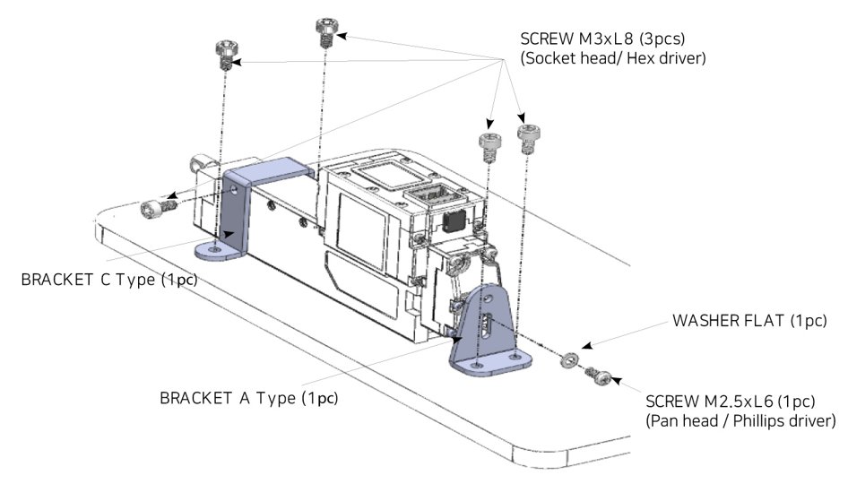

# IR-MB07 Assemble
## Using Metal Barcket(IR-MB07)

The IR-MB07 is a metal bracket exclusively designed for the 17Lf series 37mm to 87mm strokes actuators. Mount the servo actuator without any directional restrictions of the actuator.
- **For Horizontal Mounting and Vertical Mounting**
- **Not compatible with 17Lf 27mm stroke version**

>[!warning] Caution
>The cross-section of the metal bracket may be sharp when assembling.  Be sure to were protective gloves.
### Horizontal Mounting
 - Install the Bracket B Type by adding a spacer
 - When installing the Bracket A Type, be sure to use the included washer.

### Vertical Mounting
- Install the Bracket C Type without a spacer.
- When installing the Bracket A Type, be sure to use the included washer.

