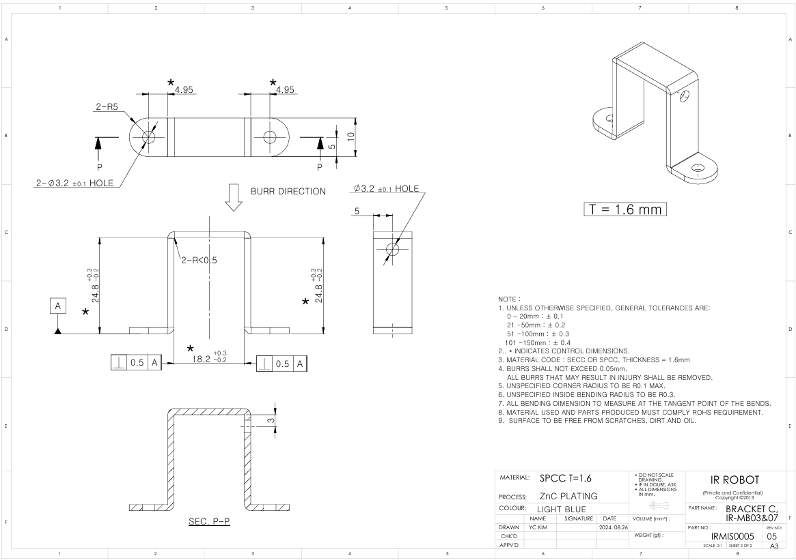

# IR-MB07 Drawing
## [IR-MB07] Metal bracket 3D / 2D drawings (for 17Lf series 37, 50, 87mm stroke only) - For Vertical mounting & Horizontal mounting

Here are 3D(STEP)/2D(PDF) drawings for the metal bracket IR-MB07 which is dedicated for 17Lf series, 37, 50, 87mm stroke actuators' VERTICAL mounting & Horizontal mounting
  
**Note: Product Compatibility by Bracket Model**
- IR-MB02: Lateral mounting bracket for 22mm, 26mm, 27mm stroke actuators of 12Lf, L12, D12, D7, 12L, 12D series
- IR-MB03: ​​Dedicated bracket for 40~96mm stroke actuators of 12Lf, L12 series
- IR-MB04: Vertical mounting bracket for 22mm, 26mm, 27mm stroke actuators of 12Lf, L12, D12, D7, 12L, 12D series
- IR-MB05: Lateral mounting bracket for 27mm stroke actuators of 17Lf series
- IR-MB06: Vertical mounting bracket for 27mm stroke actuators of 17Lf series
- IR-MB07: Dedicated bracket for 37, 50, 87mm stroke actuators of 17Lf series
### MB-07 Drawing  Uint : mm
**Download** : <a class="downloadbtn" href="./data/IR-MB07_2D_PDF.zip" download> PDF(ZIP) </a> / <a  class="downloadbtn" href="./data/IR-MB0307_Horizontal_Rev01_20240826.step" download> STEP(Horizontal) </a> / <a  class="downloadbtn" href="./data/IR-MB0307_Vertical_Rev01_20240826.step" download> STEP(Vertical) </a>
#### MB-07 BRACKET A

#### MB-07 BRACKET B

#### MB-07 BRACKET C

#### MB-07 SPACER

#### MB-07 WASHER
