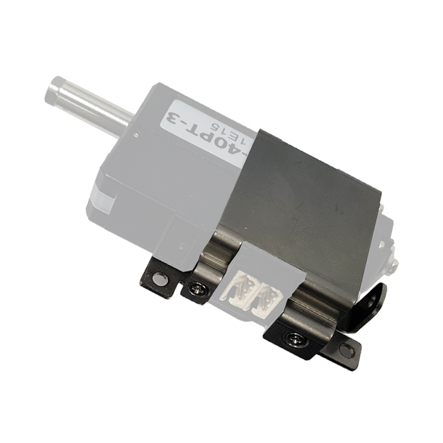
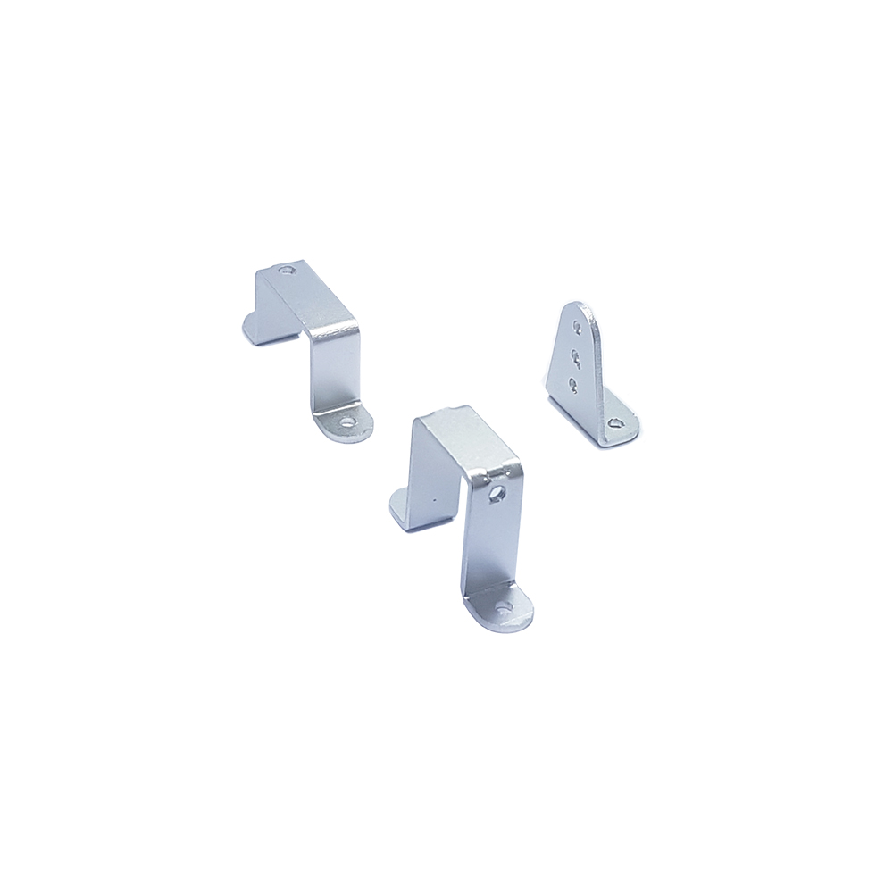
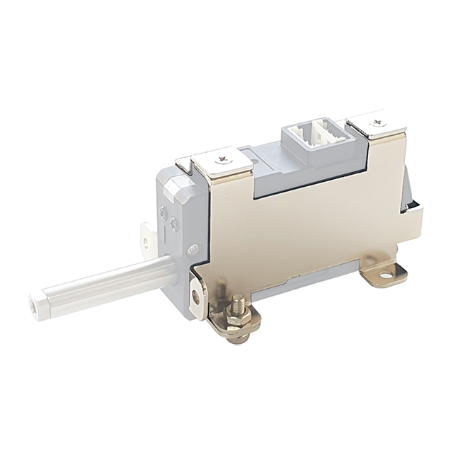
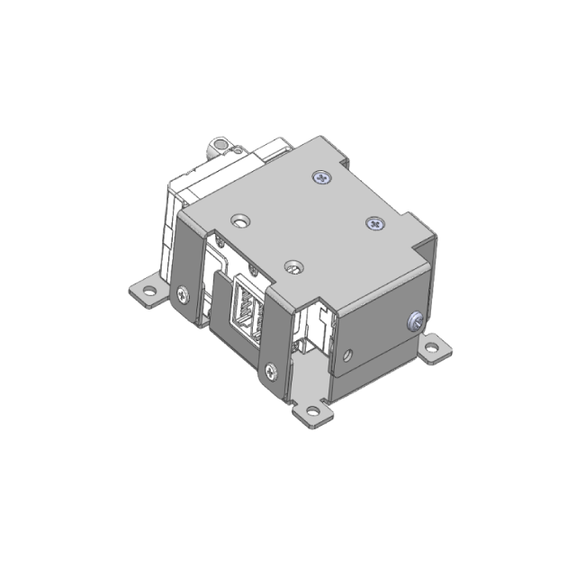
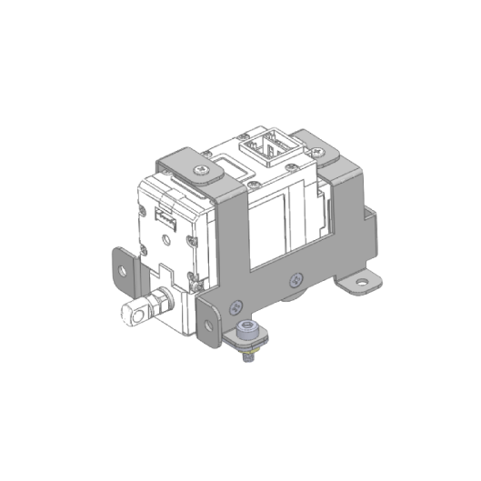
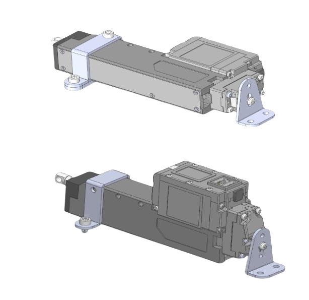

# IR-MB02

	
	<ul>
	<li>For 12Lf / L12 (27mm stroke), D12 / D7 (26mm stroke),  
	         12L / 12D (22mm stroke) series  
	         (Select IR-MB03 for longer stroke actuator of 40 mm or more)</li>
	<li>For Lateral Mounting </li>
	<li>Not compatible with 17Lf series </li>
	</ul>

# IR-MB03

	
	<ul>
	<li>Dedicated for 12Lf / L12 (40 ~ 96mm Stroke) Version</li>
	<li>Full Set for A, B, C Type Brackets </li>
	<li>Not compatible with 17Lf series </li>
	</ul>

# IR-MB04

	
	<ul>
	<li>For 12Lf / L12 (27mm stroke), D12 / D7 (26mm stroke),  
		 12L / 12D (22mm stroke) series</li>
	<li>For Vertical Mounting </li>
	<li>Not compatible with 17Lf series</li>
	</ul>

# IR-MB05

	
	<ul>
	<li>Dedicated only for 17Lf (27mm stroke)</li>
	<li>For Lateral Mounting </li>
	<li>Not applicable to models other than 17Lf 27mm stroke series</li>
	<li>For assembly and installation instructions, see below.</li>
	</ul>

# IR-MB06

	
	<ul>
	<li>Dedicated only for 17Lf (27mm stroke)</li>
	<li>For Vertical Mounting </li>
	<li>Not applicable to models other than 17Lf 27mm stroke series</li>
	<li>For assembly and installation instructions, see below.</li>
	</ul>

# IR-MB07

	
	<ul>
	<li> Dedicated for 17Lf (37~87mm stroke) version</li>
	<li>Full Set for A, B, C Type Brackets </li>
	<li>For Horizontal Mounting and Vertical Mounting</li>
	<li>Not compatible with 17Lf 27mm stroke version</li>
	</ul>

