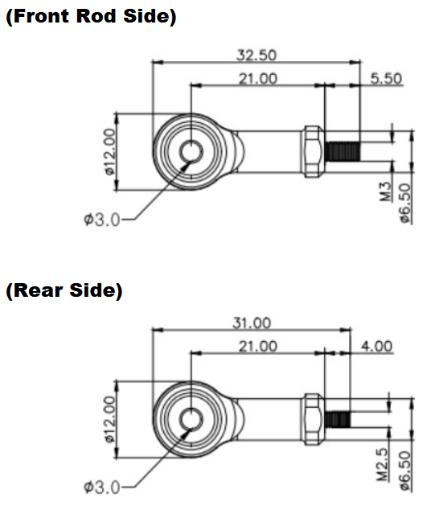
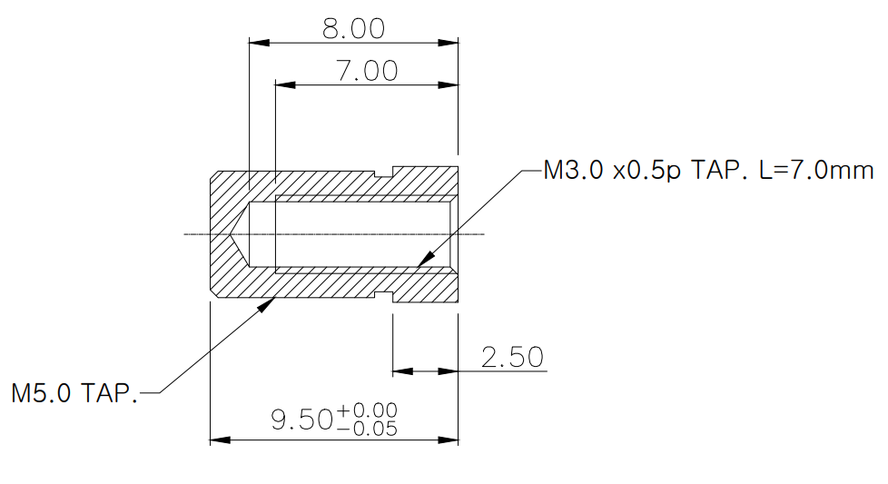

# IR-EB01 Drawing
## [IR-EB01] Rod End Bearing 2D / 3D Drawings
2D drawings(PDF / DXF) and 3D drawings(STEP) for IR-EB01 which mounts migthyZAP at the both end using end bearings.  In case of 3D drawings, there are two different files for both M2.5 and M3.0. (1 set IR-EB01 = 1 x M2.5 end bearing + 1 x M3.0 end bearing)

### EB01 Rod End Bearing Uint : mm

**Download** : <a class="downloadbtn" href="./data/IR-EM01-Rod-End-Bearing.pdf" download> PDF </a> / <a class="downloadbtn" href="./data/PHSCM-3-M3.0-ASSM-1.step" download> STEP(M3.0) </a> / <a class="downloadbtn" href="./data/PHSCM-3-M2.5-ASSM-1.step" download> STEP(M2.5) </a> / <a  class="downloadbtn" href="./data/IR-EB01-Rod-End-Bearing.DXF" download> DXF </a>

### EB01 Rod End Bearing Uint : Inch

### Rod end Nut Unit : mm
Here is the drawing for the Rod end nut (M3)which is attached on the end of Rod.  
Its specification is M3.0x5P, 7mm depth.

**Download** : <a class="downloadbtn" href="./data/Rod-end-nutM3.pdf" download> PDF </a> / <a  class="downloadbtn" href="./data/Rod-end-nutM3.DXF" download> DXF </a>

## Rod end Nut Unit : Inch
