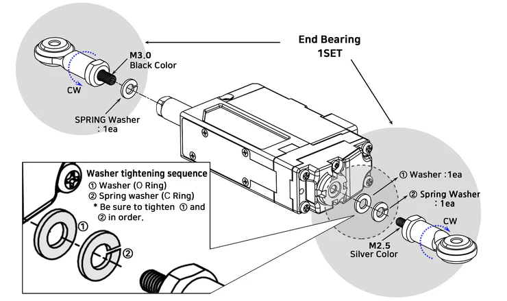
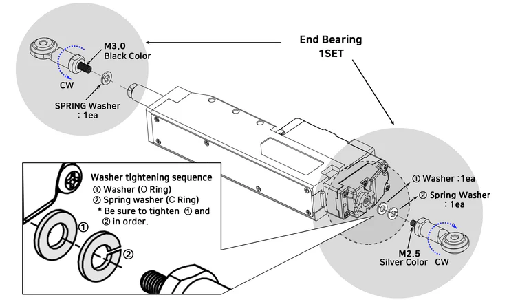

## Using End bearing(IR-EB01)
This method can be used to secure both sides of servo motor using End bearing. 
In this case, mechanical condition should permit servo motor movement by using spring or LM Guide. (In case of spring connection, tension should be within the range of rated force to prevent overload.)
### 26mm, 27mm Stroke Model

### 40mm ~ 96 mm Stroke Model

>[!warning] Caution
>- Make sure to fix the end bearings by paying attention to the order of the washer as shown in the picture above.  
>- Failure to tighten in order may cause malfunction or product damage.
