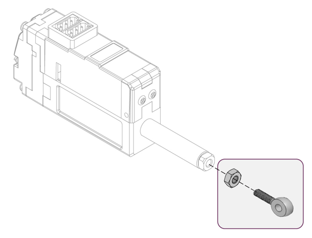

## Using Rod-End Tip(IR-MC06)
- The IR-MC06 SUS Rod End Tip (Eye Bolt) is an optional accessory made of SUS 304 material for improved strength.
- Please note that the shape of IR-MC06 is slightly different from the old basic brass rod end tip, which is a basic accessory, so please refer to the related drawing if necessory.
- To be packed 5pcs in a set along with 5pcs of M3 nuts.

