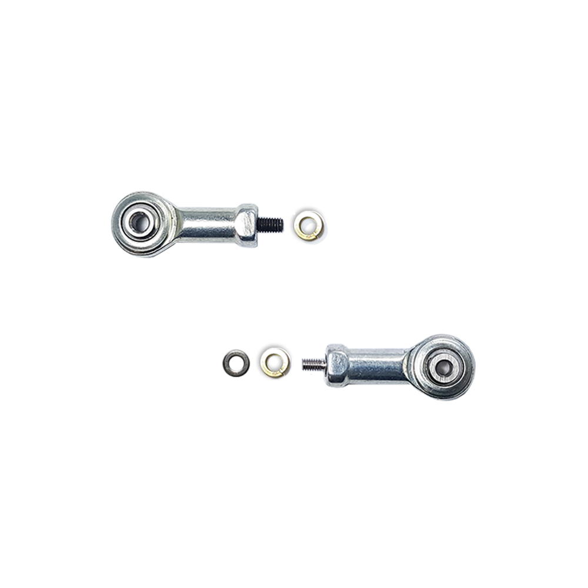
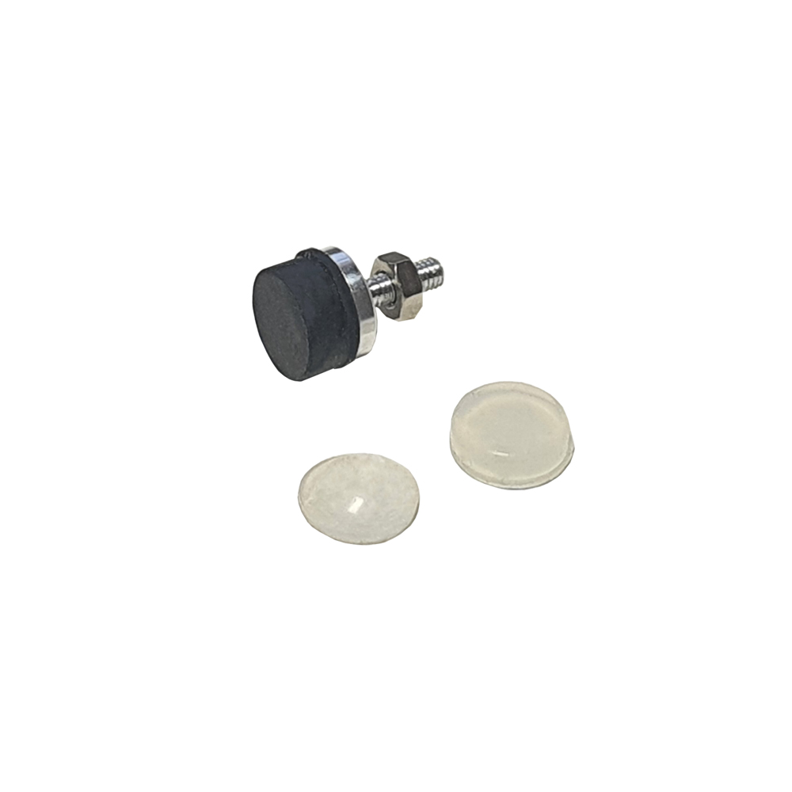
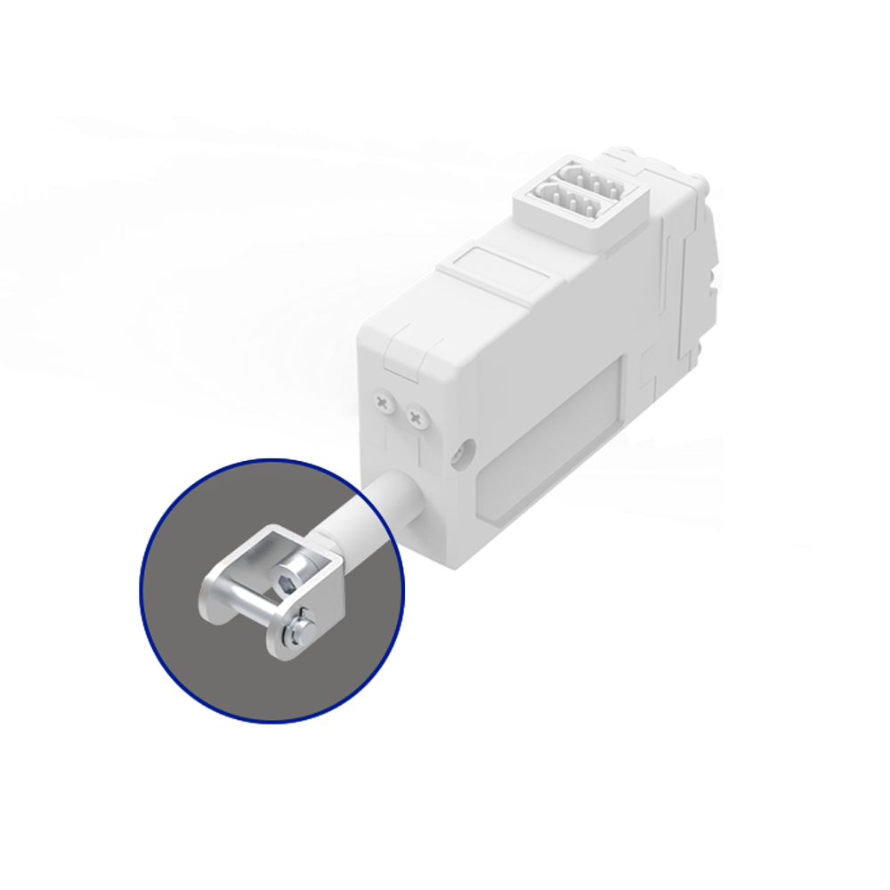
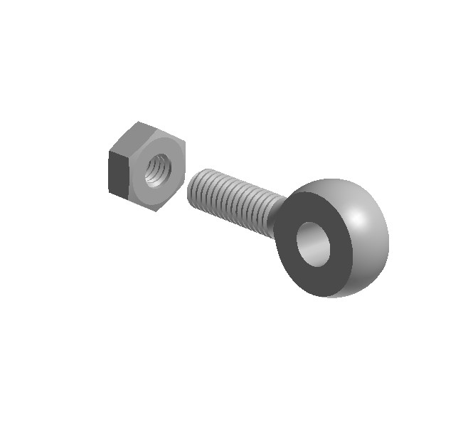

## IR-EB01

	
	<ul style="margin:auto 0">
	<li> Rod End Ball Bearings for mightyZAP</li>
	<li> M2.5, M3 Screws Applied</li>
	</ul>

## IR-GT01

	
	<ul style="margin:auto 0">
	<li> Rod-End Soft Grip Tip for mightyZAP</li>
	<li> 3 Different Types Rubber/Silicon Pads</li>
	</ul>

## IR-MC05

	
	<ul style="margin:auto 0">
	<li> Free Angle U Type Rod-End Bracket</li>
	</ul>

## IR-MC06

	
	<ul style="margin:auto 0">
	<li> SUS Rod End Tip (Eye Bolt) for mightyZAP</li>
	<li> SUS Rod End Tip (Eye Bolt) for mightyZAP</li>
	</ul>

