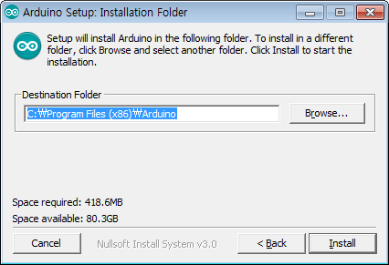

# EZController 
# 1 Overview
Arduino-based EZ Controller is a controller to easily operate / test mightyZAP linear servo actuators. The features of EZ Controller are as follows.

- Operate the linear actuator simply and easily through various input devices on the board by using the built-in basic program.
- Various motion programming is available by example program provided from us or by your own coding via Arduino.
- Connectable with various external accessories. (External switch, etc.)
- No need for a separate circuitry to control the mightyZAP linear actuator. Also, for safety, it is equipped with power protection circuits for prevention of reverse power, over-current, and static electricity.
## 1.1 Precautions
The following precautions require special attention when using, so be sure to read them carefully. Please note that warranty will be void for problems caused by failure to comply with the following.
1. <u>Do not apply excessive force</u> when connecting products. Also, <u>do not apply excessive force to the components</u> or the pins on the board. It may cause malfunction.
2. Be advised that it may cause a short circuit when connecting power to the board on the metal plate that is not insulated.<u> Be sure to attach the enclosed plastic support</u> to the board before use. (See the picture on the right) 
   
3. Since the voltage applied to the EZ controller is directly applied to the connected actuator, <u>check the operating voltage range of the actuator and check the polarity</u> when connecting external power. Ex) If user connects the actuator whose input voltage is 7.4V (D7 or L7 series) to the board, and accidently connects 12V power to the board may cause the damage of actuator.
4. When connecting the actuator to the board, make sure to check the polarity of the pins. It may cause motor or actuator PC board damage.
5. <u>Use the appropriate connector</u> to prevent damage due to incorrect insertion.
6. <u>Apply proper input to each terminal</u>. Make sure proper signal voltage and pay attention to the proper wiring between power and signal terminal.
7. <u>Do not overturn the variable resistance knob</u> when setting the start and end points of the rod.
8. Keep the product away from fire, water, dust and oil and keep the product out of reach of children.
9. This product is designed for indoor use. Please refrain from using outdoors.
## 1.2 Proper Storage  
Do not use or store the product in the following extreme environments. It may cause malfunction or product damage.  
- High temperature environment over 60℃ or low temperature below minus 20℃    
- Direct sunlight or near fire 
- Hot, humid and dusty places    
- Severe vibration condition    
- Places that can cause static electricity   
# 2 Function & Operation
## 2.1 Function
  
- **EZ Controller Components and Description**
   
>[!note] Note
>Set the positions of the A and B points by adjusting the blue V/R ③ (A position) and ④ (B position) respectively. 
>-Clockwise:- (actuator retraction direction) 
>-Counterclockwise: + (actuator extension direction)
>
>For convenience, it is recommended to set A to minimum position and B to maximum position as shown below.
>-A point (part ③): Turn clockwise to set the minimum position
>-B point (part ④): Turn counterclockwise to set the maximum position
>Please note that the minimum and maximum positions of A and B may be reversed and changed depending on user settings.

1. A Position External switch input (○: +, ●:-)
2. B Position External switch input (○: +, ●:-)
   : Position command by external switch or external signal. It is same function as ⑨,⑩ push button. : For position setting, use ③ and ④
3. “A” Position setting V/R : “A” position setting by adjusting variable resistor. (A position command made by ① or ⑨)
4. “B” Position setting V/R : “B” position setting by adjusting variable resistor. (B position command made by ② or ⑩)
5. PC connection USB(C type) terminal : Arduino Sketch download/Serial communication
6. Reset Switch: Controller reset 
7. 12V main power input terminal
8. Mode selection Switch 
9. A Position push button Switch 
10. B Position push button Switch 
11. MCU F/W download connector(ICSP) : User manipulation prohibited 
12. Arduino I/O Pins (Digital:3 , Analog:3 / GND, 5V, SIG) 
13. Internal power terminal(GND / 3.3V / 5V / VIN(12V)) : power output terminal internally used. 
    **\[Current Limit of each terminal\]** 
    3.3V : ~150mA / 5V : ~ 900 mA / VIN(12V) : Depending on Input Voltage Source 
14. PWM port 
15. TTL port 
16. RS-485 port 
17. Linear Potentiometer for manual position 
18. User external communication terminal (Bluetooth : TX / RX / GND / 3.3V)

## 2.2 Mode Selection 
- Test the operation of the actuator using the basic operation program built into the EZ Controller.    
- The basic operation program consists of Manual Mode, Position Select Mode, and Position Toggle Mode. (The mode switch only affects the basic operation program.)

| Manual                                    | Position Select                           | Position Toggle                           |
| ----------------------------------------- | ----------------------------------------- | ----------------------------------------- |
|  |  |  |

- **Manual Mode** : : Connect the actuator, move the Mode switch(⑧) to the lowest position, set it to Manual Mode. Then, operate actuator by change the position of the linear potentiometer(⑰).   
- **Position Select Mode :** Connect the actuator, move the Mode switch(⑧) to the middle position, set it to Position Select Mode. Adjust the blue position setting variable resistors (A:③ &B:④) to set A and B Position respectively, and then press the white push buttons(A:⑨& B:⑩) in the center to operate the actuator as Point A and Point B.
- **Position Toggle Mode :** Connect the actuator, move the Mode switch⑧) to the top, set it to Position Toggle Mode. Adjust the blue position setting variable resistors (A:③ &B:④) to set A and B Position respectively, and then press any of the white push buttons(⑨or⑩) in the center to operate the actuator to point A and B. 
## 2.3 External Switch  
- **A/B position external switch input & External signal input** (Pic. ①,②)
Connect external switches or apply a voltage level signal for position command. It is the same function as the white push button switches (⑨, ⑩). Only the position command can be made, and each position setting should be made through the blue variable resistors (③ and ④).

1. **External Switch Connection**    
   : Connect the both ends of the terminal with switches to input the signal. (Short circuit at both ends of the terminal)

2. **External Signal Input**
   : To recognize the signal in the second hole of each terminal, apply 3.3~12V level signal.

## 2.4 Part Pinmap  
- Parts No : Part number described on the manual Page 4. 
- Pin Name : Arduino(Leonardo) I/O Pin
- Purpose : I/O Pin function

| **Part No** | **Pin Name** | **Purpose**                 | **Part No** | **Pin Name** | **Purpose**             |
| ----------- | ------------ | --------------------------- | ----------- | ------------ | ----------------------- |
| ①,⑨         | I/O10        | GPIO– A Signal              | ⑫           | A0,A2,A3     | GPIO - Analog           |
| ②,⑩         | D3           | GPIO– B Signal              | ⑫           | D7,IO11,IO13 | GPIO - Digital          |
| ③           | A4           | Analog–A Variable resistor  | ⑭           | D5           | GPIO - PWM              |
| ④           | A5           | Analog–B Variable resistor  | ⑮,⑯         | D0,D1        | TTL,RS485 Communication |
| ⑤           | Serial       | USB Serial, Sketch download | ⑰           | A1           | Analog -Potentiometer   |
| ⑧           | D4,IO12,D6   | GPIO – Slide SW             | ⑱           | IO8,IO9      | Software Serial         |


# 3 PC Installation for Arduino IDE
IR-CT01, EZ controller has been built based on Arduino Leonardo. User needs to set Arduino development environment as below for program operation.
## 3.1 Install Arduino IDE
1. . Select Window installer from https://www.arduino.cc/en/main/software

2. Download by “JUST DOWNLOAD”

3. Run arduino-xxx-windows.exe after download.

4. Install software as following.




5. Install driver when Windows asks it.

6. Click “Close” after installation.

7. Run “Arduino” on your Windows wallpaper.

## 3.2. Arduino IDE Structure
Basic composition of Arduino IDE is as below.


1. Compile button :Program will be compiled. (Compile result to be shown at area#4) 
2. Upload button :Upload to Arduino at the same time of compile (In case of compile error or Arduino&usbconnection error occur, it will be shown at area#4.) 
3. Serial monitor button :When PC is connected with Arduino via USB, Arduino is able to send message to PC when its operation. If program is written by Serial.write() orSerial.print() functions, user is able to check message on Serial monitor. 
4. Message area :Various Error message, complie, upload result will be shown in this area
## 3.3. Add Library   
1. Download Arduino API/Library(IRROBOT_EZController_XXXX.Zip) for EZ controller from the Digital Archives at http://www.mightyzap.com 
>[!caution] Caution
>There are two different menus on our Digital Archives. The one is for the Position control lineup, and the other is for the Force control lineup actuators. According to the actuator you have, please select proper menu.

2. Click [Sketch] – [Include Library] – [Add .ZIP Library]

3. Select IRROBOT_EZController_XXXX.Zip you downloaded. (File name is subject to be changed according to future update.)

## 3.4. Example Loading
1. Run Arduino IDE 
2. Click [File] - [Examples] - [IRROBOT_EZController_XX]-[EZ] – Then, select desired example.

## 3.5. Program Upload
1. Click [Tools]-[Board]-Select [Arduino Leonardo] 
2. [Tools]-[Port]-Select connected Port [COMXX (Arduino Leonardo)]

3. Upload program to the board by Upload button.
# 4. Example - Actuator Control through Arduino IDE
**Actuator control via the Arduino IDE's data communication protocol (RS-485 or TTL). This is for the advanced users of Arduino who want to control actuators more freely through data communication of Arduino.**
## 4.1 Overview 
Here are Arduino examples to control mightyZAP through EZ Controller. The examples are for serial data communication (TTL or RS-485 communication) and do not support PWM communication. 
The EZ Controller is designed based on Arduino Leonardo, and the Arduino API provided by us is based on Arduino Leonardo / Uno. For detailed description of each parameter function, please refer to the mightyZAP user manual.
## 4.2 Example - 2 Position Control (RS-485/TTL)
The EZ controller contains two variable resistors (Figures 3 and 4) that can assign two positional points and two buttons (Figures 9 and 10) that commands to reach the assigned points. (Alternatively, it is also possible to reach the assigned points with an external physical switch or external voltage signal (Figure 1 or 2). 
For detailed information about external switch, see 2.3 External switches on page5.

Here is the example of moving to 2 assigned positions which is set by position setting variable resistors (#3&4) through 2 switches (#9&10). 
Select [Example] - [IRROBOT_EZ Controller] - [EZ]–[EZ Controller_2Positions]


  
### \[Description]
- Mode switch (#8) can be positioned anywhere. (Mode switch only works in the built-in basic program) 
- Supply power to the input power terminal(#7). Make sure correct input voltage(7.4V or 12V) and correct polarity.(GND and VCC) 
- Carefully insert the connector suitable for the selected communication. (#14 PWM / #15 TTL / #16 RS-485) 
  **(For PWM connector (#14), refer to the page 6 to make sure correct polarity.)** 
- Set two positional points (position A & B) by turning variable resistors (#3&4). (Clockwise turn – Retracting direction(short stroke) / Counter clockwise turn- Extension direction(long stroke)) 
- Press A, B button (#9, 10 ) to make positional command to the assigned goal positions. 
- It is also possible to reach the assigned points with an external switch or external voltage signal (#1 or 2). For detailed information about external switch, see 2.3 External switches on page5.

### \[Program Description]
Example of setting two points with the value of a variable resistor and moving them to the corresponding point when the buttons of A and B are pressed.
```C++
#include <IRROBOT_EZController.h>  
#define ID_MAX 11
#define A_POSITION_VR Easy.VR_2
#define B_POSITION_VR Easy.VR_3
#define VR_MIN 0
#define VR_MAX 1023
#define VAL_MIN 0
#define VAL_MAX 4095
#define IS_A_POSITION_ON Easy.POS_A.isOFF()
#define IS_B_POSITION_ON Easy.POS_B.isOFF()
#define ID_NUM 0
#define PWM_MIN 900
#define PWM_MAX 2100
#define PWM_VAL map(position_val,VAL_MIN,VAL_MAX,PWM_MIN,PWM_MAX)

IRROBOT_EZController Easy(&Serial1);

void setup() {
  Easy.begin();
  Easy.MightyZap.begin(32);
  Easy.setStep(ID_MAX,0,1023);
}

void loop()
{
  unsigned char MightyZap_actID = ID_NUM;
  short A_stroke_val, B_stroke_val, position_val;
  int A_stroke_limit, B_stroke_limit;
  A_stroke_val = map(A_POSITION_VR.read(), VR_MIN, VR_MAX, VAL_MIN, VAL_MAX);
  B_stroke_val = map(B_POSITION_VR.read(), VR_MIN, VR_MAX, VAL_MIN, VAL_MAX);

  if(IS_A_POSITION_ON)
    position_val = A_stroke_val;
  else if(IS_B_POSITION_ON)
    position_val = B_stroke_val;

  Easy.MightyZap.GoalPosition(MightyZap_actID,position_val);
  Easy.servo_CH1.writeMicroseconds(PWM_VAL);
  delay(10);

}
```

- **Mapping for PWM value**
	``` C++
	#define PWM_MIN 900                         
	#define PWM_MAX 2100                       \	
	#define PWM_VAL map(position_val,VAL_MIN,VAL_MAX,PWM_MIN,PWM_MAX)
	```
	- short : 900
	- long : 2100

- **Enter position value using variable resistance**
	```C++
	A_stroke_val = map(A_POSITION_VR.read(), VR_MIN, VR_MAX, VAL_MIN, VAL_MAX);
	B_stroke_val = map(B_POSITION_VR.read(), VR_MIN, VR_MAX, VAL_MIN, VAL_MAX);
	```
	- Read the variable resistor values of Position A and Position B and assign values to “A_stroke_val” and “B_stroke_val” variables respectively.
	- The map () function maps the variable resistor's resistor value to the actuator's position range.
	- In case not using a variable resistor
	  A_stroke_val = 100;
	  B_stroke_val = 3600;
	
- **Output control**  
Easy.MightyZap.GoalPosition() : TTL/RS485 control  
Easy.servo_CH1.writeMicroseconds() : PWM control
	```C++
	Easy.MightyZap.GoalPosition(MightyZap_actID,position_val);
	Easy.servo_CH1.writeMicroseconds(PWM_VAL);
	```  
## 4.3. Example - TogglePosition      
This is an example of inverting 2 Positions designated by 1 toggling button. 
Select [Example] - [IRROBOT_EZController] - [EZ]– [EasyControl_TogglePosition]

**\[Description]**
- Mode switch (#8) can be positioned anywhere. (Mode switch only works in the built-in basic program) 
- Supply power to the input power terminal (#7). Make sure correct input voltage(7.4V or 12V) and correct polarity.(GND and VCC) 
- Carefully insert the connector suitable for the selected communication. (#14 PWM / #15 TTL / #16 RS-485)
  **(For PWM connector (#14), refer to the page 6 to make sure correct polarity.)** 
- Set two positional points (position A & B) by turning variable resistors (#3&4). (Clockwise turn – Retracting direction(short stroke) / Counter clockwise turn- Extension direction(long stroke)) 
- Press A or B button (#9 or 10 ) to make positional command to the assigned goal positions. (Either button between A and B) 
- It is also possible to reach the assigned points with an external switch or external voltage signal (#1 or 2). For detailed information about external switch, see 2.3 External switches on page5. 

**\[Program Description]**
Example in which the two points set as variable resistors are reversed from point A to point B and point B to point A when the A or B button is pressed.

```C++
#include <IRROBOT_EZController.h>  
#define ID_MAX 11
#define A_POSITION_VR Easy.VR_2
#define B_POSITION_VR Easy.VR_3
#define VR_MIN 0
#define VR_MAX 1023
#define VAL_MIN 0
#define VAL_MAX 4095
#define IS_A_POSITION_ON Easy.POS_A.isOFF()
#define IS_B_POSITION_ON Easy.POS_B.isOFF()
#define ID_NUM 0
#define PWM_MIN 900
#define PWM_MAX 2100
#define PWM_VAL map(position_val,VAL_MIN,VAL_MAX,PWM_MIN,PWM_MAX)  

IRROBOT_EZController Easy(&Serial1);  

short position_val;
bool tg_flag,Sw_status = 0;
int sw_cnt = 0,cnt =0 ;  

void setup() {
  Easy.begin();
  Easy.MightyZap.begin(32);
  Easy.setStep(ID_MAX,0,1023);
}

void loop() {
  unsigned char MightyZap_actID = ID_NUM;
  short A_stroke_val;
  short B_stroke_val;
  A_stroke_val = map(A_POSITION_VR.read(),VR_MIN,VR_MAX,VAL_MIN,VAL_MAX);
  B_stroke_val = map(B_POSITION_VR.read(),VR_MIN,VR_MAX,VAL_MIN,VAL_MAX);
    
  if(IS_A_POSITION_ON || IS_B_POSITION_ON) tg_flag ^= 1;
  if(tg_flag) position_val = A_stroke_val;
  else position_val = B_stroke_val;

  Easy.MightyZap.GoalPosition(MightyZap_actID,position_val);
  Easy.servo_CH1.writeMicroseconds(PWM_VAL);
  delay(10);

}
```

- **toggle motion**
When the A or B button is pressed, the tg_flag value declared as bool is inverted, and when the value is 1, it moves to the A point, and when it is 0, it moves to the B point.
	```C++
	if(IS_A_POSITION_ON || IS_B_POSITION_ON) tg_flag ^= 1;
	if(tg_flag) position_val = A_stroke_val;
	else position_val = B_stroke_val;
	```

# 4.4. Example – Manual Position
Moving the position of the actuator by moving distance of the linear potentiometer. 
Select [Example] - [IRROBOT_EZController] - [EZ]– [EasyControl_MPosition]

**\[Description]**
- Mode switch (#8) can be positioned anywhere. (Mode switch only works in the built-in basic program) 
- Supply power to the input power terminal (#7). Make sure correct input voltage(7.4V or 12V) and correct polarity.(GND and VCC) 
- Carefully insert the connector suitable for the selected communication. (#14 PWM / #15 TTL / #16 RS-485) (For PWM connector (#14), refer to the page 6 to make sure correct polarity.) 
- By adjusting the variable linear potentiometer (#17), user is able to operate actuator. In the manual mode, it is not affected by the setting of the position setting variable resistor (# 3 & 4), and as the linear potentiometer moves, the actuator position can be controlled in the full stroke section.
**\[Program Description]**


```C++
#include <IRROBOT_EZController.h>  

#define ID_MAX 11
#define MANUAL_POSITION_VR Easy.VR_1
#define VR_MIN 0
#define VR_MAX 1023
#define VAL_MIN 0
#define VAL_MAX 4095
#define ID_NUM 0
#define PWM_MIN 900
#define PWM_MAX 2100
#define PWM_VAL map(position_val,VAL_MIN,VAL_MAX,PWM_MIN,PWM_MAX)  

IRROBOT_EZController Easy(&Serial1);  

short position_val;
  
void setup() {
  Easy.begin();
  Easy.MightyZap.begin(32);
  Easy.setStep(ID_MAX,0,1023);
}

void loop()
{
  unsigned char MightyZap_actID = ID_NUM;
  short Manual_position_val;
  short A_stroke_val;
  short B_stroke_val;
  Manual_position_val  = map(MANUAL_POSITION_VR.read(),VR_MIN,VR_MAX,VAL_MIN,VAL_MAX);  
  position_val = Manual_position_val;
  Easy.MightyZap.GoalPosition(MightyZap_actID,position_val);
  Easy.servo_CH1.writeMicroseconds(PWM_VAL);
  delay(10);
}
```

- **Manual control using a potentiometer**
Actuator position operation after reading Potentiometer value with “Manual_position_val “variable

```C++
Manual_position_val = map(MANUAL_POSITION_VR.read(),VR_MIN,VR_MAX,VAL_MIN,VAL_MAX);  
position_val = Manual_position_val;
Easy.MightyZap.GoalPosition(MightyZap_actID,position_val);
Easy.servo_CH1.writeMicroseconds(PWM_VAL);
```
  
## 4.5. Example – Basic Function (Factory program)
Switching control mode and controlling actuator through Mode selection slide switch. 
Select [Example] - [IRROBOT_EZController] - [EZ]-[EasyControl_BasicFunction]

**[Description]**
- Supply power to the input power terminal (#7). Make sure correct input voltage(7.4V or 12V) and correct polarity.(GND and VCC) 
- Carefully insert the connector suitable for the selected communication. (#14 PWM / #15 TTL / #16 RS-485) **(For PWM connector (#14), refer to the page 6 to make sure correct polarity.)** 
- Switch the mode with the mode slide switch (#8) to operate the actuator. 

| Manual                                    | Position Select                           | Position Toggle                           |
| ----------------------------------------- | ----------------------------------------- | ----------------------------------------- |
|  |  |  |

  1) Mode0 : Manual Control (Switch Bottom) 
  2) Mode1 : 2 Position Control (Switch Center) 
  3) Mode2 : Toggle Control (Switch Top) 
- When operating in Mode1 (Manual Control), note that the position setting variable resistor values by # 3 and 4 are set to the limit value of the movable range of the variable linear potentiometer (# 17).

**[Program Description]**
```C++
#include <IRROBOT_EZController.h>

#define ID_MAX 11
#define MANUAL_POSITION_VR Easy.VR_1
#define A_POSITION_VR Easy.VR_2
#define B_POSITION_VR Easy.VR_3
#define IS_MANUAL_MODE_ON Easy.MODE_0.isOFF()
#define IS_2P_MODE_ON Easy.MODE_1.isOFF()
#define IS_TOGGLE_MODE_ON Easy.MODE_2.isOFF()
#define IS_A_POSITION_ON Easy.POS_A.isOFF()
#define IS_B_POSITION_ON Easy.POS_B.isOFF()
#define VR_MIN 0
#define VR_MAX 1023
#define VAL_MIN 0
#define VAL_MAX 4095
#define ID_NUM 0
#define PWM_MIN 900
#define PWM_MAX 2100
#define PWM_VAL map(position_val,VAL_MIN,VAL_MAX,PWM_MIN,PWM_MAX)

IRROBOT_EZController Easy(&Serial1);

short position_val;
bool tg_flag,Sw_status = 0;
int sw_cnt = 0, cnt = 0;
int nFilter=0;

void setup() {
  Easy.begin();
  Easy.MightyZap.begin(32);
  Easy.setStep(ID_MAX,0,1023);
}

void loop()
{
  unsigned char MightyZap_actID = ID_NUM;
  short Manual_position_val,A_stroke_val,B_stroke_val;
  int A_stroke_limit, B_stroke_limit, stroke_limit_dir;

  Manual_position_val  = map(MANUAL_POSITION_VR.read(),VR_MIN,VR_MAX,VAL_MIN,VAL_MAX);
  nFilter = nFilter - (nFilter >> 3) + Manual_position_val;
  Manual_position_val = (uint16_t)(nFilter >> 3);

  A_stroke_val = map(A_POSITION_VR.read(),  VR_MIN, VR_MAX,  VAL_MIN, VAL_MAX);
  B_stroke_val = map(B_POSITION_VR.read(),  VR_MIN, VR_MAX,  VAL_MIN, VAL_MAX);

  if(A_stroke_val>B_stroke_val)
  {
    int temp = A_stroke_limit;
    A_stroke_limit = B_stroke_val;
    B_stroke_limit = temp;
  }

  if(IS_MANUAL_MODE_ON) position_val = Manual_position_val;
  else if(IS_2P_MODE_ON)
  {
    if(IS_A_POSITION_ON) position_val = A_stroke_val;
    else if(IS_B_POSITION_ON) position_val = B_stroke_val;
  }
  else if(IS_TOGGLE_MODE_ON)
  {
    if(IS_A_POSITION_ON || IS_B_POSITION_ON){
      if(!Sw_status){
        if(sw_cnt++>7){
          tg_flag ^= 1;
          Sw_status = 1;
          sw_cnt = 0;
        }
      }
      else sw_cnt = 0;
    }
    else {
      sw_cnt = 0;
      if(!IS_A_POSITION_ON && !IS_B_POSITION_ON){
        if(cnt++>7){
          cnt = 0;
          Sw_status = 0;
        }
      }
    }
    if(tg_flag ==1) position_val = A_stroke_val;
    else position_val = B_stroke_val;
  }
  Easy.MightyZap.GoalPosition(MightyZap_actID,position_val);
  Easy.servo_CH1.writeMicroseconds(PWM_VAL);
  delay(10);
}
```

- **Define slide switch mode**
The bottom, middle, and top of the Slide Switch are defined as MODE_0, MODE_1, and MODE_2 in each order
	```
	#define IS_MANUAL_MODE_ON Easy.MODE_0.isOFF()
	#define IS_2P_MODE_ON Easy.MODE_1.isOFF()
	#define IS_TOGGLE_MODE_ON Easy.MODE_2.isOFF()
	```

- **Debouncing by variable counting**
Sw_status : Recognizing if the switch is pressed
sw_cnt: When SW is On, recognizing after debouncing 
cnt: When SW is off, recognizing after determining

	```C++
	if(IS_A_POSITION_ON || IS_B_POSITION_ON)
	{
		if(!Sw_status){
			if(sw_cnt++>7){
				tg_flag ^= 1;
				Sw_status = 1;
				sw_cnt = 0;
			}
		}
		else sw_cnt = 0;
	}
	else {
		sw_cnt = 0;
		if(!IS_A_POSITION_ON && !IS_B_POSITION_ON){
			if(cnt++>7){
				cnt = 0;
				Sw_status = 0;
			}
		}
	}
	```
## 4.6. Example –Extra IO(1)
Controlling the actuator by receiving the input of the digital IO pin. 
Select [Example] - [IRROBOT_EZController] - [EZ]–[EasyControl_ExtIO]
**\[Description]**
 - Mode switch (#8) can be positioned anywhere. (Mode switch only works in the built-in basic program) 
 - Supply power to the input power terminal (#7). Make sure correct input voltage(7.4V or 12V) and correct polarity.(GND and VCC) 
 - Carefully insert the connector suitable for the selected communication. (#14 PWM / #15 TTL / #16 RS-485) 
   **(For PWM connector (#14), refer to the page 6 to make sure correct polarity.) **
 - The left three of the upper header pins (# 12) are assigned for digital terminals, and the first & second pins from the left can be used. 
 - The signal terminal is the lowest pin of the 3 pins and the pin has a signal level of 5V. (See picture below) (Active Low / 5V : High Signal / 0V : Low Signal) 
 - Set the two points for position setting in the same way as the previous method through the two variable resistors on the left (#3 and 4). 
 - When a low signal is applied to the first pin, the actuator moves to the set point A, 
   When a low signal is applied to the second pin, the actuator moves to the set B point.
 
**\[Program Description]**
 
- The left three pins are Arduino's Digital IO, the right three pins are Analog IO.

```C++
#include <IRROBOT_EZController.h>
#define ID_MAX 11
#define A_POSITION_VR Easy.VR_2
#define B_POSITION_VR Easy.VR_3
#define VR_MIN 0
#define VR_MAX 1023
#define VAL_MIN 0
#define VAL_MAX 4095
#define ID_NUM 0
#define PWM_MIN 900
#define PWM_MAX 2100
#define PWM_VAL map(position_val,VAL_MIN,VAL_MAX,PWM_MIN,PWM_MAX)  

IRROBOT_EZController Easy(&Serial1);  

short position_val;  

void setup() {
  pinMode(7,INPUT);
  pinMode(11,INPUT);
  Easy.begin();
  Easy.MightyZap.begin(32);
  Easy.setStep(ID_MAX,0,1023);
}

void loop() {
  unsigned char MightyZap_actID = ID_NUM;
  short A_stroke_val,B_stroke_val;
  A_stroke_val = map(A_POSITION_VR.read(),  VR_MIN, VR_MAX,  VAL_MIN, VAL_MAX);
  B_stroke_val = map(B_POSITION_VR.read(),  VR_MIN, VR_MAX,  VAL_MIN, VAL_MAX);  

  if(digitalRead(7) == HIGH) position_val = A_stroke_val;
  else if(digitalRead(11) == HIGH) position_val = B_stroke_val;
  else position_val = position_val;

  Easy.MightyZap.GoalPosition(MightyZap_actID,position_val);
  Easy.servo_CH1.writeMicroseconds(PWM_VAL);

  delay(10);
}
```

- **IO Pin settings**
Among Digital IO (7,11,13), 7 and 11 IO are declared as input.
	``` C++
	pinMode(7,INPUT);
	pinMode(11,INPUT);
	```

- **IO input control**  
When 5V signal is applied to pin 7, the actuator moves to the set point A. When 5V signal is applied to pin 11 the actuator moves to the set point B.  

	```C++
	if(digitalRead(7) == HIGH) position_val = A_stroke_val;
	else if(digitalRead(11) == HIGH) position_val = B_stroke_val;
	else position_val = position_val;
	```

## 4.7. Example -Extra IO(2)  
Controlling the actuator by receiving the input of an external sensor to the analog IO pin. 
Select [Example] - [IRROBOT_EZController] - [EZ]–[EasyControl_Sensing]

**\[Description]**
- Mode switch (#8) can be positioned anywhere. (Mode switch only works in the built-in basic program) - Supply power to the input power terminal (#7). Make sure correct input voltage(7.4V or 12V) and correct polarity.(GND and VCC) 
- Carefully insert the connector suitable for the selected communication. (#14 PWM / #15 TTL / #16 RS-485) 
  **(For PWM connector (#14), refer to the page 6 to make sure correct polarity.)**
- Among the header pins (# 12), the right three are analog terminals, and these three pins are used for Extra IO. (See picture below) 
- Connect the sensor to read the analog value to the pin according to the purpose.
- Actuator moves according to the sensor value. 
  ex) CDS => brighter forward, darker backward 

**\[Program Description]**
In the library, analog pins A0, A2, A3 are defined as VR_4, VR_5, VR_6. Declare the pin you want to use with a defined name, or directly declare matched analog pin.

```C++
#include <IRROBOT_EZController.h>

IRROBOT_EZController Easy(&Serial1);

#define ID_MAX 11
#define MANUAL_POSITION_VR Easy.VR_1
#define A_POSITION_VR Easy.VR_2
#define B_POSITION_VR Easy.VR_3
#define EXT_ANALOG_VR Easy.VR_4   //VR4 : A0  //VR5 : A2  //VR6 : A3
#define VR_MIN 0
#define VR_MAX 1023
#define VAL_MIN 0
#define VAL_MAX 4095
#define ID_NUM 0
#define PWM_MIN 900
#define PWM_MAX 2100
#define PWM_VAL map(position_val,VAL_MIN,VAL_MAX,PWM_MIN,PWM_MAX)

short position_val;
  
void setup(){
  Easy.begin();
  Easy.MightyZap.begin(32);
  Easy.setStep(ID_MAX, 0, 1023);
}

void loop() {
  unsigned char MightyZap_actID = ID_NUM;
  short Ext_analog_val;

  Ext_analog_val = map(EXT_ANALOG_VR.read(), VR_MIN, VR_MAX, VAL_MIN, VAL_MAX);
  position_val = Ext_analog_val;
  Easy.MightyZap.GoalPosition(ID_NUM, position_val);
  Easy.servo_CH1.writeMicroseconds(PWM_VAL);
  delay(10);
}
```

- analog pin settings
	```C++
	#define EXT_ANALOG_VR Easy.VR_4   //VR4 : A0  //VR5 : A2  //VR6 : A3
	```
- analog input control
	```C++
    Ext_analog_val = map(EXT_ANALOG_VR.read(), VR_MIN, VR_MAX, VAL_MIN, VAL_MAX);
	```
## 4.8. Example –External Communication
Controlling the actuator through external communication by the Bluetooth port. 
Select [Example] - [IRROBOT_EZController] - [EZ]–[EasyControl_ExtCom]

**\[Description]**
- Mode switch (#8) can be positioned anywhere. (Mode switch only works in the built-in basic program) 
- Supply power to the input power terminal (#7). Make sure correct input voltage(7.4V or 12V) and correct polarity.(GND and VCC) 
- Carefully insert the connector suitable for the selected communication. (#14 PWM / #15 TTL / #16 RS-485) 
  **(For PWM connector (#14), refer to the page 6 to make sure correct polarity.)** 
- There is a port (# 18) for external communication at the bottom right, and connects the device to the pin according to the pin arrayal. 
- If you press the A(B) button in the example, ‘A(B)’ is sent as an ASCII value. 
- When the board receives ‘A’ as an ASCII value, the actuator moves to the A point set the same as before, Similarly, when the ASCII value 'B' is received, the actuator moves to the set point B.

**\[Program Description]**
- On the Arduino, IO8 and IO9 pins are declared as RX and TX respectively.
- Set baud rate of serial monitor with Serial.begin ()function. Check the data which is sent and received by the Sw_func () function and ExtComData_Func () function on the serial monitor.
- Communication data is received byte by byte through “ExtComData_Listen ()” function.
- The Sw_Func () function sends ASCII code values corresponding to A and B respectively, and the ExtComData_Func () function moves the actuator to the position corresponding to the received ASCII code value.


```C++
#include <IRROBOT_EZController.h>

IRROBOT_EZController Easy(&Serial1);
SoftwareSerial userSerial(8,9);

#define ID_MAX 11
#define A_POSITION_VR Easy.VR_2
#define B_POSITION_VR Easy.VR_3
#define VR_MIN 0
#define VR_MAX 1023
#define VAL_MIN 0
#define VAL_MAX 4095
#define IS_A_POSITION_ON Easy.POS_A.isOFF()
#define IS_B_POSITION_ON Easy.POS_B.isOFF()
#define ID_NUM 0
#define PWM_MIN 900
#define PWM_MAX 2100
#define PWM_VAL map(position_val,VAL_MIN,VAL_MAX,PWM_MIN,PWM_MAX)

short position_val;
char RxChar;
short A_stroke_val,B_stroke_val;

void setup() {
  Easy.begin();
  Easy.MightyZap.begin(32);
  Easy.setStep(ID_MAX,0,1023);

  Serial.begin(9600);
  userSerial.begin(9600);
}

void loop() {
  unsigned char MightyZap_actID = ID_NUM;
  A_stroke_val = map(A_POSITION_VR.read(),  VR_MIN, VR_MAX,  VAL_MIN, VAL_MAX);
  B_stroke_val = map(B_POSITION_VR.read(),  VR_MIN, VR_MAX,  VAL_MIN, VAL_MAX);
  Sw_Func();
  ExtComData_Listen();
  ExtComData_Func();
}

void Sw_Func(void){
  if(IS_A_POSITION_ON){
    userSerial.write('A');
    Serial.println("'A' Send");
    delay(500);
  }
  else if(IS_B_POSITION_ON){
    userSerial.write('B');
    Serial.println("'B' Send");
    delay(500);
  }
}

void ExtComData_Listen(void){
  if(userSerial.available()>0){
    RxChar = userSerial.read();
  }
}

bool ExtComData_Func(){
  if(RxChar == 'A'){
    position_val = A_stroke_val;
    Serial.println("'A' Recieved");
  }
  else if(RxChar == 'B'){
    position_val = B_stroke_val;
    Serial.println("'B' Recieved");
  }
  Easy.MightyZap.GoalPosition(ID_NUM, position_val);
  Easy.servo_CH1.writeMicroseconds(PWM_VAL);
  delay(10);
}
```

## 4.9. Example – Mode Selection
Example for the mode setting that can be operated according to the value of the mode selection switch (Fig# 8). 
Select [Example] - [IRROBOT_EZController] - [EZ]–[EasyControl_ModeSelect]

**\[Description]**
In the same way as [Basic Function], the operation can be different according to the position of Mode selection switch(#8), and the operation can be assigned for each mode.

**\[Program Description]**


```C++
#include <IRROBOT_EZController.h>

#define ID_MAX 11
#define ModeSW_1 Easy.MODE_0.isOFF()
#define ModeSW_2 Easy.MODE_1.isOFF()
#define ModeSW_3 Easy.MODE_2.isOFF()
#define MANUAL_MODE 1
#define POS2_MODE 2
#define TOGGLE_MODE 3
#define EXT_IO_MODE 4
#define EXT_SENSING_MODE 5
#define EXT_COM_MODE 6

IRROBOT_EZController Easy(&Serial1);

void setup() {
  Easy.begin();
  Easy.MightyZap.begin(32);
  Easy.setStep(ID_MAX,0,1023);
}

void loop()
{
  int sw_val;
  if(ModeSW_1)sw_val = 1;
  else if(ModeSW_2) sw_val = 2;
  else if(ModeSW_3) sw_val = 3;
  Easy.ModeSelect(MANUAL_MODE,POS2_MODE,TOGGLE_MODE,sw_val);
  delay(10);
}
```
- **Mode define**
Index values for each mode are defined sequentially
  ```C++
	#define MANUAL_MODE 1
	#define POS2_MODE 2
	#define TOGGLE_MODE 3
	#define EXT_IO_MODE 4
	#define EXT_SENSING_MODE 5
	#define EXT_COM_MODE 6
	```
- **Switch value define**
	- 1 : when the mode switch is at the bottom  
	  2 : mode switch at the middle  
	  3 : at the top  
	- Tester.ModeSelect(int mode1, int mode2. int mode3, int sw);   
	  mode1 : operation when sw value is 1   
	  mode 2 : operation when sw value is 2   
	  mode3 : operation when sw value is 3   
	  sw : Mode value set by mode switch 
	```C++
	if(ModeSW_1)sw_val = 1;
	else if(ModeSW_2) sw_val = 2;
	else if(ModeSW_3) sw_val = 3;
	Easy.ModeSelect(MANUAL_MODE,POS2_MODE,TOGGLE_MODE,sw_val);
	```
## 4.10. Example –Stroke Limit    
Example which can set the max/min limit of stroke with 2 x position setting variable resistors(fig#3&4). 
Select [Example] - [IRROBOT_EZController] - [EZ]–[EasyControl_StrokeLimit]

**\[Description]**
- Mode switch (#8) can be positioned anywhere. (Mode switch only works in the built-in basic program) 
- Supply power to the input power terminal (#7). Make sure correct input voltage(7.4V or 12V) and correct polarity.(GND and VCC) 
- Carefully insert the connector suitable for the selected communication. (#14 PWM / #15 TTL / #16 RS-485)
  **(For PWM connector (#14), refer to the page 6 to make sure correct polarity.)**
- Set the position limit by turning the variable resistors (Fig# 3 and 4) that adjust the position of the max and min points of the stroke in the clockwise (-) and counterclockwise (+) directions. Clockwise direction is for retraction (short stroke), Counterclockwise direction is for extension(long stroke). 
- Operate actuator by adjusting linear potentiometer (Fig#17). Operating position will be affected by position setting V/R(#3&4), and even if the potentiometer is moved, the position is controlled only within the section set by the variable resistor.     

**\[Program Description]**

```C++
#include <IRROBOT_EZController.h>

#define ID_MAX 11
#define MANUAL_POSITION_VR Easy.VR_1
#define A_POSITION_VR Easy.VR_2
#define B_POSITION_VR Easy.VR_3
#define IS_A_POSITION_ON Easyter.POS_A.isOFF()
#define IS_B_POSITION_ON Easy.POS_B.isOFF()
#define SW_A Easy.POS_A
#define SW_B Easy.POS_B
#define VR_MIN 0
#define VR_MAX 1023
#define VAL_MIN 0
#define VAL_MAX 4095
#define ID_NUM 0
#define PWM_MIN 900
#define PWM_MAX 2100
#define PWM_VAL map(position_val,VAL_MIN,VAL_MAX,PWM_MIN,PWM_MAX)

IRROBOT_EZController Easy(&Serial1);

short position_val;
bool tg_flag,Sw_status = 1;
int sw_cnt = 0;

void setup() {
  Easy.begin();
  Easy.MightyZap.begin(32);
  Easy.setStep(ID_MAX,0,1023);
}

void loop()
{
  unsigned char MightyZap_actID = ID_NUM;
  short Manual_position_val,A_stroke_val,B_stroke_val;
  int A_stroke_limit, B_stroke_limit, stroke_limit_dir;
  int short_stroke_limit,long_stroke_limit;
  
  Manual_position_val  = map(MANUAL_POSITION_VR.read(),VR_MIN,VR_MAX,VAL_MIN,VAL_MAX);  
  short_stroke_limit = map(A_POSITION_VR.read(),  VR_MIN, VR_MAX,  VAL_MIN, VAL_MAX);
  long_stroke_limit = map(B_POSITION_VR.read(),  VR_MIN, VR_MAX,  VAL_MIN, VAL_MAX);


  if(short_stroke_limit>long_stroke_limit)
  {
    int temp = short_stroke_limit;
    short_stroke_limit = long_stroke_limit;
    long_stroke_limit = temp;
  }

  if(Manual_position_val<short_stroke_limit) Manual_position_val = short_stroke_limit;
  else if(Manual_position_val>long_stroke_limit) Manual_position_val = long_stroke_limit;
  position_val = Manual_position_val;
  
  Easy.MightyZap.GoalPosition(MightyZap_actID,position_val);
  Easy.servo_CH1.writeMicroseconds(PWM_VAL);
  delay(10);
}
```
- **Set analog value Min/Max**
 Regardless of V/R(#3&4) location, large value sets max limit and small value sets min limit.
	```C++
	if(short_stroke_limit>long_stroke_limit)
	{
		int temp = short_stroke_limit;
		short_stroke_limit = long_stroke_limit;
		long_stroke_limit = temp;
	}
	```
- **Position Limit value setting**
Determine the potentiometer value so that linear potentiometer does not exceed the set range.
	```C++
	if(Manual_position_val<short_stroke_limit) Manual_position_val = short_stroke_limit;
	else if(Manual_position_val>long_stroke_limit) Manual_position_val = long_stroke_limit;
	position_val = Manual_position_val;
	```