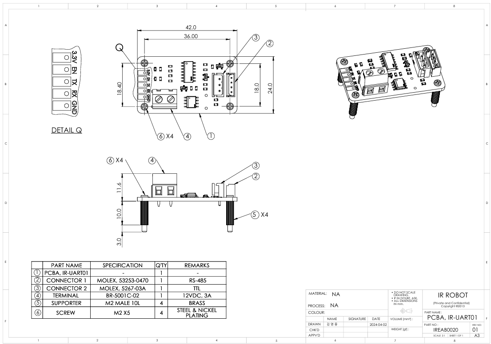

# UART01 Drawing
## [IR-UART01] UART to Half Duplex TTL/RS-485 converter 2D/3D 도면

### UART-01  Uint : mm

**Download** : <a class="downloadbtn" href="./data/IREAB0020_IR-UART01_Rev01.pdf" download> PDF </a> <a class="downloadbtn" href="./data/IREAB0020_IR-UART01_Rev01.step" download> STEP </a> <a  class="downloadbtn" href="./data/IREAB0020_IR-UART01_Rev01.DXF" download> DXF </a>
