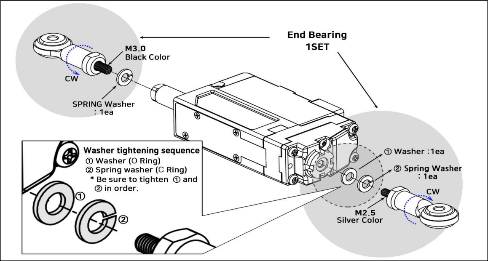
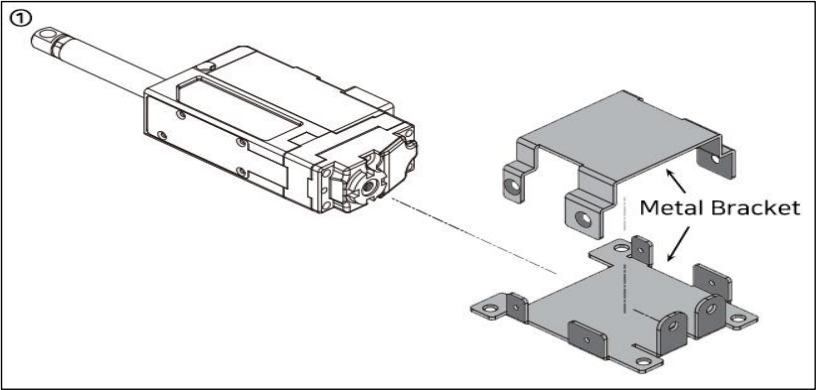
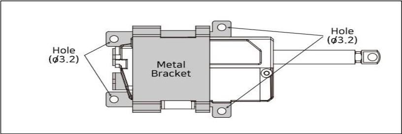
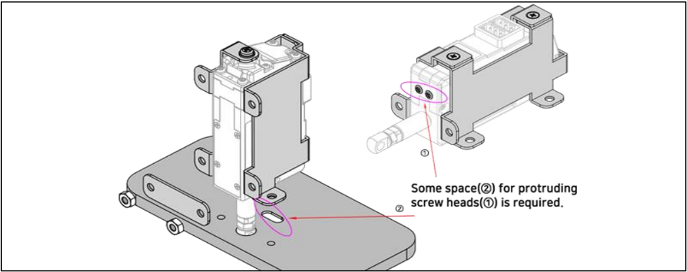

# How to mount mightyZAP_26mm, 27mm Stroke Version
## Option#1 : Using End bearing(IR-EB01)
This method can be used to secure both sides of servo motor using End bearing. 
In this case, mechanical condition should permit servo motor movement by using spring or LM Guide. (In case of spring connection, tension should be within the range of rated force to prevent overload.)

> [!warning] Caution
> - Make sure to fix the end bearings by paying attention to the order of the washer as shown in the picture above. 
> - Failure to tighten in order may cause malfunction or product damage.
## 2. Option#2 : Using Lateral Mounting Metal Barcket(IR-MB02) (IR-MB02 which is dedicated for 26mm, 27mm stroke version Lateral mounting)
This is the most common method to mount mightyZAP. 
Fix mightyZAP using dedicated metal bracket IR-MB02.
1) **Separate the metal brackets from the top and bottom as shown in the figure below.** mightyZAP can be mounted by IR-MB02 without directivity.
   
2. **Make sure to put spring washer before M2.5 L5 screw is applied.**
   (See Red circle on image #② below.) Otherwise, it may damage the servo motor inside. Tighten the metal bracket with 4pcs of M2 L2 screw.
   ![[2627mm_stroke_ass_3.png]]
3. **mightyZAP can be mounted by IR-MB02 without directivity.**
   See Installation method ⓐ and ⓑ below.
   ![[2627mm_stroke_ass_4.png]]
4. **Mounting assembled metal brackets** 
   Apply M3 screws to 4 x M3 mounting holes. (M3 screws are not included.)
   
## 3. Option#3 : Using Vertical Mounting Metal Barcket(IR-MB04) (IR-MB04 which is dedicated for 26mm, 27mm stroke version Vertical mounting)
1. **Separate the metal brackets from the top and bottom as shown in the figure below.**
   As shown in the figure below, pay attention to the direction of the actuator for proper mounting.![[2627mm_stroke_ass_6.png]]
2. **Make sure to put spring washer before M2.5 L5 screw is applied.**
   (See Red circle on image below.) Otherwise, it may damage the servo motor inside.
   Then, tighten the metal brackets with 2pcs of M2 L4 screw.
   ![[2627mm_stroke_ass_7.png]]
3. **Mounting assembled metal brackets** 
	1) Bottom Side Mounting
	   ![[2627mm_stroke_ass_8.png]]
	2) Front Side Mounting
	   ![[2627mm_stroke_ass_9.png]]
4. **CAUTIONS**
   For front mounting, some space(②) for protruding screw heads(①) is required.

