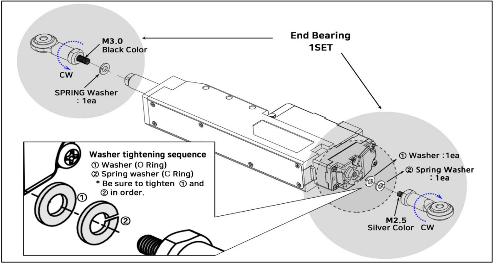
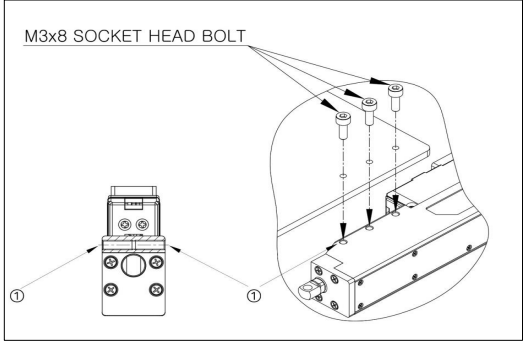

# How to mount mightyZAP_40mm~96mm Stroke Version
## 1. Option#1 : Using End Bearing(IR-EB01)
This method can be used to secure both sides of servo motor using End bearing. 
In this case, mechanical condition should permit servo motor movement by using spring or LM Guide. (In case of spring connection, tension should be within the range of rated force to prevent overload.)

> [!warning] Caution 
> - Make sure to fix the end bearings by paying attention to the order of the washer as shown in the picture above.
> - Failure to tighten in order may cause malfunction or product damage.
## Option#2 : Using Tap holes on servo motor case without brackets

- Use the M3 bolt to tighten as shown above. 
- Please note that tapping holes on both sides of case does not penetrate the whole body From both side directions on the metal case, screw M3x8 socket bolts. Please do not apply longer screws and do not try to penetrate the case.
## Option#3 : Metal Barcket (IR-MB03 which is dedicated for 40mm ~ 96mm Stroke Version)
- Mount mightyZAP laterally or longitudinally using the M3 bolt as shown in Figure Method 1) and Method 2). 
- If necessory, bracket A, B, C can be purchased individually.

1) **Lateral Mounting**
   ![[4090stroke-5.png]]
2) **Longitudinal Mounting**
   ![[4090stroke-4.png]]
