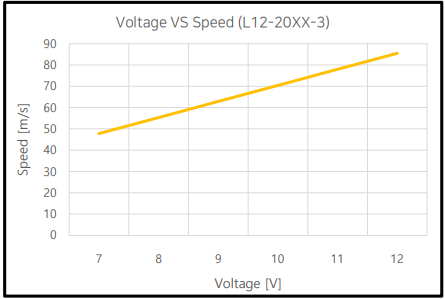
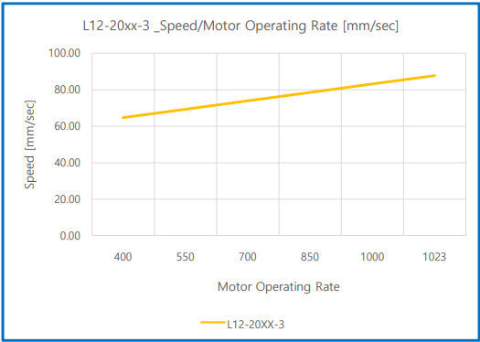

# TIPs for mightyZAP Noise Reduction
mightyZAP makes a big deceleration based on a small high speed DC motor that rotates at super high speed in order to produce larger force in a small size. Therefore, some mechanical noise is inevitable, but you can reduce the noise by changing the installation method or changing some parameter condition. 

Noise is an absolute loudness (db), and mightyZAP’s noise is about 50db at 1m distance. But, when we consider there are also emotional noises that people feel depending on the frequency level of noise (absolute noise is not so loud, but emotional noise is different case). 

Through the following methods, user may control absolute sound level as well as emotional sound.

## 1) Changing mounting method
When installing actuator, minimize the area of contact with the mounting surface and use some shock absorbing material such as rubber pads, silicone pads, leather or sponge pads that can absorb vibrations and sound between actuator and mounting surface to reduce noise. 

In addition, in some cases, check if actuator is mounted on a sound box structure, and consider how to fill the inside with sound absorbing material or to separate an actuator from the sound box structure.
## 2. Decreasing input voltage
Based on the 12V input voltage product, mightyZAP operates from the lowest 7V, so if you use a power supply with a variable voltage to lower the operating voltage, the sound may be highly reduced.

Please note that speed and STALL force (the maximum force that actuator can exert, 5 times bigger than Rated force) will be lowered when input voltage is lowered while RATED force will be same regardless of input voltage. (For example, the rated force of L12-20PT-3 is 20N and rated force will remain same even after lowering input voltage.). 

Therefore, use this function when application is not affected by lowered speed and stall force. As rated force will not be changed after lowering input voltage, there is no problem if application’s load condition is less than rated force. If application’s load condition is more than rated force, you may feel some lack of power. 

No-load speed VS input voltage graph is described on the data sheet of each product. Please refer to the example graph for the no-load speed VS voltage of L12-20XX-3 (Basic input voltage 12V, rated force 20N, and 27mm stroke.)

## 3. Decreasing Motor Operating Rate (Old “Max Force”)
By controlling “motor operating rate”, which is an internal parameter of the actuator, noise can be reduced more effectively without adjusting input voltage described above. 

In order to reduce the motor operation rate, the Servo manager software needs to be downloaded and installed on a PC (Window version), and the actuator can be connected to the PC through the PC USB interface (IR-USB01) sold separately. 

The default value of Motor operating rate is 1024 and it is the maximum motor operation rate. It can be reduced to minimum 400 value. 

For example, reducing motor operating rate to around 500 has a similar effect to reducing input voltage from 12V to 7V. 

Just like reducing the voltage, speed and STALL force (the maximum force that actuator can exert, 5 times bigger than Rated force) will be lowered when motor operating rate is lowered while RATED force will be same regardless of input voltage. (For example, the rated force of L12-20PT-3 is 20N and rated force will remain same even after lowering input voltage.). 

Therefore, use this function when application is not affected by lowered speed and stall force. As rated force will not be changed after lowering input voltage, there is no problem if application’s load condition is less than rated force. If application’s load condition is more than rated force, you may feel some lack of power. 

No-load speed VS motor operating rate is described on the data sheet of each product. Please refer to the example graph for the no-load speed VS motor operating rate of L12-20XX-3 (Basic input voltage 12V, rated force 20N, and 27mm stroke.)

 
 >[!note] Note
 >You can use the 2nd and 3rd method in combination, but it is recommended to use one of the two methods as the force may be reduced too much and the product may not move.
