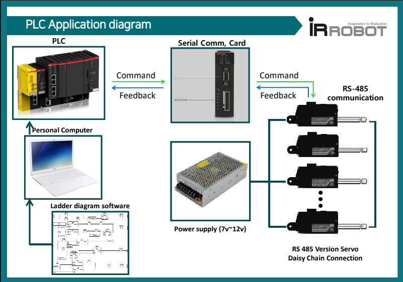
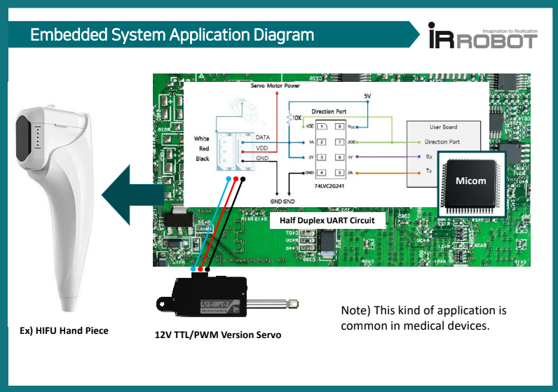
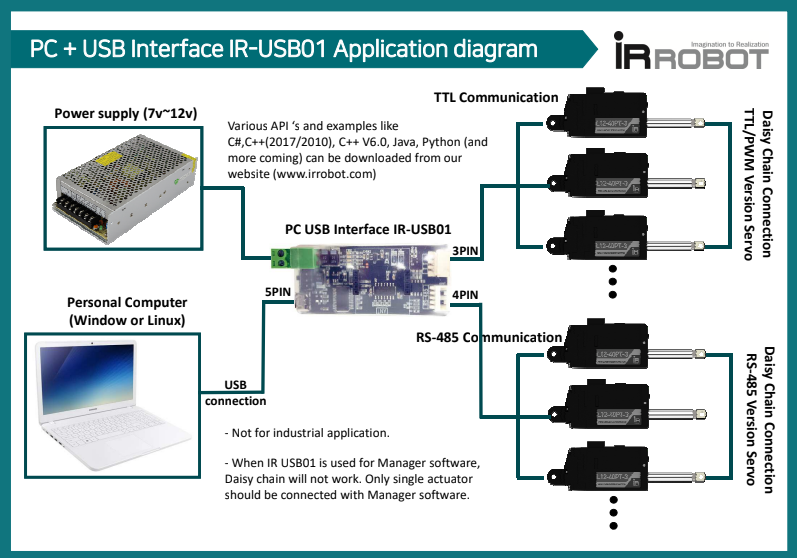
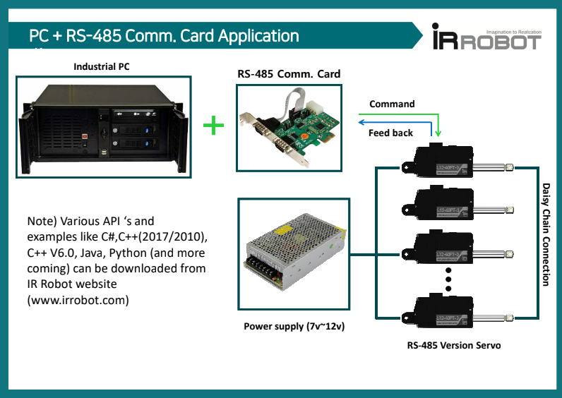
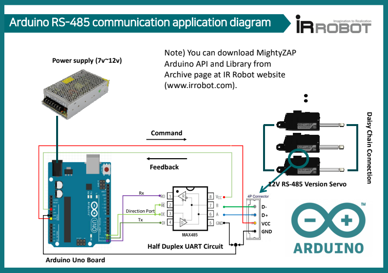
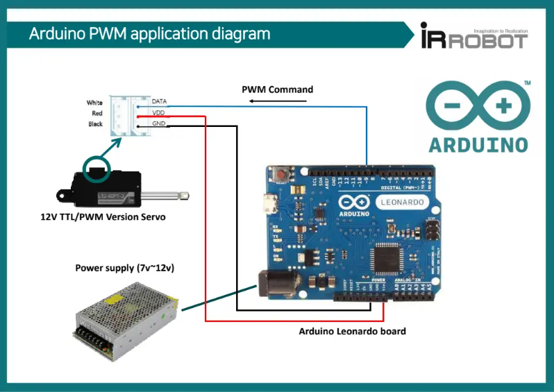
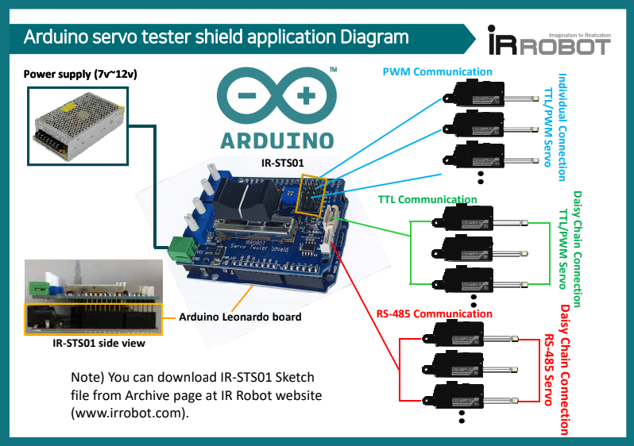
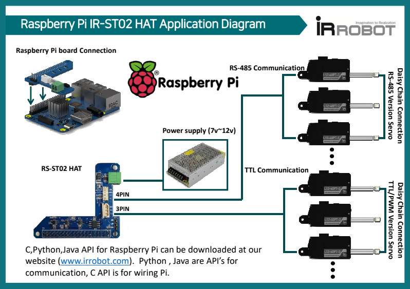
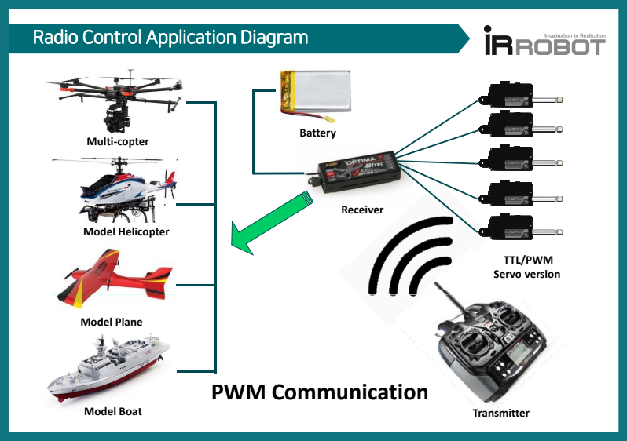

**Here are simple diagrams for various applications to help your understanding.**
## 1. PLC
- PLC application using  RS-485 communication card
  

## 2. Embedded System
- Embedded  system application by TTL communication

## 3. PC Control
- PC connection by IR-USB01 PC USB interface

- PC connection by RS-485 communication card

## 4. Arduino
- Arduino connection by RS-485 communication

- Arduino connection by PWM communication 

- Arduino connection by IR-STS01 Arduino Servo Tester Shield 

## 5. Raspberry Pi
- Raspberry Pi connection by IR-STS02 Raspberry Pi HAT(Hardware Attached on Top)

## 6. Radio Control
- Radio Control application by PWM

