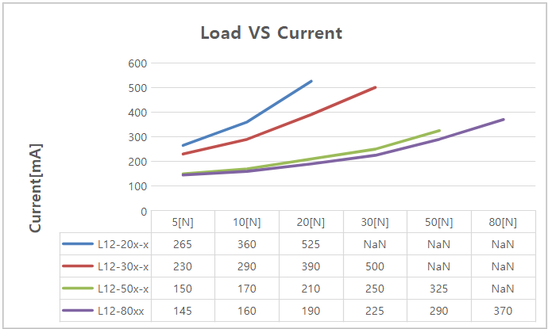
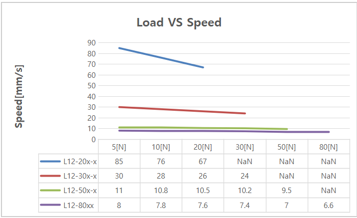
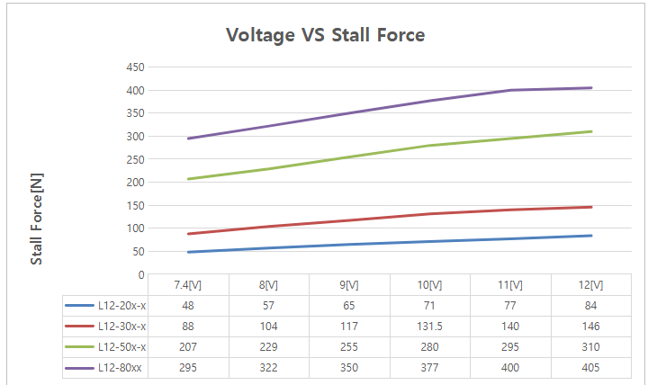
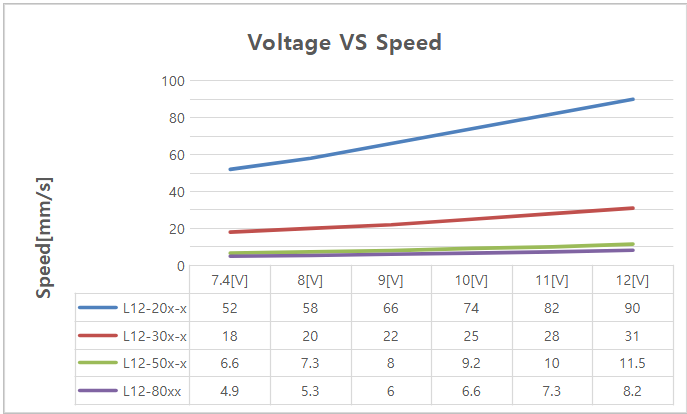
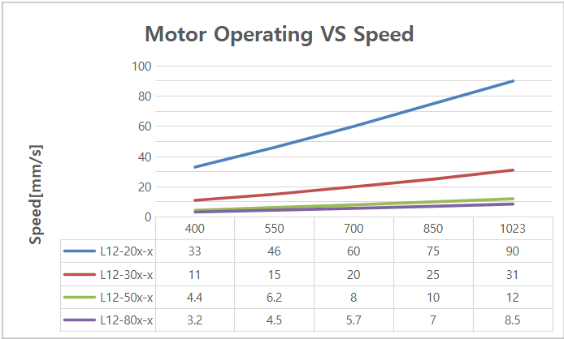
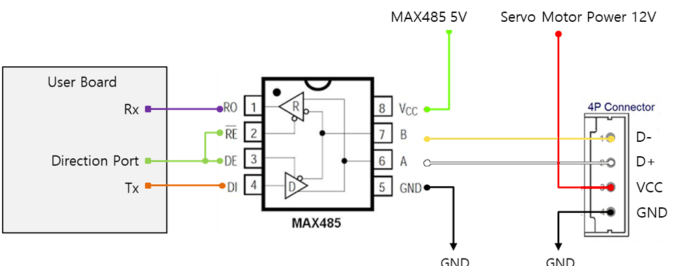

## 1. Features
-  Micro size  
-  Precise position control
-  Strong force comparing to the size
-  Built-in Drive Circuitry
-  - RS-485 communication
-  Parameter programmable on the Manager software

## 2. Specification
### 2.1 Common Specifications
| **Property** | Value |
| ---------- | ---------- |
| **Stroke** | 40mm |
| **Rated Load** | 17N~78N according to gear ratio(See appendix.) |
| **Recommended duty cycle** | under 50% |
| **Micro controller** | 32bit Arm Cortex |
| **Position Resolution** | 4096 Resolution (A/D Converter) |
| **Input Voltage** | 12.0V(Rated), 7.4V ~ 13 V(Operating) |
| **Motor Type / Watt** | Coreless DC Motor / 3.5 Watt |
| **Current consumption** | 30mA(Idle), 380mA(Rated), 1.6A(Stall) |
| **Position repeatability** | Unidirectional less than 0.03mm(30um) |
| ^ | Bydirectional less than +/0.06mm(60um) |
| **Position sensor** | 10kΩ linearity potentiometer |
| **Size, Weight** | 86.9(L)x36(W)x18(H)mm **/**96~99g (to be varied according to gear ratio) |
| **Communication** | RS-485  |
| **Protocol** | IR Open Protocol (MODBUS is for Force control lineup only.) |
| **Operating Temperatures** | -10℃ ~ 60℃ |
| **Ingress protection** | IP-54 |
| **Mechanical Backlash** | 0.03mm(30um) |
| **Audible Noise** | Max. 50db at 1m |
| **Gear ratio** | 10:1(20PT,30PT) 20:1(50PT) /50:1(80PT) |
| **Gear type** | Engineering plastic gears(20PT,30PT)   4metal & 2engineering plastic gears(50PT,80PT)(Aluminum and stainless steel combination) |
| **Rod type** | stainless steel |
| **Standard Accessory** | 1xHinge base   1x Hinge   1xHinge shaft   1xRod end tip   2x M3 NUT   3 x M2.5x6 screws   1x Molex wire harness (200mm)   1 x M3 spanner   1 x Socket set screwlex wire harness (200mm)     1 x M3 spanner     1 x Socket set screw |
| **Connector Type (Male) in the Actuator**   | MOLEX 22-03-5035 |
| **Wire Harness** | Molex(50-37-5033) to Molex(50-37-5033)/ 200mm / 0.08x60(22AWG) |

### 2.2 Volatges
| Parameter                          | Min | Norm | Max | Unit | Note |
| :--------------------------------- | :-: | :--: | :-: | :--: | :--: |
| **Supply voltage**          | 7.4 |  12  | 13  |  V   |   |
| **Logic input voltage** | 2.0 | 3.3  | 5.5 |  V   | TTL  |

### 2.3 Currents
| Parameter                               | Min | Norm | Max | Unit | Note          |
| :-------------------------------------- | :-- | :--- | :-- | :--- | :------------ |
| **Maximum peak Current** | 2.1 | 2.2  | 2.3 | A    | Stall Current |
| **No Load Current**       | 180 | 200  | 220 | mA   | No Load       |
| **Rated Load Current**  | 420 | 450  | 480 | mA   | Rated Load    |
| **Idle Current**                        | 25  | 30   | 35  | mA   |               |

### 2.4 Temperatures
| Parameter                   | Min | Norm | Max | Unit | Note |
| :-------------------------- | :-: | :--: | :-: | :--: | :--: |
| **StorageTemp.**     | -20 |  -   | 70  |  ℃   |      |
| **Operating Temp.** | -10 |  -   | 60  |  ℃   |      |

### 2.5 Strokes
| Parameter                   | Min  | Norm | Max  | Unit | Note |
| :-------------------------- | :--- | :--- | :--- | :--- | :--- |
| **MIN Position** | 3.2  | 3.7  | 4.2  | mm   |      |
| **MAX Position** | 43.2 | 43.7 | 44.2 | mm   |      |
| **Stroke length**     |      | 40.0 |      | mm   |      |

⁕ Synchronize Min / Max Position by “Min / Max Position Calibration” feature on Manager software or Parameter Map.
### 2.6 No Load Speed
| Parameter                                  | Min  | Norm | Max   | Unit | Note       |
| :----------------------------------------- | :--- | :--- | :---- | :--- | :--------- |
| Maximum Speed at 12.0V  | 72   | 80   | 88    | mm/s | L12-20PT-x |
| ^                                          | 25.2 | 28   | 30.8  | mm/s | L12-30PT-x |
| ^                                          | 9.45 | 10.5 | 11.55 | mm/s | L12-50PT-x |
| ^                                          | 6.93 | 7.7  | 8.45  | mm/s | L12-80PT-x |
### 2.7 Load
| Parameter Parameter         | Min | Rated | Max | Unit | Note       |
| :----------------------------- | :-: | :---: | :-: | :--: | :--------- |
| Load at 12.0V  |     | 17.0  |     |  N   | L12-20PT-x |
| ^                              |     | 3.82  |     | lbf  | ^          |
| ^                              |     | 1.73  |     | kgf  | ^          |
| ^                              |     | 31.0  |     |  N   | L12-30PT-x |
| ^                              |     | 6.96  |     | lbf  | ^          |
| ^                              |     | 3.16  |     | kgf  | ^          |
| ^                              |     | 50.0  |     |  N   | L12-50PT-x |
| ^                              |     | 11.24 |     | lbf  | ^          |
| ^                              |     | 5.09  |     | kgf  | ^          |
| ^                              |     |  78   |     |  N   | L12-80PT-x |
| ^                              |     | 17.53 |     | lbf  | ^          |
| ^                              |     | 7.95  |     | kgf  | ^          |

⁕ 1 kgf = 9.8N, 1lbf = 4.45N
### 2.8 Self Lock Feature
| Parameter | Min |     Norm      | Max | Unit | Note      |
| :-------- | :-: | :-----------: | :-: | :--: | :-------- |
| Slef Lock |  -  |    N/A    |  -  |      | L12-20x-x |
| ^         |  -  | Available |  -  |      | L12-30x-x |
| ^         |  -  |       ^       |  -  |      | L12-50x-x |
| ^         |  -  |       ^       |  -  |      | L12-80x-3 |

>[!tip] Tip
>**Self-lock feature :The force which actuator maintains its position by mechanical friction without motor power.**

## 3. 참고 자료
### 3.1 Load Vs Current
\
※ Data includes tolerance.
### 3.2 Load Vs Speed

※ Data includes tolerance.
### 3.3 Voltage Vs Stall Force 

※ Data includes tolerance.
### 3.4 Voltage Vs Speed 

※ Data includes tolerance.
### 3.5 Motor Operating Rate

※ Data includes tolerance.

### 3.6 PIN Map
| PIN NUMBER(COLOR) | PIN NAME&nbsp; | 
FUNCTION
 |
| :---------------: | :------------: | :-----------------: |
|     1(YELLOW)     |       D-       |      RS 485 -       |
|     2(WHITE)      |       D+       |      RS 485 +       |
|      3(RED)       |      VCC       |       Power +       |
|     3(BLACK)      |      GND       |       Power -       |
